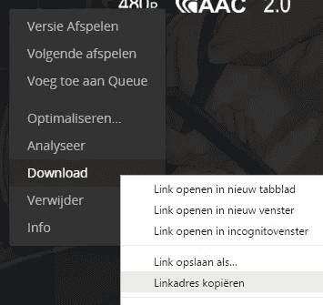

# plex♥Alexa——完美的婚礼

> 原文：<https://medium.com/hackernoon/plex-alexa-the-perfect-wedding-38b14b41faf0>


就在两周前，我买了一台亚马逊 Echo Dot 和一台 Bose SoundTouch 10。音乐播放的惊人组合！然而，目前音乐服务的可能性很少。提供对 Amazon Music Unlimited 和 Spotify 的标准支持。SoundCloud 也有一项音乐播放技能，名为 [*Magic Jukebox*](https://www.alexaskillstore.com/Magic-Jukebox/40064) ，一位名叫史蒂夫加图索的开发者正在积极更新他的 [*geemusic*](https://github.com/stevenleeg/geemusic) 项目，支持从[谷歌](https://hackernoon.com/tagged/google)音乐播放。

作为一名开发人员，我想通过让 Alexa 用户访问他们自己的 Plex 音乐播放器来拓宽频谱。因为我之前写过一篇关于如何创建你自己的 Alexa 技能的深度教程，所以我在这里就不赘述了。这一次， [Heroku](https://hackernoon.com/tagged/heroku) 用于应用的部署，但是几乎可以使用任何平台。请记住，PythonAnywhere 上的部署不适用于此应用程序，因为他们的白名单不允许访问 Plex 服务器。

# 代码

GitHub 上提供了[*PlexMusicPlayer*](https://github.com/Tyzer34/plexMusicPlayer)项目，以后会更新。这个项目的目的是给 Alexa 用户一种播放音乐的方式，使用他们自己的 Plex 服务器。然而，这也是向开发者展示将 Plex 作为音乐服务集成到 Alexa 中的方法。然而，该应用程序不支持 Plex 实例的远程控制，也不(目前)包括全局认证技术。但是，下一节将提供如何设置该应用程序的详细概述。

# 设置

如前所述，我使用 Heroku 部署了这个项目。他们的免费层允许单个 web 应用程序在免费的 dyno 上运行。但是，请记住，该 dyno 每月使用时间限制为 550 小时(如果使用信用卡验证，则为 1000 小时)，并且应用程序在 30 分钟没有接收到网络流量后会进入睡眠模式。在他们的 FAQ 中，他们说了以下关于免费 dyno 的用法:

> 如果一个应用程序有一个使用免费 dyno 运行的 web dyno，并且该 web dyno 在 30 分钟内没有收到流量，则 web dyno 将会休眠。除了 web dyno 休眠之外，worker dyno(如果存在)也会休眠。免费动态睡眠不消耗免费动态睡眠时间。

这意味着免费层对于应用程序的自部署来说绰绰有余。但是，请记住，如果应用程序进入睡眠模式，它需要一些时间才能再次启动。这对应用程序有很大的影响，因为用户的第一个查询将导致超时，并响应以下错误。

```
The remote endpoint could not be called, or the response it returned was invalid.
```

尽管第一个查询失败了，但是它为我们部署在 Heroku 上的应用程序产生了 web 流量，允许它被唤醒。大约 20 秒后，唤醒序列结束，应用程序可以使用了。

## 在 Heroku 的部署

首先，您应该在本地机器上安装 Heroku 和 Git。如果你以前没有使用过 Heroku，安装过程可以在[这里](https://devcenter.heroku.com/articles/heroku-cli)找到。此外，请确保您已经使用 Heroku 帐户登录。

接下来，我们想要克隆这个项目的当前 GitHub 存储库。首先，打开一个终端(或命令提示符)并导航到您想要存储文件的目录。然后，使用以下命令克隆存储库。

```
git clone [https://github.com/tyzer34/plexmusicplayer.git](https://github.com/tyzer34/plexmusicplayer.git)
```

现在文件已经被本地克隆了，它们可以被部署到 Heroku 上。要设置这个 Heroku 服务器，应该使用以下命令。注意 **yourServerName** 应该换成别的。

```
heroku create *yourServerName*
git push heroku master
```

应用程序现在应该正常上线了！现在我们只需要在服务器上设置认证变量，并设置 Alexa 技能。

## 获取身份验证变量

为了认证 PlexMusicPlayer 应用程序，需要设置两个环境变量，即 **Plex 令牌**和**基本 url** 。

首先，你需要导航到[plex.tv/web/app](http://plex.tv/web/app)，随机选择一集、节目等。并点击左边的三个点(如下图荷兰语所示)。接下来，右击*下载*选项，选择*复制链接地址。*



复制的链接地址表单通常看起来应该是这样的(尽管已经填写了部分):

```
[https://your-plex-ip-address.some_long_encoded_string.plex.direct:your_plex_port/library/parts/some_id/some_file_id/file.ext?download=1&X-Plex-Token=y](https://192-168-0-226.9c04bc5196e2483bbe7919e96a0e5c1a.plex.direct:32400/library/parts/45/1473368932/file.mkv?download=1&X-Plex-Token=7JQRYQYbXS2ZbW4oH7rx)our_plex_token
```

当查看这个长 url 时，两个需要的变量都可以提取如下。对于基本 url 来说， *your_plex_port* 后面的/不被复制是很重要的。

*   **基础网址**=[https://your-plex-IP-address . some _ long _ encoded _ string . plex . direct:your _ plex _ port](https://192-168-0-226.9c04bc5196e2483bbe7919e96a0e5c1a.plex.direct:32400/library/parts/45/1473368932/file.mkv?download=1&X-Plex-Token=7JQRYQYbXS2ZbW4oH7rx)
*   **丛令牌** = [y](https://192-168-0-226.9c04bc5196e2483bbe7919e96a0e5c1a.plex.direct:32400/library/parts/45/1473368932/file.mkv?download=1&X-Plex-Token=7JQRYQYbXS2ZbW4oH7rx) our_plex_token

现在，我们必须在 Heroku 服务器中设置这些环境变量。要做到这一点，回到终端(或命令提示符)并输入下面几行，用提取的变量进行修改。

```
heroku config:set PLEX_TOKEN=your_plex_token
heroku config:set PLEX_URL=[https://your-plex-ip-address.some_long_encoded_string.plex.direct:your_plex_port](https://192-168-0-226.9c04bc5196e2483bbe7919e96a0e5c1a.plex.direct:32400/library/parts/45/1473368932/file.mkv?download=1&X-Plex-Token=7JQRYQYbXS2ZbW4oH7rx)
```

最后，我们只需要重启服务器，这样它就可以处理设置的环境变量。为此，只需使用以下命令。

```
heroku restart
```

## 制作 Alexa 技能

既然后端已经完全启动并运行，Alexa 技能必须在亚马逊开发者上进行初始化。如果你以前没有这样做过，你可以按照这个[一步一步的讲解](https://blog.craftworkz.co/flask-ask-a-tutorial-on-a-simple-and-easy-way-to-build-complex-alexa-skills-426a6b3ff8bc#0acf)。

至于调用名，我选择了 *plexmusic。*然而，这可以是你想要的任何东西。在 *speech_assets* 文件夹中的 [GitHub 存储库](https://github.com/Tyzer34/plexMusicPlayer/tree/master/speech_assets)中可以找到填充意图模式和示例话语所需的信息。

接下来，需要通过以下链接将端点设置为 *HTTPS* (将 **yourServerName** 更改为之前选择的那个)

```
https://*yourServerName*.herokuapp.com/plex
```

最后，在端点的*证书*处选择第二个选项，并保存您的应用程序。

恭喜你！PlexMusicPlayer 现已启动并运行在您最喜爱的 Alexa 设备上。现在，您已经准备好尝试它的一些功能了！

# 这些功能

目前，PlexMusicPlayer 能够根据提供的艺术家、专辑或歌曲名称播放音乐。如果提供了艺术家或专辑，并且在您的 Plex 库中有多首歌曲可用于该艺术家或专辑，这些歌曲将排队并作为播放列表播放。此外，可以询问与当前歌曲相关的信息或随机播放当前播放列表。显然，诸如 next 和 play 之类的请求也被实现了。下面提供了一些激活句作为例子。更多信息可以在[示例话语文件](https://github.com/Tyzer34/plexMusicPlayer/blob/master/speech_assets/sampleUtterances.txt)中找到。

*   Alexa，请 plexmusic 演奏威豹乐队。
*   Alexa，请 plexmusic 播放北极猴子的专辑 AM。
*   Alexa 让 plexmusic 告诉我这首歌的名字。
*   Alexa，请 plexmusic 播放“我的最爱”播放列表。

# 未来

由于这只是一个初始实现，因此还有很大的改进空间和额外的功能。以下是我希望在项目中实现的一些事情的列表。请注意，在这些示例中，小改进和大改进没有区别。

*   启用基于 Plex PIN 的用户认证( [node.js 实现](https://github.com/overloadut/node-plex-api-pinauth)
*   实现更多回放功能，例如基于流派或年份的回放
*   添加 Alexa 卡以显示所请求的歌曲、专辑或艺术家的图片
*   制造更多的意图，因此用户可以请求特定的动作，例如歌曲是哪一年的

GitHub 存储库中提供了对这些未来实现的跟踪。也欢迎用户投稿和改进！

希望本指南能够允许在 Echo 设备上从您的 Plex 媒体服务器播放音乐。如果有任何问题，请不要犹豫，在 GitHub 上提出问题。

[](http://bit.ly/HackernoonFB)[](https://goo.gl/k7XYbx)[](https://goo.gl/4ofytp)

> [黑客中午](http://bit.ly/Hackernoon)是黑客如何开始他们的下午。我们是 [@AMI](http://bit.ly/atAMIatAMI) 家庭的一员。我们现在[接受投稿](http://bit.ly/hackernoonsubmission)并乐意[讨论广告&赞助](mailto:partners@amipublications.com)机会。
> 
> 如果你喜欢这个故事，我们推荐你阅读我们的[最新科技故事](http://bit.ly/hackernoonlatestt)和[趋势科技故事](https://hackernoon.com/trending)。直到下一次，不要把世界的现实想当然！

