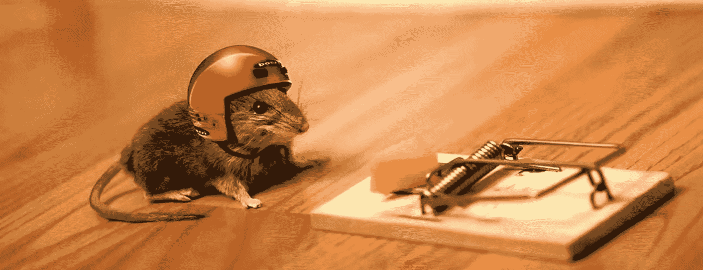

# 毫无意义？编程问题

> 原文：<https://medium.com/hackernoon/pointless-programming-problems-59427ea6f8b6>



Pointless or Perfect? That is the war I wage in my head about these types of problems.

[编程](https://hackernoon.com/tagged/programming)挑战，面试问题，编程脑筋急转弯。为了个人的[成长](https://hackernoon.com/tagged/growth)或洞察为什么这些被如此频繁地使用，尤其是对于面试问题，我将从 hackerrank.com、谷歌搜索、甚至可能从你的建议中做一些挑战。

首先让我表达一下我对这类问题的一些纯粹的想法。像这样的编程挑战经常在面试中以一种神秘的方式使用，以了解某人是如何编程的。当处理这些类型的问题时，我经常发现自己陷入个人的斗争中，大多数时候我担心它们是没有意义的，在现实世界的编程中是看不到的。我还发现，在做这些事情的时候，我学到了很多关于问题的某些方面和我的编程风格的东西。通常这类问题也会在白板前提出，[对于这一点，我听从 Eric Elliot 的意见，“白板是用来绘图的，不是用来编码的。”](/javascript-scene/tech-hiring-has-always-been-broken-heres-how-i-survived-it-for-decades-b7ac33088de6)

对于你们这些招聘经理来说，不要只是把这类问题写在白板上让他们去解决，而是提出一个你希望如何解决的建议。在我看来，透明度是最好的，不要在问题中隐藏你真正想要的东西。"你能用算术代替字符串比较来解决这个问题吗？"或者“你能告诉我如何使用正则表达式和模式匹配来解决这个问题吗？”让它敞开着会在你的嘴里留下酸味，因为这可能不是你在日常工作中最终得到最终解决方案的方式。话虽如此，也要理解*受访者*解决你面前的问题可能是对问题的快速第一想法，而**不是**他们在生产环境中处理事情的方式。


This will be my diagnosis one day.

我为什么要重新做这些题？我已经解决了像 fizz-buzz 这样的问题，反转数组，寻找和替换值，为什么要浪费时间呢？简而言之，答案是我的好奇心。我不仅想解决问题，还想进行基准测试，并应用测试驱动的方法来解决这些问题。我不仅是在以面试的方式挑战自己，也是在看看哪些解决方案更好，好到什么程度。我还在构建一个清单，以便将来我需要做各种类型的数学比较、字符串比较或模式匹配时，我知道当给定某一类型的问题时，应该立即采取哪种方法。

# 反向元音问题

这个问题需要你取一个输入字符串，把元音反过来。起初我在 JavaScript 中这样做，但是我并不真正喜欢它，也没有真正的理由继续在 JS *(不是说我对 JS 有问题)*中这样做，所以在本文中我把它移到了 Ruby 中。尽管最初的尝试是将 JavaScript 解决方案移植到 Ruby 上。

## 第一次尝试

这是我对这个问题的第一次尝试，看起来像是我的 JavaScript 解决方案的精确移植，但在 Ruby *(这很难看，不是一个很好的解决方案)*中，通过从字符串的两端而不是单向工作，做得稍微好一点。

```
class ReverseVowels
  # the string that gets reversed
  attr_accessor :string_to_reverse # init method that sets the string to an instance variable
  def initialize(string_to_reverse)
    @string_to_reverse = string_to_reverse
  end

  # method that does all the work 
  def reverse_vowels
    # temp arrays
    vowels = []
    indexes = [] 

    # iterators for while 
    i = 0 
    j = string_to_reverse.length - 1
    half_way = (j/2.to_f).ceil

    # shorten var name temporarily, maybe more in the future
    str = string_to_reverse 

    # iterate stuff 
    while i <= half_way && j >= half_way
      if is_vowel?(str[i])
        indexes << i 
        vowels << str[i]
      end 

      if is_vowel?(str[j]) 
        indexes << j
        vowels << str[j]
      end

      i += 1
      j -= 1
    end

    indexes = indexes.map(&:to_i).sort
    vowels.reverse! 

    vowels.each_with_index do |v,i|
      str[indexes[i]] = v
    end 

    return str
  end

  # checks the vowels except y
  def is_vowel?(character)
    vowels = ['a', 'e', 'i', 'o', 'u']
    vowels.include? character.to_s.downcase 
  end 
end
```

## 第二次尝试

这是我明显的重构，并试图消除循环的数量。测试没有改变，所以重构简单且易于测试。唯一真正有效的方法是颠倒元音字母。这是一个思维过程，通过使用一个在中间相遇的循环可以做得更好，并在运行中进行调整。

```
 def reverse_vowels
    # iterators for while 
    i = 0 
    j = string_to_reverse.length - 1
    str = string_to_reverse 

    # iterate stuff 
    while i < j
      if !is_vowel?(str[i])
        i += 1 
        next 
      end 
      if !is_vowel?(str[j])
        j -= 1 
        next 
      end 

      str[i], str[j] = str[j], str[i]

      i += 1
      j -= 1
    end

    str
  end
```

## 第三次尝试

这是迄今为止最短的尝试，并且不需要使用 is _ 元音方法。我希望这是我自己想出来的，但是我是在查看 ruby api 文档中的[扫描方法时发现的。试图弄清楚如何使用扫描方法，反元音问题实际上出现了。这个解决方案非常出色，属于 StefanPochmann](https://ruby-doc.org/core-2.2.0/String.html#method-i-scan) 。scan 方法查找模式，并将项目转换为数组中的索引项目。然后，它使用 gsub regex 模式将数组中的最后一项放入第一个找到的元音中。

```
def reverse_vowels    
  vowels = @string_to_reverse.scan(/[aeiou]/i)     
  @string_to_reverse.gsub(/[aeiou]/i) { vowels.pop }  
end
```

## 绩效结果

每个性能测试都是在 1000 次尝试的迭代中完成的，每次运行三次。每个平均值是通过对该对象进行 3000 次尝试而得到的。

```
# First Attempt
# Realtime per 1000 attempts 
# ----------------------------------
0.02257158898282796
0.011442353017628193
0.010828958998899907
Average Time: 0.01494763366645202# Second Attempt
# Realtime per 1000 attempts 
# ----------------------------------
0.01959512199391611ms
0.00883392000105232ms
0.008858179993694648ms
Average Time: 0.012429073996221026ms# Third Attempt
# Realtime per 1000 Attempts 
# -----------------------------------
0.017268108000280336ms 
0.007276029995409772ms 
0.007084235025104135ms
Average Time: 0.010542791006931415ms
```

表现结果很有趣，每个人可以用不同的方式来解释。从大的方面来看，我不认为这些结果对速度有显著的影响，但是最容易保持的结果也是最快的。

# 求和问题

问题是取一个大数字，对它的每个数字求和，然后返回值。虽然，一开始我完全不知道如何分解这个数字。我对所有这些问题的无干预解决方案是扩展到一个数组，然后迭代这些数字并求和。我后来被告知，数学编程将是更好的方法，并显示出严重的性能收益。

## 第一次尝试

非严格类型化的奇妙之处在于，我可以将它分解成许多不同类型的解决方案。第一种方法是使用字符串比较将对象分成一个数组，然后将它们相加，最后返回总和。它看起来既不优雅也不时髦，所以明确的重构是合适的，但是数学上的重构呢？

```
class Sum
  attr_accessor :input def initialize(input_num)
    @input = input_num
  end

  def sum_input
    digits = @input.to_s.split('')
    sum = 0
    digits.each do |digit|
      sum += digit.to_i
    end 
    sum
  end
end
```

## 第二次尝试

第二次尝试是我尝试用数学方法来做。我知道我们的数字系统是十进制的，所以我可以通过除以 10 来取出数字，我还知道模运算符返回余数。使用模操作符，我能够得到第一个数字的数值，然后除法帮助我把它从临时迭代器中移除。这种方法很容易用微妙的线索弄清楚，当思考数字问题时，我希望在未来记住和思考。

```
class Sum
  attr_accessor :input def initialize(input_num)
    @input = input_num
  end

  def sum_input
    i = @input
    sum = 0
    while i > 0
      sum += (i % 10)
      i = (i / 10)
    end
    sum
  end
end
```

## 第三次尝试

这次尝试是想看看我能创建多小的方法来解决仍然通过测试的问题。在这之前有许多 4/5 衬垫和一些实验，但这是我决定进行最小尝试的一个。

```
class Sum
  attr_accessor :input def initialize(input_num)
    @input = input_num
  end

  def sum_input
    digits = @input.to_s.split('')
    sum = eval digits.join '+'
  end
end
```

## 第三次尝试重构

第三次尝试在性能测试中被评为很差，以至于我运行了几次测试，并检查了一些类型的 bug。我以为会和第一次尝试一样，但结果却是迄今为止最慢的一次。我发现 eval 是一个缓慢的过程，在深入研究之后，我被指向了 [inject 方法](https://apidock.com/ruby/Enumerable/inject)，它基本上是对一个数组的内容求和，假设它们是整数。重构之后，第三种方法能够获得与第一种方法相似的性能结果，并通过所有测试。

```
class Sum
  attr_accessor :input

  def initialize(input_num)
    @input = input_num
  end def sum_input
    digits = @input.to_s.split('').map(&:to_i)
    sum = digits.inject(0, :+)
  end
end
```

## 绩效结果

这真是令人大开眼界。这些测试中的每一个都以毫秒为单位，总共进行了 3000 次以上的平均尝试，并使用了从 1 到 9999999 的随机数。数学表达式快得惊人，不像我预期的那样只有几毫秒。更糟糕的是聪明的速记方法

```
# First Attempt
# Realtime per 1000 attempts 
# ----------------------------------
0.007490240968763828
0.006662635016255081
0.0066195380059070885
Average Time: 0.0069241379969753325# Second Attempt
# Realtime per 1000 attempts 
# ----------------------------------
0.0007742019952274859
0.0007528960122726858
0.0007553229806944728
Average Time: 0.0007608069960648814# Third Attempt
# Realtime per 1000 Attempts 
# -----------------------------------
0.01474869396770373
0.014116039033979177
0.01710168702993542
Average Time: 0.015322140010539442# Third Attempt (Refactor) 
# Realtime per 1000 Attempts 
# -----------------------------------
0.007556420983746648
0.00706747395452112
0.006896736973430961
Average Time: 0.007173543970566243
```

# 结论

结束这个过程可能是我最难以接受的，因为我已经说过我觉得这些问题是没有意义的。尽管看起来毫无意义，但它们让我思考、学习，并给了我一些在面临类似问题时可以使用的答案。如果它是基于文本的，正则表达式可能被证明是最快和最容易维护的。如果这是一个数字问题，我应该尝试找出一个数学方法来解决这个问题。

# TL；速度三角形定位法(dead reckoning)

我对 AF 很好奇，不得不更深入地研究一些编码挑战，并且可能会做得更多。