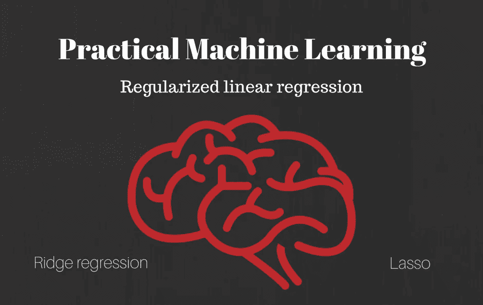
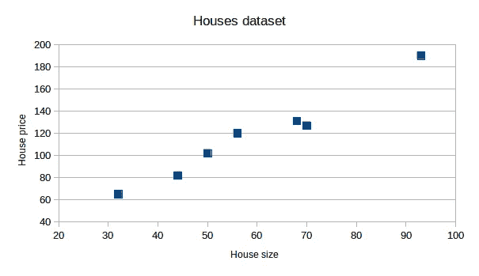
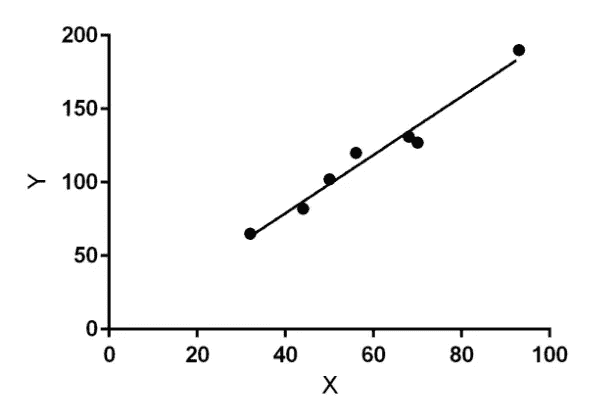
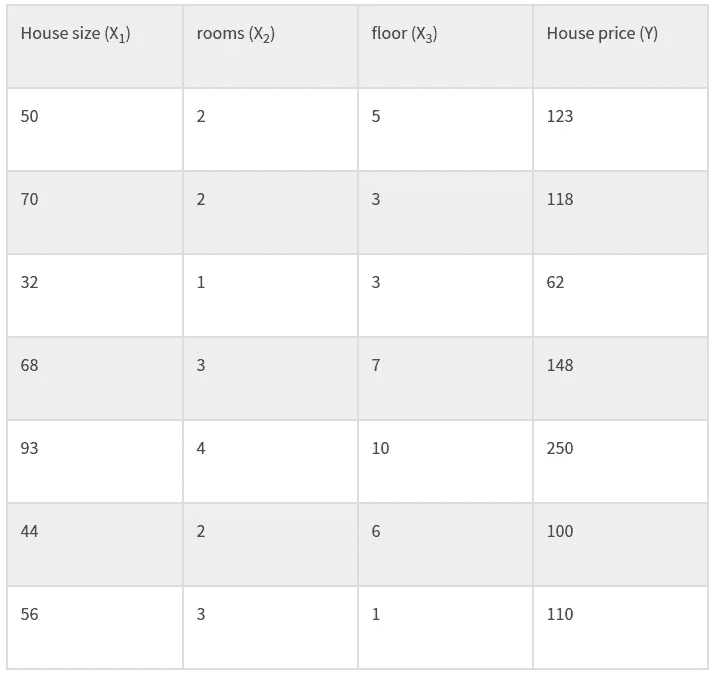
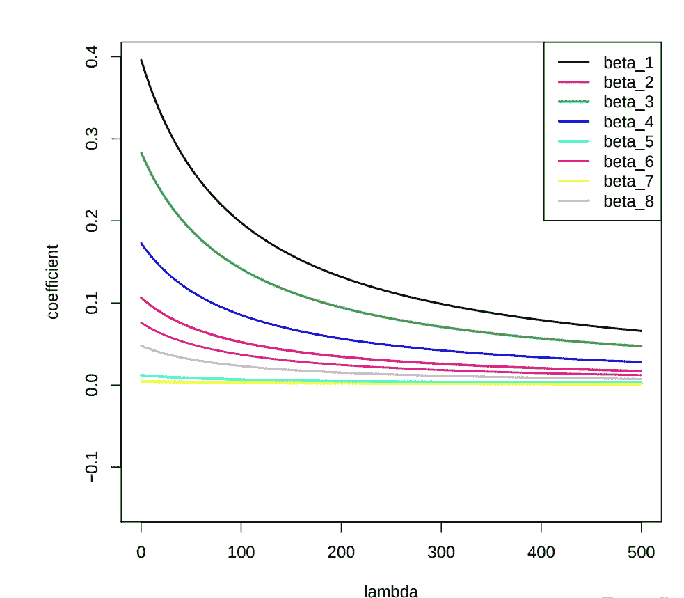

# 实用机器学习:岭回归 vs. Lasso

> 原文：<https://medium.com/hackernoon/practical-machine-learning-ridge-regression-vs-lasso-a00326371ece>

多年来，程序员一直试图使用传统算法来解决极其复杂的计算机科学问题，这些算法基于最基本的条件语句:if this then that。例如，如果电子邮件包含单词“免费！”应该归类为垃圾邮件。

近年来，随着卓越的[云计算技术](https://codingstartups.com/choose-cloud-computing-technology-startup/)的兴起，解决复杂问题的机器学习方法得到了极大的加速。机器学习是一门为计算机提供学习和解决问题的能力而无需明确编程的科学。听起来像是黑魔法？也许吧。在这篇文章中，我将向您介绍可以使用机器学习解决的问题，以及解决这些问题的实用机器学习解决方案。

就像人类每天学习一样，为了让机器学习，你需要为它提供足够的数据。一旦它处理了数据，它就能对未来做出预测。假设你想把邮件按照是否是垃圾邮件来分类。为了使用机器学习来解决这个问题，你需要为机器提供许多标有**标签的**电子邮件——这些邮件已经被正确分类为垃圾邮件和非垃圾邮件。**分类器**将迭代样本，并学习定义垃圾邮件的**特征**。假设你对机器学习模型进行了正确的训练，它将能够**预测**未来的电子邮件是否应该被归类为垃圾邮件，准确率很高。在许多情况下，您将无法完全理解模型如何预测类。

# 机器学习层次结构

机器学习的世界可以分为两类问题:**监督学习**和**非监督学习**。在这篇文章中，我们将只关注监督学习，这是一个包含**标记的**数据的问题子集(也就是说，每封电子邮件都被标记为垃圾邮件或非垃圾邮件)。对于有未标记数据的情况，无监督学习可能是一个合适的解决方案。

在监督学习问题之下，还有另一种划分，即**回归**问题 vs. **分类**问题。在回归问题中，你希望预测的值是连续的 T21。比如房价。另一方面，在分类问题中，您将要预测的值是离散的，就像垃圾邮件与非垃圾邮件。

为训练模型而需要提供的数据取决于问题和您希望预测的值。假设您想根据不同的房产预测房价。因此，在这种情况下，数据集中的每一行都应该(例如)包含:

1.  **特征:**房子大小，房间数量，楼层，是否有电梯等。
2.  **标签:**房价。

选择和收集最能描述房屋的特征来预测其价格是一项挑战。这需要市场知识以及对大数据源的访问。这些特征是预测房价的关键。

# 作为优化问题的机器学习

每一个机器学习问题基本上都是一个**优化问题**。也就是说，你希望找到一个特定函数的最大值或最小值。你想要优化的函数通常被称为**损失函数**(或**成本函数**)。损失函数是为您使用的每个机器学习算法定义的，这是评估您训练的模型准确性的主要指标。

对于房价预测的例子，在模型被训练之后，我们能够根据它们的特征来预测新的房价。对于我们预测的每一个房价，记为ŷi，和实际的房价 Yi，我们可以通过下式计算损失:

> *l =(ŷi-易)2*

这是特定数据点损失的最基本形式，主要用于**线性回归**算法。损失函数作为一个整体可以表示为:

> *l =∑(ŷi-易)2*

它简单地定义了我们模型的损失是我们预测的房价和真实情况之间的距离之和。特别地，这个损失函数被称为**二次损失**或**最小二乘**。我们希望**尽可能地最小化**损失函数(L ),这样预测将尽可能地接近真实情况。

如果你跟随我到现在，你熟悉每一个实际的机器学习问题的基本概念。**记住，**每个机器学习算法都是根据自己的人生目标来定义自己的损失函数。

# 线性回归

线性回归是一个基本但超级强大的机器学习算法。随着你在机器学习方面获得越来越多的经验，你会注意到大多数时候简单比复杂要好。线性回归广泛应用于不同的监督机器学习问题，你可能已经猜到了，它专注于回归问题(我们希望预测的值是连续的)。很好地理解线性回归是非常重要的

在学习更复杂的学习方法之前。已经为线性回归开发了许多扩展，我将在本文后面介绍。

线性回归的最基本形式是处理每个数据点的单个要素的数据集(将其视为房屋大小)。因为我们正在处理监督学习，数据集中的每一行(房子)都应该包括房子的价格(这是我们希望预测的值)。

我们数据集的一个例子:

在视觉表现中:

在线性回归中，我们希望拟合以下形式的函数(模型):

> *ŷ=β0+β1x*

其中 X 是特征向量(下表第一列)，β0，β1 是我们希望**学习**的系数。

通过学习参数，我的意思是执行迭代过程，通过尽可能减少损失函数，在每一步更新β。一旦我们达到损失函数的最小点，我们可以说我们完成了迭代过程并学习了参数。

更清楚地说，β系数的组合是我们训练过的模型——这意味着我们有问题的解决方案！

在执行迭代过程之后，我们可以在同一个图上可视化解决方案:

其中被训练的模型是:

> *ŷ=-0.5243+1.987 x*

现在让我们假设我们想要基于我们训练好的模型来预测 85 号房子的价格。为了预测价格，我们将求出的β值代入模型函数，包括房屋面积，得到预测的房价:

> *ŷ= 168.37*

总结一下我们到目前为止所讲的内容:

1.  每一个机器学习问题，基本上都是一个优化问题。也就是说，我们希望最小化(或最大化)某个函数。
2.  我们的数据集由要素(X)和标注(Y)组成。在我们的例子中——房子的大小是唯一的特征，房价是标签。
3.  在线性回归问题中，我们希望最小化二次损失，二次损失是预测值和实际值(真实值)之间的距离之和。
4.  为了最小化损失函数并找到最佳β系数，我们将执行迭代过程。
5.  为了根据新房子的大小预测其标签(房价)，我们将使用训练好的模型。

最小化损失函数的迭代过程(又名学习系数β)将在另一篇文章中讨论。虽然它可以用一行代码完成，但我强烈推荐阅读更多关于最小化损失函数的迭代算法，如**梯度下降**。

# 多特征线性回归

在现实世界的问题中，通常每行(房子)有不止一个特征。让我们看看线性回归如何帮助我们解决多特征问题。

考虑这个数据集:

因此，目前我们有 3 个特点:

1.  房子大小
2.  房间数量
3.  地面

因此，我们需要将我们的基本线性模型调整为一个扩展模型，该模型可以考虑每个房屋的附加特征:

> *ŷ=β0+β1x1+β2 x2+β3x 3*

为了解决多特征线性回归问题，我们将同样的迭代算法和最小化损失函数。主要区别在于，我们最终将获得四个β系数，而不是两个。

# 机器学习算法中的过度拟合

拥有更多的特征似乎是提高我们训练模型的准确性(减少损失)的完美方式，因为将要训练的模型将更加灵活，并将考虑更多的参数。另一方面，我们需要非常小心**过度拟合**数据。正如我们所知，每个数据集都有噪声样本。例如，房子的大小没有准确测量，或者价格不是最新的。如果没有仔细训练，这些不准确性会导致低质量的模型。模型可能最终会记住噪音，而不是学习数据的趋势。

非线性过度拟合模型的直观示例:

在线性模型中处理多个特征时也会发生过度拟合。如果不预先过滤和研究，某些要素可能会弊大于利，重复其他要素已经表达的信息，并向数据集添加高噪声。

# 使用正则化克服过拟合

因为过度适应是许多机器学习问题中极其常见的问题，所以有不同的方法来解决它。避免过度拟合背后的主要概念是尽可能简化模型。简单模型(通常)不会过度拟合。另一方面，我们需要注意模型过拟合和欠拟合之间的平衡。

避免过度拟合的最常见机制之一叫做正则化。正则化机器学习模型是这样一种模型，其损失函数包含也应该被最小化的另一元素。让我们看一个例子:

> *l =∑(ŷi-易)2 + λ∑ β2*

这个损失函数包括两个元素。第一个是你以前见过的——每个预测和它的基本事实之间的距离总和。然而，第二个元素，也称为正则化术语，可能看起来有点奇怪。它对β值的平方求和，然后乘以另一个参数λ。这样做的原因是为了“惩罚”系数β的高值的损失函数。如前所述，简单模型比复杂模型更好，通常不会过度拟合。因此，我们需要尽可能地尝试和简化模型。记住我们迭代过程的目标是最小化损失函数。通过惩罚β值，我们添加了一个约束来尽可能地最小化它们。

在拟合模型和不过度拟合之间有一个温和的权衡。这种方法被称为**岭回归**。

# 里脊回归

岭回归是线性回归的推广。它基本上是一个正则化的线性回归模型。λ参数是一个标量，也应该使用一种称为**交叉验证**的方法来学习，这将在另一篇文章中讨论。

关于岭回归，我们需要注意的一个非常重要的事实是，它强制β系数较低，但它**并不**强制它们为零。也就是说，它不会去除不相关的特征，而是**最小化它们对训练模型**的影响。

# 套索法

套索是另一个建立在正则化线性回归基础上的扩展，但是有一个小的扭曲。套索的损失函数为:

> *l =∞(ŷi-易)2+λ∞|β|*

与岭回归的唯一区别在于正则化项是绝对值。但这种差异对我们之前讨论的权衡有很大影响。套索法克服了岭回归的缺点，它不仅惩罚系数β的高值，而且如果它们不相关，则实际上将其设置为零。因此，与开始时相比，模型中包含的功能可能会更少，这是一个巨大的优势。

**结论**

机器学习变得越来越实用和强大。用零知识编程，你可以训练一个模型来预测房价在任何时间。

我们已经涵盖了机器学习、损失函数、线性回归、脊线和套索扩展的基础知识。

从我在这篇文章中谈到的内容中，涉及到了更多的数学，我试图保持它的实用性，另一方面，尽可能的高层次(有人说权衡？).

我鼓励你深入这个神奇的世界。查看我的博客，了解更多关于具有创业精神的程序员的帖子——https://codingStartups.com。