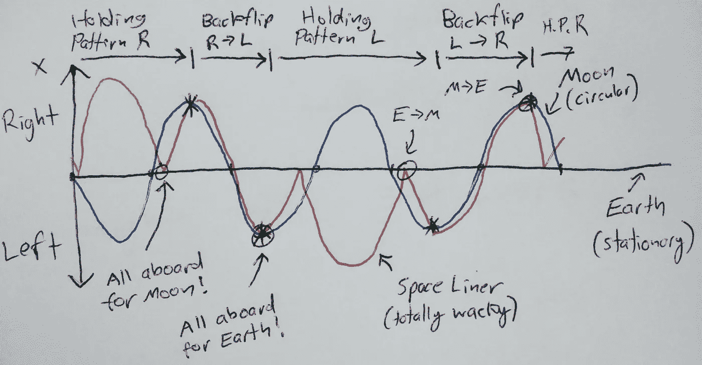

# 对月球循环仪的实际理解

> 原文：<https://medium.com/hackernoon/practical-understanding-of-lunar-cyclers-bda71e1f1da2>

在安迪·威尔的《阿耳忒弥斯》一书中，人们乘坐宇宙飞船沿着“循环者”的轨迹往返于地球和月球之间。威尔在建造世界的研究上投入了大量的精力，月球探测器就是一个例子。在阿耳忒弥斯的规模上，cycler 对于客运来说将是一个非常具有科学吸引力的概念。

然而，有一点他大错特错了——循环者很容易理解。主角声称自己能够算出细节，甚至可以心算。根据我的经验，月球探测器是一个非常不明显的概念。

让我来解释一下为什么不容易。

我询问了 cycler 轨道上的各种困惑点，这里涉及到一个“后空翻”:

[](https://space.stackexchange.com/questions/3889/what-does-the-backflip-lunar-cycler-do-in-its-pass-by-earth) [## 后空翻月球探测器在经过地球时做了什么？

### 本文描述了一个地月循环轨道。在这个概念中，一个 180 度的“后空翻”是用来修改一个更…

space.stackexchange.com](https://space.stackexchange.com/questions/3889/what-does-the-backflip-lunar-cycler-do-in-its-pass-by-earth) 

我发现自己(和其他用户一起)深深地陷入了原始论文中微妙的语言。这就是威尔在他的书中提到的那篇论文。


最后，有人在论文的第 10 页发现了一段话，阐明了它是如何回到起点的:

> *周期为 1/2 个月(在某些情况下为 1/3 个月)的地球返回轨道，以确保在其地球返回轨道上循环 2(或 3)圈后返回月球*

这回答了我的主要困惑，也就是最基本的问题“它是如何工作的？”在我插入一些数字后，我继续发展甚至更多的困惑，并发现论文提到的 1/2 个月选项可能从一开始就考虑不周，可能是一个彻底的错误，但这仍然是悬而未决的。

[](https://space.stackexchange.com/questions/23873/is-the-uphoff-crouch-cycler-orbit-with-3-passes-impossible) [## 3 次通过的 Uphoff-Crouch cycler 轨道是不可能的吗？

### 我之前在这里问的一个问题得到了关于月球探测器轨道通过地球阶段的澄清

space.stackexchange.com](https://space.stackexchange.com/questions/23873/is-the-uphoff-crouch-cycler-orbit-with-3-passes-impossible) 

# 时间表

你可能已经知道，月球大约每月绕地球一周，大约 28 天。然而，该报引述月球自行车只提供双月运输。复杂还不止于此。的确，它会每两个月提供一次往返月球的运输，但它的周期实际上是三个月。困惑了吗？

我试图用一个非常基本的表格来说明这一点:

 [## 月球周期表

### 编辑描述

docs.google.com](https://docs.google.com/spreadsheets/d/e/2PACX-1vQG5Vgka9XyXF6jQyvLPdHbO_tTLt3UD3m_eY2hh5Umvy9c1Z7QEuTcq3ojYX6pj5bMn1AEheFLKp4X/pubhtml) 

```
+----------+----------+----------------------+-------------+
|          |   Time   |       Location       | Handedness  |
+----------+----------+----------------------+-------------+
| start    | start    | Earth perigee        | (right)     |
|          | 7 days   | Earth apogee         |             |
|          | 14 days  | Earth perigee        |             |
|          | 21 days  | Lunar outbound flyby |             |
| 1 month  | 28 days  | mid-backflip         |             |
|          | 35 days  | Lunar inbound flyby  | left        |
|          | 42 days  | Earth perigee        |             |
|          | 49 days  | Earth apogee         |             |
| 2 months | 56 days  | Earth perigee        |             |
|          | 63 days  | Lunar outbound flyby |             |
|          | 70 days  | mid-backflip         |             |
|          | 77 days  | Lunar inbound flyby  | right       |
| 3 months | 84 days  | Earth perigee        | note repeat |
|          | 91 days  | Earth apogee         |             |
|          | 98 days  | Earth perigee        |             |
|          | 105 days | Lunar outbound flyby |             |
| 4 months | 112 days | mid-backflip         |             |
|          | 119 days | Lunar inbound flyby  | left        |
|          |          | (continues)          |             |
+----------+----------+----------------------+-------------+
```

这类似于火车时刻表…只有在太空中。

让我们下次用简单的英语来解释这个问题。在这 3 个月的时间里，飞船在做什么？基本时间会计:

*   整整一个月是在地球“右侧”的等待轨道上度过的
*   另一个 1 个月在“左侧”等待航线中度过
*   半个月花在从左边转移到右边
*   半个月花在从右边转移到左边

男孩这是令人困惑的！

同样令人困惑的是，1 个月长度的 2 个等待模式段被进一步细分为多个通道。因此，上面提到的关于分成两半或三分之二的争论与整个模式的节奏是完全分开的，不管怎样都是一样的。(请注意，该表假设了两个一半的情况)

还困惑吗？这次我们来试一张图。



好吧，也许不是一张图片，而是一张非常繁忙而且画得很差的图表。我希望这完全符合上面的列表。我也希望它都是正确的(同样，我的论点是这是非显而易见的)。至少要知道，如果你困惑了，你就“明白了”。如果你不困惑，你显然不明白。

图形组件:

*   垂直轴(x) —一个空间维度。记住总共有 3 个空间维度，但是预算限制留给我们这个。该轴被选择在月球轨道的平面内，并且也是与等待航线中的太空班轮轨道方向一致的轴
*   横轴—时间。当你走到图的右边时，它会向前移动。请注意，时间被细分为与时间表相对应的轨道部分。
*   绿线——地球，它停留在原地(它是我们坐标系的中心)
*   蓝线——月球在其可预测的轨道上运行
*   红线——在 cycler 轨道上运行的宇宙飞船

在所有这一切中，需要指出一些细微的差别。

*   我圈出了人们可能登上从地球到月球或从月球到地球的班轮的地点。不客气
*   我标记了宇宙飞船飞越月球，从等待轨道过渡到后空翻轨道的时刻。请注意，并不是每次飞越都是登机的好时机(但我猜如果你想消磨几周时间，你还是可以去做的)
*   在后空翻阶段，只有这一个特定的轴对准太空班轮和月球。在空间的另外两个轴上，它们相距很远，直到飞越。
*   最难的部分是——宇宙飞船的轨道是怎么回事？？？！

我在等待航线上画了轨道，只朝一个方向。这是因为实际上，它是一个高度椭圆的轨道。当它经过地球时，速度非常快，当它远离地球时就会慢下来。这就是为什么它看起来像一个快速反弹…它有点像，至少在这个轴上。

接下来，注意太空飞船的轨道比月球的轨道高。它需要一点额外的能量来平衡飞越中的向量，以在可行的轨道倾角范围内匹配它需要的轨道。但老实说，如果你现在已经不读了，我也没意见。你做得很好。

最后，请注意太空班轮的一个奇怪时期。在这个方案中，椭圆轨道实际上需要比月球轨道周期的 1/2 慢一点点。左手固定轨道是一个很好的方法来想象这个。我把它想象成篮球运球，月亮就像手一样。球需要有更多的能量，它需要上升到手上。这意味着向下和向上的反弹比相应的抛物线弧要快一点，以相同的速度开始，向上并被允许落回地面。因此，时间表中的 7 天是一种谎言，但你应该知道更好地期望 1 位有效数字的准确性。

所以你走吧。

轨道力学很复杂。即使只是对单车/后空翻轨迹的*定性*理解实际上也是相当困难的，除非你是个喜欢吹牛的混蛋(*咳* [爵士](http://lifeonartemis.wikia.com/wiki/Jazz_Bashara))。如果是那样的话，我想你已经知道这一切了。