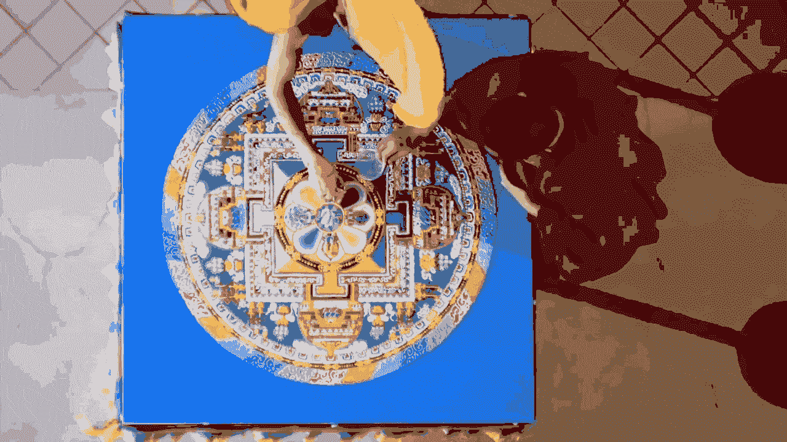

# 像表演一样练习编码

> 原文：<https://medium.com/hackernoon/practicing-coding-as-a-performance-c0ca0ec7261c>

编码通常是在一个孤独的环境中完成的。我们一个人坐着思考，写，修改，可能提交代码评审，再修改，然后合并。这是一种可以与写散文、绘画或雕塑相提并论的活动。

然而，有些时候我们必须作为编码员*执行*，这更像是音乐家的即兴表演。一些例子包括面试或与新同事配对。你也可以把黑客马拉松或者对时间敏感的、关键的错误修复看作是表演。

包括我在内的许多程序员在这些情况下会非常紧张，如果可能的话会尽量避免。但是，如果我们可以将编码作为一种[表演](https://hackernoon.com/tagged/performance)来帮助减轻一些压力，那会怎么样呢？如果它在其他方面对我们正常的、非面向性能的编码有益呢？

# 编码实践的好处

下面，我将描述一些我练习过的方法，但是我发现的一些好处是:

*   降低进入新项目的时间和心理障碍。
*   更快地将新项目提升到最佳实践，如测试、林挺等。
*   将认知负荷从“繁重的工作”问题转移到我试图解决的实际问题上。换句话说，更快地到达[流程](https://en.wikipedia.org/wiki/Flow_(psychology))。
*   在编码时，对自己的感受和心理障碍有清醒的认识。
*   脱离任何一段代码，并愿意用一个更好的实现来代替它，不管是不是我写的。
*   走出思维定势。

# 结构化实践的实验

几年前，我在我工作的公司领导了一轮为期一个月的代码形培训。这些是[编程](https://hackernoon.com/tagged/programming)问题，为了练习或训练，你一次又一次地试图解决它们。希望它们能帮助你锻炼心智，强化你的学习，并且更熟悉具体的问题和一般的编码。我提出了解决问题的建议，并要求经理们给他们的员工时间来解决这些问题，如果他们选择参与的话。

A different kind of structured practice

每个人都可以自由地练习他们想要的东西，但是在我自己的练习中，我把我的注意力从传统的算法问题转移到了设计模式上。很多天，我会从一个全新的项目开始，引导它直到我可以做一个简单的问题，但是有一个全功能的测试基础设施。我给自己设定了时间限制，有时我甚至没有深入研究代码，但我练习了*开始一个新项目*。

在开始这个实践之前，我心里有一个开始一个新项目的成本。我会考虑所有我必须做的引导和样板文件。这么多想法留在我的笔记里，从来没有写出来。当我开始新的项目时，我可能会等到绝对必要时再进行测试，因为这意味着我必须弄清楚如何设置它，这会分散我对“真正工作”的注意力。

在开始新项目、增加测试、每天花 10-30 分钟左右写代码，甚至几天之后，这些障碍似乎都消失了，即使只是精神上的。我知道我可以很快上手，专注于我想做的代码。

# 新的开始

我做这个实验已经有几年了，最近我决定以一种小得多的方式回归，但还是通过启动项目。最近我在 React 中做了很多 Javascript web 开发，使用 [create-react-app](https://github.com/facebookincubator/create-react-app) 开始一个项目变得容易多了。类似地，对于其他语言和框架，有一个惊人的转变，使开始新项目比以往任何时候都更容易。

Starting over can be fun!

使用这些引导工具启动新项目的一个好处是，它们包含了新的默认设置和捆绑的推荐包。当我最近开始我的一些其他项目时，我必须弄清楚如何设置，但现在大部分问题都解决了。通过使用新的最佳实践，我可以看到如何修改我现有的一些项目。

如果你有兴趣尝试这种类型的练习，这里有一些关于如何组织你的课程的想法:

*   使用您已经熟悉的最新版本的堆栈开始一个新项目。
*   建立一个你以前做过的小功能——如果可以的话，在这个阶段避免创造性和新奇的学习。你在练习。
*   当你编码时，注意你的想法——当你觉得你必须做出一个主动的决定时(例如，我应该把这个文件放在哪里？我应该把这个分成小块吗？等等。)，就赶紧挑一个选项。下一次，尝试另一个选项。
*   限制每次练习的时间。当你重复创建新的项目时，你会变得更快，从而有更多的时间在相同的时间内更深入地探索。
*   每次会话结束时保存您的工作，但以后不要再从它开始。随意重温，只是为了看看你可能已经做了什么，或者你已经取得了多大的进展，但是把每一次会议的工作视为一次性的。(c.f. [沙曼陀罗](https://en.wikipedia.org/wiki/Sand_mandala)

Finishing a sand mandala

这一轮实践已经鼓励我开始一些新的项目。在我有机会在实践中创建并丢弃一些代码之后，它们似乎变得更容易了。

尽管做了所有这些练习，我仍然不期待很快为其他人表演，但是我意识到我很享受为自己表演，更快地进入新的项目。

你试过用类似的方法练习吗？什么有效，什么无效？

如果你尝试这种做法，请留下你的回复。✍️

谢谢，练习愉快！

*如果你喜欢这篇文章，你会吗💚和/或共享以便其他人可以找到它？一个追随者也会对你很好。:)*

> [黑客中午](http://bit.ly/Hackernoon)是黑客如何开始他们的下午。我们是 [@AMI](http://bit.ly/atAMIatAMI) 家庭的一员。我们现在[接受投稿](http://bit.ly/hackernoonsubmission)并乐意[讨论广告&赞助](mailto:partners@amipublications.com)机会。
> 
> 如果你喜欢这个故事，我们推荐你阅读我们的[最新科技故事](http://bit.ly/hackernoonlatestt)和[趋势科技故事](https://hackernoon.com/trending)。直到下一次，不要把世界的现实想当然！

