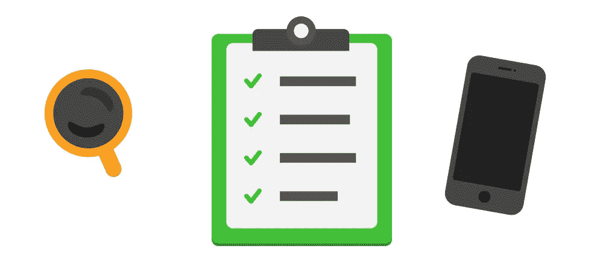

# 产品管理 40 步:一个好的产品经理每天都在做什么？

> 原文：<https://medium.com/hackernoon/product-management-in-40-steps-what-does-a-good-product-manager-do-every-day-f5730fdf19c9>

无论你已经是一名产品经理，正在考虑产品管理的工作，还是只是和产品经理一起工作，有一点是肯定的:你可能会从你询问的每个人那里听到关于产品经理是什么和做什么的不同定义。

对于产品经理的日常工作有很多困惑。产品经理是“*产品*的 CEO”(这是一个宽泛且被误解的定义)，还是管理产品的人(对产品管理的看法要狭隘得多)，还是两者兼而有之？

事实上，这些不同定义的主要原因是，产品经理的角色可能因公司、行业和许多其他因素而异。在大型企业中，产品经理的职责和他们开展业务的方式，以及在初创企业中产品经理需要做的事情之间存在显著差异。

在经历了在这两种环境中与几十个产品经理一起工作超过 10 年后，我想也许我们应该停止尝试创建产品经理角色的标准定义，而是详细说明产品经理在动态环境中必须经常扮演的各种角色。下面的内容是根据我作为产品经理和其他产品经理交流时所做的笔记整理而成的。

## 谁是产品经理，他们做什么？

或许我们应该停止对产品经理的定义，一步一步写下这个人在公司应该承担的角色。以下条目是我经过长时间思考后，在纸上、笔记本、电脑上做的笔记组成的。

1.  他们**认识顾客**。他们知道现有客户的问题，并试图找出潜在客户的问题。
2.  他们很有能力**讲故事**。在展示产品时，他们不太关注具体的特性和功能，而是讲述他们的产品如何满足客户需求并帮助他们取得成功的故事。他们知道如何调整自己的故事，让不同类型的客户能够轻松联系起来。
3.  他们与媒体保持联系。作为这个过程的一部分，他们再次使用故事，而不是强调产品的技术特征。
4.  他们**找到第一批测试客户**，找出哪些人会投入必要的时间和资源，会积极使用产品，会提供周到而有价值的反馈。
5.  他们能够吸引一直使用该产品的满意客户，并让他们**同意花时间提供用于案例研究的信息和反馈**。
6.  他们**准备案例研究**，撰写文本，创作故事，在网站上发布，并寻找其他渠道传播研究成果。
7.  他们创造了滴滴营销(逐步营销)的**规则。他们训练潜在客户按照规定的标准留下他们的电子邮件地址。**
8.  他们拥有**基本的网页制作技能**。
9.  他们决定产品的价格或价格区间，在这样做的同时，他们还研究类似产品是如何定价的。他们知道低价并不总是带来更多的销售。如果有必要，他们根据客户来定价。
10.  如果产品没有达到预期，没有实现既定的目标，他们必须准备好**改变**结构。
11.  他们对**设计和用户体验**有[深刻的认识](https://www.vitsoe.com/eu/about/good-design)，但并不过分痴迷于此。他们与设计师团队合作无间。
12.  他们能够向设计团队详细传达他们想要的东西。如有必要，他们提前绘制基础图纸并准备一份**分析文件**。
13.  他们知道何时使用哪些功能。他们去掉了不必要的部分。他们知道如何组织功能，隐藏那些不需要显示的功能，以及何时删除它们。
14.  他们像乐队指挥一样工作，鼓励其他团队成员积极参与产品开发过程。
15.  他们平衡每个群体的要求和愿望，并确保所有群体同步发展，以提高销售额并完善产品愿景。
16.  他们几乎像了解自己的产品一样了解竞争对手的产品。
17.  他们知道他们的对手。他们检查市场。它们总是最新的。他们通过各种渠道(社交媒体、网络、博客)关注他们。它们不会制造财政、技术和行政借口。他们首先关注他们的产品。他们有效地利用时间。他们处理的是事件，不是人。
18.  他们不仅关注产品本身，还关注收入和客户。产品有多少技术特征是次要的。
19.  他们利用定性和定量的价值来改进产品。他们知道如何利用数字、直觉和反馈来改进产品。
20.  他们按时制作自己的报告，并与上级和下级单位分享。他们确保产品开发过程在整个组织中是透明的。
21.  即使团队的想法似乎毫无意义，他们也愿意与队友交流。他们不在乎这些建议有多有效，但保持它们畅通是很重要的。
22.  他们将队友融入流程，必要时委派工作，确保**产出是 10x** 。他们并不是什么都知道。
23.  他们知道开发一个特定的功能需要多少时间和金钱。他们每周都遵循产品路线图和时间表。
24.  在将想法转化为产品之前，他们征求每个人的意见。他们确保正在完成的工作被工作在不同方面的团队质疑。
25.  **他们热爱自己的工作，没有压力。他们不紧张，他们把紧张从环境中释放出来。他们关注细节，但不会迷失其中。通过这种方式，他们可以与队友产生共鸣，并建立更牢固的沟通基础。**
26.  他们通过与团队和客户建立长期沟通来避免短期的因果关系。
27.  他们参与产品的部署过程。他们直接与客户打交道。
28.  他们协调在发布**新版本**之前需要完成的所有操作。
29.  他们了解并跟踪每一个**客户投诉**。他们跟踪每一次投诉，有多少客户提出了同样的投诉，以及其他相关信息。他们根据这些投诉开发产品。
30.  他们销售产品。他们训练公司。他们听取营销团队的反馈。
31.  他们很专注。他们不是试图立即解决客户的所有问题，而是对问题进行优先排序和安排(T21 ),并将其作为整体发展计划的一部分。
32.  他们非常了解产品的每一点。他们像大学教师一样精通他们的学科。
33.  他们可以看到产品的全貌。他们设计他们添加到产品中的每个属性将向客户提供什么。他们战略性地进步。
34.  他们定期培训销售团队。为了增加销售额，他们按照销售团队来规范产品，按照产品来组织销售团队。他们在销售策略中扮演着积极的角色。
35.  他们找到积极使用产品新功能的客户，倾听他们的意见，获得反馈并与团队分享。
36.  他们**与整个团队分享**来自其他满意客户的积极反馈，提供信心，创造快乐:)
37.  他们探索潜在的合作关系。他们想好了与谁合作，在目标地理区域推广产品，并且完成了。
38.  **他们准备产品培训文件和视频**。如果他们正在与第三方公司合作进行该流程，他们将与第三方公司一起参与该流程。(自我提醒:去年我准备了近 200 页的文件)
39.  **他们意识到技术发展**，并与开发团队合作，在产品的某些点上反映出来。
40.  他们有勇气。

写完所有这些条目后，我们很容易得出以下结论:

产品经理从来不是这样的人，他从公司内部和外部获得想法，并从中选择最好的，然后将工作交给开发团队，并确保完成工作。

相反，产品经理是拥有无数能力的人，比如快速开发、团队合作、客户认可、增加销售、增强用户体验。

为了做到这一点，产品经理必须是一个能够倾听、决策、清晰沟通并克服自我的人。

**总之，好的产品经理永远是赢家。**

如果你有任何想法想补充或者觉得我错过了，请告诉我。

戈尔肯·切廷博士