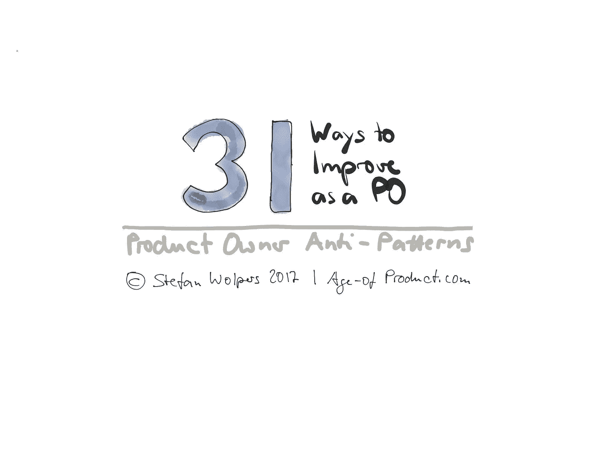

# 产品所有者反模式

> 原文：<https://medium.com/hackernoon/product-owner-anti-patterns-22ed1f989867>

如果你是产品负责人，很有可能会有改进的空间。我整理了这份最常见的产品所有者反模式列表，以帮助您提高游戏水平。

如果你想提高你认识的人，为什么不向 scrum 大师和团队寻求支持呢？产品所有者反模式列表是回顾的良好起点。

# 产品积压和细化

您可以在 PO 的后院发现大多数产品所有者反模式——产品积压及其细化:

*   代理人确定优先级:一个利益相关者或者一个利益相关者委员会确定产品待办事项的优先级。(Scrum 的优势建立在产品负责人的强势地位之上。产品负责人是唯一决定什么任务成为产品待办事项的人。因此，产品所有者也决定优先级。去掉这种授权，Scrum 就变成了一个非常健壮的瀑布 2.0 过程。)
*   **规模过大**:产品积压包含的项目比 scrum 团队在三到四次冲刺中能够交付的要多。(这样，产品所有者通过囤积可能永远不会实现的问题来制造浪费。)
*   **过时的问题**:产品积压包含了六到八周或者更长时间没有被触及的项目。(这通常是两到四次冲刺的长度。如果产品负责人囤积积压的项目，那么旧的项目就有过时的风险，从而使得 scrum 团队先前投入的工作变得过时。)
*   **缺少验收标准**:产品 backlog 中有没有验收标准的用户故事。(在细化周期开始时，没有必要有验收标准，尽管它们会使任务变得容易得多。然而，最终所有的用户故事都需要满足就绪标准的定义，而接受标准是该定义的一部分。)
*   **不超过一个标题**:产品 backlog 包含的用户故事只不过是一个标题。(见上。)
*   **问题太详细**:有用户故事，有一个广泛的接受标准列表。(这是另一个极端:产品负责人在没有与团队协商的情况下覆盖每个边缘案例。通常，三到五个验收标准就足够了。)
*   **想法的存储**:产品负责人使用产品 backlog 作为想法和需求的存储库。(这种实践堵塞了产品积压，可能导致认知超载，并使在项目组合管理和路线图计划级别与‘大图’保持一致变得非常困难。)
*   **兼职 PO** :产品负责人不是每天都在处理产品积压。(产品 backlog 需要在任何给定的时间代表开发团队资源的最佳使用。在下一次优化会议之前每周更新一次不足以满足这一要求。)
*   **复制&粘贴 PO** :产品负责人通过将从涉众那里收到的需求文档分解成更小的块来创建用户故事。(这个场景帮助产品所有者获得了“票猴”的绰号。记住:用户故事的创建是一个团队练习。)
*   **主导 PO** :产品负责人通过不仅提供“为什么”，还提供“如何”和“什么”来创造用户故事。(团队回答“如何”的问题——技术实现——团队和 PO 在“什么”的问题上合作:达到预期目的需要什么范围。)
*   投资——什么？产品负责人没有将比尔·威克的[投资原则](http://xp123.com/articles/invest-in-good-stories-and-smart-tasks/)应用到用户故事中。
*   **问题过于详细**:产品负责人在用户故事上投入了太多的时间，使得它们过于详细。(如果一个用户故事看起来很完整，团队成员可能看不到参与进一步细化的必要性。这样,“胖”的用户故事降低了团队的参与度，损害了共享理解的创建。顺便说一下，在我们使用索引卡的时候，考虑到它们的物理限制，这种情况并没有发生。)
*   **什么团队？**产品负责人没有让整个 scrum 团队参与细化过程，而是仅仅依靠“首席工程师”(或者团队中独立于其他人的任何其他成员)。
*   **“我都知道”PO** :产品负责人在细化过程中不涉及利益相关者或主题专家。(一个认为自己无所不知或者是沟通渠道的产品负责人对 Scrum 团队的成功来说是一个风险。)

# 冲刺规划反模式

在我的产品所有者反模式列表中，第二个领域是 sprint 规划本身:

*   **我们为什么而战？**产品负责人无法提供冲刺目标，或者选择的冲刺目标有缺陷。(一个原始的冲刺目标回答了“我们为什么而战？”问题。这是产品所有者和开发团队之间的谈判。它是集中的和可衡量的，因为 sprint 目标和团队预测是密切相关的。最后，sprint 目标是对即将到来的 sprint 的有用校准。)
*   **称看板为“Scrum”**:sprint backlog 类似于任务的随机分类，没有定义 sprint 目标。(如果这是完成你的 sprint planning I 的自然方式，你可能已经超越了 Scrum 作为产品开发框架的有用性。根据你产品的成熟度，看板可能是一个更好的解决方案。否则，这种随机性可能意味着一个软弱的产品所有者，他会过多地听取利益相关者的意见，而不是适当地对产品待办事项进行优先级排序。)
*   **未完成的业务**:上一个 sprint 中未完成的用户故事和其他任务没有经过任何讨论就溢出到新的 sprint 中。(这可能有充分的理由，例如，任务的值没有改变。不过，这不应该是一种自动性，记住[沉没成本谬论](https://en.wikipedia.org/wiki/Sunk_cost#Loss_aversion_and_the_sunk_cost_fallacy)。)
*   **最后一分钟的变化**:产品负责人试图挤进一些不符合就绪定义的最后一分钟的用户故事。(原则上，产品负责人有权做出这样的改变，以确保开发团队在任何给定的时间都只致力于最有价值的用户故事。然而，如果 scrum 团队有规律地实践产品积压精化会议，这些事件应该是一个罕见的例外。如果这些经常发生，这表明产品负责人需要在优先级和团队沟通方面得到帮助。或者产品负责人需要支持，以便更经常地对利益相关者说“不”。)
*   **输出焦点**:产品负责人推动开发团队承担比它实际能处理的更多的任务。产品负责人可能会参考以前的团队度量标准，比如速度，来支持他或她的愿望。

# 下载 Scrum 反模式指南

这本电子书涵盖了 150 多种 Scrum 反模式，可以在这里免费获得。 [*现在就下载****《Scrum 反模式指南》*** *！*](https://age-of-product.com/scrum-anti-patterns/)

下载内容以 PDF 格式发送到您的电子邮件地址。请注意，如果您还没有订阅的话，下载此内容还会为您订阅我们广受欢迎的专业策划的每周“敏捷思维的食粮”时事通讯。(当然，您可以随时取消订阅。)

[我们尊重您的隐私](https://age-of-product.com/privacy/)

# 冲刺反模式

另一个容易出现产品所有者反模式的领域是 sprint 本身:

*   **缺席 PO** :产品负责人在 sprint 的大部分时间都缺席，无法回答开发团队的问题。(这为 sprint 的持续时间创建了一个微瀑布方法。)
*   **PO 执着于任务**:一旦产品待办事项变成 sprint 待办事项，产品负责人就不能放手。例如，产品负责人扩大了用户故事的范围。或者，一旦团队接受了 sprint backlog 中的问题，他或她就改变接受标准。(有一条清晰的线:在产品待办事项变成冲刺待办事项之前，产品负责人是有责任的。然而，一旦它从一个待办事项转移到另一个，开发团队就要负责任了。如果在冲刺阶段变化变得尖锐，团队将共同决定如何处理它们。)
*   **不灵活 PO** :产品负责人不灵活调整验收标准。(如果一项任务的工作揭示了达成一致的验收标准不再是可实现的或浪费的，scrum 团队需要适应新的现实。盲目地遵循最初的计划违反了 scrum 的一个核心原则。)
*   **延迟采购订单**:一旦 sprint 待办事项完成，产品负责人不接受。相反，他或她会一直等到冲刺结束。(本着持续集成的精神，产品负责人应该立即检查符合验收标准的任务。否则，产品所有者将创建一个人工队列，这将增加周期时间。这种习惯也给达到冲刺目标带来了风险。)
*   **滥用 sprint 取消**:产品负责人取消 sprint，以将他或她的意愿强加给团队。(取消 sprints 是产品负责人的特权。但是，如果没有严重的原因，产品负责人不应该轻易这样做。产品负责人也不应该在没有咨询开发团队的情况下中止 sprint。很可能，团队有办法拯救 sprint。最后，滥用取消特权也表明存在严重的团队协作问题。)
*   **不取消 sprint**:产品负责人不取消 sprint 目标不再能够实现的 sprint。(如果产品负责人确定了一个统一的 sprint 目标，例如，集成一种新的支付方法，然后管理层在 sprint 中途放弃了这种支付方法，那么继续致力于 sprint 目标将是一种浪费。在这种情况下，产品负责人应该取消 sprint。)

***请点击【拍手】*** 👏 ***，如果你觉得这篇文章有用——它对我来说意义重大！***

# 站立式反模式

与其他 Scrum 仪式相比，单口相声对产品所有者反模式有显著的弹性。只有一个严重:

*   **计划会议**:产品负责人劫持站立者来讨论新的需求，提炼用户故事，或者开一个类似(冲刺)的计划会议。
*   **一只健谈的鸡**:产品负责人——至少在我看来——更像是一只“鸡”，而不是单口相声中的团队成员。因此，说得太多可能是一个问题。(不过，兼任 scrum 大师的产品负责人是另一种情况。)

# 冲刺评审反模式

最后是冲刺复习。尽管这对产品负责人来说是一个改善与涉众和 scrum 团队合作的绝佳机会，但是一些 POs 根本没有理解这个信息:

*   **自私的 PO** :产品负责人向利益相关者展示“他或她的”成就。(还记得那句老话:“团队”里没有“我”吗？)
*   **延迟的 sprint 接受**:产品负责人使用 sprint 评审来接受用户故事。(这个要和 sprint 评审脱钩。产品负责人应该在用户故事满足接受标准的时候接受它们。)
*   **不可接近的 PO** :产品负责人不接受利益相关者的反馈。(这样的行为违背了冲刺评审仪式的首要目的。)

# 结论

诚然，产品负责人的角色是最具挑战性的 scrum 角色，期望越高，就越容易让他们失望。然而，持续改进的概念也适用于行使产品负责人的角色。上面的产品所有者反模式列表可能是一个起点。

您观察到列表中缺少哪些产品所有者反模式？请在评论中与我分享。

# 产品所有者反模式相关的帖子

[28 产品积压和精化反模式](https://age-of-product.com/28-product-backlog-anti-patterns/)

[免费下载“Scrum 反模式指南”](https://age-of-product.com/scrum-anti-patterns/)

***请点击【拍手】*** 👏 ***，如果你觉得这篇文章有用——它对我来说意义重大！***

***要不要这样多读书？嗯:***

*   📰 ***加入 11773 同行和*** [***报名参加本周刊快讯***](https://age-of-product.com/subscribe/?ref=Food4ThoughtMedium)
*   🐦 ***关注我上*** [***推特***](https://twitter.com/stefanw) ***并订阅我的博客*** [***产品年龄***](https://age-of-product.com)
*   💬 ***或者，免费加入*** [***Slack 团队的 1750 多名同行【动手敏捷】******…***](https://goo.gl/forms/XIsABn0fLn9O0hqg2)

*原载于 2017 年 10 月 2 日 age-of-product.com***。**