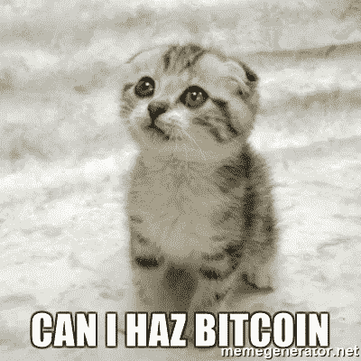

# 利害关系证明与工作证明

> 原文：<https://medium.com/hackernoon/proof-of-stake-vs-proof-of-work-fe6a3717a2d7>

No internet article can be made less informative by a cat image

每一次关于加密货币的对话都带有宗教色彩。一些人坚定地认为，无论如何加密都注定会升值，而另一些人则持有同样强烈的相反信念，认为加密货币作为一种资产类别是彻头彻尾的狗屎，是有史以来最大的泡沫。

撇开宗教争论不谈，肯定有一种方法可以以某种理性的方式分析密码的长期价值。我认为[利益证明与工作证明](https://github.com/ethereum/wiki/wiki/Proof-of-Stake-FAQ)是此类分析中应包含的一个重要方面。

假设一个人将资本分配给任何传统的资产类别。资本分配的目标是获得对资产产生的未来预期现金流的要求权。这些预期现金流为资产提供了有效的价格底线。相比之下，工作证明硬币没有这种属性。在任何给定时间点，一枚战俘硬币可能花费 X、2X 或 0.5X，而没有分析框架来估计公平价值或价格下限。当然，可以使用统计或技术分析来计算战俘硬币的短期供求动态，但这对沃伦巴菲特式的价值套利没有帮助，这种力量是传统资产的长期价格底线。传统上，工作证明硬币的供应量有限，这被用作供需曲线在不断增加的点相遇的论据。目前还不清楚这个论点有多大说服力，因为现在有大量的权力链，将来也有无数个可能的区块链。

在利害关系证明系统中，硬币持有者因确认交易而获得交易费。因此，股权证明为长期持有硬币创造了清晰明确的经济激励。硬币的价格可以根据预期的未来现金流进行分析，这些现金流以网络交易费的形式产生。本质上，POS 区块链可以被认为是一个分散的 Visa / Mastercard，具有由特定实现支持的所有附加的分布式分类帐功能。这一点很重要，因为传统的价值套利投资可以支持一个证明股权的硬币价值。与任何其他产生现金流的资产类似，一个正常运行的网络中的 POS 硬币的价值不能长期低于网络产生的现金流的现值，从而产生稳定性并抑制波动性，这反过来意味着 POS 硬币应该比其 POW 竞争对手更好地存储价值。

我们目前没有很多功能性的利害关系证明区块链。或许，Dash 可以被认为是一种混合工作证明/利益证明或服务模型。以太坊计划在某个时候切换到 Proof-of-Stake，但目前还不清楚这种升级是否会像宣传的那样奏效。

TL；DR；我愿意发布一个有条件的预测:

如果 Vitalik buter in、[、Vlad Zam fir](https://medium.com/u/aa9bb0a9d2ad?source=post_page-----fe6a3717a2d7--------------------------------)和以太坊团队的其他成员能够齐心协力，成功完成 POS 升级，从长远来看，以太坊和其他竞争 POS 链将接管并取代 POW 货币作为价值储存手段和支付网络/分类账。

no cat picture can ever detract from any internet article