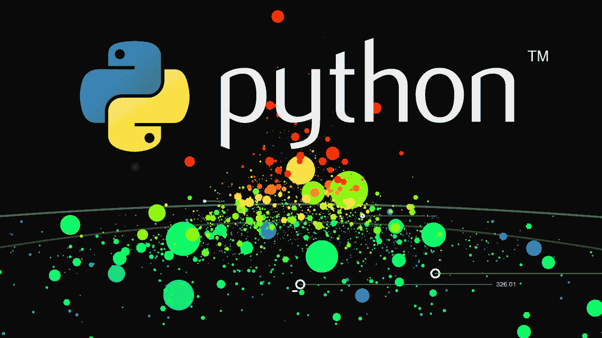

# Python 是发展最快的编程语言，因为它有一个你从未听说过的特性

> 原文：<https://medium.com/hackernoon/python-is-the-fastest-growing-programming-language-due-to-a-feature-youve-never-heard-of-3ea2fa344a84>

根据最近的 StackOverflow 分析，Python 是已经广泛使用的编程语言中发展最快的。更重要的是，增长率正在*加速*，而且在过去几年里一直如此。虽然 StackOverflow 帖子的具体结论可能应该有所保留，但不可否认的事实是，Python 的使用在过去五年中呈爆炸式增长。对于那些长期使用并喜欢这种语言的人来说，这是一个好消息，但是问一下*为什么* Python 的使用激增仍然很重要。这种增长的主要的，如果不是唯一的促进因素，是这种语言的一个特点，你可能从来没有听说过。

# 大数据和不情愿的程序员

随着大数据的兴起，大多数行业发现自己处于一个可怕的境地:他们花费了大量的时间和金钱来构建大数据管道，但他们的投资回报却很少。在捕捉不断增长的数据量的激烈竞争中，大多数公司对于如何处理它们捕捉到的数据没有明确的计划。当时，每个人都认为通过存储大量数据，分析将变得简单，有价值的商业见解几乎是不言而喻的。这在今天听起来可能很傻，但大多数人认为，一旦获得足够的数据，数据中的模式就会变得显而易见。

不幸的是，事实并非如此。

相反，该行业几乎同时集体意识到，他们希望收集的非平凡见解和希望回答的问题需要严格的数学分析和验证。SQL 查询可能揭示最明显的模式和趋势，但是真正有趣的东西需要完全不同的技能。这是一套牢牢植根于统计学和应用数学的技能，是学术界以外的人似乎都不具备的。此外，负责分析这些庞大数据集的人不仅需要非常扎实的数学背景，*他们还需要能够编写软件*。

因此,“数据科学家”的头衔开始出现在求职网站和简历中也就不足为奇了，尽管还需要几年时间才能有人试图精确地确定数据科学家到底做了什么。当时，它更接近于“在统计分析和编程方面都有能力的人”的简写。

# Web 上的 Ruby 与 Python

再往前倒一点，在大数据成为真正的“东西”之前，你会看到 Ruby 和 Python 之间为成为“网络语言”而展开的激烈战斗。两者都被证明非常适合开发 web 应用程序。Ruby 的流行与 [Rails](http://rubyonrails.org/) 框架密切相关。很少有人会说，大多数自称为“Ruby 程序员”的程序员可能会说“Rails 程序员”。Python 在学术界和一些不同的行业中已经相当稳固了。与 Rails 最接近的 Python 等价物是 [Django](https://www.djangoproject.com/) 。尽管发布时间比 Rails 稍早，但它的受欢迎程度似乎远远落后。

许多人认为这两种语言在表现力和可接近性方面非常相似，最终会“赢得”网络。但是这种想法的含义有一个根本的不同:虽然 Ruby 的受欢迎程度与 Rails 的密切相关，但是 Django 只代表了已经充满活力的 Python 生态系统中相对较小的一部分。看起来，Ruby 需要 Rails 来“击败”Python，以保证它的持续流行。在很多方面确实如此。

事实证明，“网络战争”远没有任何人预期的那么重要。

# 房间里的奥列芬特

要理解其中的原因，我们需要追溯到 2006 年，当时 [Travis Oliphant](https://en.wikipedia.org/wiki/Travis_Oliphant) 还是 BYU 的助理教授，而不是完全基于 Python 构建的最成功的商业[数据科学](https://hackernoon.com/tagged/data-science)平台之一[Anaconda(nee Continuum Analytics)](https://www.anaconda.com/)的联合创始人。一年前，他基于以前的科学计算库 Numeric 启动了 [NumPy](http://www.numpy.org/) 项目。他最终成为 SciPy 的创始贡献者，甚至担任 PSF 的主任。但是在 2006 年，他(和卡尔·班克斯一起)提交了 [PEP 3118](https://www.python.org/dev/peps/pep-3118/) ，这是对 Python 的**“缓冲协议”**的修订。

buffer 协议过去是(现在仍然是)一个非常低级的 API，用于其他库直接操作内存缓冲区。这些是解释器创建和使用的缓冲区，用于在连续内存中存储某些类型的数据(最初，主要是“类似数组”的结构，其中数据的类型和大小是预先知道的)。

提供这样一个 API 的主要动机是*消除仅在读取时复制数据的需要，澄清缓冲区的所有权语义，并将数据存储在连续内存中(即使在多维数据结构的情况下)，其中读取访问非常快。那些使用 API 的“其他库”几乎肯定是用 C 语言编写的，并且对性能高度敏感。新的协议意味着，如果我创建一个整数的 NumPy 数组，其他库可以*直接访问底层的内存缓冲区*，而不需要间接访问，或者更糟的是，在使用之前复制数据。*

现在，为了让这段漫长的记忆之旅走完整个圈，有一个问题:什么类型的程序员会从对大量数据的快速、零拷贝的内存访问中受益匪浅？

**为什么，当然是数据科学家。**

# 我们是如何从那里来到这里的

所以现在我们看到了全貌:

*   在羽翼未丰的 NumPy 项目的推动下，奥列芬特和班克斯提议修改 Python 的缓冲协议，以简化对某些数据结构的底层内存的直接访问。
*   PEP 3118 已提交、接受并实施。
*   由于 PEP 3118 的实现，Python 已经悄悄地成为一种令人难以置信的令人信服的语言，可以在其上构建数值计算库，因为 C 扩展可以以很小的开销共享和操作数据
*   Python 和 Ruby 在网络上一决雌雄，大多数人认为这场“语言战争”将会胜利
*   随着磁存储设备价格暴跌，存储大量数据供以后分析变得可行(即使不清楚分析可能需要什么；最好只是保存数据，因为这样做已经足够便宜了)
*   对新一代程序员的需求出现了:一个有统计学和/或应用数学背景，以前没有什么编程经验的人
*   **数据科学家**，在寻找一种既有表现力*又有速度*的语言(有良好的数值计算库支持)时，都选择了 Python
*   在后续的帖子中，堆栈溢出的大卫·罗宾逊详细介绍了[“为什么是 Python”](https://stackoverflow.blog/2017/09/14/python-growing-quickly/)，为数据科学成为主要驱动力提供了一个令人信服的案例
*   杰夫最后写了一篇文章，详细介绍了为什么 Python 在过去五年中如此受欢迎，自从他参与了 [Arrow](https://arrow.apache.org/) 和 [Parquet](https://parquet.apache.org/) 项目以来，这篇文章一直萦绕在他的脑海中

# 我们将何去何从？

在本文的第二部分，我将解释过去几年里我在 Python 方面做了什么*，以及它如何与上面的故事和数据科学家的崛起直接联系起来。*

由杰夫·努普于 2017 年 9 月 15 日发布

*原载于 2017 年 9 月 15 日*[*jeffknupp.com*](https://jeffknupp.com/blog/2017/09/15/python-is-the-fastest-growing-programming-language-due-to-a-feature-youve-never-heard-of/)*。*