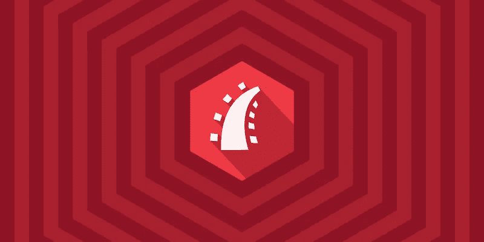

# 没有 Ruby 或 Rails 的 Rails 开发

> 原文：<https://medium.com/hackernoon/rails-development-without-ruby-or-rails-d41b3ce56249>



这可能吗？好吧，我承认不是。但是先别走！让我解释一下。

我所说的是与您的开发机器相隔离的 Rails 应用程序开发。因此，虽然从技术上讲，你仍然需要 Ruby 和 Rails *在某个地方*，但你不需要它们把你的本地机器搞得一团糟。

# 老办法

我开发 Ruby on Rails 已经将近 10 年了(这让我觉得自己真的老了)。虽然 Rails 是一个非常棒的框架，Ruby 是一门非常漂亮的语言，但是 Ruby on Rails 的开发一直有一些问题困扰着我。

## 版本管理

> 你如何在项目之间管理 Ruby 的版本？您可以创建一个版本管理器，这样您就不必这么做了。

`RVM`还是`rbenv`，这是个问题…

版本管理器为您提供了下载、安装、列出和切换 Ruby 版本所需的一切，但老实说，这是一种痛苦(不像之前的[那么痛苦，但仍然是一种痛苦)。](http://andre.arko.net/2015/04/28/how-does-bundler-work-anyway/)

我不记得有多少次我安装了一个新的宝石，却忘了用`rbenv rehash`把垫片放入环境中，所以我坐在那里挠头，想知道它为什么不工作...

管理 Ruby 的版本、版本管理器的版本，并确保我运行的所有东西都和我团队中的其他人运行的是同一个版本，这太乏味了…唉。

## 依赖性管理

这里的情况不会好到哪里去。`gemfile`是声明依赖关系的直接方式，而`bundler`使得获取/更新它们变得容易。但也就到此为止了。

我安装的那些宝石到底去哪了？

它们都被塞进了一个文件夹，在当前版本的 Ruby 下，在你的本地机器上。成百上千的文件。太疯狂了，对吧？加上`node_modules`和`bower_components`，你可能在谈论你为每个项目存储的**数百万行代码！**

## 克鲁福特

这是前两次留下的所有东西。我不知道你怎么想，但我通常不会在完成一个项目后去清理所有的东西。

我敢说你已经安装了多少版本的 Ruby 了…如果你用的是`rvm`那就是`rvm list`，用`rbenv`那就是`rbenv versions`。

如果你六岁或更少，你可能是幸运的。最有可能的是你有接近 12 个(我甚至不会要求你检查你在每个 Ruby 版本上为你曾经工作过的每个项目安装了多少不同版本的 gem)。

是只有我，还是看起来应该有更好的方式…

# 更好的方法

退一步说，与大多数其他工作流相比，Ruby 和 Rails 的开发仍然非常出色。但现在是 2017 年了。我想终于是时候把^的所有事情都弄清楚了。

实现这一点的方法是使用隔离的开发环境。与其把所有东西都放在你的工作机器上，不如把它们放在专门为满足应用程序需求而创建的环境中。

这将消除对版本和依赖性管理器的需要，消除版本和依赖性冲突，并释放空间和清理文件系统。

## 虚拟化和集装箱化

创建隔离的开发环境的一种方法是使用 vagger 和 VirtualBox。这种方法有点过时了，但还是有点效果的。

街区里新来的孩子叫多克。

Docker 使得使用容器创建这些隔离的环境变得很容易。虽然 Docker 真的很酷，代表了容器化应用程序的巨大飞跃，但它很快就变得复杂了。

一旦您的应用程序增长，并且您有几十个运行多个微服务的容器，您必须在组合中加入 Kubernetes 或 Swarm 之类的东西…这是一个混乱。

当你不得不开始添加*的东西*来帮助管理由其他*的东西*创建的*的东西*，这些东西都是为了让*的东西*变得更简单……事情总是变得更复杂。

# 最好的方法

最好的方法是忘记所有的事情。算了吧。

作为一名应用程序开发人员，我不想担心如何设置我的开发环境*恰到好处*。我不想担心在该环境和任何生产环境之间保持平衡，我甚至不想*考虑*创建、配置或管理生产基础设施…

## 微 PaaS

消除这一切的方法是使用[微型 PaaS](https://content.nanobox.io/introducing-micro-paas-the-next-evolution-of-paas/) 。微 PaaS 的整个概念是，您的应用程序环境应该与您的应用程序共存。

## 它是如何工作的

微 PaaS 在项目的根目录下使用一个简单的配置文件来定义应用程序环境。因为这个配置文件存在于应用程序中，所以无论你的应用程序去哪里，你的环境都会跟着去。

想想这里的含义…

您创建自己的应用程序，轻松地与整个团队共享，并保证每个人都运行在完全相同的基础架构上。你不需要担心*那个人*似乎永远无法让应用程序运行，或者那个新来的家伙会占用你几天的时间来设置应用程序并提高效率。

微平台即服务的另一个**巨大的**好处是，同样，由于您的应用程序环境与应用程序代码共存，您不必担心创建或配置生产基础设施。您只需部署您的代码，基础设施就为您创建和配置好了。

这保证了所有环境之间的*精确的*对等性；开发，筹备，生产，等等。

## 开发人员的理想平台

如果你能理解我在这里谈到的任何事情，并准备好改进你的开发工作流程， [Nanobox](https://nanobox.io) 是一个微型 PaaS，你现在就可以开始使用。

Nanobox 通过利用 Docker 创建虚拟开发环境，为您提供了容器的所有功能和灵活性。这可以让你的项目保持独立，让你的工作机器保持干净。您不必担心配置应用程序环境的细节，这一切都是为您处理的。

如果您和我一样，想不惜一切代价避免基础设施配置和管理的复杂性，没有传统 PaaS 的限制，Nanobox 可以轻松地将您的应用部署到任何提供商。您可以轻松部署到 AWS、DigitalOcean、Linode，甚至您定义的自定义提供商。没有更多的供应商锁定，耶！

在项目的根处有一个简单的`boxfile.yml`,您定义了一个本地开发环境:

```
run.config:
  engine: ruby extra_packages:
    - nodejs
```

通过对同一个配置文件进行一些修改，您可以定义一个完整的生产环境:

```
run.config:
  engine: ruby

  extra_packages:
    - nodejs
    - nginx

deploy.config:
  extra_steps:
    - rake assets:precompile

  before_live:
    web.main:
      - rake db:setup_or_migrate

data.db:
  image: nanobox/postgresql

web.main:
  start:
    nginx: nginx -c /app/config/nginx.conf
    puma: bundle exec puma -C /app/config/puma.rb

  writable_dirs:
    - tmp
    - log

  log_watch:
    rails: 'log/production.log'

worker.main:
  start: sidekiq
```

# 请客。哟。自我。

停止在版本管理器、依赖性管理器、环境设置以及基础设施配置和管理上浪费时间和精力。

花时间做你真正喜欢做的事情…开发你的令人敬畏的应用程序！

[](http://bit.ly/HackernoonFB)[](https://goo.gl/k7XYbx)[](https://goo.gl/4ofytp)

> [黑客中午](http://bit.ly/Hackernoon)是黑客如何开始他们的下午。我们是阿妹家庭的一员。我们现在[接受投稿](http://bit.ly/hackernoonsubmission)并乐意[讨论广告&赞助](mailto:partners@amipublications.com)机会。
> 
> 如果你喜欢这个故事，我们推荐你阅读我们的[最新科技故事](http://bit.ly/hackernoonlatestt)和[趋势科技故事](https://hackernoon.com/trending)。直到下一次，不要把世界的现实想当然！

