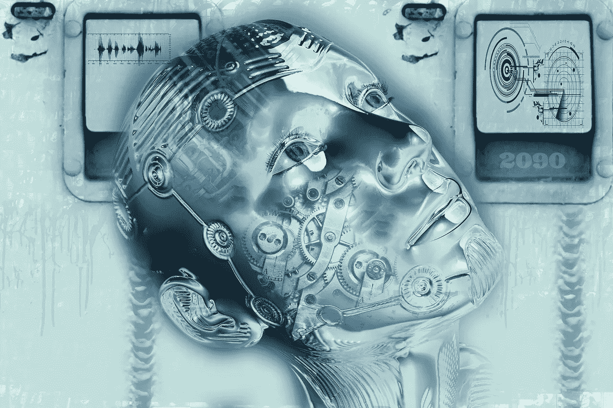
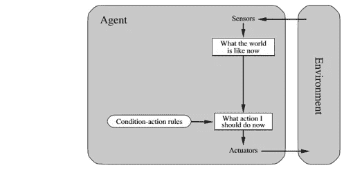
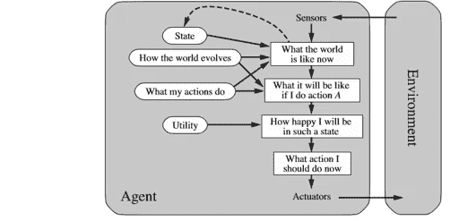

# 人工智能的理性代理

> 原文：<https://medium.com/hackernoon/rational-agents-for-artificial-intelligence-caf94af2cec5>

基于我们希望用它实现什么，以及我们将如何衡量它的成功，你可以采取多种方法来创建人工智能。它的范围从极其罕见和复杂的系统，如自动驾驶汽车和机器人，到我们日常生活的一部分，如人脸识别，机器翻译和电子邮件分类。

下面的文章让我们深入了解真正创造人工智能需要什么。

 [## 所以你认为你知道什么是人工智能？

### 当你想到人工智能时，首先想到的不是机器人就是有大脑的机器…

hackernoon.com](https://hackernoon.com/so-you-think-you-know-what-is-artificial-intelligence-6928db640c42) 

你选择的道路将取决于你的人工智能的目标是什么，以及你对各种方法的复杂性和可行性的理解程度。在本文中，我们将讨论被认为对科学发展更可行和更普遍的方法，即 ***研究理性/智能主体的设计。***

## 什么是代理？

任何可以被视为

*   **通过传感器感知周围环境**
*   **通过执行器对其进行操作**

***它会在感知、思考、行动的循环中运行。*** 以人类为例，我们通过我们的五官(传感器)感知我们的环境，我们思考它，然后使用我们的身体部位(执行器)行动。类似地，机器人代理通过我们提供给它们的传感器(可以是摄像机、麦克风、红外探测器)感知环境，它们进行一些计算(思考)，然后使用各种附加的马达/致动器来执行功能。现在，应该清楚的是，你周围的世界充满了像你的手机、吸尘器、智能冰箱、恒温器、相机甚至你自己这样的代理。

## 什么是智能代理？

***一个智能体，在给定它所感知到的和它所拥有的任何内在知识所提供的证据的情况下，它以一种期望最大化其性能度量的方式行动。***

> 绩效衡量标准定义了代理成功的标准。

这种代理也称为**理性代理。**智能体的合理性通过其性能度量、其拥有的先验知识、其能够感知的环境和其能够执行的动作来衡量。

> 这个概念是人工智能的核心。

智能代理的上述属性通常被归入术语 PEAS，它代表性能、环境、执行器和传感器。因此，举例来说，一辆自动驾驶汽车将有以下豌豆:-

*   性能:安全、时间、合法行驶、舒适。
*   环境:道路、其他汽车、行人、路标。
*   执行器:转向、油门、刹车、信号、喇叭。
*   传感器:摄像头、声纳、GPS、速度计、里程表、加速计、发动机传感器、键盘。

为了满足真实世界的用例，人工智能本身需要有广泛的智能代理。这带来了代理类型和环境的多样性。让我们来看看。

## 环境类型

需要设计一个 rational agent，记住它将被使用的环境类型。以下是类型:-

*   **完全可观察和部分可观察**:如果完全可观察，代理的传感器让它*获得环境在每个时间点的完整状态*，否则不可观察。比如 ***象棋是完全可观察的环境，而扑克不是***
*   **确定性和随机性**:环境的*下一个状态完全由当前状态和代理*执行的动作决定。(如果除了其他主体的行动，环境是确定性的，那么环境是战略性的)。*随机环境本质上是随机的，不能完全确定*。比如 ***8-puzzle 有确定性环境，而无人驾驶汽车没有。***
*   **静态和动态**:当一个智能体在思考时*静态环境是不变的。*(如果环境本身不随着时间的推移而改变，但是代理的表现分数随着时间的推移而改变，则环境是半动态的。).另一方面，动态环境确实会改变。 ***步步高有静态环境，roomba 有动态。***
*   **离散和连续**:有限数量的不同的、明确定义的感知和行为构成了一个离散的环境。例如 ***跳棋就是一个离散环境的例子，而自动驾驶汽车是在一个连续的环境中进化的。***
*   **单代理和多代理** : *一个单独运行的代理有一个单代理环境。然而，如果涉及到其他代理，那么这就是一个多代理环境*。 ***自动驾驶汽车拥有多智能体环境。***

还有其他类型的环境，情节性的和序列性的，已知的和未知的，它们定义了代理的范围。

## 代理类型

一般来说，有四种类型的代理，在他们能够执行的任务的智能水平或复杂程度上有所不同。随着时间的推移，所有类型都可以提高它们的性能并产生更好的行动。这些可以概括为学习代理。

## 简单的反射代理

这些人只根据当前状态选择行动，忽略了感知的历史。

只有当环境是完全可观察的，或者正确的行动是基于当前的感知时，它们才能工作。

## 基于模型的反射代理

*代理跟踪部分可观察的环境。*这些*具有取决于感知历史的内部状态*。环境/世界是基于它如何独立于主体而发展，以及主体如何作用于 affects 世界而建模的。

## 基于目标的代理

这是对基于模型的代理的一个改进，用于了解环境的当前状态还不够的情况。代理将提供的目标信息与环境模型相结合，选择实现该目标的行动。

## 基于实用程序的代理

对基于目标的代理的改进，当达到期望的目标还不够时是有帮助的。我们可能需要考虑成本。例如，我们可能会寻找更快、更安全、更便宜的旅程来到达目的地。这用效用函数来表示。效用代理人会选择最大化期望效用的行动。

> 通用智能代理，也称为学习代理，是由艾伦·图灵提出的，现在是人工智能中创建最先进系统的首选方法。
> 
> 上面描述的所有代理都可以推广到这些学习代理中，以产生更好的动作。

## 学习代理

学习要素:负责做出改进—绩效要素:负责选择外部行动。这就是我们目前所认为的代理人。—评论家:代理在固定绩效标准方面做得如何？—问题生成器:允许代理探索。

## 内部状态表示

随着代理变得复杂，它们的内部结构也变得复杂。它们存储内部状态的方式发生了变化。就其本质而言，简单反射代理不需要存储状态，但其他类型需要。下图提供了座席状态的高级表示，按照表达能力递增的顺序排列(从左到右)。

Credit : Percy Liang

*   **原子表示** **:** 在这种情况下， ***状态存储为黑盒，即没有任何内部结构*** 。例如，对于 Roomba(机器人吸尘器)，内部状态是一个已经抽真空的补丁，你不必知道其他任何东西。如图所示，这种表示适用于基于模型和目标的代理和用于各种人工智能算法的 ***，如搜索问题和对抗性游戏。***
*   **分解表示:**在这种表示中，状态不再是一个黑盒。 ***它现在有了属性-值对，也就是可以包含值的变量*** 。例如，在查找路线时，您有一个 GPS 位置和油箱中的汽油量。这给问题增加了一个约束。如图所示，这种表示适用于基于目标的代理和各种人工智能算法中使用的 ***，如约束满足和贝叶斯网络*** 。
*   **结构化表示:**在这个表示中， ***我们有变量/分解状态之间的关系。这在人工智能算法中引入了逻辑。*** 例如，在自然语言处理中，状态是语句是否包含对人的引用以及语句中的形容词是否表示那个人。这两个州的关系将决定这个声明是否是讽刺性的。 ***这是高级人工智能，用于一阶逻辑、基于知识的学习和自然语言理解等算法中。***

对于这些人工智能的理性代理，还有更多，这只是一个概述。正如你所知，对理性代理设计的研究是人工智能的重要组成部分，因为它在各种各样的领域都有应用。然而，这些代理并不是独立工作的，它们需要一种人工智能算法来驱动它们。这些算法大多涉及搜索。

我很快会写更多关于驱动理性代理的人工智能算法和机器学习在人工智能中的应用。所以，为了更了解人工智能的世界，**跟我来**。这是最好的办法，等我多写点这样的文章就知道了。

如果你喜欢这篇文章，一定要为下面的这篇文章鼓掌以示支持，如果你有任何问题，请留言，我会尽力回答。

也可以在 **Twitter 关注我在**[**@ pra shant _ 1722**](https://twitter.com/Prashant_1722)， [**直接发邮件给我**](mailto:pr.span24@gmail.com) 或者 [**在 linkedin**](https://www.linkedin.com/in/prashantgupta17/) 上找我。我很乐意收到你的来信。

乡亲们，祝你们有美好的一天:)

## 信用

本文内容的灵感来自人工智能这一现代方法。斯图尔特·拉塞尔和彼得·诺维格。第三版。皮尔森教育。