# 从头开始反应应用程序

> 原文：<https://medium.com/hackernoon/react-app-from-scratch-d694300d1631>

这是教程的第一部分，我将展示如何从头开始创建 react 应用程序。


React 不是一个框架。这是一个用于构建用户界面的 JavaScript 库。如果你想创建 react 应用程序，你可能应该基于 react 创建自己的框架——你需要管理状态，使用异步操作，创建自己的组件结构…

# Codesandbox.io

如果你想创建你的第一个组件或者只是想看看 react 是什么——你可以使用服务[https://codesandbox.io/](https://codesandbox.io/s/new)。

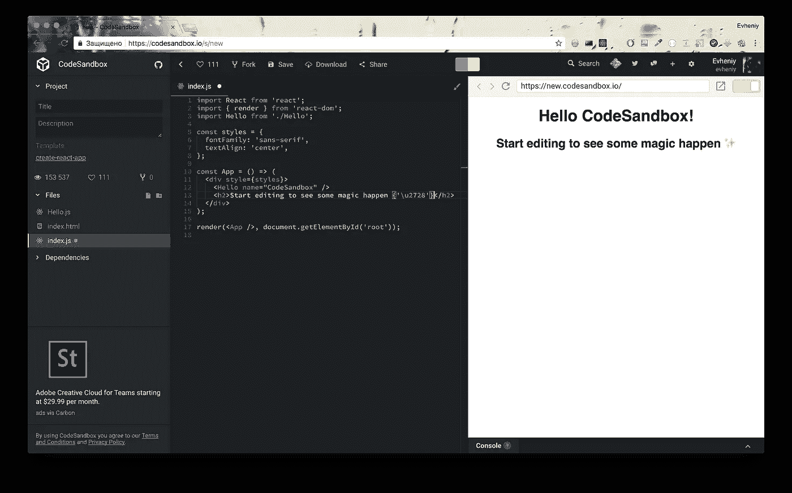

接下来，我将向您展示如何在您的 PC 上使用 react。

你需要 [**安装 node.js**](https://nodejs.org/uk/download/package-manager/) 。我用 [**nvm**](https://github.com/creationix/nvm) 和 [**docker**](https://www.docker.com/) 。关于 docker 你可以看我的文章:

[](https://hackernoon.com/making-right-things-using-docker-7296cf0f6c6e) [## 使用 Docker 做正确的事情

### 在这篇文章中，我想展示如何使用 docker 进行开发和测试。为了表明现在是时候从…

hackernoon.com](https://hackernoon.com/making-right-things-using-docker-7296cf0f6c6e) 

# 创建-反应-应用

如果你只是想看看什么是 react 并创建小应用程序，你可以使用[**create-react-app**](https://github.com/facebookincubator/create-react-app)。对于生产来说，这不是完美的选择，因为在真正的应用程序中，你需要管理状态，使用异步操作(ajax 请求)…在这种情况下，你最需要的是 webpack 或其他 bundler。但是对于在 PC 上运行你的第一个 hello world 应用程序，create-react-app 是一个不错的选择。

安装 node.js 后，npm 会帮助您安装新的软件包。要使用 create-react-app，您需要使用下一个命令全局安装它:

```
npm i **-g** create-react-app
```

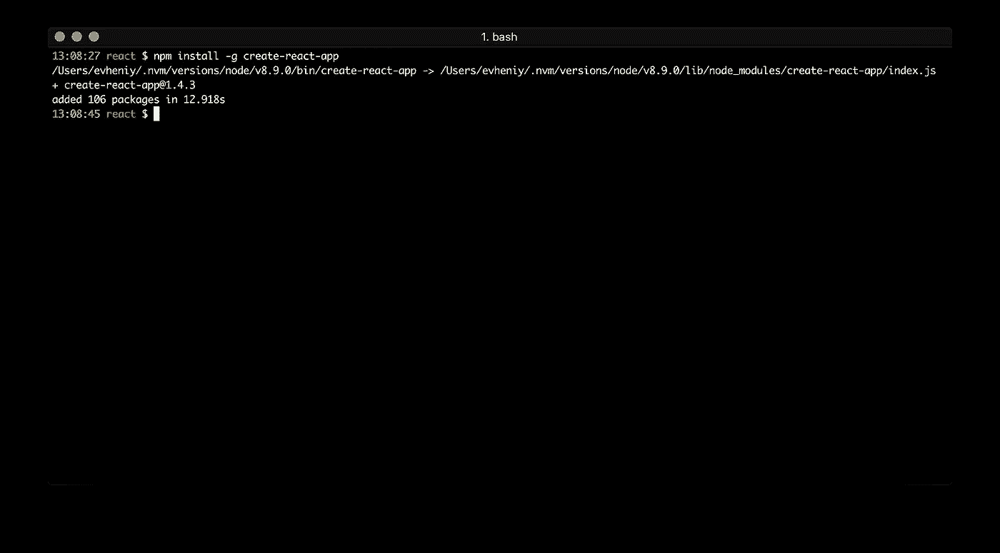

创建新项目:

```
create-react-app my-app
```


并启动它:

```
cd my-app/
npm start
```


您的项目结构:


你可以用它来玩，但对于真正的生产，你需要使用其他方式。

接下来我将向您展示 react 生态系统: [**webpack**](https://webpack.js.org/) ， [**babel**](https://babeljs.io/) ， [**npm**](https://www.npmjs.com/) 脚本，如何使用热模块替换([**【HMR】**](/@rajaraodv/webpacks-hmr-react-hot-loader-the-missing-manual-232336dc0d96))与 [**dev server**](https://webpack.js.org/configuration/dev-server/) 与[**service workers**](https://developers.google.com/web/fundamentals/primers/service-workers/)与 [**workbox**](https://developers.google.com/web/tools/workbox/)

让我们开始…

为我们的应用程序创建一个新目录:

```
*mkdir app
cd app*
```

# 初始化项目

任何 node.js 项目都应该从 **npm init** 命令开始:

```
*npm init -f*
```

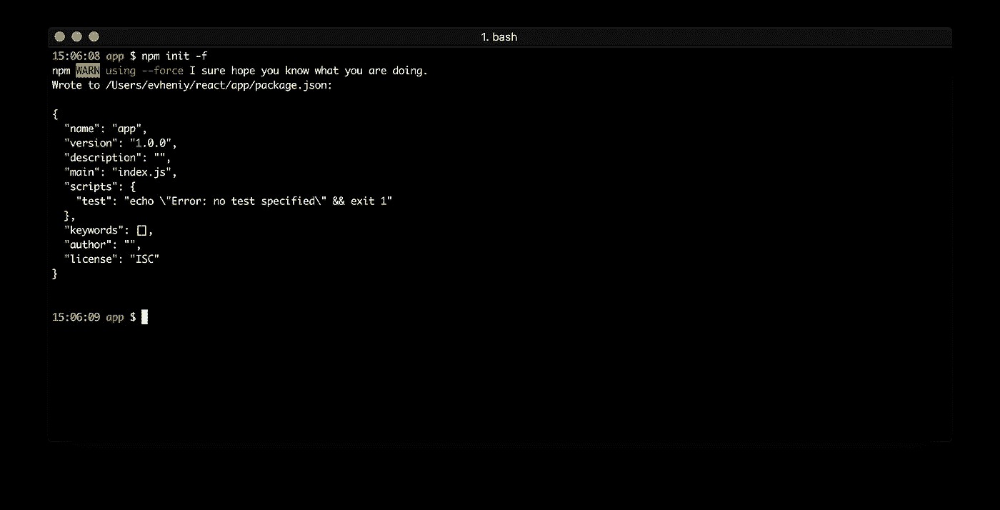

# 编辑器配置

[**EditorConfig**](http://editorconfig.org/) 是一种文件格式和文本编辑器插件的集合，用于在不同编辑器和 ide 之间保持一致的编码风格。

EditorConfig 帮助开发人员在不同的编辑器和 ide 之间定义和维护一致的编码风格。EditorConfig 项目由**一个用于定义编码样式的文件格式**和一组**文本编辑器插件**组成，这些插件使编辑器能够读取文件格式并遵循定义的样式。EditorConfig 文件易于阅读，并且它们与版本控制系统配合得很好。

要使用它，只需创建`.editorconfig`文件，并确保您的 IDE 可以使用它:

```
*# EditorConfig is awesome: http://EditorConfig.org* 
*# top-most EditorConfig file* root = true

*# Unix-style newlines with a newline ending every file* [*]
end_of_line = lf
insert_final_newline = true*# Set default charse* charset = utf-8

*# 2 space indentation* indent_style = space
indent_size = 2
```

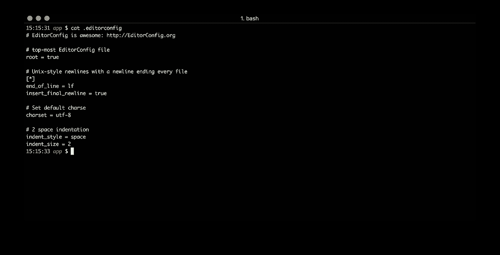

# 埃斯林特

接下来我们需要配置 eslint。

[**ESLint**](https://eslint.org/) 是一个开源项目，最初由 [Nicholas C. Zakas](http://nczonline.net/) 于 2013 年 6 月创建。它的目标是为 JavaScript 提供一个可插拔的林挺工具。

我们将使用[Airbnb](https://airbnb.com/)[**eslint react config**](https://www.npmjs.com/package/eslint-config-airbnb)。要安装它，只需运行:

```
npm i -D eslint eslint-config-airbnb eslint-plugin-import eslint-plugin-jsx-a11y eslint-plugin-react
```

我们使用标志 **-D** 将其安装为开发依赖项。

之后我们需要创建**。带有设置的 eslintrc** 文件:

```
{
  "extends": "airbnb",
  "env": {
    "browser": true,
    "node": true,
    "mocha": true
  }
}
```


并将 lint 命令添加到 **package.json** **脚本**部分:

```
"scripts": {
  "test": "eslint ."
},
```

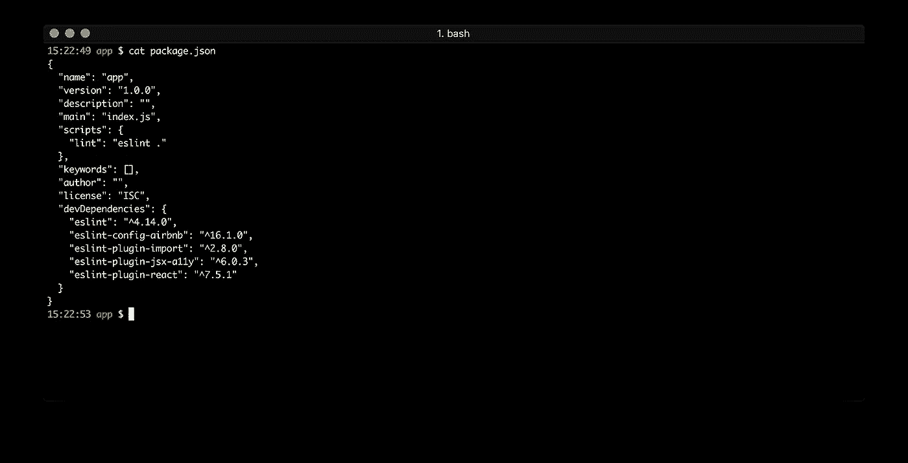

要运行它，请使用 npm run 命令:

```
npm test
```

您可以配置您的 IDE 来使用 eslint 和自动检查。

# Npm 任务列表

脚本部分的每个命令你都可以使用 [**npm 运行命令**](https://docs.npmjs.com/cli/run-script) 来运行。例如 **npm 运行测试**， **npm 运行启动**。一些有用的命令，比如 test 和 start，可以使用短语法运行: **npm test** (甚至 **npm t** )和 **npm start** 。

但是如果你处理一个新项目，并且不想打开 package.json 文件，你可以使用 npm 任务列表( **ntl** )。只需全局安装即可:

```
npm i -g ntl
```

之后在 app 目录下运行 **ntl** 命令，可以点击上/下箭头按钮选择命令:

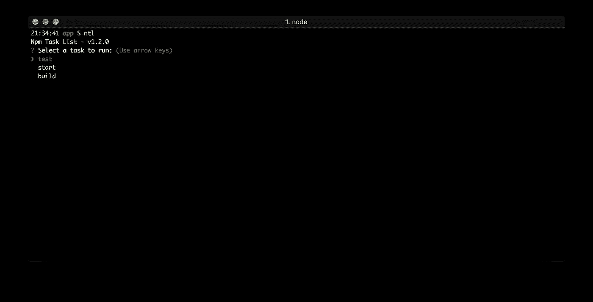

# NPM-检查-更新

如果需要检查和更新依赖关系，可以使用其他有用命令。

[**NPM-check-updates**](https://www.npmjs.com/package/npm-check-updates)是一个命令行工具，允许您将 package.json 依赖项升级到最新版本，而不管现有的版本约束。

要安装它，请全局运行

```
npm i -g npm-check-updates
```

之后运行 **ncu** 命令。

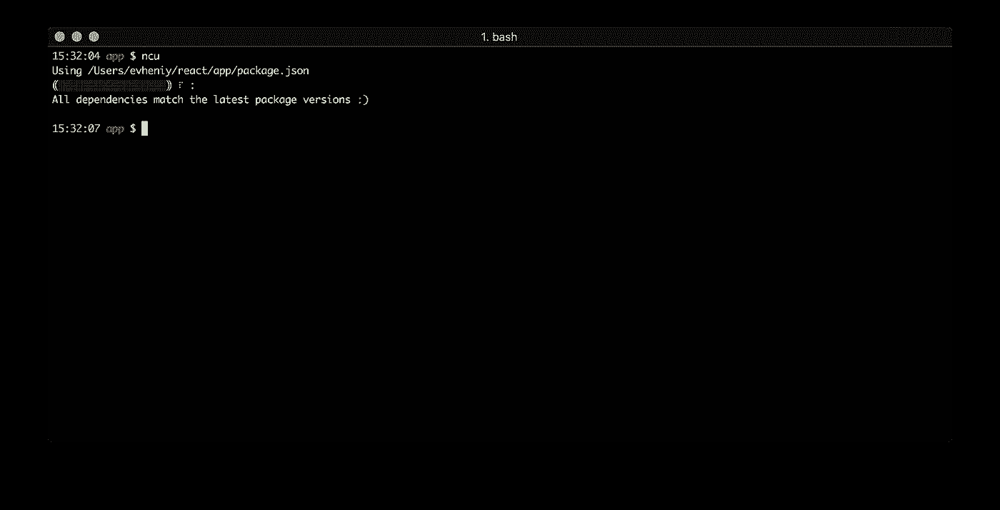

我们可以降级 eslint 命令，看看它是如何工作的:

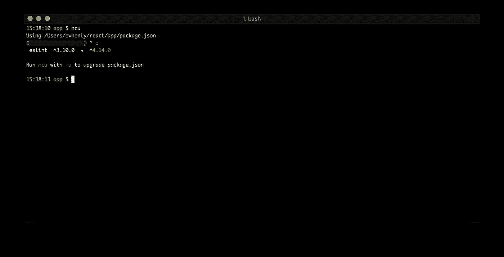

运行 **ncu -u** ，它将升级 package.json

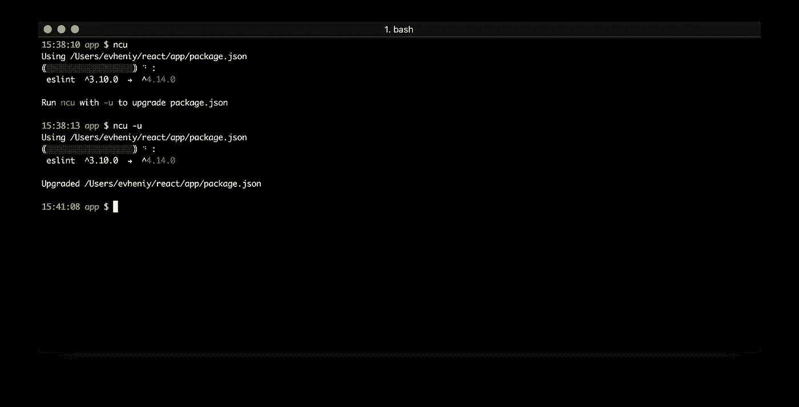

并运行 **npm i** 来安装新的依赖项


# 浏览列表

[**Browserlist**](https://github.com/ai/browserslist) 帮助在不同的前端工具之间共享目标浏览器，如 Autoprefixer、Stylelint 和 babel-preset-env。

我们将它用于 [**postcss**](https://github.com/postcss/postcss) 和[**babel-preset-env**](https://github.com/babel/babel-preset-env)。

只需创建**。浏览 listrc** 文件并将配置放在那里:

```
# Browsers that we support

> 1%
Last 2 versions
IE 10 # sorry
```

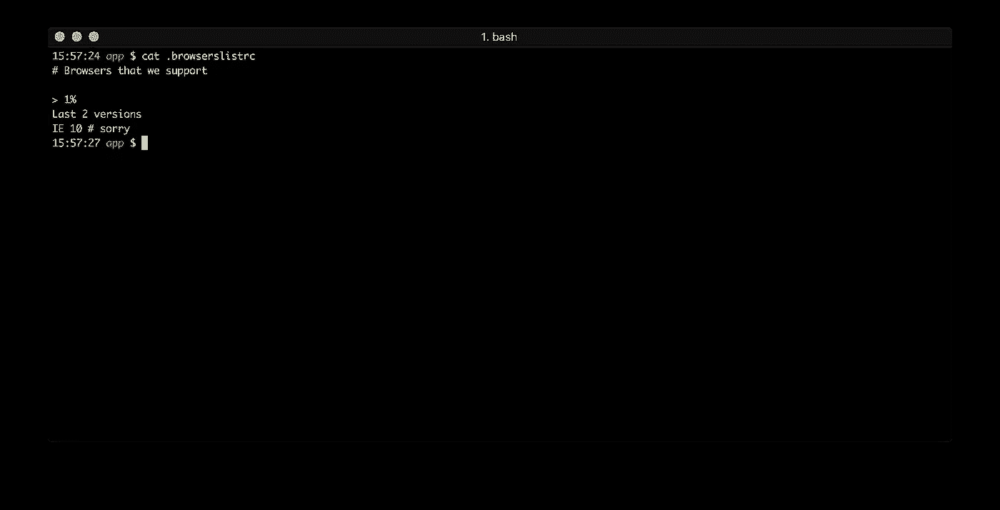

您可以使用 [**在线演示**](http://browserl.ist/) 来测试浏览器列表查询，或者使用 [**babel repl**](https://babeljs.io/repl/) 来测试环境预设:


您可以看到目标和插件添加到应用程序的工作与浏览器目标。

# 巴比伦式的城市

[**巴别塔**](https://babeljs.io/) 是编写下一代 JavaScript 的编译器。它有助于将 react jsx 和 es6 代码转换成旧的 es5 代码。对旧浏览器使用新的 JS 标准会有所帮助。

要在 node.js 端使用它，我们需要安装 [**通天塔**](https://www.npmjs.com/package/babel-core) 。我们之前讨论过，需要用[**babel-poly fill**](https://babeljs.io/docs/usage/polyfill/)安装[**babel-preset-env**](https://github.com/babel/babel-preset-env)。而对于 react 我们需要 [**巴别塔-预设-反应**](https://www.npmjs.com/package/babel-preset-react) 。

还有一个。我打算使用一个新的特性像 [**对象扩散/静止**](https://babeljs.io/docs/plugins/transform-object-rest-spread/) 操作符和 [**静态对象属性**](https://babeljs.io/docs/plugins/transform-class-properties/) 。为此我需要安装 [**巴别-插件-转换-对象-休息-传播**](https://www.npmjs.com/package/babel-plugin-transform-object-rest-spread) 和 [**巴别-插件-转换-类-属性**](https://www.npmjs.com/package/babel-plugin-transform-class-properties) 。

我们可以使用[**babel-plugin-lodash**](https://github.com/lodash/babel-plugin-lodash)——一个简单的转换来挑选 Lodash 模块。

我们需要它只是为了发展:

```
npm i -D babel-core babel-preset-env babel-preset-react babel-plugin-transform-class-properties babel-plugin-transform-object-rest-spread babel-plugin-lodash
```

但是**babel-poly fill**with[**react-hot-loader**](https://github.com/gaearon/react-hot-loader)我们会在代码中使用，所以这不是开发依赖。我们应该使用标志 **-S** :

```
npm i -S babel-polyfill react-hot-loader
```

接下来我们需要安装配置文件:**。babelrc**

```
{
  "presets": ["env", "react"],
  "plugins": [
    "transform-class-properties",
    "transform-object-rest-spread",
    "react-hot-loader/babel",
    "lodash"
  ]
}
```

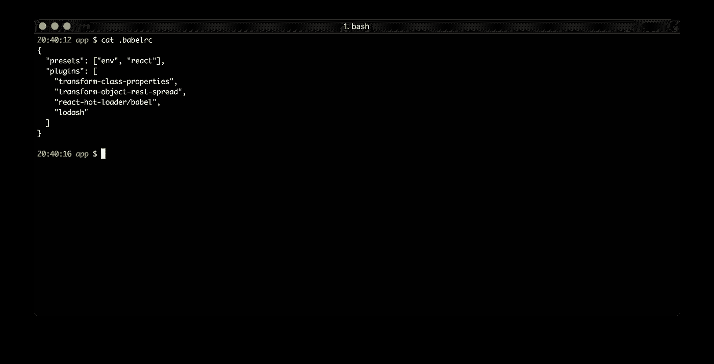

正如你所看到的，我添加了[**react-hot-loader/babel**](https://www.npmjs.com/package/react-hot-loader)作为插件。我们需要它与热模块替换一起工作。

# PostCSS

[**PostCSS**](https://github.com/postcss/postcss) 是一个用 JS 插件进行风格转换的工具。这些插件可以 lint 你的 CSS，支持变量和混合，transpile 未来的 CSS 语法，内联图像，等等。

PostCSS 被包括维基百科、Twitter、阿里巴巴和 JetBrains 在内的行业领导者所使用。 [Autoprefixer](https://github.com/postcss/autoprefixer) PostCSS 插件是最流行的 CSS 处理器之一。

我们将使用 [**postcss-cssnext**](https://github.com/MoOx/postcss-cssnext) 和 [**cssnano**](http://cssnano.co/) 。

是一个 PostCSS 插件，帮助你使用最新的 CSS 语法。它将 CSS 规范转换成更加兼容的 CSS，因此您不需要等待浏览器支持。

Cssnano 会将您精心格式化的 CSS 进行多次优化，以确保最终结果在生产环境中尽可能小。

要安装它，请运行:

```
npm i -D postcss postcss-cssnext cssnano
```

Postcss-cssnext 有一个有趣的工具——[**autoprefixer**](https://github.com/postcss/autoprefixer)。它是 postcss 插件，使用来自[的值来解析 css 并将供应商前缀添加到 CSS 规则中。这是谷歌推荐给 T21 的，在推特和淘宝上使用。](http://caniuse.com/)

它使用浏览器列表规则。

以及配置文件: **postcss.config.js**

```
module.exports = {
  plugins: {
    'postcss-cssnext': {
      warnForDuplicates: false,
    },
    cssnano: {},
  },
};
```


# 网络包

[**Webpack**](https://webpack.js.org/) 是一个模块捆绑器。它的主要目的是捆绑 JavaScript 文件以便在浏览器中使用，但它也能够转换、捆绑或打包任何资源或资产。

我们将在 webpack 中使用什么:

*   [**DevServer**](https://webpack.js.org/configuration/dev-server/) —提供实时重载的开发服务器。
*   [**copy-web pack-plugin**](https://www.npmjs.com/package/copy-webpack-plugin)**—将单个文件或整个目录复制到构建目录。**
*   **[**babel-loader**](https://github.com/babel/babel-loader) —允许使用 [Babel](https://github.com/babel/babel) 和 [webpack](https://github.com/webpack/webpack) 传输 JavaScript 文件。**
*   **[**postcss-loader**](https://github.com/postcss/postcss-loader)—web pack 的 PostCSS 加载器。**
*   **[**样式加载器**](https://github.com/webpack-contrib/style-loader) —通过注入`<style>`标签将 CSS 添加到 DOM 中。**
*   **[**css-loader**](https://github.com/webpack-contrib/css-loader) —像`import/require()`一样解释`@import`和`url()`，并将解析它们。**
*   **[**sass-loader**](https://github.com/webpack-contrib/sass-loader)with[**node-sass**](https://github.com/sass/node-sass)**—sass loader for web pack。将 Sass 编译为 CSS。****
*   ****[**文件加载器**](https://github.com/webpack-contrib/file-loader) —指示 webpack 将所需对象作为文件发出，并返回其公共 URL。****
*   ****[**extract-text-web pack-plugin**](https://webpack.js.org/plugins/extract-text-webpack-plugin/)—将一个或多个包中的文本提取到单独的文件中。****
*   ****[**html-webpack-plugin**](https://github.com/jantimon/html-webpack-plugin)**—简化 HTML 文件的创建以服务于您的 web pack 包。******
*   ******[**clean-webpack-plugin**](https://github.com/johnagan/clean-webpack-plugin)—一个 web pack 插件，用于在构建之前删除您的构建文件夹。******
*   ****[**web pack-bundle-analyzer**](https://www.npmjs.com/package/webpack-bundle-analyzer)—web pack 插件和 CLI 实用程序，将包内容表示为方便的交互式可缩放树状图。****
*   ****[**lodash-web pack-plugin**](https://github.com/lodash/lodash-webpack-plugin)—通过用 [noop](https://lodash.com/docs#noop) 、 [identity](https://lodash.com/docs#identity) 或更简单的替代方案替换模块的[特性集](https://github.com/lodash/lodash-webpack-plugin#feature-sets)，创建更小的 Lodash 构建。****
*   ****[**work box-web pack-plugin**](https://www.npmjs.com/package/workbox-webpack-plugin)—用于您的 [Webpack](https://webpack.js.org/) 构建过程的插件，帮助您生成 workbox-sw 应该预缓存的本地文件的清单。我们以后会用到它。****

****要安装它，请运行:****

```
**npm i -D webpack webpack-dev-server copy-webpack-plugin babel-loader postcss-loader style-loader css-loader sass-loader node-sass file-loader extract-text-webpack-plugin html-webpack-plugin clean-webpack-plugin webpack-bundle-analyzer lodash-webpack-plugin workbox-webpack-plugin**
```

****接下来，我将把 webpack 配置分割成小的单个责任文件。让我们创建 webpack 目录:****

```
**mkdir webpack
cd webpack**
```

## ******webpack/index.js******

```
**const { resolve } = require('path');const vendor = require('./vendor');
const rules = require('./rules');
const plugins = require('./plugins');
const devServer = require('./dev_server');
const devtool = require('./devtool');const settings = {
  resolve: {
    extensions: ['*', '.js', '.jsx', '.css', '.scss'],
  },
  context: resolve(__dirname, '..'),
  entry: {
    app: [
      'react-hot-loader/patch',
      'babel-polyfill',
      './src/index'
    ],
    vendor,
  },
  output: {
    filename: '[name].[hash].js',
    path: resolve(__dirname, '..', 'dist'),
  },
  module: {
    rules,
  },
  plugins,
  devServer,
  devtool,
};module.exports = settings;**
```

## ****网络包/供应商. js****

```
**const vendor = [
  'babel-polyfill',
  'react',
  'react-dom',
  'react-redux',
  'react-router',
  'react-router-redux',
  'react-virtualized',
  'redux',
  'redux-observable',
  'react-toolbox',
  'react-hot-loader',
  'rxjs',
  'lodash',
  'moment',
  'localforage',
  'react-loadable',
];module.exports = vendor;**
```

****这里我们可以把不想放在主代码中的库放进去。对于入口点和供应商来说，将一个大的应用程序文件分割成较小的文件是有帮助的。如果我们不升级供应商，他们会在两个版本之间被缓存。****

****我们稍后将安装的所有软件包。****

## ****网络包/规则. js****

```
**const { join } = require('path');
const ExtractTextPlugin = require('extract-text-webpack-plugin');const rules = [{
  test: /.jsx?$/,
  loader: 'babel-loader',
  exclude: /node_modules/,
}, {
  test: /\.scss$/,
  exclude: /node_modules/,
  use: ExtractTextPlugin.extract({
    fallback: 'style-loader',
    use: [{
      loader: 'css-loader',
      options: {
        sourceMap: true,
        importLoaders: 2,
        modules: true,
        localIdentName: '[name]__[local]___[hash:base64:5]'
      },
    }, {
      loader: 'postcss-loader',
    }, {
      loader: 'sass-loader',
      options: {
        sourceMap: true,
      },
    }],
  }),
}, {
  test: /\.css$/,
  use: [{
    loader: 'style-loader',
  }, {
    loader: 'css-loader',
    options: {
      sourceMap: true,
      importLoaders: 2,
      modules: true,
      localIdentName: '[name]__[local]___[hash:base64:5]'
    },
  }, {
    loader: 'postcss-loader',
  }],
}, {
  test: /\.(woff2|woff|ttf|eot|svg)(\?.*$|$)/,
  loader: 'file-loader?name=fonts/[name].[ext]',
  include: [
    join(__dirname, 'src'),
    join(__dirname, 'node_modules'),
  ],
}, {
  test: /\.(jpg|jpeg|gif|png|ico)(\?.*$|$)$/,
  loader: 'file-loader?name=img/[name].[ext]',
  include: [
    join(__dirname, 'src'),
    join(__dirname, 'node_modules'),
  ],
}];module.exports = rules;**
```

****这里我们描述了加载不同类型文件的规则，比如 js/jsx，scss，css，字体，图片。****

## ****webpack/plugins.js****

```
**const { resolve, join } = require('path');
const webpack = require('webpack');
const HtmlWebpackPlugin = require('html-webpack-plugin');
const ExtractTextPlugin = require('extract-text-webpack-plugin');
const CleanWebpackPlugin = require('clean-webpack-plugin');
const WorkboxPlugin = require('workbox-webpack-plugin');
const CopyWebpackPlugin = require('copy-webpack-plugin');
const LodashModuleReplacementPlugin = require('lodash-webpack-plugin');
const { BundleAnalyzerPlugin } = require('webpack-bundle-analyzer');const isProduction = process.env.NODE_ENV === 'production';const dist = 'dist';// the path(s) that should be cleaned
const pathsToClean = [
  `${dist}/*.*`,
];// the clean options to use
const cleanOptions = {
  root: resolve(__dirname, '..'),
  exclude: [`${dist}/.gitignore`],
  verbose: true,
  dry: false,
};const plugins = [
  new webpack.EnvironmentPlugin({ NODE_ENV: 'development' }),
  new CleanWebpackPlugin(pathsToClean, cleanOptions),
  new LodashModuleReplacementPlugin(),
  new HtmlWebpackPlugin({
    template: join('src', 'index.html'),
  }),
  new ExtractTextPlugin(join(dist, 'bundle.css'), {
    allChunks: true,
  }),
  new webpack.optimize.CommonsChunkPlugin({
    name: 'vendor',
    minChunks: Infinity,
  }),
  new webpack.NamedModulesPlugin(),
];if (isProduction) {
  plugins.push(
    new webpack.LoaderOptionsPlugin({
      minimize: true,
      debug: false,
    }),
    new webpack.optimize.UglifyJsPlugin({
      sourceMap: true,
      compress: {
        warnings: false,
        screw_ie8: true,
        conditionals: true,
        unused: true,
        comparisons: true,
        sequences: true,
        dead_code: true,
        evaluate: true,
        if_return: true,
        join_vars: true,
      },
      output: {
        comments: false,
      },
    }),
    new webpack.IgnorePlugin(/^\.\/locale$/, /moment$/),
    new CopyWebpackPlugin([{
      from: require.resolve('workbox-sw'),
      to: 'workbox-sw.prod.js',
    }]),
    new WorkboxPlugin({
      globDirectory: dist,
      globPatterns: ['**/*.{html,js,css}'],
      swSrc: join('src', 'service-worker.js'),
      swDest: join(dist, 'service-worker.js'),
      clientsClaim: true,
      skipWaiting: true,
      navigateFallback: '/index.html',
    })
  );
} else {
  plugins.push(
    new webpack.LoaderOptionsPlugin({
      debug: true,
    }),
    new webpack.HotModuleReplacementPlugin(),
    new BundleAnalyzerPlugin()
  );
}module.exports = plugins;**
```

****在这个文件中，我们配置了 webpack 插件，并按环境(生产或开发)进行了划分。对于开发，我们需要热模块替换和分析器，对于生产，我们需要工具箱插件和丑。****

## ****webpack/devtool.js****

```
**const isProduction = process.env.NODE_ENV === 'production';const devtool = isProduction ? 'source-map' : 'inline-cheap-module-source-map';module.exports = devtool;**
```

****在这里，我们只是检查环境，并选择我们应该使用什么样的源地图。****

## ****webpack/dev_server.js****

```
**const { join } = require('path');const devServer = {
  quiet: false,
  port: 3000,
  contentBase: join(__dirname, '..', 'dist'),
  hot: true,
  historyApiFallback: true,
  inline: true,
  noInfo: false,
  headers: { 'Access-Control-Allow-Origin': '*' },
  stats: {
    assets: false,
    colors: true,
    version: false,
    hash: false,
    timings: false,
    chunks: false,
    chunkModules: false,
  },
};module.exports = devServer;**
```

****在这里，我们为 webpack 开发服务器设置配置。****

## ****网络包.配置. js****

```
**require('webpack');const settings = require('./webpack');module.exports = settings;**
```

****最后一件事——向 **package.json** 添加脚本:****

```
**"scripts": {
    "test": "eslint .",
    "start": "webpack-dev-server --inline",
    "build": "NODE_ENV=production webpack"
  },**
```

****小更新——我们不需要通过 eslint 检查 webpack 文件，所以我们需要创建**。eslintinignore**归档并放入下一行(稍后介绍 dist 和 service-worker):****

```
**webpack/*.js
dist/*.js
src/service-worker.js**
```

****现在运行 **npm test** 命令或使用**ntl**lint 项目文件:****

****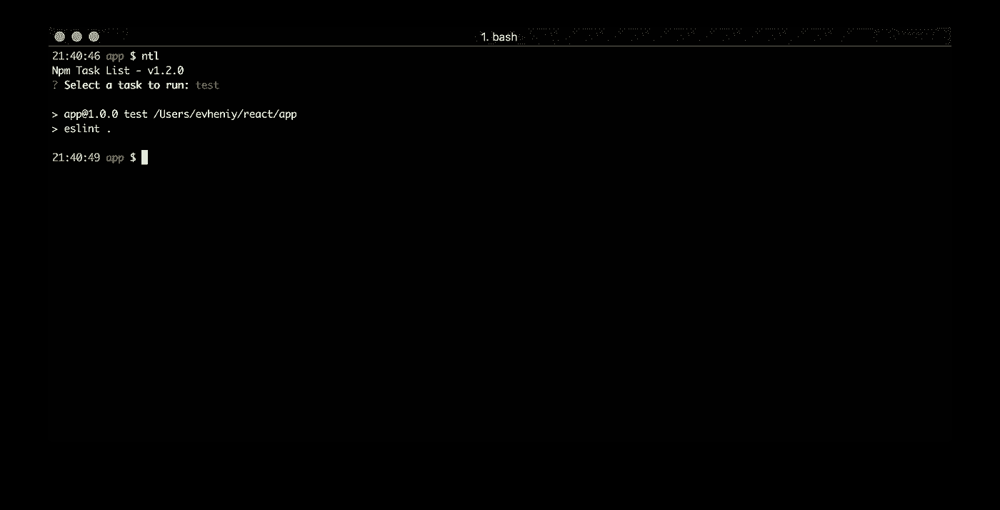****

# ****反应****

****现在我们可以安装所有依赖项了。****

*   ****[**反应过来**](https://reactjs.org/)**——**我希望现在你知道是什么了；)****
*   ****[**React-DOM**](https://www.npmjs.com/package/react-dom) —这个包作为 DOM 相关渲染路径的入口点。****
*   ****[**Redux**](https://redux.js.org/)—JavaScript 应用的可预测状态容器。****
*   ****[**react-Redux**](https://github.com/reactjs/react-redux)—Redux 官方 React 绑定。****
*   ****[**RxJS**](http://reactivex.io/rxjs/) —一个使用 Observables 进行反应式编程的库，使编写异步或基于回调的代码变得更加容易。****
*   ****[**redux-observable**](https://github.com/redux-observable/redux-observable)—RxJS 中间件，用于 Redux 中使用“Epics”的动作副作用。****
*   ****[**react-路由器**](https://github.com/ReactTraining/react-router)—react 的声明式路由。****
*   ****[**react-router-redux**](https://github.com/reactjs/react-router-redux)—无情的简单绑定让 react-router 和 redux 保持同步。****
*   ****[**React-虚拟化**](https://github.com/bvaughn/react-virtualized) — React 组件，用于高效呈现大型列表和表格数据。****
*   ****[**react-toolbox**](https://github.com/react-toolbox/react-toolbox)—一套以 CSS 模块[的力量实现 Google 的材质设计规范的 React 组件 http://www . React-toolbox . io](http://www.react-toolbox.io/)。****
*   ****[**Lodash**](https://lodash.com/) —一个 JavaScript 实用程序库，提供一致性、模块性、性能等额外功能。****
*   ****[**时刻**](https://momentjs.com/) —在 JavaScript 中解析、验证、操作和显示日期和时间。****
*   ****[**local feed**](https://github.com/localForage/localForage)—离线存储，改进。使用简单但强大的 API 包装 IndexedDB、WebSQL 或 localStorage。****
*   ****[**react-loadable**](https://github.com/thejameskyle/react-loadable)—加载有承诺组件的高阶组件。****

****我们将在下一部分使用所有这些包。****

****要安装它，请使用下一个命令:****

```
**npm i -S react react-dom redux react-redux rxjs redux-observable react-router react-router-redux react-virtualized react-toolbox lodash moment localforage react-loadable**
```

****我们的代码将存储在 **src** 目录中。让我们创建它:****

```
**mkdir src
cd src**
```

****当我们使用 html-webpack-plugin 时，我们需要创建 index.html:****

## ****src/index.html****

```
**<!DOCTYPE html>
<html>
<head>
  <meta charset="UTF-8">
  <title>Reports</title>
  <link href="[https://fonts.googleapis.com/icon?family=Material+Icons](https://fonts.googleapis.com/icon?family=Material+Icons)" rel="stylesheet">
</head>
<body>
<div id="root"></div>
</body>
</html>**
```

****在这里，我添加了链接到[谷歌字体](https://fonts.googleapis.com/icon?family=Material+Icons)，因为 react-toolbox 没有将字体包含到包中。而**<div id = " root "></div>**就是我们的 app 容器。Html-webpack-plugin 将在容器后添加脚本标签。****

****我们的切入点是:****

## ****src/index.jsx****

```
**import React from 'react';
import ReactDOM from 'react-dom';
import { AppContainer } from 'react-hot-loader';
import App from './components/App';const render = (Component) => {
  ReactDOM.render(
    <AppContainer>
      <Component />
    </AppContainer>,
    document.getElementById('root'),
  );if (process.env.NODE_ENV === 'production' && 'serviceWorker' in navigator) {
    window.addEventListener('load', () => {
      navigator.serviceWorker.register('service-worker.js').catch(() => {});
    });
  }
};render(App);if (module.hot) {
  module.hot.accept();
}**
```

****这里我包括了 react-hot-loader 和 react 组件的链接。****

****在我创建了使用热模块替换来渲染组件的函数之后。接下来，我添加了与服务人员一起工作的代码，但我将在以后描述它。****

****我运行我们的函数 render，并在检查热模块替换以更改代码之后。****

****并创建我们的第一个 react 组件。****

```
**mkdir components
cd components**
```

****src/components/App.jsx****

```
**import React, { Component } from 'react';
import { AppBar, Checkbox, IconButton } from 'react-toolbox';
import { Layout, NavDrawer, Panel, Sidebar } from 'react-toolbox';class App extends Component {
  state = {
    drawerActive: false,
    drawerPinned: false,
    sidebarPinned: false
  };toggleDrawerActive = () => {
    this.setState({ drawerActive: !this.state.drawerActive });
  };toggleDrawerPinned = () => {
    this.setState({ drawerPinned: !this.state.drawerPinned });
  };toggleSidebar = () => {
    this.setState({ sidebarPinned: !this.state.sidebarPinned });
  };render() {
    return (
      <Layout>
        <NavDrawer active={this.state.drawerActive}
                   pinned={this.state.drawerPinned} permanentAt='xxxl'
                   onOverlayClick={ this.toggleDrawerActive }>
          <p>
            Navigation, account switcher, etc. go here.
          </p>
        </NavDrawer>
        <Panel>
          <AppBar title="React Toolbox" leftIcon="menu" onLeftIconClick={ this.toggleDrawerActive } />
          <div style={{ flex: 1, overflowY: 'auto', padding: '1.8rem' }}>
            <h1>Main Content</h1>
            <p>Main content goes here.</p>
            <Checkbox label='Pin drawer' checked={this.state.drawerPinned} onChange={this.toggleDrawerPinned} />
            <Checkbox label='Show sidebar' checked={this.state.sidebarPinned} onChange={this.toggleSidebar} />
          </div>
        </Panel>
        <Sidebar pinned={ this.state.sidebarPinned } width={ 5 }>
          <div><IconButton icon='close' onClick={ this.toggleSidebar }/></div>
          <div style={{ flex: 1 }}>
            <p>Supplemental content goes here.</p>
          </div>
        </Sidebar>
      </Layout>
    );
  }
}module.exports = App;**
```

****这只是一个例子。我是从 [**react 工具箱文档**](http://react-toolbox.io/#/components/layout) 里拿来的。****

# ****工具箱****

****[**Workbox**](https://developers.google.com/web/tools/workbox/) 是一个库和构建工具的集合，可以轻松地在用户设备上本地存储网站文件。如果您想要:****

*   ****让您的网站脱机工作。****
*   ****提高重复访问时的加载性能。即使你不想完全离线，你也可以使用 Workbox 在本地存储和提供常用文件，而不是从网络上。****

****我们使用 workbox webpack 插件(我们已经安装了它并将其添加到 webpack/plugins.js 中)。现在我们需要安装[**work box-SW**](https://www.npmjs.com/package/workbox-sw)——一个服务工作者库，使管理获取请求和缓存尽可能容易。它在许多独立的模块之上提供了一个高级包装器，为您提供了一个一致的、强大的界面。****

```
**npm i -D workbox-sw**
```

****为了使用 workbox-sw，我们已经添加了另一个插件——copy-web pack-plugin。它应该将 workbox-sw 模块复制到 dist/workbox-sw.prod.js，在那里我们有我们构建后的文件。****

****最后一件事—创建服务工作者文件，我们可以在其中设置缓存规则:****

## ****src/服务工作者. js****

```
**importScripts('workbox-sw.prod.js');const workboxSW = new self.WorkboxSW({
  "skipWaiting": true,
  "clientsClaim": true,
});workboxSW.precache([]);workboxSW.router.registerRoute('[https://fonts.googleapis.com/(.*)',](https://fonts.googleapis.com/(.*)',)
  workboxSW.strategies.cacheFirst({
    cacheName: 'googleapis',
    cacheExpiration: {
      maxEntries: 20,
    },
    cacheableResponse: { statuses: [0, 200] },
  })
);// We want no more than 50 images in the cache. We check using a cache first strategy
workboxSW.router.registerRoute(/\.(?:png|gif|jpg)$/,
  workboxSW.strategies.cacheFirst({
    cacheName: 'images-cache',
    cacheExpiration: {
      maxEntries: 50,
    },
  })
);workboxSW.router.registerRoute(/index.html/, workboxSW.strategies.staleWhileRevalidate());**
```

****在这里，我缓存谷歌字体，应用程序图像和 index.html-主要应用程序页面。****

****和我们项目的结构:****

****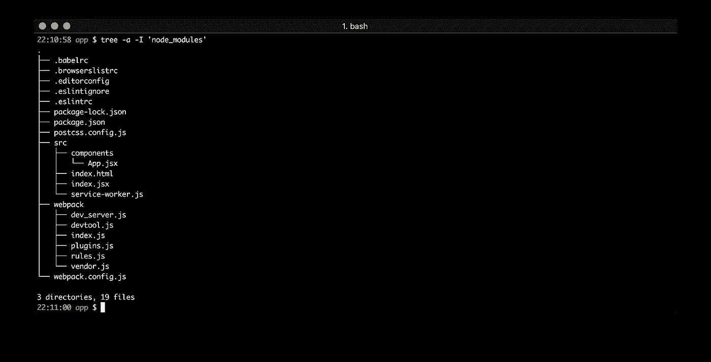****

# ****如何使用****

****首先我们需要创建 **dist** 目录并添加**。gitkeep** 文件(我们稍后会用到):****

```
**mkdir dist
touch dist/.gitkeep**
```

## ****测试****

****因为我们将 **dist** 目录添加到了**中。我们不应该测试我们构建的文件。与 **src/service-worker.js** 相同。******

**因此，我们可以运行 **npm 测试**或使用 **ntl** 来检查我们没有任何问题:**

**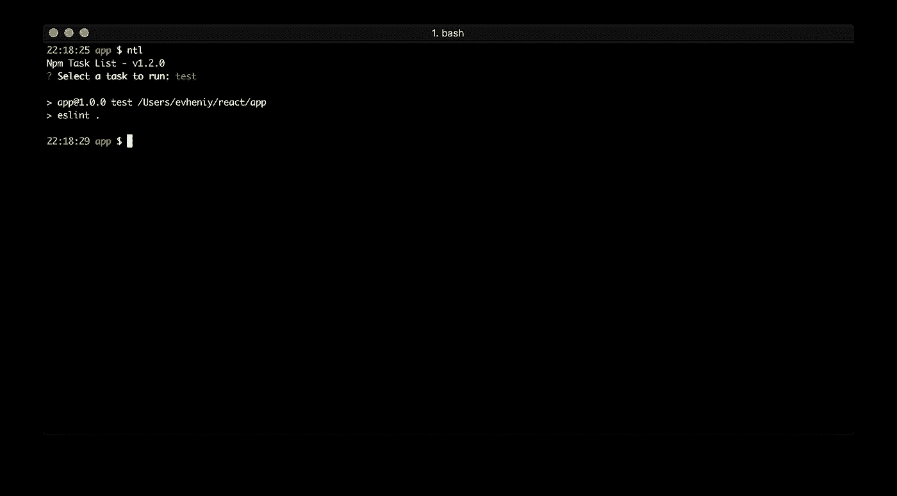**

## **发展**

**命令 **npm start** 将使用来自 **webpack/dev_server.js** 的配置运行 webpack 开发服务器。**

****

**它帮助我们解决了两个主要问题——通过将文件缓存到内存中来构建文件，以及热模块替换(HMR)。如果你修改了任何文件(js，css，scss…)，你几乎可以同时在浏览器中看到它，而不需要刷新页面。**

**运行 **npm 启动**或使用 **ntl** 后，您可以看到分析仪打开的页面:**

**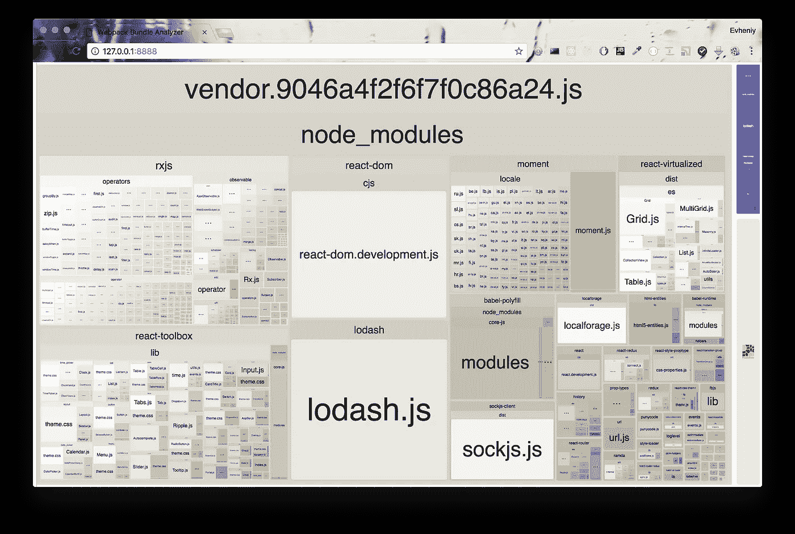**

**在这里，您可以看到捆绑内容是方便的交互式可缩放树状图。**

**本模块将帮助您:**

1.  **意识到你的包裹里真正的是什么**
2.  **找出哪些模块构成了它的最大尺寸**
3.  **找到错误到达那里的模块**
4.  **优化一下！**

**最棒的是它支持缩小的捆绑包！它解析它们以获得捆绑模块的实际大小。它还显示了他们的 gzipped 尺寸！**

**让你的 app 少而快，这是一个很好的开始。**

**但这不是我们现在的目标。让我们打开 [http://localhost:3000/](http://localhost:3000/) 查看我们的 app:**

****

**如果我们打开代码并进行任何更改:**

**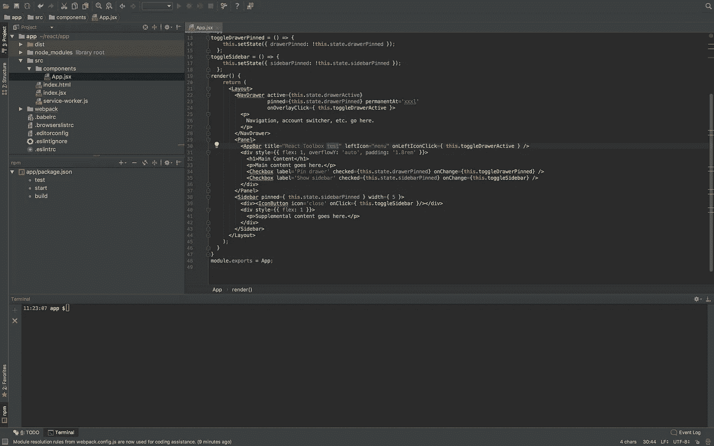**

**我们可以同时在页面上看到它:**

**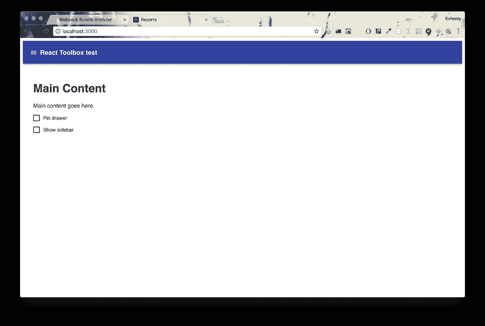**

**这对发展真的有帮助。**

## **构建生产就绪捆绑包**

**如果我们需要发布我们的应用程序，我们需要在将它放在服务器或 CDN 上之前生成(构建)文件。**

**只需运行 **npm 运行构建**或使用 **ntl** :**

**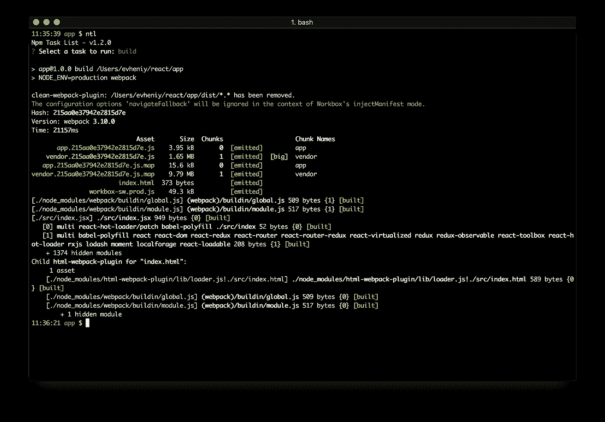**

**我们可以看到一个新文件:**

**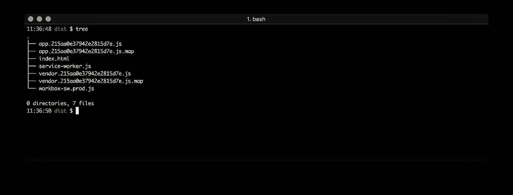**

**我们可以在任何网络服务器上运行 index.html 文件，例如 http-server。**

**安装它:**

```
npm i -g http-server
```

**并从 **dist** 目录运行它:**

```
cd dist
http-server
```

****

**并打开 [http://localhost:8080/](http://localhost:8080/)**

****

**我们看到同样的内容。但是，如果我们打开开发工具，并使用服务人员菜单打开应用程序选项卡，我们可以看到已安装的服务人员:**

**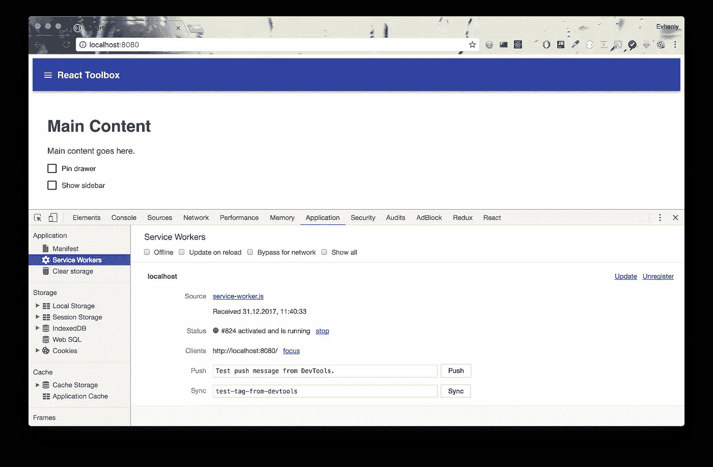**

**我们可以测试它—设置离线复选框并刷新页面:**

**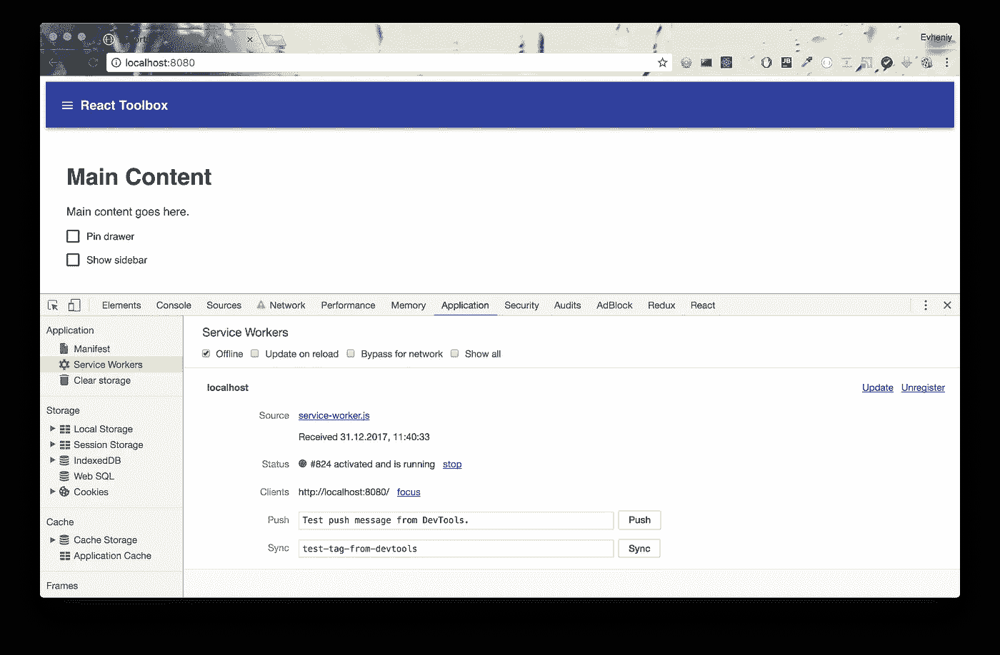**

**工作原理是一样的。如果我们打开网络选项卡并再次刷新页面:**

**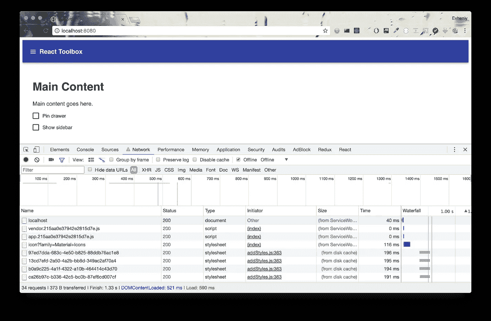**

**我们可以看到我们所有的文件都是从服务人员那里得到的。这是我们的目标。**

## **开源代码库**

**我创建了 [**github 库**](https://github.com/evheniy/react-app) ，这样你就可以在你的 PC 上克隆代码(别忘了安装 node.js 并安装所有的依赖项)并运行它。**

**在下一部分，我将向你展示如何使用 redux，redux-observable，react-loadable…以及如何创建测试来使你的应用程序 100%准备好投入生产。**

**[](/@evheniybystrov/continuous-delivery-of-react-app-with-jenkins-and-docker-8a1ae1511b86) [## 与 Jenkins 和 Docker 一起持续交付 react 应用程序

### 这是文章的第二部分——从头开始反应应用程序。我将向您展示如何创建一个 CD 过程来制作您的应用程序…

medium.com](/@evheniybystrov/continuous-delivery-of-react-app-with-jenkins-and-docker-8a1ae1511b86) 

# 我的其他帖子

[](/@evheniybystrov/) [## 埃夫赫尼·比斯特罗夫培养基

### 阅读艾弗尼·比斯特罗夫在媒介上的作品。Ciklum 高级软件工程师。每天，艾芬尼·比斯特罗夫和…

medium.com](/@evheniybystrov/) 

*   [从头开始开源 node.js 包](/@evheniybystrov/open-source-node-js-package-from-scratch-fa48242a1bbd)
*   [又一个事件许诺服务器](/@evheniybystrov/yet-another-event-promised-server-ee1b06506add)
*   [Node.js REST API 从头开始](/front-end-hacking/node-js-rest-api-from-scratch-3d1ccf4fabf4)
*   [Node.js GraphQL 从头开始](/@evheniybystrov/node-js-graphql-from-scratch-80138b7bcdc)
*   [数据科学的 Docker](/@evheniybystrov/docker-for-data-science-9c0ce73e8263)
*   [用 Docker 从零开始进行 TensorFlow 对象检测](/@evheniybystrov/tensorflow-object-detection-with-docker-from-scratch-5e015b639b0b)

[](https://hackernoon.com/useful-links-for-node-js-react-engineers-acc4ad286d60) [## Node.js / React 工程师的 150 多种有用资源

### 在过去的 8 个月里，我得到了很多有用的链接，我决定分享它。我希望你能找到一些有趣的东西…

hackernoon.com](https://hackernoon.com/useful-links-for-node-js-react-engineers-acc4ad286d60) 

# 参考

[](/@addyosmani/a-tinder-progressive-web-app-performance-case-study-78919d98ece0) [## Tinder 渐进式 Web 应用程序性能案例研究

### Tinder 最近在网上刷屏了。他们新推出的响应式渐进式网络应用程序——Tinder Online——可供 100 名……

medium.com](/@addyosmani/a-tinder-progressive-web-app-performance-case-study-78919d98ece0) 

*   [网络包&热模块更换](/@rajaraodv/webpack-hot-module-replacement-hmr-e756a726a07)
*   [Webpack 的 HMR&React-Hot-Loader——缺失的手册](/@rajaraodv/webpacks-hmr-react-hot-loader-the-missing-manual-232336dc0d96)
*   [工具箱 webpack 插件](https://developers.google.com/web/tools/workbox/modules/workbox-webpack-plugin)
*   [使用 Workbox + Webpack 与服务人员进行预缓存](http://air.ghost.io/using-workbox-webpack-to-precache-with-service-worker/)**