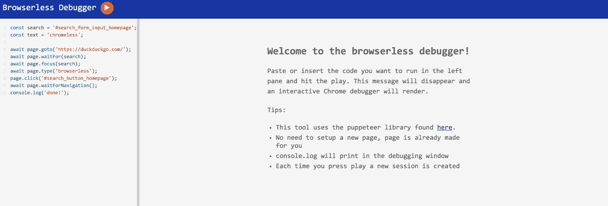

# 用 Chrome 重新思考无头浏览器自动化

> 原文：<https://medium.com/hackernoon/rethinking-headless-browser-automation-with-chrome-29cd3455e889>

Prep work for installing headless Chrome on linux

在看了无数的 docker 文件、 [GitHub](https://hackernoon.com/tagged/github) 库、太多的博客帖子和一大堆媒体之后，我决定就人们如何管理他们的无头浏览器工作进行一次公开讨论。尤其是现在有了新的库(无头 Chrome、木偶师和无头 Chrome)，我觉得我们在*获得了第二次机会，以更好的方式使用*这些[工具](https://hackernoon.com/tagged/tools)。

这是我在 [browserless](https://github.com/joelgriffith/browserless) 亲自花了很多天和几个月来做的事情，因为我知道做好这件事对 it 和用户来说都是成功的最好机会(特别是那些只想用[一种方式来运行无头“作业”](https://browserless.io)的人)。首先，我考虑的是，作为一个消费者，我想要什么，但是故事从那里发展到“我们怎么会在这里结束？”

# 我们是如何来到这里的

不久前，开发人员在基于浏览器的自动化方面几乎没有选择。PhantomJS、nightmare 和少数其他公司统治了这个领域，很少有人质疑三巨头(谷歌、Mozilla 或微软)中的一家是否会发布他们浏览器的无头版本。尽管这些浏览器都很棒，但有一件事他们中的大多数都不擅长:在 linux 上运行良好。这个致命弱点实际上是 PhantomJS 和其他几个人*实际上*做对了:立即安装和工作。事实上，你可以非常可靠地安装 phantom，用它在几秒钟内部署一个应用程序。问题是，现在仍然是，大多数人都是这么做的。

正是这种心态和部署方式让幻影受到了更多的抨击。在大多数应用程序环境中，您不会将数据库与您的服务器应用程序一起部署，也不会与它直接交互。相反，你可以单独操作它(即使它实际上位于同一个盒子上),并通过某种套接字连接与它对话。但是开发人员通常不会这样做。相反，他们只是调用幻影，运行一些工作，然后就到此为止。但是当你的应用程序开始收到大量请求时会发生什么呢？当您想要大规模并行化工作时会发生什么？

# 回到未来

我想以数据库为例，说明我们应该如何进行分布式和并行化的浏览器工作。数据库拥有所有这些很酷的东西:连接池、套接字，并且非常容易安装和运行。我可以毫不犹豫地说，数据库在其功能周围有一个不错的服务层。也就是说:他们有一个严格的协议，规定了如何以及何时与他们互动。

从另一个角度来考虑，想象一下:在每次请求时手动将数据写入和保存到一个平面文件。从本质上来说，这就是我们要求无头浏览器做的事情，这是我们与它们交互的本质。当然，他们会消耗大量的资源，并且变得古怪。当然，它们将会崩溃，并且通常不可用。你在核心应用程序旁边明确地运行一个巨大的二进制文件，你期望什么？

有一些阶级问题会很难解决，或者根本不可能解决。你只能做这么多来限制 Chrome 消耗的资源量，也只能并行化这么多资源。但是你仍然可以使用像队列和负载平衡这样的东西来使事情更具可扩展性。然而，当没有服务边界时，很难对二进制文件进行负载平衡。

# 我们应该在哪里

[无浏览器系统](https://github.com/joelgriffith/browserless)试图解决这些问题，主要是通过将网络浏览器或多或少地视为数据库。在数据库中，你不能使用 lambdas 或 functions-as-a-service 等花哨的工作流，否则你的数据会在每次调用后消失。类似地，在 web 浏览器中，调用可能会持续几分钟或更长时间，这使得无状态 lambdas 变得很困难。您还需要大量资源来使浏览器正常运行，这打破了无服务器类型工作流中的许多限制。如果你不相信我，去任何无头图书馆按日期排序，并见证人们争取让这个工作。我认为这是一种新颖的浏览器工作方式，但它从根本上说有一些缺陷，而且相当脆弱。事实是:如果你想保持与浏览器互动的灵活性，lambdas**T5**可能不是**的正确选择**。****

相反，我想建议你像对待其他服务一样对待浏览器，只是有一些小的不同。不要依赖无状态 HTTP，你必须让 WebSockets 运行(这就是每个远程 Chrome 库在某种程度上的工作方式)。这意味着您的 headless 服务将需要代理 HTTP 和 WebSockets，以及照看 Chrome 和并发连接。听起来很痛苦吗？有点像。但结果是你几乎得到了你需要的一切:

*   扩展应用/测试的清晰路径。易于负载平衡和并行化。
*   无需部署新版本即可更改您的无头作业。由于你是远程驾驶，你几乎不需要部署。
*   在自己的基础设施上沙盒化 Chrome，这样就不会让一切都瘫痪。
*   轻松地在本地交换正在运行的脚本，而不是无头服务器场。在无浏览器模式下，这是一行代码。

除此之外，您还可以构建一些非常酷的工具。例如，无浏览器捆绑了一个漂亮的调试器，允许你测试和查看浏览器在执行过程中做了什么。

The browserless debugger in action

# 你用 Chrome 做什么？

我很好奇，想听听你们是怎么在应用中操作和运行无头工作的。你还在把它和你的应用一起部署吗？在兰达斯经营？不相信我的立场？我请求你考虑一下[无浏览器](https://github.com/joelgriffith/browserless)因为它解决了我个人经历的很多问题。甚至还有[主持的计划，我已经专门设置了](https://browserless.io)，这样你就可以开始你的下一个项目了。