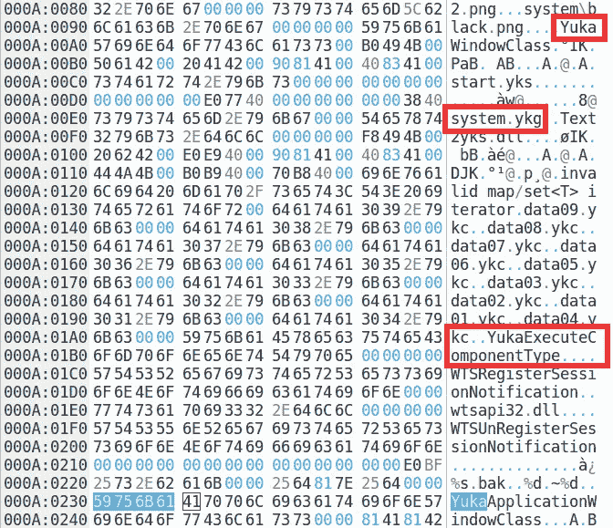

# 逆向工程视觉小说 101

> 原文：<https://medium.com/hackernoon/reverse-engineering-visual-novels-101-d0bc3bf7ab8>


我想坦白:我喜欢视觉小说。对于那些不在潮流中的人来说，视觉小说介于互动书籍、主要由大量阅读文本组成的游戏和带有图像的广播剧之间。不用说，其中绝大多数来自日本。我可以说，在过去的 5 年里，我完全投入其中，忽略了大多数其他形式的娱乐媒体，如纸质书、有声读物或电视。

从孩提时代起，我就是一个狂热的修补者:我只是喜欢深入事物内部，弄清楚它们是如何工作的。这样的态度慢慢让我在一家知名的全国性公司获得了逆向工程师和恶意软件分析师的职位，于是我想:我为什么不把这两个爱好结合起来，看看会发生什么？

我有这些想法已经好几年了，但是当我今年春天遇到[开泰结构](http://kaitai.io/)框架时，一切都改变了。这是一个二进制结构逆向工程的新框架(尽管作者似乎坚持认为这纯粹是出于和平目的:))基本思想很简单，但很吸引人:您使用一种特殊的标记语言来声明性地标记具有结构的二进制数据——然后，瞧，您用一种特殊的编译器编译它，您就拥有了一个支持任何编程语言的解析库。还有一个方便的可视化工具/十六进制查看器。我们可以转一圈吗？

To make it practical and demonstrate typical stuff one encounters while doing basic reverse engineering work, I propose that we start with something not-so-trivial, namely a beautiful visual novel called [Koisuru Shimai no Rokujuso](https://vndb.org/v13353) (originally 恋する姉妹の六重奏) by PeasSoft. It’s a fun, easy-going romantic comedy with a splendid visual part that’s PeasSoft is usually famous for. As a reverse engineering object, it’s also nice thing to explore, as it looks like we’ll be kind of breaking fresh ground. And it’s much more interesting that just duplicating work of others on well-explored stuff like [Kirikiri](http://kikyou.info/tvp/) or [Ren’Py](https://www.renpy.org/).

# 飞行前检查

首先，让我们看看我们需要的物品清单:

*   [开泰结构](http://kaitai.io/) —编译器，可视化工具，以及你最喜欢的编程语言的运行时库
*   [Java 运行时](http://java.com/download/)——不幸的是，开泰结构是用 Scala 编写的，因此需要 JRE 来运行
*   Ruby —开泰结构可视化工具是用 Ruby 编写的
*   KS 支持的任何语言(在撰写本文时，这是 C++、C#、Java、JavaScript、Ruby 和 Python)——我自己将使用 Ruby，但这并不重要，因为在我们的探索结束时，我们将使用它来编写几行代码
*   某种十六进制编辑器；我使用 [Okteta](https://utils.kde.org/projects/okteta/) ，但是我可以自由地使用任何你喜欢的东西，只要它能做基本的事情，比如查看十六进制转储、跳转到一个地址以及快速地将标记的片段复制到一个文件中

# 让他们准备好

好了，现在我们需要一个解剖的对象，这是一个视觉小说发行。我们很幸运，皮斯软件公司在他们的网站上合法地提供他们的视觉小说的试用版供免费下载。试用版足以让我们熟悉他们的格式。在他们的网站上寻找类似这样的页面:


Trial version download page

左边带数字的蓝色列表实际上是一组镜像链接——你可以使用其中任何一个来下载发行版。

# 思考-思考-思考

下载完了，我们先从基础智能开始。我们对目标有什么了解？至少我们下载的版本可以在使用英特尔 CPU 的 Windows 操作系统上运行(实际上*有*一个运行在 arm 上的 Android 版本，但它只在日本应用市场上销售，而且它不太容易从手机中提取)。那么，假设是 Windows/Intel，我们可以假设什么呢？

*   二进制格式的整数将使用小端编码
*   Windows 程序员仍然生活在石器时代，使用移位 JIS 编码(而不是世界其他地方使用的 UTF 8)
*   如果我们会遇到行尾标记，我们会使用“\r\n”，而不仅仅是“\n”

快速浏览我们的战利品可以看到以下内容:

*   data01.ykc — 8，393，294
*   data02.ykc — 560，418，878
*   data03.ykc — 219，792，804
*   sextet.exe——978，944 人
*   AVI/每加仑 122，152，964 元

所以，这里我们有一个单一的。exe 文件(显然是可执行引擎)**几个巨大的。ykc 文件**(很可能是内容档案或容器)和**op . mpg**——一段开场视频(可以用任何视频播放器轻松打开)。

在十六进制编辑器中快速检查 exe 文件会很有用。大多数现代开发人员足够理智，最终转而使用流行的现成库进行图像/音乐/声音处理，而不是发明自己的内部压缩格式。所有这些文库通常带有一些肉眼容易发现的特征。要寻找的东西:

*   “libpng 版本 1 . 0 . 8—2000 年 7 月 24 日”— libpng 的用法，它意味着图像将在。png 格式
*   “zlib 版本错误”、“未知 zlib 错误”——zlib 标记，表示将采用 zlib 压缩；实际上，这可能是一个误报，因为 zlib 压缩嵌入在 png 库中，所以它可能只是 libpng 的一部分
*   “西弗。org libVorbis I 2002 07 17”-libVorbis，这意味着音乐/声音/语音可能使用 ogg/vorbis 格式
*   “损坏的 JPEG 数据”、“JPEG 文件过早结束”——来自 libjpeg 的几个字符串；如果它们在这里——这意味着该引擎也可以处理 JPEG 图像
*   “D3DX8 着色器汇编器版本 0.91”——引擎内部的某些东西使用 D3DX8 着色器
*   “Microsoft Visual C++ Runtime Library”、“local vftable”、“eh vector constructor iterator”等大量字符串显示该 exe 与 Microsoft C++库链接，因此最初是用 c++编写的；事实上，人们甚至可以派生出一个精确版本的编译器(和一个库)，但它现在对我们来说用处不大——我们不打算反汇编 exe 或任何东西，我们仍然试图做一个公平的“清理房间”工作

寻找诸如“版本”、“版权”、“编译器”、“引擎”、“脚本”之类的东西也是一个好主意——并且，考虑到它是一个 Windows exe，不要忘记在像 UTF16-LE 这样的 2 字节编码中寻找它——有可能你会得到一些有趣的东西。在我们的例子中，我们有“优香编译器错误”、“YukaWindowClass”、“YukaApplicationWindowClass”、“YukaSystemRunning”，以及提到的“start.yks”和“system.ykg”。可以这么说，开发者将他们的引擎命名为“优香”，所有与它相关的文件都有以“yk”开头的扩展名——“ykc”、“yks”、“ykg”。我们还可以发现“CDPlayMode”和“CD play time”——这可能意味着该引擎可以播放音频 CD 中的音乐曲目，而“MIDIStop”和“MIDIPlay”表明也支持 MIDI 音乐。



Various fancy signature strings inside .exe give us some bold hints

总而言之，这意味着:

*   图像可能会在。巴新和。jpeg 格式，这实际上是一个非常好的消息——我们不需要在自定义压缩或任何东西上捣乱
*   音乐，声音和声音可能会用到。ogg 文件(但也可能使用 MIDI 或 CDDA，尽管不太可能——trail 版本是文件下载，而不是物理 CD)

# 让我们变得危险

好了，是时候卷起袖子大干一场了。有几个文件——这实际上也是非常好的消息。如果你做逆向工程，有几个样本可能是一个非常有价值的资产，因为你可以充分利用统计方法，将这些样本相互比较。如果这是你唯一拥有的东西，那就更难猜测 7F 02 00 00 意味着什么了。

让我们检查一下这些文件是否都有相同的格式。由此判断，它们都遵循相同的“数据*”。ykc”模式——确实如此。检查文件的开头会发现它们都以“YKC001\0\0”开头，这证明我们是对的。

另一个快速检查:让我们看看它们是否被压缩。只是采取任何压缩机，并尝试压缩一个文件，然后检查压缩比。我刚刚使用了 zip:

*   之前— 8，393，294 字节
*   之后— 6，758，313 字节

是的，它施加了一些压力，但不会太大。很可能它是未压缩的，或者至少某些文件是未压缩的。其实如果有的话。pngs 或者。oggs 在那个档案里，它们已经被很好地压缩了，所以看起来像是真的。

基本理论表明，每个归档都有某种类型的头，应用程序将使用它开始读取其归档，99%的文件将被归档内容填充—文件或一些数据块。请注意，文件头并不总是在文件的最开头，它可能在文件结尾的某个偏移量处，或者在文件开头的某个偏移量处。但是，标题不太可能就在内容的中间。

检查文件的开头会发现:


我们开始吧:

*   59 4B 43 30 │ 30 31 00 00 —这只是一个签名，一些检查文件实际上是一个容器的神奇字符串；在 ASCII 中是“ykc 001”——它很可能意味着类似“优香容器”的东西，版本 001
*   18 00 00 00 00│00 00 00 00│1A 00 80 00│34 12 00 00—就是这个标题
*   然后我们看到某种文件的主体；在 data02.ykc 中很容易看到——归档以一个文本文件开始，类似于一个配置或一些脚本语言，类似于“WindowSize = 1280，800”、“TransitionWaitType = 2”等等

让我们比较一下这三个文件的头文件:

```
data01.ykc: 18 00 00 00 │ 00 00 00 00 │ 1A 00 80 00 │ 34 12 00 00
data02.ykc: 18 00 00 00 │ 00 00 00 00 │ 4E E1 66 21 │ F0 6E 00 00
data03.ykc: 18 00 00 00 │ 00 00 00 00 │ 5C E1 18 0D │ 48 E4 00 00
```

我还不知道“18 00 00 00 │ 00 00 00 00”是什么，但这并不重要，因为在任何地方都一样。另外两个字段更有趣——它们看起来很像两个 4 字节的整数。所以，是时候抓住开泰结构，开始勾画我们的格式了:

```
meta:
  id: ykc
  application: Yuka Engine
  endian: le
seq:
  - id: magic
    contents: ["YKC001", 0, 0]
  - id: magic2
    contents: [0x18, 0, 0, 0, 0, 0, 0, 0]
  - id: unknown1
    type: u4
  - id: unknown2
    type: u4
```

没什么可怕的，不是吗？其实，。ksy 只是一个普通的 YAML 文件。“元”部分由我们早期的发现组成，即我们正在处理“ykc”文件，它使用的应用程序被称为“优香引擎”(这只是对其他研究人员的友好提醒，就像一个注释一样，它并不真正影响解析)，我们将默认使用小端整数(即“endian: le”)。

然后我们有一个“seq”部分，描述如何解析文件——这是一个字段列表。每个字段都必须有一个名称(“id”)——这正是我们正在努力的——以及对其内容的描述。我们在这里使用了两个子句:

*   " contents: [0x18，0，0，0，0，0，0，0]"用固定内容标记字段。这实际上意味着在解析过程中，KS 会自动读取正确的字节数，并与给定的模式进行比较。如果它们不匹配，就会抛出一个异常。
*   “type: u4”标记“u”n 有符号整数，4 字节长的字段。它将使用默认的字节顺序，我们已经在“meta”中指定了。

让我们在可视化工具中尝试我们的 ksy 文件:

```
ksv data01.ykc ykc.ksy
```

你瞧，我们的 data01.ykc 布局很好:


Kaitai Struct visualizer in all its console glory

是的，可视化工具是基于控制台的，所以你现在就可以开始感觉像电影中展示的真正的黑客了。但是让我们先来看看树结构:

```
[-] [root]
  [.] [@magic](http://twitter.com/magic) = 59 4b 43 30 30 31 00 00
  [.] [@magic2](http://twitter.com/magic2) = 18 00 00 00 00 00 00 00
  [.] [@unknown1](http://twitter.com/unknown1) = 8388634
  [.] [@unknown2](http://twitter.com/unknown2) = 4660
```

用户可以使用 visualizer 中的箭头键遍历所有这些字段，使用“Tab”跳转到 hex viewer 并返回，使用“Enter”打开关闭的树节点，显示实例(我们稍后将讨论它们)并全屏查看 hex 转储。为了让文章更容易阅读，我不会显示可视化工具的完整截图，只显示树中有趣的部分。

好了，这是 data01.ykc，让我们看看 data02.ykc:

```
[-] [root]
  [.] [@magic](http://twitter.com/magic) = 59 4b 43 30 30 31 00 00
  [.] [@magic2](http://twitter.com/magic2) = 18 00 00 00 00 00 00 00
  [.] [@unknown1](http://twitter.com/unknown1) = 560390478
  [.] [@unknown2](http://twitter.com/unknown2) = 28400
```

和 data03.ykc:

```
[-] [root]
  [.] [@magic](http://twitter.com/magic) = 59 4b 43 30 30 31 00 00
  [.] [@magic2](http://twitter.com/magic2) = 18 00 00 00 00 00 00 00
  [.] [@unknown1](http://twitter.com/unknown1) = 219734364
  [.] [@unknown2](http://twitter.com/unknown2) = 58440
```

实际上，没那么多。没有文件目录什么的。让我们记下原始容器文件的大小，看看这些文件中是否有偏移量或指针:

*   data 01 . ykc—8393294[@ unknown 1](http://twitter.com/unknown1)= 8388634
*   data 02 . ykc—560418878[@ unknown 1](http://twitter.com/unknown1)= 560390478
*   data 03 . ykc—219792804[@ unknown 1](http://twitter.com/unknown1)= 219734364

哇，看来我们击中靶心了。让我们看看在文件中的那个偏移量处发生了什么:

```
meta:
  id: ykc
  application: Yuka Engine
  endian: le
seq:
  - id: magic
    contents: ["YKC001", 0, 0]
  - id: magic2
    contents: [0x18, 0, 0, 0, 0, 0, 0, 0]
  - id: unknown_ofs
    type: u4
  - id: unknown2
    type: u4
instances:
  unknown3:
    pos: unknown_ofs
    size-eos: true
```

我们添加了另一个名为“未知 3”的字段。然而，这次它不在“seq”部分，而是在“instances”部分。实际上是同样的事情，但是“实例”是用来描述不按顺序的字段，因此它们可以在流中的任何地方，并且需要位置注释(“pos”)来开始解析。因此，我们的“unknown3”从“unknown _ ofs”(“pos:unknown _ ofs”)开始，一直延续到文件的结尾(=stream，so“size-EOS:true”)。因为我们不知道我们将在那里得到什么，所以到目前为止，它将被作为一个字节流来读取。没什么特别的，但是让我们来看看:

```
[-] [root]
  [.] [@magic](http://twitter.com/magic) = 59 4b 43 30 30 31 00 00 
  [.] [@magic2](http://twitter.com/magic2) = 18 00 00 00 00 00 00 00 
  [.] [@unknown_ofs](http://twitter.com/unknown_ofs) = 8388634
  [.] [@unknown2](http://twitter.com/unknown2) = 4660
  [-] unknown3 = 57 e7 7f 00 0a 00 00 00 18 00 00 00 13 02 00 00…
```

嘿，注意那个“未知 3”的长度。看起来和《未知 2》一模一样。因此，事实证明，YKC 文件的第一个文件头实际上并不是文件头本身，而是对文件的某个其他点的引用，以找到真正的文件头。让我们修理我们的。ksy 文件来添加这些知识:

```
meta:
  id: ykc
  application: Yuka Engine
  endian: le
seq:
  - id: magic
    contents: ["YKC001", 0, 0]
  - id: magic2
    contents: [0x18, 0, 0, 0, 0, 0, 0, 0]
  - id: header_ofs
    type: u4
  - id: header_len
    type: u4
instances:
  header:
    pos: header_ofs
    size: header_len
```

这里没有什么太复杂的:我们只是重命名了“unknown”字段，使其具有更有意义的名称，并将“size-eos: true”(这意味着读取文件末尾之前的所有内容)替换为“size: header_len”(这指定了要读取的确切字节数)。可能这和最初的想法非常接近。再次加载，现在让我们把注意力集中在我们命名为“header”的字段上。在 data01.ykc 中看起来是这样的:

```
000000: 57 e7 7f 00 0a 00 00 00 18 00 00 00 13 02 00 00
000010: 00 00 00 00 61 e7 7f 00 0b 00 00 00 2b 02 00 00
000020: db 2a 00 00 00 00 00 00 6c e7 7f 00 11 00 00 00
000030: 06 2d 00 00 92 16 00 00 00 00 00 00 7d e7 7f 00
```

在 data02.ykc 中:

```
000000: d1 2b 66 21 0c 00 00 00 18 00 00 00 5a 04 00 00
000010: 00 00 00 00 dd 2b 66 21 14 00 00 00 72 04 00 00
000020: 26 1a 00 00 00 00 00 00 f1 2b 66 21 16 00 00 00
000030: 98 1e 00 00 a8 32 00 00 00 00 00 00 07 2c 66 21
```

在 data03.ykc 中:

```
000000: ec 30 17 0d 26 00 00 00 18 00 00 00 48 fd 00 00
000010: 00 00 00 00 12 31 17 0d 26 00 00 00 60 fd 00 00
000020: 0d 82 03 00 00 00 00 00 38 31 17 0d 26 00 00 00
000030: 6d 7f 04 00 d0 85 01 00 00 00 00 00 5e 31 17 0d
```

乍一看，一点意义都没有。然而，转念一想，一系列重复的字节引起了我们的注意。即第一档中的“e7 7f ”,第二档中的“2b 66 ”,第三档中的“30 17”和“31 17”。实际上，它看起来非常像我们在这里处理的固定长度记录，0x14 (20 十进制)字节长。顺便说一下，这个假设也适用于所有三个文件的头长度:4660、28400 和 58440 都可以被 20 整除。让我们试一试:

```
meta:
  id: ykc
  application: Yuka Engine
  endian: le
seq:
  - id: magic
    contents: ["YKC001", 0, 0]
  - id: magic2
    contents: [0x18, 0, 0, 0, 0, 0, 0, 0]
  - id: header_ofs
    type: u4
  - id: header_len
    type: u4
instances:
  header:
    pos: header_ofs
    size: header_len
    type: header
types:
  header:
    seq:
      - id: entries
        size: 0x14
        repeat: eos
```

在这里查看“header”实例发生了什么。它仍然位于“header_ofs ”,大小为“header_len”字节，但它不再仅仅是一个字节数组。它有自己的类型，“type: header”。这意味着我们可以指定一个自定义类型，这个类型将用于处理给定的字段。在这里，它就在下面，在“类型:”部分。正如您可能已经猜到的，实际上“类型”遵循与主文件完全相同的格式(即根文件)——您可以使用相同的“序列”部分来指定子字段的序列，“实例”，它可以有自己的子类型(“类型”)，等等。

因此，我们指定了一个“header”类型，它由一个单独的字段“entries”组成。我们知道该字段需要 0x14 字节长(“大小:0x14”)，但是我们要求它尽可能长地重复(即，直到流的末尾，即“repeat: eos”)。

顺便说一下，注意“流”的概念和我们之前看到的不一样，当时“流”实际上是指“整个文件”。这一次我们处理了一个固定大小的子结构(“size: header_len”)，所以无论如何重复都会受到大小的限制。所以我们可以放心，如果有超过这个长度的东西，它不会污染我们的这个结构。

好吧，让我们试一试:

```
[-] header
    [-] [@entries](http://twitter.com/entries) (233 = 0xe9 entries)
      [.]   0 = 57 e7 7f 00|0a 00 00 00|18 00 00 00|13 02 00 00|00 00 00 00 
      [.]   1 = 61 e7 7f 00|0b 00 00 00|2b 02 00 00|db 2a 00 00|00 00 00 00 
      [.]   2 = 6c e7 7f 00|11 00 00 00|06 2d 00 00|92 16 00 00|00 00 00 00 
      [.]   3 = 7d e7 7f 00|14 00 00 00|98 43 00 00|69 25 00 00|00 00 00 00 
      [.]   4 = 91 e7 7f 00|15 00 00 00|01 69 00 00|d7 12 00 00|00 00 00 00 
      [.]   5 = a6 e7 7f 00|12 00 00 00|d8 7b 00 00|27 3f 07 00|00 00 00 00
```

现在开始有点道理了，不是吗？它看起来真的像一个重复的结构。让我们看看第二个文件:

```
[-] header
    [-] [@entries](http://twitter.com/entries) (1420 = 0x58c entries)
      [.]    0 = d1 2b 66 21|0c 00 00 00|18 00 00 00|5a 04 00 00|00 00 00 00 
      [.]    1 = dd 2b 66 21|14 00 00 00|72 04 00 00|26 1a 00 00|00 00 00 00 
      [.]    2 = f1 2b 66 21|16 00 00 00|98 1e 00 00|a8 32 00 00|00 00 00 00 
      [.]    3 = 07 2c 66 21|16 00 00 00|40 51 00 00|a2 16 00 00|00 00 00 00 
      [.]    4 = 1d 2c 66 21|16 00 00 00|e2 67 00 00|89 c4 00 00|00 00 00 00 
      [.]    5 = 33 2c 66 21|16 00 00 00|6b 2c 01 00|fa f5 00 00|00 00 00 00
```

对了，你看到那个(233 = 0xe9 条目)和(1420 = 0x58c 条目)了吗？推断它可能是存档中的文件数量是合理的。我们的第一个归档相对较小(8 MiB)，将其除以 233 个文件，平均每个文件产生 36022 字节。对于一堆脚本、配置等来说看起来是合法的。第二个存档是最大的(560 MiB)，有 1420 个文件，每个文件产生 394661 字节，这对于图像、语音文件等内容来说是可以的。

‘57e 7 7f 00’、‘61e 7 7f 00’、‘6c E7 7f 00’等等看起来很像一个递增的整数序列，它可能意味着什么呢？在第二个文件中，它是“d1 2b 66 21”、“dd 2b 66 21”、“f1 2b 66 21”。等一下，我想我已经在哪里见过了。让我们回到工作的开始——就这样！它接近文件的全长——因此，它看起来又像是偏移量。好了，让我们试着描述一下这些 20 字节记录的结构。从外表来看，我会说这是 5 个整数。我们将描述另一个名为“文件条目”的类型。给出完整的清单变得很麻烦，所以如果你不介意的话，我不会从现在开始复制粘贴整个文件，而只会向你展示改变后的“类型”部分:

```
types:
  header:
    seq:
      - id: entries
        repeat: eos
        type: file_entry
  file_entry:
    seq:
      - id: unknown_ofs
        type: u4
      - id: unknown2
        type: u4
      - id: unknown3
        type: u4
      - id: unknown4
        type: u4
      - id: unknown5
        type: u4
```

没有新的。ksy 特性在此解决。我们为条目添加了“type: file_entry ”,并将该子类型描述为 5 个连续的 u4 整数。在 visualizer 中检查它:

```
[-] header
    [-] [@entries](http://twitter.com/entries) (233 = 0xe9 entries)
      [-]   0
        [.] [@unknown_ofs](http://twitter.com/unknown_ofs) = 8382295
        [.] [@unknown2](http://twitter.com/unknown2) = 10
        [.] [@unknown3](http://twitter.com/unknown3) = 24
        [.] [@unknown4](http://twitter.com/unknown4) = 531
        [.] [@unknown5](http://twitter.com/unknown5) = 0
      [-]   1
        [.] [@unknown_ofs](http://twitter.com/unknown_ofs) = 8382305
        [.] [@unknown2](http://twitter.com/unknown2) = 11
        [.] [@unknown3](http://twitter.com/unknown3) = 555
        [.] [@unknown4](http://twitter.com/unknown4) = 10971
        [.] [@unknown5](http://twitter.com/unknown5) = 0
      [-]   2
        [.] [@unknown_ofs](http://twitter.com/unknown_ofs) = 8382316
        [.] [@unknown2](http://twitter.com/unknown2) = 17
        [.] [@unknown3](http://twitter.com/unknown3) = 11526
        [.] [@unknown4](http://twitter.com/unknown4) = 5778
        [.] [@unknown5](http://twitter.com/unknown5) = 0
```

有什么想法吗？还有一个想法:“unknown3”是指向我们存档中文件开头的指针，“unknown4”很可能是这个文件的长度。很简单，因为 24 + 531 = 555，555 + 10971 = 11526。那只是在容器中连续运行的文件。人们可能还会注意到 unknown_ofs 和 unknown2 也是如此:8382295 + 10 = 8382305，8382305 + 11 = 8382316。这意味着“未知 2”是从“未知 _ofs”偏移量开始的一些其他子记录的长度。“unknown5”似乎总是等于 0。

来吧，让我们在“file_entry”中加入一些特殊的魔法来读取这些数据块，即记录在(unknown _ ofs 未知 2)和位于(未知 3；未知 4)。看起来应该是这样的:

```
 file_entry:
    seq:
      - id: unknown_ofs
        type: u4
      - id: unknown_len
        type: u4
      - id: body_ofs
        type: u4
      - id: body_len
        type: u4
      - id: unknown5
        type: u4
    instances:
      unknown:
        pos: unknown_ofs
        size: unknown_len
        io: _root._io
      body:
        pos: body_ofs
        size: body_len
        io: _root._io
```

实际上，我们以前已经对“实例”做过同样的事情，所以这并不新鲜。这里唯一真正新“神奇”的东西是“io: _root。_io”规范。它是做什么的？

你还记得我提到过 KS 有“流”的概念吗？如果你在解析一个子结构时通过偏移量和大小有效地限制了这个“流”,它就不是从一开始就等于整个文件的那个“流”?这里的情况就是这样。如果没有这个“io”规范，“pos: body_ofs”将试图在对应于我们的“file_entry”记录的流中寻找“body_ofs”位置，实际上是 20 个字节长——这不是我们想要的(更不用说这会导致错误)。所以我们需要一些特殊的魔法来指定我们要读取的不是当前的 IO 流，而是对应于整个文件的 IO 流——也就是“_root”。_io”。

好吧，我们得到了什么？

```
 [-] [@entries](http://twitter.com/entries) (233 = 0xe9 entries)
      [-]   0
        [.] [@unknown_ofs](http://twitter.com/unknown_ofs) = 8382295
        [.] [@unknown_len](http://twitter.com/unknown_len) = 10
        [.] [@body_ofs](http://twitter.com/body_ofs) = 24
        [.] [@body_len](http://twitter.com/body_len) = 531
        [.] [@unknown5](http://twitter.com/unknown5) = 0
        [-] unknown = 73 74 61 72 74 2e 79 6b 73 00 
        [-] body = 59 4b 53 30 30 31 01 00 30 00 00 00…
      [-]   1
        [.] [@unknown_ofs](http://twitter.com/unknown_ofs) = 8382305
        [.] [@unknown_len](http://twitter.com/unknown_len) = 11
        [.] [@body_ofs](http://twitter.com/body_ofs) = 555
        [.] [@body_len](http://twitter.com/body_len) = 10971
        [.] [@unknown5](http://twitter.com/unknown5) = 0
        [-] unknown = 73 79 73 74 65 6d 2e 79 6b 67 00 
        [-] body = 59 4b 47 30 30 30 00 00 40 00 00 00…
```

使用交互式可视化工具更容易检查，但即使在这个静态快照上，也很容易看出‘73 74 61 72 74 2e 79 6b 73 00’是一个 ASCII 字符串。检查字符串表示，结果是“start.yks ”,结尾是零字节。而‘73 79 73 74 65 6d 2e 79 6b 67 00’其实就是“system.ykg”。答对了，是文件名。我们非常确定它们是字符串，而不仅仅是一些字节。让我们把它标记出来:

```
 file_entry:
    seq:
      - id: filename_ofs
        type: u4
      - id: filename_len
        type: u4
      - id: body_ofs
        type: u4
      - id: body_len
        type: u4
      - id: unknown5
        type: u4
    instances:
      filename:
        pos: filename_ofs
        size: filename_len
        type: str
        encoding: ASCII
        io: _root._io
      body:
        pos: body_ofs
        size: body_len
        io: _root._io
```

这里的新东西是“type:str”——这意味着我们捕获的字节必须被解释为一个字符串——而“encoding: ASCII”指定了编码(我们不是很确定，但目前为止是 ASCII)。再次可视化工具:

```
 [-] header
    [-] [@entries](http://twitter.com/entries) (233 = 0xe9 entries)
      [-]   0
        [.] [@filename_ofs](http://twitter.com/filename_ofs) = 8382295
        [.] [@filename_len](http://twitter.com/filename_len) = 10
        [.] [@body_ofs](http://twitter.com/body_ofs) = 24
        [.] [@body_len](http://twitter.com/body_len) = 531
        [.] [@unknown5](http://twitter.com/unknown5) = 0
        [-] filename = "start.yks\x00"
        [-] body = 59 4b 53 30 30 31 01 00 30 00 00 00…
      [-]   1
        [.] [@filename_ofs](http://twitter.com/filename_ofs) = 8382305
        [.] [@filename_len](http://twitter.com/filename_len) = 11
        [.] [@body_ofs](http://twitter.com/body_ofs) = 555
        [.] [@body_len](http://twitter.com/body_len) = 10971
        [.] [@unknown5](http://twitter.com/unknown5) = 0
        [-] filename = "system.ykg\x00"
        [-] body = 59 4b 47 30 30 30 00 00 40 00 00 00…
      [-]   2
        [.] [@filename_ofs](http://twitter.com/filename_ofs) = 8382316
        [.] [@filename_len](http://twitter.com/filename_len) = 17
        [.] [@body_ofs](http://twitter.com/body_ofs) = 11526
        [.] [@body_len](http://twitter.com/body_len) = 5778
        [.] [@unknown5](http://twitter.com/unknown5) = 0
        [-] filename = "SYSTEM\\black.PNG\x00"
        [-] body = 89 50 4e 47 0d 0a 1a 0a 00 00 00 0d…
```

现在，这不是很好吗？看来我干得不错。您甚至可以选择单个文件体，在可视化工具中按“w ”,键入一些名称，然后将这些二进制块导出为本地文件。但是这很烦人，这也不是我们想要的:我们想要一次提取所有的文件，保持它们原来的文件名。

# 摊牌时间

让我们为此写个剧本。我们如何将我们的格式描述转换成代码？这就是 Kaitai Struct 的亮点所在:**你不需要手动将所有类型规范重新输入代码**。您只需获得 ksc 编译器并运行:

```
ksc -t ruby ykc.ksy
```

在当前文件夹中，您已经有了一个漂亮而闪亮的“ykc.rb”文件，这是一个可以直接插入并使用的库。好吧，但是我们怎么做呢？让我们从简单的事情开始，比如在屏幕上列出文件:

```
require_relative 'ykc'
Ykc.from_file('data01.ykc').header.entries.each { |f|
  puts f.filename
}
```

很酷吧。我们开始吧——两行代码(如果算上“要求”和块终止，就是四行)——我们已经有了一个庞大的清单:

```
start.yks
system.ykg
SYSTEM\black.PNG
SYSTEM\bt_click.ogg
SYSTEM\bt_select.ogg
SYSTEM\config.yks
SYSTEM\Confirmation.yks
SYSTEM\confirmation_load.png
SYSTEM\confirmation_no.ykg
SYSTEM\confirmation_no_load.ykg
...
```

让我们一步一步地看看这里发生了什么:

*   Ykc.from_file(…) —创建一个新的 Ykc 类对象(从我们的。ksy 描述)，解析来自本地文件系统的文件；该对象的字段将被填充中描述的任何内容。ksy
*   。header —选择 Ykc 中的“header”字段，从而返回 Ykc::header 类的实例，该实例对应于中的“Header”类型。ksy
*   。条目—选择标题中的“条目”字段，返回 Ykc::FileEntry 类的实例数组
*   。each { | f |…}——对集合中的每个元素进行操作的典型 Ruby 方式
*   将 f.filename —仅将 FileEntry 的“filename”字段中的字符串输出到 stdout，即屏幕

编写批量提取脚本应该不难，但是我想在此之前注意一些事情:

1.  “文件名”字段中有路径规范，并且它使用“\”(反斜杠)作为文件夹分隔符，因为归档最初是在 Windows 系统上创建的。如果我们试图在 UNIX 系统上创建这样一个路径，它会顺从地为我们创建一个名称中带有反斜杠的目录，所以对于 mkdir_p 这样的调用，最好将这些“\”转换成“/”
2.  文件名实际上是以零结尾的(是的，看起来像 C，好吧)。当你把它放在屏幕上时，它是不可见的，但是当你试图创建一个名称中带有“\0”的文件时，它可能会成为一个问题。
3.  如果您进一步查看清单，您会看到类似这样的内容:

```
"SE\\00050_\x93d\x98b\x82P.ogg\x00"
"SE\\00080_\x83J\x81[\x83e\x83\x93.ogg\x00"
"SE\\00090_\x83`\x83\x83\x83C\x83\x80.ogg\x00"
"SE\\00130_\x83h\x83\x93\x83K\x83`\x83\x83\x82Q.ogg\x00"
"SE\\00160_\x91\x96\x82\xE8\x8B\x8E\x82\xE9\x82Q.ogg\x00"
```

你还记得文章开头，我说疯狂的日本程序员使用 Shift-JIS 吗？正是如此。他们使用有日文字符的文件。让我们在文件名类型描述中将“编码:ASCII”改为“编码:SJIS”。不要忘记重新编译 ksy → rb，瞧:

```
SE\00050_ 電話１.ogg
SE\00080_カーテン.ogg
SE\00090_チャイム.ogg
SE\00130_ドンガチャ２.ogg
SE\00160_ 走り去る２.ogg
```

Even if you don’t read Japanese, you can check out something like Google Translator to see that 電話 is actually “phone”, so chances are “SE\00050” is a sound of phone ringing.

最终，我们的提取脚本将如下所示:

```
require 'fileutils'
require_relative 'ykc'EXTRACT_PATH = 'extracted'ARGV.each { |ykc_fn|
  Ykc.from_file(ykc_fn).header.entries.each { |f|
    filename = f.filename.strip.encode('UTF-8').gsub("\\", '/')
    dirname = File.dirname(filename)
    FileUtils::mkdir_p("#{EXTRACT_PATH}/#{dirname}")
    File.write("#{EXTRACT_PATH}/#{filename}", f.body)
  }
}
```

这比两行多一点，但是这里也没有什么特别的东西。我们获取一个命令行参数列表(这样，您可以使用类似。/extract-ykc *。ykc)，同样，对于每个容器文件，我们遍历所有的文件条目。我们清理文件名(去掉尾随零，将其编码为 UTF-8，并用正斜杠替换反斜杠)，导出目录名(dirname)，创建文件夹(mkdir_p ),最后，我们将“f.body”内容转储到一个文件中。

我们的任务完成了。您可以运行脚本来看看我们会得到什么。正如我们所预测的，图像真的出现了。png 格式(你可以用任何图像浏览器查看)，音乐和声音都在。ogg(所以你可以用任何播放器听它们)。例如，这是我们在 BG 文件夹中的背景:


BG folder unpacked: backgrounds

并且 TA 文件夹包含覆盖在这些背景上的精灵。例如，米卡看起来像这样:


TA/MIKA folder unpacked: sprites for Mika character

I can give out a little secret: in many Japanese VNs, “standing” sprites are named “ta” or “tati” / “tachi” / “tatsu” / “tatte”. That’s because Japanese word for “standing” is 立って (tatte) or “to stand up” is 立ち上がる (tachi ageru). That usually contrasts with “fa” or “face” sprites, which are actually used for avatar portraits in the dialogue text box, which show only character’s face.

今天到此为止。这里留给逆向工程的两大东西是“yks”和“ykg”文件——大概“yks”是游戏的脚本，“ykg”是一些辅助图形或者动画。让我们下次设法解决它们。

我想分享几个结论:

*   开泰结构是一个非常好的工具，看起来和没有它的时候你正在做的事情非常匹配，因此节省了你很多时间。如果你是用普通的 Ruby(或者 Python，或者 PHP，或者其他什么)来做这件事，至少你要把整个事情做两遍:首先，你写一个脚本，把转储输出到屏幕上，然后你重写它来真正提取数据。如果你正在使用“高级”的十六进制编辑器，如 Hexinator 或 010 Editor——很可能你实际上已经做了三次了(还有一次你必须在你的编辑器中写一个模板)。
*   开泰结构可视化工具是一个非常简单的工具，它可能又丑又慢，但它仍然是我迄今为止遇到的最好的工作。希望有一天它能改头换面:)
*   实际上，你甚至不需要一个十六进制编辑器/查看器，在你用. ksy 完成第一个草图之后。无论如何，在 visualizer 中遍历树比手动计算偏移要好。但是有一个初步分析+在. exe 中快速搜索还是很有用的。
*   。ksy 是一种非常富于表现力的语言(它轻而易举地击败了“高级”十六进制编辑器模板)，但是它的文档有点欠缺。我必须承认，为了写这篇文章，我一个星期以来一直用无穷无尽的问题纠缠 KS 作者。用“io: _root”的那一招。_io”可不是你一个人想出来的。我只能希望文档会变得更好，因为 Kaitai Struct 将接近 1.0 版。

一些有用的链接:

*   开泰结构—[http://kaitai.io/](http://kaitai.io/)
*   http://peassoft.com/(警告，NSFW！)
*   人们可以找到一些视觉新颖引擎的规范和工具(在。ksy 格式也是)在[我的 GitHub 项目](https://github.com/mnakamura1337/)。
*   你也可以用俄语阅读这篇文章[。](https://habrahabr.ru/post/281595/)

[](http://bit.ly/HackernoonFB)[](https://goo.gl/k7XYbx)[](https://goo.gl/4ofytp)

> [黑客中午](http://bit.ly/Hackernoon)是黑客如何开始他们的下午。我们是 [@AMI](http://bit.ly/atAMIatAMI) 家庭的一员。我们现在[接受投稿](http://bit.ly/hackernoonsubmission)并乐意[讨论广告&赞助](mailto:partners@amipublications.com)机会。
> 
> 如果你喜欢这个故事，我们推荐你阅读我们的[最新科技故事](http://bit.ly/hackernoonlatestt)和[趋势科技故事](https://hackernoon.com/trending)。直到下一次，不要把世界的现实想当然！

[](https://goo.gl/Ahtev1)