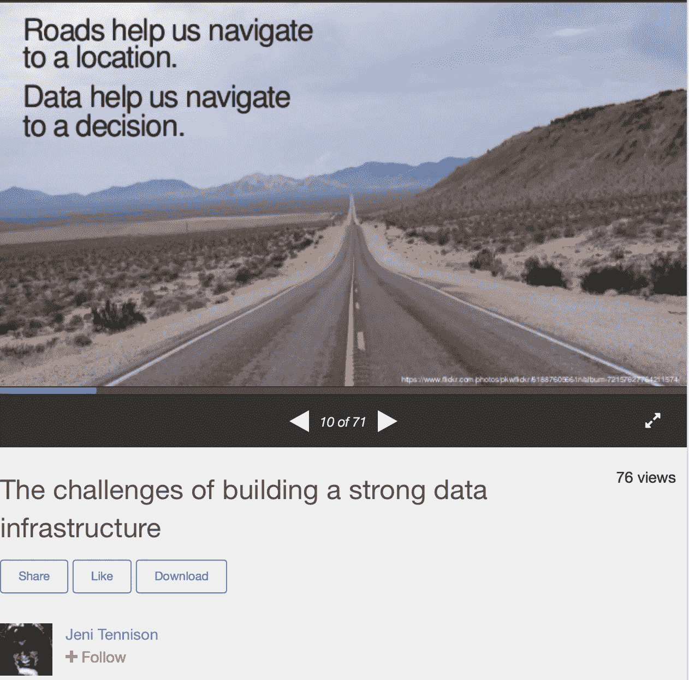
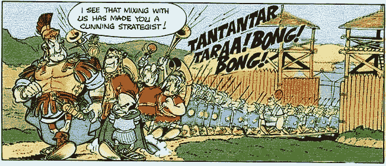
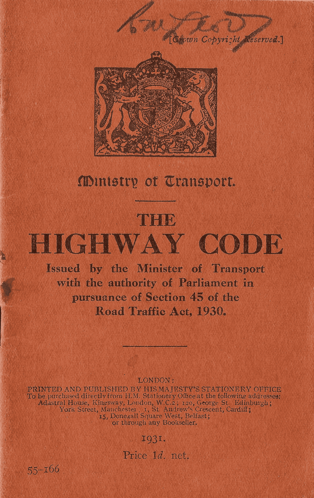

# 罗马道路和数据基础设施

> 原文：<https://medium.com/hackernoon/roman-roads-and-data-infrastructure-28f586c50f3b>

我偶尔会走来走去，挥舞手臂，宣告:

> 数据是基础设施，就像道路一样

对于这种奇怪的痛苦，我时而责备，时而赞美才华横溢的林洋·坦尼森。我称赞林洋为[数据](https://hackernoon.com/tagged/data)提出了道路的精彩类比，我责怪她让我染上了兴奋地向任何人谈论它的毛病，这样我就可以从他们的想法中学习。

A clip from [one of Jeni’s talk on data infrastructure](https://www.slideshare.net/JeniT/the-challenges-of-building-a-strong-data-infrastructure).

我最近宣称，对于一个拥有古典文学学位、在小学从事教学工作的朋友来说，数据就像是道路。她非常[博学](http://www.thefreedictionary.com/well-read)。

我的朋友问我，我是否认为作为一个社会，我们在建设数据基础设施方面已经走在了前列。

不，我说，互联网/网络的发明导致了目前数据的大规模增长，这仅仅是几十年的事情，我怀疑我们还需要 10 到 20 年才能学会如何做好数据工作。

我认为你是对的，她回答说，毕竟你描述的所有数据基础设施听起来很像罗马的道路，我们花了几千年才开始把道路修好。

真的吗？我说。罗马路？听起来很有趣…

## 罗马的道路是为经济和军事服务的

A Roman army in an [Asterix](https://en.wikipedia.org/wiki/Asterix) comic. They will have tried, and failed, to conquer. Copyright [René Goscinny](https://en.wikipedia.org/wiki/Ren%C3%A9_Goscinny) and [Albert Uderzo](https://en.wikipedia.org/wiki/Albert_Uderzo)

我们通常想象中的罗马道路要么是一队考古学家挖掘的泥泞的土地，要么是一支罗马士兵的军队行进着试图征服一片新的土地。但是罗马的道路也被其他人使用。他们是罗马经济的重要组成部分。

人们沿着它们运送货物进行贸易，运送建造新房子的材料。关于道路对罗马[埃及](https://books.google.co.uk/books?hl=en&lr=&id=PTcTDAAAQBAJ&oi=fnd&pg=PR6&dq=roman+roads+economics&ots=g85w0uyUxx&sig=LIEbciSeqH0Mbt128np5CoEqsCk#v=onepage&q=roman%20roads%20economics&f=false)和[意大利](https://books.google.co.uk/books?hl=en&lr=&id=eMXKBgAAQBAJ&oi=fnd&pg=PP1&dq=roman+roads+economics&ots=cBwj9QdqL8&sig=-zEigoSL5t7h7LKdnkmp5LuiOy8#v=onepage&q=roman%20roads%20economics&f=false)的影响的书籍已经出版——他们有复杂的定价模式，将他们的道路与其他交通方式相结合，并且他们发展了治理安排来管理他们道路的发展。

但是罗马的道路不仅仅是为了军队和商人。它们也被用来传递信息、税收和运送人员。在公共道路上，有许多 T2 式的车站。

## 数据不是真正的道路

在我深入这个故事之前，我应该明确一点，我并不真的认为数据就像道路一样。这是一个类比。所有的类比都是不完美的。但我确实认为，对于 21 世纪的社会来说，数据正在成为一种新的、奇怪的、重要的[基础设施形式。很重要的一点是，我们应该讨论并学习如何从中获得最大收益。](https://theodi.org/what-is-data-infrastructure)

A first edition of the first UK Highway Code by [Mikey Ashworth](https://www.flickr.com/photos/36844288@N00/4982230334), CC-BY-2.0

道路的类比有助于打破人们在思考数据时通常的思维定势。经常与石油相提并论尤其不合时宜。

道路的类比更加贴切。维护的重要性；[收费公路的危险以及昂贵或复杂的许可；以及如何使用道路的规则手册。](https://en.wikipedia.org/wiki/The_Highway_Code)

这是一个相当不错的类比，但是我的朋友已经开始谈论罗马道路了。

## 罗马道路有助于吸收其他经济体

沿路设置了 Mansio。它们由罗马政府维护，供官员和军队使用。政府官员和他们的动物可以睡觉、洗澡和喂食。许多其他人也可以使用曼西奥斯，但他们必须为这一特权付费。

人们支付的钱将用于维护 mansios 和运行 cursus publicus。cursus publicus 是一个运输系统，既用于运送人员，也用于传递信息。官员和他们的信息将免费旅行。其他人都得付钱。这是一个庞大的收费公路网络，横跨一系列国家，只允许一部分人优先通行。

其他人会付钱，因为罗马的道路比他们自己修建的道路要好得多。没有真正的竞争:如果你想从 A 地到 B 地，你必须去罗马。因此，许多曼西奥逐渐发展成为城镇。

A Roman coin showing Marcus Aurelius. Copyright: CC-BY-SA 3.0 by [Rasiel](https://en.wikipedia.org/wiki/User:Rasiel) at [English Wikipedia](https://en.wikipedia.org/wiki/)

这种影响不仅优先改善了一个民族，即罗马人及其城镇的经济，还通过让人们使用他们的语言和货币来帮助推行罗马文化和标准。我们铁路的宽度来自罗马道路是一个神话，这是由于不同的基础设施，[铁路是在英国北部发明的，但是许多欧洲城镇的名字和位置仍然反映了它们的罗马起源。](https://en.wikipedia.org/wiki/Standard_gauge#Origins)

给我讲了罗马道路的故事后，我的朋友转向我说:这不就是你刚才描述的吗？谷歌、微软、亚马逊那些大政府机构不就是现代的 cursus publicus 吗？

哦，我说，是的。

## 罗马人为我们做过什么

正如我前面提到的,“数据即道路”只是一个类比，IANARH(我不是罗马历史学家)但是罗马系统与我们当前的数据基础设施的相似性是惊人的和令人放心的。

The “what have the Romans ever done for us” scene from [Monty Python’s Life of Brian](https://en.wikipedia.org/wiki/Monty_Python's_Life_of_Brian).

罗马的道路系统有着惊人的相似之处，甚至到了人们哀叹道路建设者在使用道路时所做的事情，认识到他们所做的实际上非常好，并意识到在许多情况下没有他们就不会发生。

这也让人放心。历史充满了[重复的模式](http://theodi.org/blog/policy-design-patterns-that-help-you-use-data-to-create-impact)，也许我们数据基础架构的当前发展阶段是新基础架构出现时重复模式的必要阶段。

## 我们认识到道路需要作为一个系统来管理

罗马的道路可能是作为一种军事和经济征服的形式开始的，但我们逐渐了解到道路需要作为一个系统来管理，以造福于社会中的每个人。这需要一段时间，就像我们对政府在实现这一目标中的作用的理解一样。随着我们理解需要做出的决策，这种参与的情况也在不断发展。

罗马帝国衰落一千年后，英国决定政府应该在道路建设中扮演更重要的角色，英国颁布了第一部《T2 公路法》。300 年后,[丽贝卡骚乱](https://en.wikipedia.org/wiki/Rebecca_Riots)反对[收费公路](http://www.bbc.co.uk/news/uk-wales-32846101)促成了收费的逐渐取消和维护大多数公路的责任转移到中央和地方政府。私人道路，例如通往你家的小路或通往当地工厂的一段路，没有被转让，但政府确保我们有照顾游客和工人的责任。

The Rebecca Riots, courtesy [Wikipedia](https://en.wikipedia.org/wiki/Rebecca_Riots#/media/File:RebeccaRiots.gif) and the [Illustrated London News](https://en.wikipedia.org/wiki/The_Illustrated_London_News)

英国仍在修建一些收费公路，但一般来说，它们都是租赁的。例如[伯明翰附近的 M6 收费公路将收费 53 年，直到收回初始投资](https://en.wikipedia.org/wiki/M6_Toll)。与此同时，1978 年，各国合作制定了《维也纳路标和信号公约》来规范道路规则。通用标准有助于提高安全性，使一个国家的人们更容易开车到另一个国家的某个地方，无论是为了娱乐还是商务。在这一点上，我们又回到了我的道路和数据类比，这告诉我是时候停下来了…

但是最后一个想法。欧洲国家的许多主要道路仍然是基于旧的罗马道路。我想知道 2000 年后，我们的数据基础设施是否还会显示出 21 世纪起源的迹象，以及现在建造它的人的决定？

> [黑客中午](http://bit.ly/Hackernoon)是黑客如何开始他们的下午。我们是 [@AMI](http://bit.ly/atAMIatAMI) 家庭的一员。我们现在[接受投稿](http://bit.ly/hackernoonsubmission)，并乐意[讨论广告&赞助](mailto:partners@amipublications.com)机会。
> 
> 如果你喜欢这个故事，我们推荐你阅读我们的[最新科技故事](http://bit.ly/hackernoonlatestt)和[趋势科技故事](https://hackernoon.com/trending)。直到下一次，不要把世界的现实想当然！

