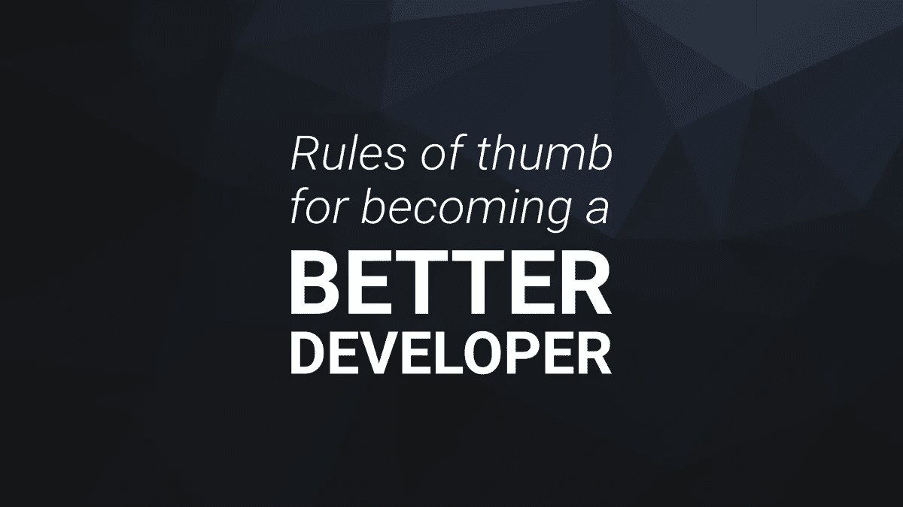

# 成为更好的开发人员的经验法则

> 原文：<https://medium.com/hackernoon/rules-of-thumb-for-becoming-a-better-developer-c5a40a1f6d57>

[Designed by Freepik](http://www.freepik.com/free-vector/modern-polygonal-background_891149.htm)

从一个全职 Android 开发人员那里学到的惨痛教训。

# 理解代码比编写代码难多了

当你第一次开始专业编码或开发时，你认为解决问题和创造解决方案将是你最困难的任务。不是的。找出你旁边的新手的[代码](https://hackernoon.com/tagged/code)在做什么，难度要高得多。快速有效地理解其他[开发人员](https://hackernoon.com/tagged/developers)的代码是一项可能需要你整个职业生涯才能掌握的技能，但这项技能会让你变得无价。如果你不需要三个月来适应一份新工作或一个新项目，你的价值就会飙升。花时间弄清楚别人的代码，并发展这种技能。

# 你是那个“不可修复”问题的罪魁祸首

错的不是平台。

错的并不是文档完整的 API。

是你。

如果你没有经验，并且在没有真正努力去理解原因的情况下就得出结论，认为某个错误或问题应该归咎于其他人，不要向更有经验的开发人员或你的导师抱怨，说它“无法修复”。闭嘴，把所有的事情都重复三遍——我是说所有的事情。你自己制造的令人尴尬的愚蠢错误的数量与你对自己没有犯任何错误的确信程度成正比。聪明的戴夫知道自己在糟糕的日子里会有多愚蠢。

# 保持一致

如果你有 10 个类做完全相同的任务，只有微小的变化，花时间创建一个有意义的格式和风格然后*坚持下去。更好的是，在整个项目中坚持下去。 **遵循惯例** *。任何开发人员都可以很容易地分辨出哪个代码是我的，因为它们的布局都是一样的。接口总是首先声明，然后是公共字段、私有字段、构造函数、公共方法、私有方法、帮助器方法，最后是内部类。这意味着每当我需要回到一个我已经两年没碰过的项目去更新一段特定的代码时，我知道该去哪里找。我不需要在所有的类方法中寻找那个该死的字段。同样的规则也适用于命名约定、文件结构等等。你会经常改变项目的背景；从懈怠到电子邮件，到编码，再到其他事情……尽可能多地去除认知努力，你会更快更有效率。**

# 编写代码时，假设该项目的下一个开发人员是一个知道你家庭住址的精神病患者

您可能认为自己很了不起，创建了一个极其复杂的定制解决方案，它具有一个构建器模式和 15 个不同的构造器，适用于任何场景，在一个文件中总共有 300 行，而不是十几个 100 行的类。你不是 T1。如果你做了那样的东西却不加任何评论，那你实际上就是一个彻头彻尾的混球。没有人会像你一样思考，也没有人知道你写这段代码时在想什么。**永远想着你之后的开发人员，尽你所能让他们的生活更轻松**，因为大多数时候，那个开发人员会是六个月后的你。

# 不惜一切代价避免共享状态

如果说我在开发 Android 应用的 4 年里学到了什么，那就是全球状态是复杂系统存在的祸根。任何时候你都可以把状态推到你系统的边缘，或者更好的是，完全摆脱它，就这么做。如果你必须通过一个应用程序流传递大约 15 个变量，这并不重要，**不要**构建一个单独的变量来保持那个状态。我去过那里，花了一个月的时间解决了 6 个类的问题，修改了一个巨大的状态桶，这个状态桶在过程中的某个地方没有被正确清除。通常，如果您的解决方案需要另一个类调用的 isSet()或 clearState()方法，请从头开始。将状态放在它所属的地方，在使用它的类内部。

# 拥抱关注点的分离

多年来，我学到的另一个重要经验是拆分代码。举个例子，我开发的第一个 Android 应用有一个巨大的模块，包含了从 UI 元素到网络请求的所有东西。他们在自己的包裹里，但仍然是一大块。现在我开始的每个项目都至少有 3 个模块；一个用于 UI，另一个用于业务逻辑，一个实体/共享模块用于整个应用程序中引用的类。您不仅获得了编译速度上的好处，而且它还迫使您考虑您的架构中的关注点的层次结构，这反过来又导致了整体上更干净的架构。

# 积累一套技巧

每当你解决一个特别烦人的问题时，请跟踪代码。发布一个要点，创建一个库，或者只是在完成后保留代码。我记不清有多少次我一头扎进以前的项目中去检索我可以重用的类或文件。如果你已经做好了轮子，就不要重新发明了，重复使用那些垃圾，把时间花在其他更有成效的地方。你脑子里或者另一个项目里的无聊代码越多，你就越能享受第一次需要解决的新问题。

# 让别人测试你的代码

我不知道它是什么，也不知道它是如何发生的，但你永远不会发现你自己软件中的所有 bug，你甚至可能不会发现其中的大部分。例如，当测试代码时，一个应用程序中的特定流程，你所做的事实会让你下意识地避开可能导致错误或崩溃的部分。尽管你可能会尝试，但你不会在几分钟内发现别人会发现的一半的错误。我曾自豪地把无数的构建送到 QA，在我自己花了几个小时测试之后，结果他们在几秒钟内就让它崩溃了。让别人来测试你的代码。向他们求情，付钱给他们，不惜一切代价。我发现的最好的解决方案是，在你测试另一个开发人员的代码时，主动提出测试他们的代码。一石二鸟有人吗？…

# 天有不测风云

在硬币的反面；接受 bug 最终会出现在产品中的事实。错误是由创造新的东西引起的，如果我们不创造新的东西，那我们到底在做什么？在一个版本发布之前，你永远无法解释所有的错误，崩溃是迟早不可避免的。你认为为什么要发明测试版测试和阶段性推广？不要纠结于一个错误是如何变得松散的，而是关注迭代周期、定期发布，并在问题出现时修复它们。

我希望这篇文章至少能发人深省，并且对那些正在寻找技巧来提高技能的开发人员来说是有用的。

欢迎随意推荐或分享，一定要留下你的想法评论。下次见，编码快乐！

> [黑客中午](http://bit.ly/Hackernoon)是黑客如何开始他们的下午。我们是 [@AMI](http://bit.ly/atAMIatAMI) 家庭的一员。我们现在[接受投稿](http://bit.ly/hackernoonsubmission)并乐意[讨论广告&赞助](mailto:partners@amipublications.com)机会。
> 
> 如果你喜欢这个故事，我们推荐你阅读我们的[最新科技故事](http://bit.ly/hackernoonlatestt)和[趋势科技故事](https://hackernoon.com/trending)。直到下一次，不要把世界的现实想当然！

