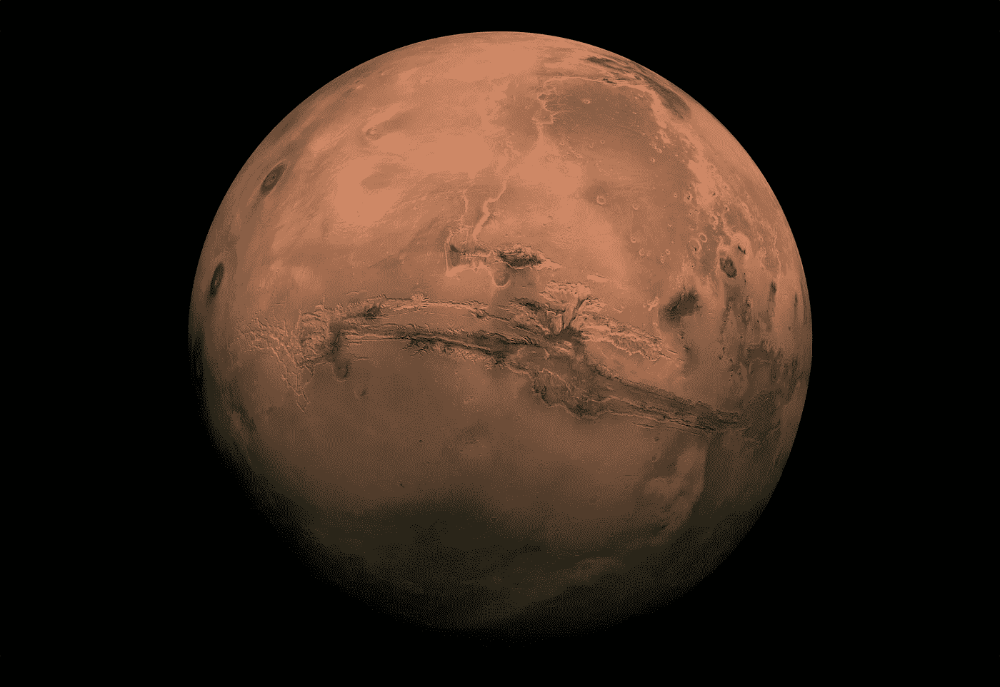

# 把比特币缩放到火星！

> 原文：<https://medium.com/hackernoon/scaling-bitcoin-to-mars-6b07f2f1272>

## 我们已经为“去月亮”努力了，那么“超越”呢？

The Red Planet, public domain image by JPL/NASA

对于比特币霸权，我最喜欢的问题是:“火星殖民者将如何把[比特币](https://hackernoon.com/tagged/bitcoin)寄回家里给家人？”这是一个伟大的思想实验，因为在火星上没有人能运行一个完整的节点，无论这个节点有多小:8-40 光分钟的往返使得地球和火星之间的交易在物理上根本不可能。你可以让特殊目的公司去工作，但是努力成为 T2 网络的真正参与者？不会吧！

我喜欢这种幻想，因为没有一些真正突破性的变化，这是完全不可能想象的。这也只是我们现在面临的问题的一个硬模式版本。任何区块链/共识系统从根本上来说都受限于你能强行通过的数据量，以及与所有相关方对话的时间。随着越来越好和越来越大，事情变得越来越昂贵，这将较小的团体和用例拒之门外。试图让每个人都同意每 10 分钟 1MB 很容易，10MB 有点难，但每 10 分钟 1TB 呢？最终，麦克斯韦定律每次都胜过摩尔定律；你永远无法超越光速。

*区块大小根本不是真正的问题*，地球/火星问题很快证明了这一点。

那你是做什么的？大自然告诉我们，唯一可扩展的数据结构是图。地球/火星问题的解决方案是拥有比特币-地球和比特币-火星，以及介于两者之间的经纪人。我们需要一些协议和工具来消除交易对手的风险(你不希望经纪人带着你辛苦赚来的 Marscoin 跑了！)，但在区块链领域，这可能只是简单的原子交换和建立在支付渠道之上的一些概念。没有什么可以阻止火星人持有地球硬币，或者地球人持有火星硬币，但是他们必须限制他们使用它的方式。

但是，你说……我们甚至没有月球殖民地，为什么还要考虑火星殖民地呢？很公平…在某种程度上。火星例子的优势在于指出了一个合理的“未来情景”，你甚至不能指望通过增加交易量来解决这个问题。解决方案不在那个层面上，我们必须更深入。

任何共识体系的核心基本问题是:谁需要达成一致？

如果坦桑尼亚的一个商人试图向他们的邻居出售一个小部件，他们需要确保世界上的每个人都同意吗？市场的建立就是为了回答这个问题——交易成本告诉你人们愿意为认证支付多少钱。如果比特币区块链的交易成本是 100 美元，这就告诉你，对某些人来说，让他们的交易获得全球认证至少值 100 美元。唯一的问题是，现在，他们没有一个有能力的替代品。他们不能在“坦桑尼亚硬币”或“他们的邻居硬币”上证明他们的交易，即使这是他们需要和想要的安全级别。

竞争会来的。

我希望人们能够围绕一个高质量的分布式交换协议走到一起。如果一枚新硬币很容易启动，其货币政策和技术选择与你的用例相匹配，并且它们很容易交易，那么问题就解决了。我们需要的是一种分层加密货币，其中的协议基于兼容但独立的区块链的思想。我们希望在非常接近网络本身的地方对交换进行编码。“互联网货币”需要更多来自互联网的灵感——我们需要货币的 TCP/IP。基本上，我们需要一个对等原子交换协商层。

当前的区块链技术很酷，但这不是全部。它相当于一台大型主机，对一个小社区来说很棒，但还不能应对整个世界。我们需要能够把事情分成邻里级、城市级、国家级和星球级的区块链，用简单易懂的方法在它们之间进行交换。在行星级的区块链上直接交易不会便宜…如果你不愿意支付行星级的交易费用，你的交易可能不属于行星级的区块链！

放在“地球规模的加密货币”的背景下，当前比特币链条上的人为高收费情况，如果不是那么白痴的话，一定会很搞笑。比特币有望成为全球规模的区块链，但想象一下 10 年后全球规模的区块链……区块会有多大？我的猜测是“大于 1MB”。也就是说，这几乎无关紧要，因为没有一个块大小可以容纳所有用户和所有用例。我们需要一个系统，它可以分形地扩展，而不是线性地扩展。

“fractalcoin”这个名字有人取吗？