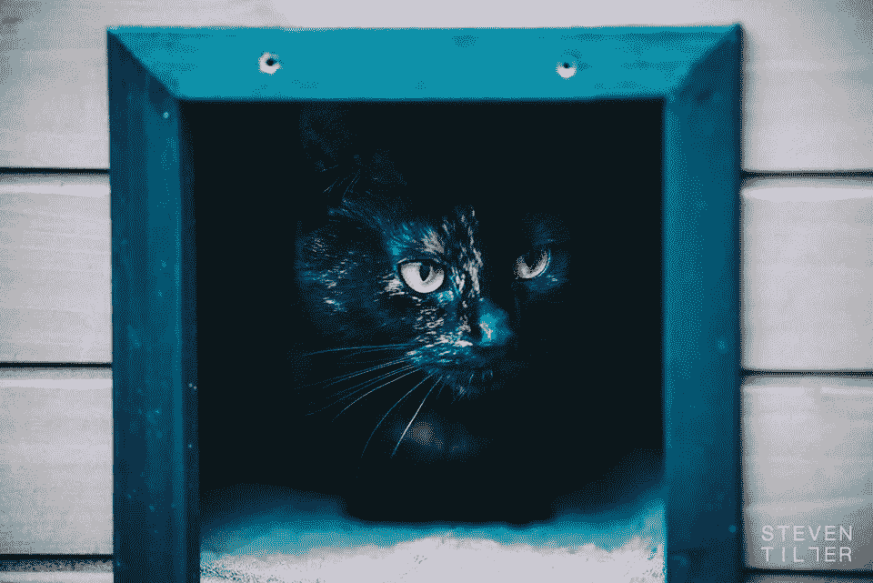

# 薛定谔的猫:我们如何掩盖组织中人们的潜力

> 原文：<https://medium.com/hackernoon/schrodingers-cat-how-we-are-obscuring-people-s-potential-in-organisations-794c4d5309f3>

Photo credit: [Steven Tiller](https://www.facebook.com/tillersteven/)

## 来自量子理论的领导力课程

听说过[薛定谔的猫](https://en.wikipedia.org/wiki/Schr%C3%B6dinger's_cat)吗？这是一个思想实验，假设如果一只猫在盒子里，它可以同时是死的和活的，因为我们不知道，除非我们能看到它。换句话说，它的状态受我们能否观察到它的影响。或者如果你喜欢更有趣的定义，下面是 HBO 电视剧《硅谷》中可爱的极客们对它的解释(为质量差道歉):

## 薛定谔的猫和组织有什么关系？

我目前正在读玛格丽特·惠特利的[“领导力和新科学”](http://margaretwheatley.com/books-products/books/leadership-new-science/)，这本书将量子科学的一些思想应用于组织和领导力。今天早上，当我在多雪的斯德哥尔摩通勤途中阅读时，我读到了以下内容:

> “我意识到，在我参加过的所有组织中，我都生活在一个薛定谔的猫的世界里。这些组织中的每一个都有无数的盒子，绘制在 endess 的组织结构图中。在每个盒子里都躺着“一只猫”，一个富有潜力的人，他的命运总是不可逆转地由观察行为决定。

如果一个经理被告知某人表现优异，他们会区别对待他们，就像 1964 年罗伯特·罗森塔尔实验中的老师一样，他随机挑选了几个孩子，告诉老师们测试显示他们有很高的潜力。罗森塔尔对这些班级进行了两年多的跟踪调查，老师认为特别有天赋的学生比他们的同龄人进步更大，因为老师给了他们更多的时间来回答问题，更多的反馈和更多的鼓励。

回到组织。如果你被认为表现不佳怎么办？惠特利在她的书中写道，那些被经理或同事视为“死亡”的员工“此后被锁定在无法展示任何新潜力的工作岗位上。”实际上，他们被组织判了无期徒刑，永远无法发挥他们的真正潜力。

除了管理者被告知或被引导去思考的，他们如何看待员工是由他们的世界观预先决定的。可悲的是，今天的大多数经理都是根据我们从工业时代继承下来的过时的思维方式招聘和晋升的。正如富于远见的 FAVI 前首席执行官江泽龙·佐布里斯特所说，大多数经理习惯于将员工视为愚蠢、无能的孩子，必须加以控制和激励。但当然，这样对待员工意味着我们永远无法释放他们的全部潜力，组织将会停滞不前并最终消亡。

## 那么解药是什么？

根据我的经验，我们可以在组织中做一些事情来避免产生薛定谔的猫的问题:

1.  使用替代工具来解放人们的潜力——我相信大多数管理者都没有意识到他们组织中的人有多聪明。有时是因为他们没有合适的工具，或者没有给人们合适的机会来看到它。我推荐[解放结构](http://www.liberatingstructures.com/)，它汇集了 33 种促进会议和对话的替代方式，通过为平等参与和有目的的合作创造合适的条件，挖掘人们的集体创造力和智慧。
2.  **创造一种心理安全和学习的文化** —研究表明高绩效团队拥有这种文化，但是为了培养这种文化，信任必须培养而不是假设。阅读 Amy Edmondson 的精彩著作[“团队合作”](https://www.amazon.co.uk/Teaming-Organizations-Innovate-Compete-Knowledge/dp/078797093X)，了解如何做到这一点的更多信息。
3.  **预设人天生有上进心，想提高** —大多数人都想做好，想变得更好。当然，有些人不知道，你可以和他们谈论这个，但总的来说，我们人类是有能力的生物。我们经营我们的整个生活，不需要有人来控制或激励我们！

正如即兴表演的创始人之一德尔·克洛斯所说:

> “如果我们像对待天才、诗人和艺术家一样对待彼此，我们在舞台上就更有可能成为他们。”

> [黑客中午](http://bit.ly/Hackernoon)是黑客如何开始他们的下午。我们是阿妹家庭的一员。我们现在[接受投稿](http://bit.ly/hackernoonsubmission)并乐意[讨论广告&赞助](mailto:partners@amipublications.com)机会。
> 
> 如果你喜欢这个故事，我们推荐你阅读我们的[最新科技故事](http://bit.ly/hackernoonlatestt)和[趋势科技故事](https://hackernoon.com/trending)。直到下一次，不要把世界的现实想当然！

