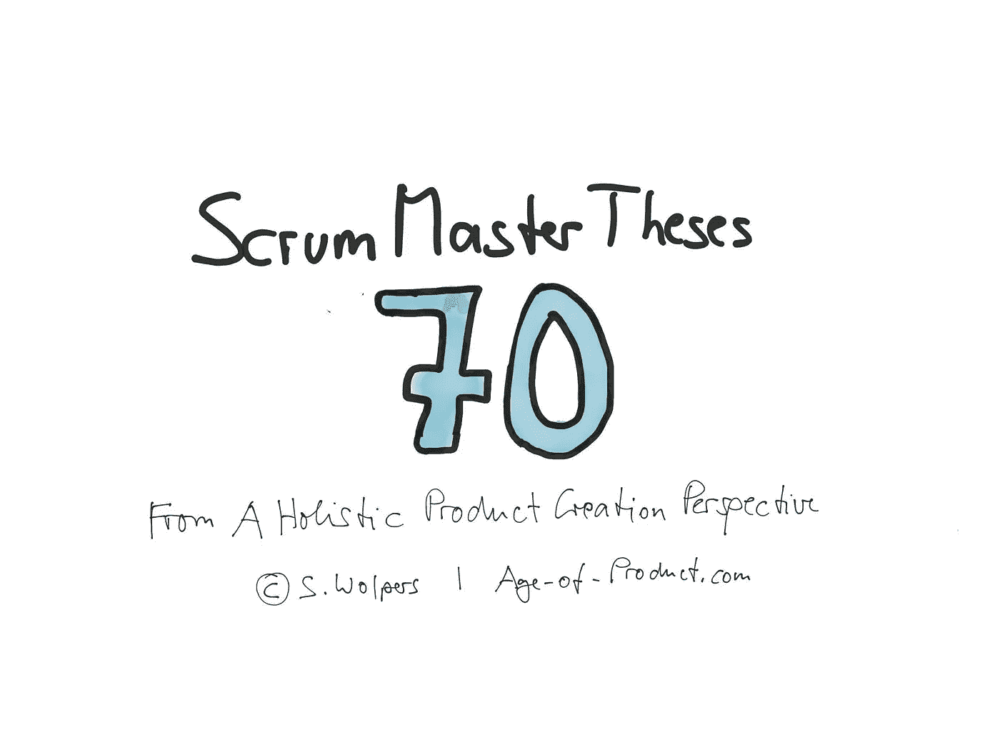

# 70 篇 Scrum 硕士论文

> 原文：<https://medium.com/hackernoon/scrum-master-theses-ff208191270d>

# TL；博士:Scrum 硕士论文

以下 70 篇 scrum 大师论文从整体产品创造的角度描述了 scrum 大师的角色。

scrum 硕士论文以动手实践的方式涵盖了从产品发现到产品交付的 scrum 大师的角色。一方面，他们处理典型的 scrum 仪式，例如冲刺计划、冲刺评审和回顾。另一方面，scrum 硕士论文也涵盖了，例如，与产品所有者的关系，他们处理敏捷度量，以及如何开始敏捷过渡，从而超越了最初的 scrum 指南。

# 详细的 Scrum 硕士论文

## Scrum 大师的角色

第一套 scrum 硕士论文阐述了她在 scrum 过程中的角色:

*   Scrum 不是一种方法论，而是一个框架。没有适用于每一个场景的规则，只有以前在其他组织中有效的实践。
*   其他组织的成功做法不能简单地照搬到你自己的组织中。每种实践都需要一个特定的环境来工作。
*   你需要自己决定什么对你的组织有效——这是一个过程，而不是目的地。
*   scrum 大师的角色主要是领导和指导。它不是一个管理角色。
*   一个 scrum 大师应该认识到 scrum 团队发展的不同阶段需要不同的方法:一些，教学；有的，教练；还有一些，指导。
*   一个 scrum 大师应该熟悉学习新技术的概念。
*   一个 scrum 大师的主要目标应该是通过让 scrum 团队能够自我组织和自我管理，让他们脱离日常运作。
*   作为一个 scrum 大师不需要，也不应该需要强制执行流程。
*   Scrum 不是为会计师设计的，尽管一些度量标准有助于理解 scrum 团队的健康状况。通常，坚持团队实现特定的 KPI(例如，承诺与速度)没有帮助。
*   Scrum 没有详细说明产品负责人将有价值的、可用的、可行的用户故事添加到产品 backlog 中的过程。使用设计思维、精益创业或精益 UX 方法论的产品发现可能会有所帮助，但无论如何，一个好的 scrum 大师会希望 scrum 团队成为这个过程的一部分(无论是参与用户访谈还是运行实验)。
*   scrum 团队与利益相关者的交流不应该通过看门人(例如，仅仅通过产品负责人)进行，因为这会损害透明度，并对团队的表现产生负面影响。相反，Sprint 回顾是与涉众保持密切联系的好方法，并且展示团队在之前的 sprint 中交付的价值。

## 产品积压细化和评估

第二组 scrum 硕士论文聚焦于产品 backlog 精化的重要性:

*   评估和待办事项细化是每个 scrum 团队的基本任务。尽管产品负责人——至少是正式的——负责保持产品 backlog 处于“峰值交付”,但是他们需要整个 scrum 团队的协助来完成这项工作。
*   一个跨职能的、同处一地的 scrum 团队独立于其他团队工作是一个理想的场景。现实是大多数 scrum 团队经常依赖于其他团队的交付(例如，API 端点)和 UX 或 UI 部门的交付。
*   良好的 scrum 团队绩效有两个基本要素:
    *a)作为一个团队编写用户故事*:当应该构建某个东西时，产品负责人首先解释为什么，并提供必要的背景(即市场情报、实验结果、用户访谈、统计数据)。因此，编写用户故事是整个 scrum 团队相应的协作努力。这个过程应该创建一个对将要构建什么和为什么要构建的共同理解(产品负责人提供“为什么”，scrum 团队详细描述“如何”，两者都定义“什么”)，以及团队成员之间共享的所有权感。
    *b)分享“就绪的定义”*:为了确保开发过程中起草良好的用户故事流，scrum 团队和产品负责人应该考虑就这些用户故事的就绪定义达成一致。这个定义是关于用户故事需要提供什么才能被认为是准备好评估的协议。如果一个定义的需求没有被满足，用户故事就没有准备好进行评估。一个没有预先评估的用户故事是一个未知的实体，因此，不准备成为 sprint backlog 的一部分，因为 scrum 团队不能在 sprint 中承诺一个未知的实体。因此，scrum 团队必须学会说“不”。(但是，注意不要把“准备好”的定义当作一种关卡过程。这构成了一种反模式。)
*   一个完善的产品 backlog 可能有两到三个 sprints 的详细用户故事，并且可能不到一半的用户故事符合 scrum 团队对 ready 的定义。也可能有除了产品负责人之外没有人在做的额外的用户故事。

# 下载 Scrum 反模式指南

这本电子书涵盖了 150 多种 Scrum 反模式，可以在这里免费获得**。 [*现在就下载****《Scrum 反模式指南》*** *！*](https://age-of-product.com/scrum-anti-patterns/)**

下载内容以 PDF 格式发送到您的电子邮件地址。请注意，如果您还没有订阅的话，下载此内容还会为您订阅我们广受欢迎的专业策划的每周“敏捷思维的食粮”时事通讯。(当然，您可以随时取消订阅。)

[我们尊重您的隐私](https://age-of-product.com/privacy/)

## 冲刺规划

第三套 scrum 硕士论文涵盖了冲刺规划:

*   过去，产品负责人会在 sprint 规划期间向 scrum 团队解释产品 backlog 中的高价值用户故事。然后，团队会将这些转化为更详细的用户故事，并评估后续的故事。然而，现在敏捷实践者中有一个共识，即在 sprint 规划之前，在单独的 backlog 精化和评估会议中处理这些高级用户故事可以提高故事的质量，从而提高团队工作的成果。
*   Sprint planning 应该让 scrum 团队成员对 sprint backlog 中的项目做出有效的承诺，从而在他们之间创造一种主人翁感。然而，这只有在 scrum 团队对他们收到的用户故事质量的不确定性被消除的情况下才会发生。为了将 scrum 团队从这种不确定性中解放出来，一个 scrum master 应该支持产品所有者运行每周的产品 backlog 精化和评估会议，只允许那些符合团队就绪标准定义的用户故事进入 sprint 计划。
*   冲刺计划通常应该分为两个部分:
    *a)冲刺计划 I* :在冲刺计划的第一部分，产品负责人向 scrum 团队展示产品负责人从产品待办事项中选择的最有价值的用户故事，作为一个排序列表。然后，团队从列表的顶部向下选择那些它可以承诺在 sprint 结束时交付的故事——考虑他们当前的约束，包括，例如，可用的容量，或者需要在同一个 sprint 期间处理的必要的技术任务，比如重构。b) Sprint planning II :在 Sprint planning 的第二部分，scrum 团队向 sprint backlog 中的用户故事添加细节(例如，将故事分解成任务，确定需要进一步澄清的故事部分，并就谁将从事什么任务达成一致)。产品负责人不一定需要参与 sprint 计划的第二部分，但是需要回答团队可能提出的问题。
*   如果用户故事准备处理得很好，整个 sprint 计划会议可能会在不到两三个小时内完成。
*   富有成效的冲刺计划会议需要一个健康的 scrum 团队。功能失调的团队无法达到所需的合作水平。一个团队功能失调的冲刺计划只会导致徒劳和痛苦的练习。
*   一个 scrum 团队通常应该避免将超过 80%的能力分配给新任务——包括用户故事、技术任务、bug 和可能的峰值。流动理论表明，90%或更高的可用能力分配不会导致团队达到最佳绩效。
*   bug、重构和技术研究需要定期关注，以避免积累技术债务。一个有效的 scrum 团队会将至少 25%的能力分配给这些任务。
*   不完整和准备不充分的用户故事会严重影响 scrum 团队的效率。这些故事永远不应该被选入 sprint backlog，而是在产品 backlog 精化和评估会议中被挑选出来。

***请点击【鼓掌手】*** 👏 ***，如果你觉得这篇帖子有用，那对我来说意义重大！***

## 单口站立

scrum 硕士论文的第四部分是关于站立的:

*   站立会议是非常适合讨论当前 sprint 进展的会议:一切都按计划进行，还是 scrum 团队需要调整？
*   站立会议是 scrum 团队与项目或产品的利益相关者会面和交流的便利时机。
*   站立不能解决的问题包括:一个功能失调的组织，一个功能失调的 scrum 团队，一个不充分的产品积压，一个出错的 sprint 计划会议，低质量的用户故事，或者一个缺失的产品愿景。
*   如果 scrum 团队已经合作得很好，并且基础工作——比如产品待办事项列表和冲刺计划——都井然有序，那么站立是很有价值的。
*   一个 scrum 团队越有经验，内部沟通越好，起立就越像是一个耗时的仪式，没有什么价值。
*   一个高级的 scrum 团队可能会考虑虚拟会议，而不是真正的会议，比如使用 Slack 频道。
*   两个人的 scrum 团队不一定需要正式的站立——喝咖啡会是一个实际的选择。
*   scrum 团队的成员在每次起立前都不交流障碍，这是有问题的。可能他们的行为更像是一群在同一时间同一地点追求相似目标的人，而不是一个 scrum 团队。
*   站立会议不是为了产品所有者或参与的利益相关者的利益而报告会议。
*   离线板是有价值的:物理地拿一张卡并移动它会灌输一种用户故事的所有权感。(这和销售人员希望你在购买前触摸商品的心理模型是一样的。)如果你必须放弃线上或线下的董事会，并且你是一个共置的团队，考虑放弃线上董事会。

## 回顾展

scrum 硕士论文的第五部分涉及回顾:

*   回顾应该鼓励自我表达，从而使 scrum 团队更容易发现其成员可能怀有的担忧和沮丧，以便制定策略来克服它们。
*   只有当团队认为这些会议是提供诚实和建设性反馈的安全场所时，回顾才能提高团队的协作和绩效。
*   指责游戏是没有帮助的。在回顾过程中，scrum 团队的成员应该专注于如何改善现状——避免互相指责。
*   一些 scrum 团队总是在他们的回顾中包括产品负责人，而其他团队坚持产品负责人应该被明确邀请。
*   最好不要在团队的工作场所召开回顾会。距离让团队成员更容易反思冲刺。定期改变会议地点也很有帮助。在一个新的地方有助于防止无聊(和团队成员“退房”)。
*   scrum 团队回顾的形式应该定期改变。同一格式不应运行两次以上。
*   智能手机、平板电脑和笔记本电脑不应该出现在回顾会上，这样 scrum 团队的成员就不会分心，可以专注于会议。
*   所有的问题、顾虑和挫折都应该记录下来——即使只是暂时使用便利贴。尽管保留一份正式文件或档案总是更好。
*   根据 Diana Larsen 和 Esther Derby 在他们的书《敏捷回顾:让优秀的团队变得伟大》中所说，进行回顾有五个阶段:
    a)准备阶段，
    b)收集数据，
    c)产生洞察力，
    d)决定做什么，
    e)结束回顾。
*   回顾应该为行动项目(要完成的任务)设定 [SMART 目标:
    a)行动项目应该是具体的和可衡量的(“更经常地做 X”不符合那个标准)，
    b)scrum 团队的一个成员应该对每个行动项目负责，
    c)每个行动项目应该包括一个何时可以预期结果的估计，
    d)行动项目应该放在一块板上，以使跟踪进度可视化和更加突出，](https://en.wikipedia.org/wiki/SMART_criteria)
*   每一次新的回顾都应该从回顾在前一次回顾中决定的行动项目的状态开始。

## 敏捷指标

第六组 scrum 硕士论文阐述了敏捷指标:

*   一般来说，度量的目的是更好地理解当前的情况，并洞察它可能如何随着时间的推移而变化。
*   度量是模式的领先指标，提供了分析变化原因的机会——并在适当的时候采取适当的行动。
*   敏捷环境中的度量标准不是用来管理个人(尤其是创造性工作者)的，当然也不是微观管理，这与传统的命令-控制管理结构相反。
*   敏捷组织中的度量标准应该被用来为 scrum 团队——敏捷实践者——提供关于如何持续改进的见解，帮助他们实现目标:
    a)正如 Daniel Pink 所解释的，敏捷实践者努力争取[自主权、掌控权和目标](https://www.youtube.com/watch?v=wdzHgN7_Hs8)。
    b)敏捷实践者通过应用目标和关键结果(OKR)等方法，用度量来解决个人发展问题。
*   有经验的敏捷实践者意识到，自治和责任对于自组织的 scrum 团队同样重要。没有度量标准，自主性和责任性都会受到限制。
*   最适合敏捷的度量反映了团队在变得敏捷方面的进展，或者组织在变得学习型组织方面的进展。
*   定性和定量的度量都被使用:
    a)当应用于 scrum 团队时，定性度量通常比定量度量揭示更多的东西。
    b)当应用于组织时，定量指标比定性指标提供更多的洞察力。
*   任何用于敏捷的度量标准都必须适合组织。
*   scrum 大师应该跟踪的度量标准仅仅是那些适用于 scrum 团队的。应该忽略衡量个人的指标。
*   应该始终记录指标的上下文，以避免误解。
*   容易遵循的参数不应该仅仅因为这个原因而被测量——特别是如果一个报告在正在使用的项目管理软件中是容易得到的。

## 如何开始向 Scrum 过渡

第七套 scrum 硕士论文涵盖了敏捷过渡:

*   没有现成的清单或主计划，或者说没有现成的清单或主计划，来确保向敏捷实践(如 scrum)的成功过渡。这也适用于 SAFe、LeSS、Nexus、DAD、XSCALE 或所谓的“Spotify 方法论”。
*   其他组织在过渡到 scrum 的过程中的“最佳实践”和“经验教训”可能会指明过渡时的方向，尽管他们过渡的背景可能没有可比性:适用于 Spotify 的可能不适用于通用汽车。
*   每个过渡都应该从理解“为什么”开始:为什么组织应该变得敏捷？
*   管理层通常给出的过渡到 scrum 和其他敏捷实践的原因包括:
    a)使组织更有效率；b)帮助组织更快地交付产品；以及
    c)提高交付日期的可预测性。
*   过渡到 scrum 和其他敏捷实践的公认好处是:
    a)通过创建一个学习型组织来超越竞争对手；b)通过提供自主、掌控和目标的空间，创造良好的工作场所文化；以及
    c)掌握持续的产品发现和交付(从而将风险降至最低)。
*   在开始过渡之前，需要向组织推销敏捷实践的好处——敏捷并不是每个人的宠儿，成功的过渡将会影响个人议程。
*   过渡会遇到与组织规模成正比的惰性和变革阻力。
*   如何进行敏捷过渡取决于许多因素，包括组织的行业、法规和遵从性规则、组织的规模和年龄、工作场所文化、组织的产品和服务的成熟度、团队规模和数量，以及当前的项目管理实践。
*   如何进行过渡应由组织的目标决定，即希望实现的目标。
*   成功的敏捷转变需要高层管理人员的支持；自下而上的方法是徒劳的。
*   过渡到 scrum 的第一步是创建第一个 scrum 团队。
*   过渡到敏捷实践需要在敏捷实践和原则方面培训和教育组织的大多数成员——不仅仅是未来的 scrum 团队成员。培训和教育对于成功转型至关重要。**阅读更多** : [绝对初学者的原型制作](https://age-of-product.com/app-prototyping-with-absolute-beginners-agile-experiments/)
*   “做敏捷”和“成为敏捷”之间有着巨大的区别。成功过渡意味着变得敏捷。
*   在一个过渡到 scrum 的组织中，未来的 scrum 大师应该是变革的代理人，而不是操练军士——这是设计出来的，因为他们缺乏适当的权威。
*   为产品和工程部门创建一个“快乐的敏捷岛”是一个有效的目标。然而，与打破职能筒仓和创建一个学习型组织相比，它可能会带来较少的投资回报。

# Scrum 硕士论文——结论

要成为一名成功的 scrum 大师，你需要对产品创造过程有一个整体的理解。你还需要成为一名兼职敏捷教练，处理组织障碍和约束，同时培训组织的其他成员，寻找可能加入你的课程的潜在变革推动者。你需要推销“敏捷”你需要赢得组织内部的人心，以克服变革的内在阻力。因此，组织 scrum 仪式只是 scrum 大师工作的一小部分。

哪些相关的 scrum 硕士论文没有更好地描述角色？请在评论中与我分享。

# Scrum 硕士论文-相关帖子

[Scrum Master 薪酬报告 2017](https://age-of-product.com/scrum-master-salary-report-2017/)

[免费下载“Scrum 反模式指南”](https://age-of-product.com/scrum-anti-patterns/)

***请点击【拍手】*** 👏 ***，如果你觉得这篇文章有用——它对我来说意义重大！***

***要不要这样多读读？*嗯:**

*   📰 ***加入 11512 位同行和*** [***报名参加本周刊快讯***](https://age-of-product.com/subscribe/?ref=Food4ThoughtMedium)
*   🐦 ***关注我上*** [***推特***](https://twitter.com/stefanw) ***并订阅我的博客*** [***产品时代***](https://age-of-product.com)
*   💬 ***或者，免费加入*** [***Slack 团队【动手敏捷】***](https://goo.gl/forms/XIsABn0fLn9O0hqg2)***…***