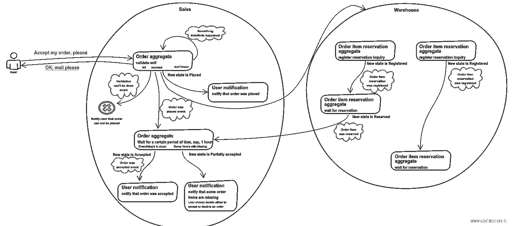
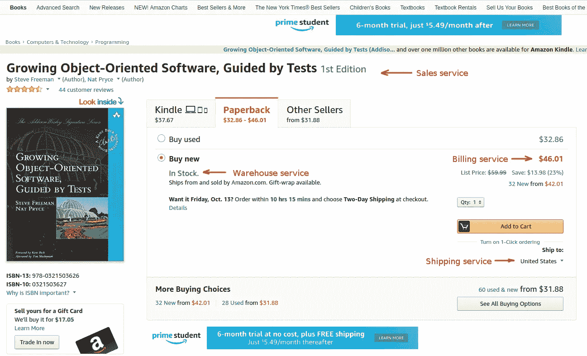

# 电子商务中的服务边界识别示例

> 原文：<https://medium.com/hackernoon/service-boundaries-identification-example-in-e-commerce-a2c01a1b8ee9>

## 服务边界识别的第二个示例(在此检查第一个的

softwareengineering.stackexchange.com 的[只有](https://softwareengineering.stackexchange.com)[两个与当前话题密切相关的](https://softwareengineering.stackexchange.com/questions/316819/how-to-clearly-define-boundaries-of-a-bounded-context) [题](https://softwareengineering.stackexchange.com/questions/328320/how-to-properly-define-boundaries-of-bounded-contexts)，我真的被逗乐了。更荒谬的是，尽管这一主题具有如此重要的战略意义，但他们的投票和观点数量却低得惊人。驻留在系统服务中的代码可能是完美的，但是如果[服务边界没有被正确识别](/@wrong.about/wrong-ways-of-defining-service-boundaries-d9e313007bcc)也没关系，因为没有[业务-IT 一致性](/@wrong.about/why-you-should-split-the-monolith-e946f57db38c)，这是 DDD 和 SOA 都在努力的。这意味着不可避免的项目失败。

## 在深入研究之前

简而言之，找到正确的比喻。这也是我在将领域分解成权利对象时遵循的建议。在这两个领域都很适合我的比喻是人类的比喻。一个人，他拥有一些知识，他能提供一些服务，他有一个封装障碍。毕竟，在对象和[业务-服务](/@wrong.about/how-to-define-service-boundaries-251c4fc0f205)之间没有太大的区别，因此可以应用于识别服务边界的方法对对象很有效，反之亦然。还记得 [CRC 卡](http://www.extremeprogramming.org/rules/crccards.html)吗？“职责”部分难道不像你的业务-能力映射吗？如果是的话，你就猜对了。这两种技术都从行为、对象思维的角度来分解你的系统。

即使你的生意是全新的，一百年前从未存在过也不可能存在的，假装它可以。想象出它可能的样子。当识别服务边界时，网络和计算机的存在经常混淆和误导，隐藏真正的数据所有者、服务责任及其边界。

## 在过去美好的日子里，商业是什么样子的

如今的电子商务不像我们习惯的典型超市。它更像是我祖父母去购物的传统商店。看起来是这样的。你走进一家商店，看到柜台后面有一个卖家。你在商店橱窗里看到一件商品，在一个卖主的前面或后面。它看起来是这样的:

A shop-window inside a shop

所以，这里要注意的第一件事是，如果某样东西出现在橱窗里，并不意味着你可以买它。特定产品的库存可能已经用完了，商店无法从橱窗里卖给你一件商品，因为天知道它在那里放了多久。50 年前的人们很清楚最终一致性的概念。或者如果一个孩子想要一瓶酒，他自然会被拒绝。因此，卖方的责任是确认并接受订单。结果，一个卖家给了你一张账单，上面有产品类型和数量。例如，它可能看起来像“三文鱼— 500 克，一条面包— 2 块。”。你去了收银台。收银员知道价格，他或她是价格真相的唯一来源。收银员看起来如下:

A cashier, accepting a payment for an order

由于她的工作单位，她给了你一张支票，确认你确实支付了你的订单。

然后你回到卖家那里，他或她确保你支付了订单，给你买的东西，然后你就可以走了。

## 电子商务现在是什么样子

上面的例子非常直接地映射到电子商务。让我们简单地看看这个过程在任何一个电子商店，比如说亚马逊，可能是什么样子。
和往常一样，让我们将[更高级别的服务](/@wrong.about/how-to-define-service-boundaries-251c4fc0f205)视为交付业务价值的一系列步骤。

商品展示在网站上，以便购买和交付。然后顾客想要购买一些物品。他选择送货选项，并选择一张银行卡进行收费。之后，系统接受他的请求并执行一些内部验证。如果一切正常，就意味着有人下了订单。然后仓库可以开始检查是否每个订单项目都存在。最后，可以向顾客收费。所以，基本上，有四种主要的服务:

Primary business-services in e-commerce

***销售*** 销售服务接受订单。在执行一些内部验证之后，比如，这个订单是否已经下了，或者当前客户是否可以订购某些产品，订单变成*已下*。如果我可以这么说的话，这是一个商业事件。目前，如何在代码中实现并不重要。现在它可以是一个电话，一封电子邮件或者仅仅是一次对话。

***仓库*** 对上述事件感兴趣的是服务，*订单*。一旦仓库接受该事件，就会检查该产品类型的库存水平。让我们想象一下，销售服务对订单中的每一项都感兴趣，如果某个产品很长时间没有出现，客户会被告知“很抱歉，您想要购买的产品没有出现”。该逻辑导致仓库发布的 *OrderItemReserved* 事件。再说一次，现在我不会从技术的角度考虑事情。这是一个商业事件，反映了领域规则。

销售和仓库逻辑可能更加敏捷。例如，某个订单项目可能在仓库中没有，它决定等到它出现在库存中。但销售不能永远等待，它对客户有一些义务，所以它可以对等待仓库保留订单项目的时间有一个限制。说到实现，这会导致长篇大论。它可以用一个*订单*集合来实现。仓库将开始它自己的传奇——每个订单项目一个。这个逻辑当然会反映领域需求，可以表示如下:

Sales and Warehouse sagas

如果客户接受了部分接受的订单，仓库对缺少的订单项目的保留 sagas 将被取消。那么您可能会认为可能会出现竞争情况:就在向客户发送了*order was partial accepted*通知之后，可能会出现一个丢失的订单项目。嗯，这种情况可能发生在任何没有计算机和网络的行业。这是一个必须从业务角度考虑的场景，就像所有其他场景一样。大多数时候，[没有](http://udidahan.com/2010/08/31/race-conditions-dont-exist/)这样的[竞态](https://ayende.com/blog/3827/rhino-dht-concurrency-handling-example-the-phone-billing-system)。

***开票和发货*** 当订单被接受时，开票流程开始。这个过程可以有多种变化，有自己的传说和事件。在[第一个示例](/@wrong.about/example-of-service-boundaries-identification-e9077c513560)中对此进行了更详细的考虑。包括运输服务的流程可能是这样的:

Billing and Shipping services

## 关于数据所有权的事情

在服务被识别之后，我们可以考虑哪些数据属于哪些服务。

产品信息除了它的价格属于销售。这是卖家所操作的，使用人类的比喻和本文开头的例子。我谨记，我的商业服务包括人与人之间以及与客户之间的交流，他们也大量使用产品信息。除此之外，销售服务需要进行一些包括客户在内的验证，所以它的数据很可能也放在那里。例如，如果验证包括年龄检查，那么它肯定应该驻留在那里。

仓库不需要产品描述或价格，它感兴趣的是允许的存储条件和跟踪库存。因此，仓库[有界环境](/@wrong.about/ddd-strategic-patterns-how-to-define-bounded-contexts-2dc70927976e)中的*产品*的概念将与销售环境中的概念完全不同。

支付所需的所有数据，如保存的客户卡、产品价格、货币路线等，都应该保存在使用它们的地方——记账服务中。同样，计费服务中的*客户*实体将围绕计费行为，这与销售服务中的需求有很大不同。

显然，客户运输细节应该归运输服务所有。

## 无处不在的产品目录服务在哪里？

嗯，没有这种服务。顾名思义，它可能是产品展示所需要的。但是“产品展示”对某些服务来说是微不足道的。这里没有逻辑，没有行为。[后端换前端](http://samnewman.io/patterns/architectural/bff/)对于这类事情来说是比较合适的选择。这可能是这样的:

Composite view, comprised of data from various services

我应该再次警告你伪 CQRS——服务之间的数据重复。数据复制之后是功能复制，然后是公共库或共享服务。而这就是[服务自治](/@wrong.about/what-characteristics-my-services-should-possess-ca22294bbea6)的终结。因此，如果产品价格出现在产品名称后的下一行，并不意味着它们必须属于同一服务。

一般来说，UI 在识别数据所有权和服务边界方面是一个糟糕的助手。数据只有在涉及到某些业务逻辑时才重要，而不是仅仅显示出来。