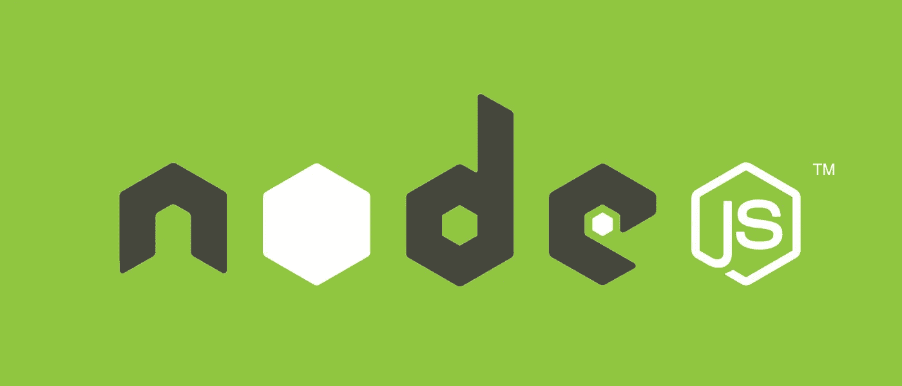

# 设置 Nodemon 以自动重启 Nodejs 应用程序服务器

> 原文：<https://medium.com/hackernoon/setup-nodemon-to-auto-restart-nodejs-application-server-8d8993b7dfd9>

手动重启 Node.js 应用程序是一项既累又繁琐的工作。Nodemon 是在开发模式下自动重启 nodejs 应用服务器的最佳解决方案。

# 第一步

组织源目录`src`，并使用`app.js`或`index.js`或`server.js`或任何其他用于引导 Node.js 服务器的约定对其进行初始化。

通过添加一个`start`脚本来相应地更新`package.json`文件。

# 第二步

添加`express`或任何其他框架作为依赖来引导一个最小的服务器。

最小服务器的代码:

在第一个终端窗口中启动服务器:

在第二个终端窗口中，请求 url 以测试 api 是否工作，并查看响应消息:

现在，如果我更改响应消息，我必须重新启动服务器才能获得想要的结果:

使用`Ctrl + C`停止当前正在运行的服务器，并使用之前相同的命令重新启动:`npm run start`。

在终端窗口中再次使用 curl 命令，我们得到了想要的结果:

这整个过程是重复的，会减慢你开发任何包或应用程序的速度。更好的解决方案是使用`nodemon`。

# 第三步

将 nodemon 添加为`devDependency`:

# 第四步

在`package.json`文件中的 npm 脚本下创建另一个脚本`dev`:

现在运行`$ npm run dev`并使用 curl 命令请求，我们将看到最后一个熟悉的结果:

如果我将`index.js`文件中的响应消息改回`Hello World`，这一次我不需要重启服务器，因为`nodemon`正在通过其`--watch`参数监视 src 目录中的变化。如果我再次使用 curl 命令，结果是熟悉的更新

可以通过观察 nodemon 运行的终端窗口中的日志消息进行验证:

要停止 nodemon 进程，请使用`Ctrl + C`。

全文来源于 [**本**](https://github.com/amandeepmittal/nodemon-auto-restart) **Github 资源库**。

# 如果你觉得这篇文章有用，请鼓掌👏。

# 谢谢大家！