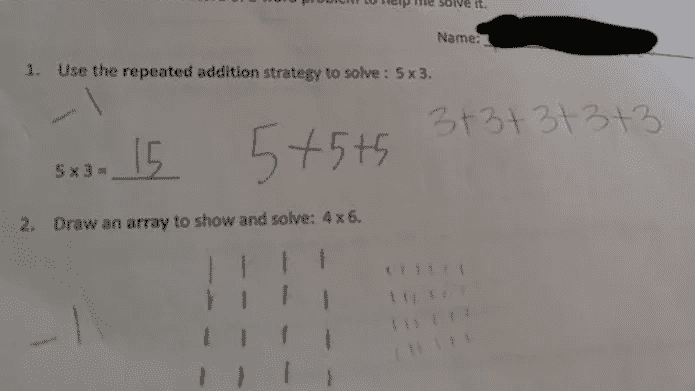
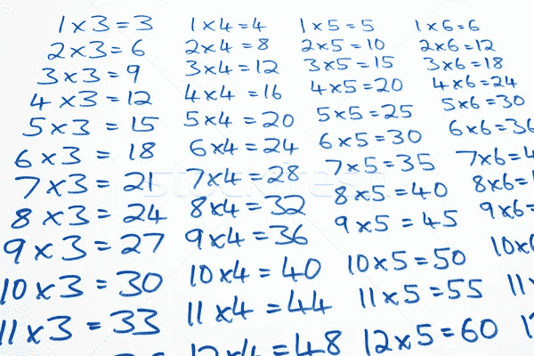
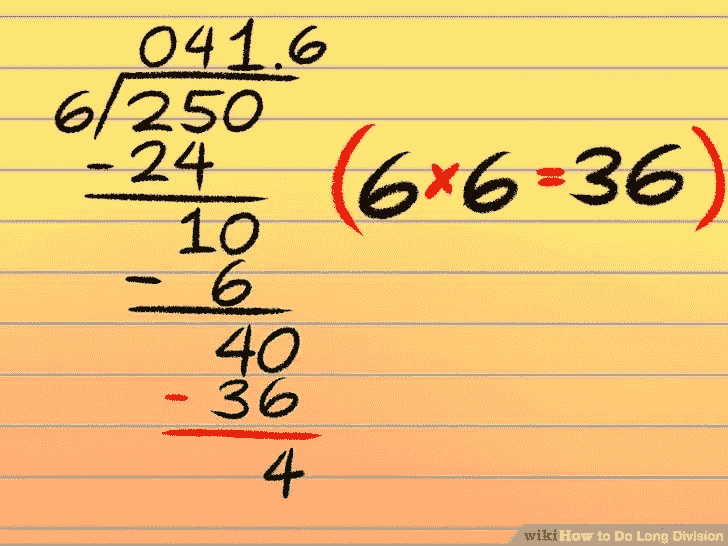

# 非数学家对数学的评价

> 原文：<https://medium.com/hackernoon/shit-non-mathematicians-say-about-maths-e80d7a3b6805>

## 一位数学家大声疾呼

似乎每个人都对数学教育有自己的看法。

还记得当一个学生因为说 5x3 = 5 + 5 + 5 而被判错误时的愤怒吗？

围绕“重复加法策略”的定义引发了一场激烈的争论。双方的家长、教育工作者和 Reddit 社区的大部分人都迫不及待地想要证明他们的观点。[我也在其中](/@fjmubeen/sorry-brett-but-it-seems-you-have-been-caught-up-in-a-web-of-terminology-9b1cbd59b1ea#.c512s4jvt)(剧透警告:这个学生是完全正当的，因为“策略”是对共同核心州标准的任意强加)。

Seriously?

这些时刻让我这个数学家感到非常绝望。令人沮丧的是，观察到那些极有影响力的人，他们决定如何向数百万学生教授数学，却犯了如此令人绝望的错误。数学家本身很少出现在这些高风险的讨论中，尽管他们最适合评论数学思维的本质。

下面是一位数学家对数学教育中一些最普遍但错误的观点的看法。

1.  ***事实先于数学理解***

这种说法的论据是这样的:

尝试解决 7x56…

…您可能会遵循以下思路:

7x50 = 350，

7x6 = 42，

所以答案是 350+42=392。

为了快速得到答案，在最后一步合并它们之前，你必须将中间输出——350 和 42——存储在你的工作记忆中。我们的工作记忆让我们能够操作物品。它依赖于短期回忆，一次仅限于少数几个项目。因此，我们不能浪费时间计算基本的乘法因子(在这个问题中，它们是 7x5 = 35 和 7x6 = 42)。这些事实必须被自动回忆起来，以释放我们的工作记忆去做它的事情。事实只有储存在我们的长期记忆中，才能以这种方式回忆起来。

这些听起来都很合理，但是支持者经常走得更远，声称事实先于理解，乘法表应该死记硬背。

这种观点忽略了乘法运算的概念深度。

> 乘法表中充斥着联系，当学生掌握乘法事实时，这一点应该得到强调。如果学生的推理在这些基础学习阶段缺失，他们将会在数学的奇妙世界中受到阻碍。

事实上，记忆乘法表这一狭隘的任务得到了对乘法原理的丰富理解的支持。在数学的背景下，抛弃理解是没有意义的。包括时间表。

**2。在高性能计算机的时代，心算无关紧要**

每个辩论都有两个极端。对于每一个叫嚣着要死记硬背乘法表的传统主义者来说，你肯定能找到一个进步主义者，他认为我们应该完全抛弃乘法事实。我们有计算器来计算，我们人类应该专注于其他的事情。但是牢固掌握心算是值得努力的；事实上，这应该是合理理解的自然结果。

以牺牲基础知识为代价来换取理解本身就很荒谬——只要问问那个说 5x3 = 5+ 5+5 的学生就知道了。

> 事实和理解是相辅相成的——这是一个比完全拒绝或接受乘法表更微妙的观点，但它是最有助于学生数学发展的观点。

Facts or understanding…how about both?

***3。多步算法很重要，因为它们很有效***

数学课程充斥着无用的算法。全世界的学生都必须忍受没完没了的长除法、列加法/减法(*借用 1* 等等)、二次方程等等。这些算法被优先考虑是因为它们的效率和未来的应用。这是在理解范例再次发挥作用之前的事实——只要让学生机械地执行这些算法，他们以后就会明白它们是如何工作的。

三个问题:

a)这些算法一点也不高效。它们包括多个步骤，通常需要纸和笔，所有繁琐的细节堵塞了学生的工作记忆。

b)形式方法，在不理解的情况下死记硬背，扭曲了学生对数学的基本直觉。学生们不再把计算看作是玩弄具体的物体，而是对符号的抽象操作。

c)这些算法不是高等数学的先驱。学生需要的大多数计算依靠最基础的知识(例如乘法表)，而不是人为的算法。

A candidate for ‘most useless thing you ever learned in school’

没错，那几个小时和长司等人一起的辛苦，真的没有什么隐藏的用处。

**4。*数学的客观真理意味着课程应该保持固定***

学校的数学课程是从数以千计的学习目标中精选出来的大约 300 个学习目标。我们如何知道我们有正确的方法，并且它们在 21 世纪仍然适用？

保持课程固定的唯一理由是它代表核心知识。并没有。以毕达哥拉斯定理为例——或者更确切地说，它的拙劣形式只着眼于结果公式。课程忽略了毕达哥拉斯定理背后的推理，而是将它简化为一个无用的计算练习(*计算出已知两个已知的直角三角形的缺长*)。所以淡化皮萨格，和许多其他这样的可憎的，可以免除。

> 如果劳动力准备真的是学校教育的目标，那么否认数学课程中需要更多概率、统计和计算的是故意的无知。

最重要的是，这些学科需要紧密地编织在一起，以反映这样一个事实，即数学不是一个孤立的主题的集合。

***5。教育研究向我们展示学生如何学习数学***

传统主义者、进步主义者以及所有介于两者之间的人都组织了教育研究来支持他们的主张。尴尬的现实是，了解一个孩子的思想超出了我们目前拥有的原始工具。许多“研究”发现是基于社会科学家采用的有问题的经验方法，这些社会科学家的主要专长不是统计学。

> 其结果是一种不和谐的相互竞争的主张，只有当非数学家利用有缺陷的数学模型对学生如何学习数学做出可疑的主张时，这种主张才会出现。

对单个研究的发现进行过度概括是有危险的，这些研究在没有深入思考“效应大小”等术语的含义的情况下就对其进行了反复讨论。当你需要数学家的时候，他们在哪里？

数学家不能免于批评。只有少数人走出象牙塔，对什么是数学思维发表评论，或者参与我们教育模式的实证研究。但是，除非我们清楚地认识到学习数学意味着什么，否则教育界对于如何教授这门我们如此珍视的学科的理解仍将是有限的。

我是一名研究数学家，后来成为一名教育家，致力于数学、教育和创新的结合。

*来打个招呼上*[*Twitter*](https://twitter.com/fjmubeen)*或者*[*LinkedIn*](https://uk.linkedin.com/in/junaidmubeen)*。*

如果你喜欢这篇文章，你可能想看看我的以下作品

 [## 我的侄子带回家这个危险的数学问题

### 接下来发生的是对学校数学的可悲控诉。

medium.com](/bright/my-nephew-brought-home-this-menacing-maths-problem-e8bbba30e5cb)  [## 学校数学的有毒蝴蝶效应

### 适应性的例子

medium.com](/@fjmubeen/the-toxic-butterfly-effect-of-school-mathematics-44b3bf92d316)  [## 西蒙·派珀特梦想着一场学习革命——为什么它没有发生？

### 艾创始人的遗产悬而未决

medium.com](/@fjmubeen/seymour-papert-dreamed-of-a-learning-revolution-why-hasnt-it-happened-b280f542e4ff) 

> [黑客中午](http://bit.ly/Hackernoon)是黑客如何开始他们的下午。我们是 [@AMI](http://bit.ly/atAMIatAMI) 家庭的一员。我们现在[接受投稿](http://bit.ly/hackernoonsubmission)，并乐意[讨论广告&赞助](mailto:partners@amipublications.com)机会。
> 
> 如果你喜欢这个故事，我们推荐你阅读我们的[最新科技故事](http://bit.ly/hackernoonlatestt)和[趋势科技故事](https://hackernoon.com/trending)。直到下一次，不要把世界的现实想当然！

