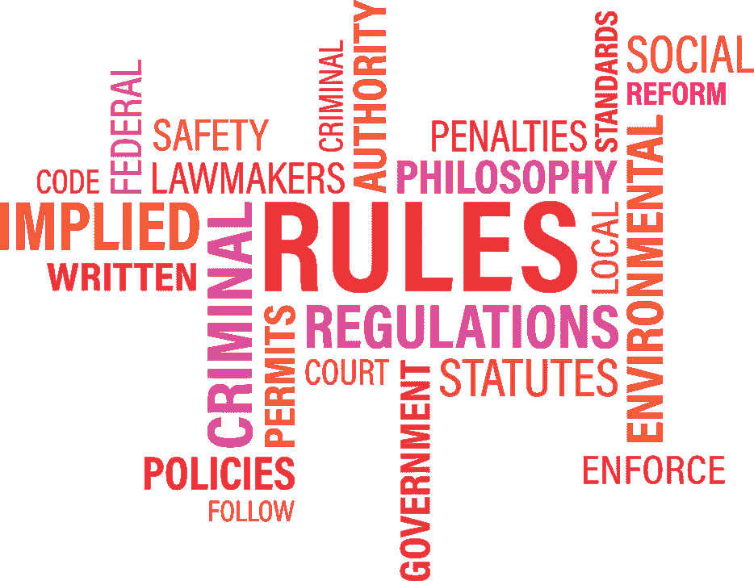

# 监管机构应该担心这种有利可图的投资吗？

> 原文：<https://medium.com/hackernoon/should-regulators-be-concerned-about-this-profitable-investment-aae6e2f056f6>

尽管世界各地的投资者对数字货币表现出越来越大的兴趣，但许多监管机构对区块链和首次发行硬币(ico)持负面批评态度。然而，最近有一个例外，金融市场战略部执行董事 Yao Loong Ng 鼓励全球监管机构了解加密货币(T2)和 ico。他甚至指出了一个事实，即了解数字货币世界的发展对监管者可能是有用的。

在马来西亚举行的东南亚国家资本市场会议的一个小组讨论会上，Ng 说，与首次公开募股(IPO)相比，ico 的上市时间要少得多。

IPO 可能需要长达 9 个月的时间才能上市。这就是为什么他认为，如果为 ICOs 撰写白皮书并随后上市的整个过程只需要几天时间，那么监管机构肯定可以从中学习一些东西。

**加密货币的最新发展**

但问题是，为什么有必要对其进行监管？加密货币在过去几年中获得了很大的吸引力，因此许多投资者一直在投资虚拟货币。事实上，2017 年 7 月，《区块链革命》的作者亚历克斯·塔普斯科特(Alex Tapscott)宣布，为他的数字投资基金关闭一笔 2000 万美元的超额认购融资。该对冲基金名为 NextBlock Global。他的观点是，该基金拥有一切，包括领域专长和市场准入，有一个光明的未来。

去年 9 月，奥拉夫·卡尔森还创建了一只数字货币对冲基金，管理着超过 2 亿美元的资产。在众多支持该基金的风险投资公司中，Union Square Venture、Sequoia Capital 和 Andreessen Horowitz 是几家领先的公司。

目前，数字货币领域的大多数投资者要么是高财富的个人，要么是散户投资者。迄今为止，机构投资者对加密货币的兴趣非常有限。但这不会一成不变。事实上，变化已经开始发生了。机构投资者的新投资流将推动比特币和其他替代货币的价值迅速上升，因为它们的市值较小。

在这种时候，挺身而出变得越来越重要。与其消极地批评这种新形式的货币，不如拥抱它，并开始努力监管它。尽管监管机构群体普遍存在持续的强烈反对，但仍有少数国家的监管机构正在努力制定相关法规。

**监管数字货币**

在马来西亚，安全委员会宣布，它目前正在制定关于这些货币如何运作的准则和条例，其中包括现有数字资产和货币的二级市场交易。

该委员会主席 Tan Sri Ranjit Singh 表示，他们正在与马来西亚中央银行密切合作，制定一个加密货币框架。他进一步补充说，该框架需要几个月的时间才能完成。他还提到，他们正在非常仔细地观察，由于证券委员会控制和监管二级市场，他们将设计规则和条例，以便为交易价值提供适当的条件，从而确保市场的完整性。这也是为了向投资者提供预测。

**监管力度**

国防研究和分析研究所的顾问 Munish Sharma 谈到了大多数监管机构面临的困境，特别是当这种新技术存在于高度监管的空间时。他说，在过去的 5 年里，数字货币吸引了很多投资者的关注，但与此同时，全球金融机构的监管机构也越来越担忧。

不同于让数字货币在没有任何干预或监管的情况下增长，各国政府正在与监管机构就如何监管这些虚拟货币进行头脑风暴。

让我们在[推特](http://www.twitter.com/eliandalvarez)上讨论这个问题