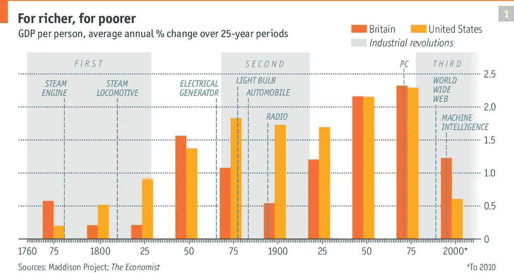
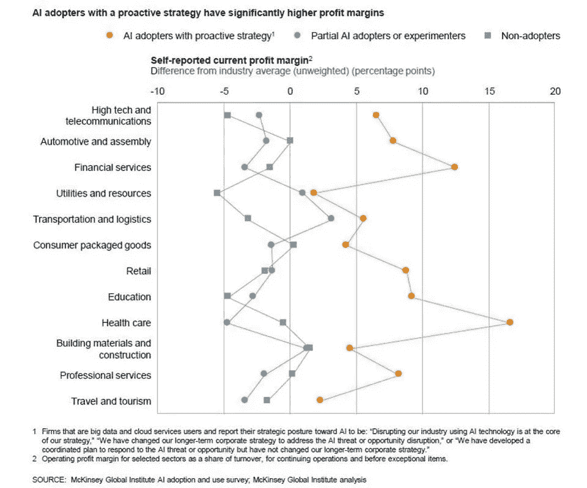

# 机器人应该纳税吗？

> 原文：<https://medium.com/hackernoon/should-robots-pay-tax-a2578bdf9f38>

## 为新的经济秩序做准备

这篇文章不仅仅是关于机器人税。机器人税被用作一个例子，以展示世界各地的经济学家、未来学家和专家为应对人工智能实现的世界而想到的无数选择。

*这篇文章为读者提供了一种应对社会结构和现有经济秩序不可避免的巨大变化的方法。人工智能(AI)规模的技术带来的破坏可能会突然发生，可能会隐藏起来，但会影响整个人类。*

*我们选择如何应对是管理变化的关键，而不是让变化管理我们的生活。我试图阐明我们回应的一些要素，其中包括对机器人税、终身学习和全球智库的思考*

# 兴奋带来的焦虑

颠覆性技术形式的巨大变化通常会引发更多的焦虑而非兴奋。这种感觉太人性化了，无所不包。我每天都感觉到。不要误解我——我不是预言家，但也不是不理智的乐观主义者。我试着生活在两者之间。我试图想象未来会是什么样子，因此我的反应应该是什么。我不否认这可能是一次徒劳的尝试，但以下是我迄今为止学到的东西。希望它能让你受益:

# 绘制平行线

在讨论人工智能时，与工业革命的相似之处是不可避免的:

1.  技术在世界范围内呈波浪式传播:这解释了为什么工业革命没有在世界范围内均匀传播，特别是像印度和中国这样的国家。对于像中国这样与美国一起领导人工智能革命的国家来说，情况可能并非如此。
2.  工业革命取代了手，但人工智能革命可以取代思想。
3.  变化的速度加快了，变化的工具(计算能力、手机等。)激增。这些因素强调了快速创建和部署响应的重要性。

更重要的是，政府将很难处理工作岗位的错位以及干预和保护的需求。正如一些人所说，贫富差距可能会扩大，这一点尤其正确。根据 Grogingen 增长与发展中心的 Maddison 项目的数据,《经济学人》绘制了人均 GDP 的年度变化，显示了引入机器智能后的减速趋势。

# 追逐移动目标的经济学家

在与 Tyler Cowen 的对话中，Jeffrey Sachs (Jeffrey D. Sachs 是世界知名的经济学教授、可持续发展领域的领导者、联合国高级顾问、畅销书作家和联合专栏作家)指出，经济学家不断分析一个移动的目标(即不断变化和转移的经济格局)。

快速的技术变革加剧了这些变化。以几乎为零的边际成本创业的能力、共享经济、自由职业者作为全职职业的兴起、数字游牧者、每周 4 小时工作制、自由职业者、使用数学和计算机代码处理数据以创造效率，以及数据科学和分散计算的出现，都是新经济秩序出现的特征——我们需要开始在个人、公司乃至全球层面做出回应。

# 概率思维并不总是有用的

有意或无意地，人们(有时包括我)有无限的能力将事情复杂化。这是因为人工智能等技术就像一只几乎失明的人(让我们现实点吧——我们所有人都有盲人，包括专家)在摸索大象，他们通过观察大象的不同部位来预测它是哪种动物。考虑[认知偏见法典](https://en.wikipedia.org/wiki/List_of_cognitive_biases)来想象我们偏见的不同类型和程度。

换句话说,“奇点”或人工智能接管人类的概率可能非常低，比如说不到 10%,而且很可能是黑天鹅事件。然而，从世界末日的预言到无拘无束的乐观主义，有一系列的观点。但是，普通人呢？他需要的是直接的、可操作的指导，而不是取决于概率的“也许这样，也许那样”的答案。

当今最清晰的交流方式之一是保险杠贴纸。我并不是说我们对人工智能的回应应该是贴在保险杠上的贴纸，但它可能是一条曲折的道路，应该被规划和解释。

## 为什么你不应该担心？

即便如此，如果你仍想担心奇点，那就想想其他颠覆性的技术力量，它们不懈地努力让生活变得更美好，但也不无潜在的危险:

1.  **分散计算:**智能合约消除了中间人(经纪人、IPO 承销商、律师等)。)和消除经济利润的区块链(例如汇款的交易成本几乎可以为零)。
2.  金融科技技术颠覆了金融服务，货币的去中心化和数字化带来了快速但不平等的全球变化。
3.  其他可能影响整个人类的全球力量——气候变化、地缘政治不确定性和不平等加剧。
4.  **基因编辑包括**[**CRISPR**](https://en.wikipedia.org/wiki/CRISPR)**Cas 9:**CRISPR/Cas 系统的一个简单版本，CRISPR/ [Cas9](https://en.wikipedia.org/wiki/Cas9) ，是一种使用起来比较简单的技术来编辑基因组。包括 CRISPR 共同发明人在内的科学家敦促全球暂停将 CRISPR 应用于人类生殖细胞，特别是临床应用。他们说，“在宽松的管辖范围内，科学家甚至应该避免尝试将生殖系基因组修改用于人类临床应用”，直到“科学和政府组织之间讨论了全部影响”。这些科学家支持 CRISPR 的基础研究，但不认为 CRISPR 已经发展到足以在临床上用于对人类进行遗传性改变。
5.  然而，在 2015 年 4 月，中国科学家报告了试图使用 CRISPR 改变非存活人类胚胎的 DNA 以纠正导致β地中海贫血(一种致命的遗传性疾病)的突变的结果。(来源:维基百科)。

最后，我想把巴兹·鲁尔曼的话留给你们:

*“不要担心未来；或者担心，但要知道担心就像嚼泡泡糖试图解代数方程一样有效。你生活中真正的麻烦往往是你从未想过的事情；在某个无聊的星期二下午 4 点暗算你的那种*

## 为什么你应该积极主动？

一个国家的 GDP 简单来说就是人口乘以生产力。在人口正在下降的发达国家，技术尤其是机器学习和人工智能来拯救它们。一个有趣的观察视角是两种强大力量的碰撞。例如，想想亚洲年轻中产阶级心目中的东方传统思想与西方意识形态。一种力量最终会比另一种更强大。尽管存在明显的反对意见，但底线是，由于令人信服的原因，人工智能的引入和发展是不可避免的。我们只是不确定这项技术在全世界的传播速度。

麦肯锡全球研究所最近发布了一份题为“[人工智能，下一个数字前沿](http://www.mckinsey.com/~/media/McKinsey/Industries/Advanced%20Electronics/Our%20Insights/How%20artificial%20intelligence%20can%20deliver%20real%20value%20to%20companies/MGI-Artificial-Intelligence-Discussion-paper.ashx)的报告，阐述了企业和职业利用人工智能的经济原理。根据该报告，包括百度和谷歌在内的科技巨头在 2016 年在人工智能上花费了 200 亿至 300 亿美元，其中 90%用于研发和部署，10%用于人工智能收购。人工智能(AI)投资已经变成了一场专利、人才和知识产权的全球竞赛。

简而言之，企业有非常合理的经济激励来投资人工智能，并将继续这样做。参考下面的信息图。底线:不可避免的经济变革。

# 可能的反应

## 在个人层面

1.  心态的改变是第一步。终身学习不再是一个时髦的词汇。开始每天自我教育。大多数 CEO 除了管理他们的业务之外，还广泛阅读。沃伦·巴菲特将他的成功归功于每天阅读 500 页。
2.  利用尽可能多的论坛(书籍、朋友、同事、专家、播客、博客、MOOC 等)。)来了解今天人工智能和机器学习的基本原理和发展状况。我在这里提供了一个短名单[。](/@abhishekkothari/polanyis-paradox-b197b61a85b1)
3.  你将能够与在你的组织中运行人工智能系统的人进行有意义的对话，并解释人工智能引擎提供的结果。你可能不需要学习编码，只要你学得足以理解人工智能系统背后的逻辑，并有足够的知识来解释结果。
4.  选择任何你想学的编程语言。C 是所有语言之母，但是 C++也是面向对象编程的基础。你甚至可以用有趣的方式学习 Apple playgrounds 或 XCode 来编码，并学习创建自己的移动应用程序。你可能会惊讶地知道，编码是用英语给机器的逻辑指令。你不需要学习汇编语言，除非你有热情去学。
5.  另一种方法是[获得 Python](https://medium.com/u/bb58ccbf9892?source=post_page-----a2578bdf9f38--------------------------------) 并开始学习用 Python 编码。 ***学习编码背后的目标不是实际编写软件，而是理解软件如何用于与机器通信，发生的常见错误类型以及循环、嵌套循环、对象和容器等基础知识，并最终能够使用人工智能作为输入。把它想象成学习英语语法不是为了成为一个出版作家，而是为了能够理解和解释规则，以便在像 GMAT 这样的竞争性考试中取得好成绩。***
6.  如果你比较有创意，可以尝试学习 HTML 和 CSS，以便能够理解和编辑网站；Java 和 JavaScripts 也是不错的选择。
7.  任何关于云计算、分布式账本技术(DLT)和机器学习的基础讲座也会有很大帮助。

## 在公司层面

## 机器人税

> 席勒断言:“对机器人征收适度的税，甚至只是减缓颠覆性技术采用的临时性税收，似乎是解决不平等加剧的政策的自然组成部分。”。
> 
> 收入可以用于工资保险，以帮助被新技术取代的人向不同的职业过渡。这将符合我们天生的正义感，因此可能会持续下去。”—罗伯特·席勒，2013 年诺贝尔经济学奖得主，耶鲁大学经济学教授，美国房价凯斯席勒指数的共同创始人

机器人税也可以采取不同的形式，比如企业向失业人员提供强制性培训，随后提供基本收入，以及基于里程碑的绩效奖金。

# 其他回应

技术可能会一波一波地传播，中小企业或初创公司不会立即采用人工智能。中小企业就业可能是人们在大型跨国公司之外寻找工作的选择之一。

为那些在调试和解释人工智能结果并最终管理人工智能系统方面被取代的人提供培训，可能是企业的另一种应对措施。

基本收入可以是成功完成培训并将其应用于实际工作的函数，即包含劳动尊严的基本收入。

假设:

1.  大多数人喜欢工作。他们希望自己谋生，而不是不劳而获地以普遍基本收入(UBI)的形式获得免费收入。基本收入是维持生活所必需的，而可变的激励可以促进工作的动力。
2.  市场之间是完全竞争的，技术是波浪式传播的。

## 在全球一级

影响整个人类的问题？猜猜谁必须做出回应——全人类，不管这项技术来自何方。虽然不是一回事，但打个比方就是病毒的传播。我们要等待全球合作抗击埃博拉等病毒吗？

诚然，我们面对的不是一场疫情，而是一场主要由技术推动的全球性大变革。

如果你是一家负责变革管理的全球智库的首席执行官/总裁，考虑一个思维实验。这里最重要的词是全球。想象一下这种变化完全席卷世界所需的时间和可变性，以及一些国家想要停止或减缓自主机器的进步以将工作岗位留给其他完全全速前进的国家所带来的无数问题。即使在今天，仍然有人没有适当的食物、衣服、住所、卫生设施或教育。

不言而喻:你需要一个全球路线图，这个路线图是通过公共和私人的参与制定的，它吸收了世界各地的专家来制定政策和项目计划。

# 最后的想法

具有人工一般智能的机器将能够做梦、想象和无中生有吗？后人工智能生活的本质不一定是更快或更便宜的产出，而是满足感在于旅程本身。因此，需要想象力的创造性追求可能是未来。

投入更多时间解决数学难题，重新发现绘画、作曲和抗击慢性病的乐趣，可能是人类使用人工智能可以从事的某些更高层次的任务。

上面的文章只是收集了一些回应，以展开一场更大的辩论，讨论如何以全球人民的最佳利益为重，积极主动地管理变革。是的，满嘴的文字在纸上看起来很好，但似乎是一个几乎无法完成的任务。然而，我很乐观，我会记住这一点:

> 总之，技术应该为人类服务，而不是相反。

## 感谢您的阅读。如果你认为这篇文章有教育意义，请与你在脸书、推特、LinkedIn 或其他社交媒体上的关注者分享。可以在推特上关注我:@akothari_mba

## 如果你喜欢这篇文章，请点击下面的心形推荐它。

