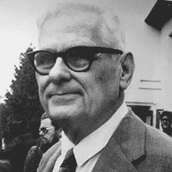

# 智能契约:图灵完备性和现实性

> 原文：<https://medium.com/hackernoon/smart-contracts-turing-completeness-reality-3eb897996621>

“道”的崩溃以及最近对以太坊的 DDOS 攻击引发了一场关于智能契约语言中“图灵完整性”是否明智的辩论。Tezos ，一个加密账本和智能合约平台，以正式指定的语言向图灵提供完整的智能合约(具有强类型和静态类型检查)。我们试图澄清一些关于智能契约背景下“图灵完备性”相关性的误解。

# 该理论

[](https://en.wikipedia.org/wiki/Alan_Turing)

Alan Turing

图灵完全性是一种表明某些(通常是大多数)编程语言完全通用的属性。根据[丘奇-图灵命题](https://en.wikipedia.org/wiki/Church%E2%80%93Turing_thesis)(一个有大量经验证据的物理原理)，每一个可以物理实现的计算，甚至原则上，都可以用图灵完全语言来表达和实现。

哪种语言并不重要。任何图灵完全语言都足够通用，可以模拟所有其他语言(尽管可能会变慢)，使它们在可以执行的计算方面等价。图灵完全语言如此普遍，以至于它们甚至出现在看似简单的系统中，如[细胞自动机](https://en.wikipedia.org/wiki/Cellular_automaton)或[平铺系统](https://en.wikipedia.org/wiki/Wang_tile)。

[](https://en.wikipedia.org/wiki/Alonzo_Church)

Alonzo Church

不幸的是，权力带来了复杂性。[莱斯定理](https://en.wikipedia.org/wiki/Rice%27s_theorem)告诉我们，原则上没有任何一个*通用*程序(人或机械)可以为所有程序决定*是否终止。事实上，它甚至不能预测他们行为的任何重要性质。*

有人可能会得出这样的结论:既然我们无法预测这些程序会做什么，我们就应该远离这些语言。事实上，这不正是刀的情况吗？合同参与者无法预测合同的行为，灾难随之而来。

这种误解出奇的普遍。显然，至少有一个人，即攻击者，能够预测和理解契约——事实上比它的创建者更好。

赖斯定理断言，没有一个通用的程序来决定一个程序的行为属性是否成立。这些可能是诸如“这个程序是否停止”、“它是否达到一个错误条件”、“是否能够产生某个输出”之类的属性。

这个定理暗示了程序的存在，这些程序由*做*终止，并且*做*按预期运行，但是不能证明如此。我们无法真正知道它们是什么，但我们通过巧妙的数学论证知道它们的存在(承蒙图灵、丘奇和哥德尔的支持)。重要的是，可能有通用程序可以计算大多数程序的*行为，而不是所有*程序的*行为。*

[](https://en.wikipedia.org/wiki/Kurt_G%C3%B6del)

Kurt Gödel

一些语言放弃了图灵完备性，它们的程序*可以*显示总是暂停。例如，比特币脚本就是这种情况。一个民间的信念似乎是赖斯定理的逆命题是正确的。也就是说，误解是:

“既然图灵完全语言中的停顿问题意味着我们不能预测程序的一般行为，那么，只要我们用保证终止的语言编写程序，我们就能够预测我们想要的所有有趣的特性。”

这不是真的，理论上不是，实践上也不是。有些语言保证程序对于所有的输入都会暂停，但是您可能无法确定任何给定的输入是否会导致程序到达错误状态。*(对于理论上倾向于:以由单个程序 f 组成的语言为例，该程序检查其输入 x 是否是 ZFC 不一致性的证明。f 总是停止，但是它是否返回“真”在 ZFC 是不可判定的)*

# 实践

实际上，图灵完备性是一种理想化。具体来说，计算机的内存是有限的，在关机前只能运行有限的时间。

Tezos(或以太坊)智能合约在时间上受到每个区块和每个交易的限制。在某种程度上，它们并不完全是图灵完备的。更好的是，由于契约执行的步骤数量是有限的，因此理论上可以预测给定程序对任何可能输入的行为。

由于解析输入所花费的时间至少与输入的长度相当，所以执行中步骤数量的上限限制了契约可以读取的任何输入的最大大小。因此，下面的算法可以决定任何契约的行为:

```
for(all inputs < max size) {
   run program for max time;
   check property;
}
```

当然，这种算法在天文学上是不切实际的。如果输入大小被限制在微不足道的千字节，宇宙中可能仍然没有足够的自由能量来进行计算。

我在这里的观点并不是要表明我们总能证明时间受限智能合约的所有真实属性。恰恰相反，我的观点是，一般算法的存在和*实用*算法的存在是截然不同的两回事。

比特币脚本是否存在如此高效的算法？答案也是否定的！

考虑下面的比特币脚本

```
scriptPubKey: OP_HASH256 0123456789abcdef0123456789abcdef0123456789abcdef0123456789abcdef OP_EQUAL
```

这是一个哈希难题，正如在[比特币维基](https://en.bitcoin.it/wiki/Script#Transaction_puzzle)上所描述的。请注意，我选择的散列显然是虚构的。该脚本明显地停止了所有的输入，但是我们可能有兴趣知道这个输出是否是可消费的。这完全取决于是否存在我创建的哈希的原像，这是绝对不清楚的。我们将不得不暴力破解哈希函数数十亿年才能找到答案。

比特币的脚本缺乏图灵完备性并不是什么灵丹妙药。这对决定这个非常简单的脚本的基本属性没有帮助。

# 真正重要的是

正如我们之前说过的，莱斯定理本质上告诉我们，存在这样的程序，*做*终止，*做*按预期运行，但无法证明如此。

然而，几乎所有感兴趣的*正确的*程序本质上都是*可证明正确的*。此外，他们的正确性的证明将是相对简单的。在基于加密分类帐的智能契约的上下文中尤其如此，这些分类帐通常实现简单明了的业务逻辑(当然，如果您处理的是计算代数，就不那么真实了)。

正确性证明可能依赖于承认某些难以证明的猜想。例如，我们可以从启发性的论证中接受哈希函数确实很难反转，并在我们的证明中将其作为引理，就像密码学论文中通常所做的那样。

但总的来说，每当程序员编写程序时，他们通常会在头脑中保留一个模糊的正确性证明大纲。有时这种证明是不完整或错误的——人是会犯错的——但它总是指导写作。程序员不断地对他们程序的行为进行推理，以确保它做了预期的事情。

当且仅当[柯拉茨猜想](https://en.wikipedia.org/wiki/Collatz_conjecture)为真，或者 [ZFC](https://en.wikipedia.org/wiki/Zermelo%E2%80%93Fraenkel_set_theory) 不一致时，程序员不会坐在他们的办公桌前，善意地写一份互换合同，销毁其所有抵押担保品。

是否存在一个完全通用的程序来判断用给定语言编写的任意程序是否正确并不重要。相反，重要的是如何简单明了地构造容易推理的程序。

在这方面，推断比特币脚本的行为一般来说是简单明了的。他们没有带来太多的惊喜。有没有前像 t0 0x123…？也许是，也许不是，但是任何人都不可能发现，所以对于所有的意图和目的来说，这笔交易是不可消费的。

# 权衡


The efficient frontier, and the new frontier created by automated theorem proving and formal verification

编程语言存在于表达能力/推理的边界之下。

*富于表现力的*语言使得描述某些想要的行为变得容易。虽然原则上所有的图灵语言都可以表达相同类型的计算，但在实践中，如果语言不够完善，就很难表达某些计算。一个幽默的例子是 T4 语。虽然 Malbolge 是图灵全集，但用这种语言编写程序来做它们应该做的事情是极其困难的。

和表现力一样，*ease to reasoning about*不是二元变量。图灵完备性对于语言推理的一般可能性有着重要的理论和实践意义，但是正如我们前面看到的，它并没有说明全部情况。

非常有表现力的语言往往更难推理，而一些受限语言(如有限状态机)却很容易推理，但代价是缺乏表现力。幸运的是，有一种方法可以拓展这个领域:正式验证。

形式验证是一门新兴的计算机科学学科，它产生可证明正确的程序。你可能会认为这是创建一个机器可检查的证明程序是正确的，虽然，通常，证明本身*就是*一个程序。智能合约只有几行代码，但风险很大，这使它们成为这种技术的完美候选。

特别是，辅助的，甚至是自动化的定理证明让程序员指定他们想要证明的属性，并让计算机完成大部分提出正确性的正式证明的繁琐工作。这对所有语言的影响并不相同。

虽然一个可证明正确的程序在被编译成某个汇编时仍然是可证明正确的，但是从编译后的版本中得到证明要困难得多。这对人类来说是真的，对自动定理证明器来说也是真的。编译步骤丢弃了关于程序结构的重要信息。

# 我们正在做什么

自 Tezos 于 2014 年夏天开始以来，该项目的核心原则一直是智能合约语言是形式验证的完美目标。我们想要一种能很好地使用定理证明的语言，但也能很容易地对其本身进行推理。这导致了以下选择:

1.  我们从语言的正式规范开始，精确地确定程序“T2”的意思。
2.  我们用代数数据类型和静态类型检查使语言具有强类型。类型是推理程序行为的一种强有力的方式。例如，他们可以确保我们不会错误地添加苹果和橘子，但他们可以进一步强制执行合同的某些属性。
3.  我们把语言变得高级了。参与者签订的合同不是一些混乱的程序集，而是编写合同的语言。这允许我们引入有用的高级原语，如功能图和功能集。我们的目标不是构建一些任意的代码执行引擎，而是一个适合智能合同作者需求的引擎。

所有这些属性都有助于使用自动定理证明程序来证明关于合同的事实，例如 [Coq 证明助手](https://coq.inria.fr/)，但是它们也使得手动检查程序的正确性更加容易。

# 结论

图灵完备性被诬陷！有些程序的性质很容易理解和证明，而有些程序的性质很难理解和证明。有一些编程语言有助于这种证明，也有一些模糊了这种证明。这是关于权衡，而不是关于停顿问题的一些亮点。

[](http://bit.ly/HackernoonFB)[](https://goo.gl/k7XYbx)[](https://goo.gl/4ofytp)

> [黑客中午](http://bit.ly/Hackernoon)是黑客如何开始他们的下午。我们是 [@AMI](http://bit.ly/atAMIatAMI) 家庭的一员。我们现在[接受投稿](http://bit.ly/hackernoonsubmission)并乐意[讨论广告&赞助](mailto:partners@amipublications.com)机会。
> 
> 如果你喜欢这个故事，我们推荐你阅读我们的[最新科技故事](http://bit.ly/hackernoonlatestt)和[趋势科技故事](https://hackernoon.com/trending)。直到下一次，不要把世界的现实想当然！

[](https://goo.gl/Ahtev1)