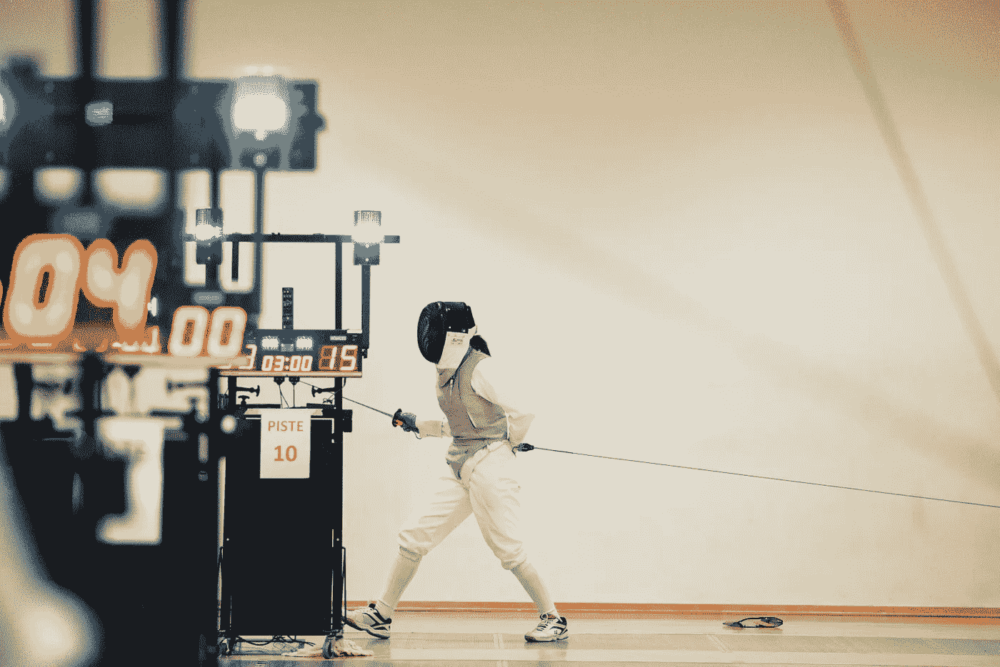
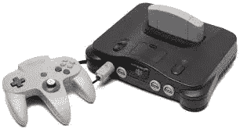

# 智能指针、共享指针、自动指针和唯一指针

> 原文：<https://medium.com/hackernoon/smart-pointer-shared-ptr-automatic-pointer-and-unique-ptr-4fb12ff53914>



对象的生命周期至关重要。确定对象生命周期的错误会导致资源(如内存、fd)泄漏，因为所拥有的资源不能被正确释放和回收以供[将来](https://hackernoon.com/tagged/future)使用。当泄漏累积到一定程度时，它会使整个系统崩溃。
对象生命周期也很复杂，因为一个对象的所有权可能被不同的实体放弃、转移或共享，这些实体包括但不限于变量、[函数](https://hackernoon.com/tagged/function)参数、模块、数据结构、容器和线程。同样，资源必须由所有者之一在某个不确定的点上释放和回收。没有事实上的标准来确定对象的生命周期。像 Java 中使用的 **GC** (垃圾收集)，Objective-C 中使用的 **ARC** 以及 C++中的所有那些指针(ptr)都有它们的优缺点。然而，本文不是关于利弊，而是集中在 C++资源管理助手类、智能指针、`shared_ptr`、`auto_ptr`和`unique_ptr`。

# 智能指针

智能指针是普通指针的包装类。**智能指针**用引用计数定义生命周期，引用计数反映智能指针对象被引用的次数。

接下来，我将展示一个**智能指针**的简单实现。该代码仅用于演示目的，因此没有健全性检查、异常处理和线程安全保证。

```
#include <stdio.h>

template < typename T > class SmartPointer {
private:
  T* _pRes;
  int* _refCount;void _release() {
    if(--(*_refCount) == 0) {
      printf("---Valar Morghulis:%d\n",*_refCount);
      delete _pRes;
      delete _refCount;
    } else {
      printf("---not today:%d\n",*_refCount);
    }
  }public:
  SmartPointer() : _pRes(NULL), _refCount(NULL) {
    _refCount = new int(0);
    printf("SP default cons:%d\n",*_refCount);
  }SmartPointer(T* pRes) : _pRes(pRes), _refCount(NULL) {
    _refCount = new int(1);
    printf("SP cons:%d\n",*_refCount);
  }SmartPointer(const SmartPointer<T>& sp) : _pRes(sp._pRes), _refCount(sp._refCount) {
    (*_refCount)++;
    printf("SP copy cons:%d\n",*_refCount);
  }SmartPointer<T>& operator = (const SmartPointer<T>& sp) {
    this->_release(); // release the last resource it points to 
    _pRes = sp._pRes;
    _refCount = sp._refCount;
    (*_refCount)++;
    printf("SP assign:%d\n",*_refCount);
    return *this;
  }~SmartPointer() {
    this->_release();
  }// to mimic a real pointer
  T& operator* () {
    return *_pRes;
  }// to mimic a real pointer
  T* operator-> () {
    return _pRes;
  }
};class AClass {
public:
  AClass() { printf("aclass cons\n"); }
  ~AClass() { printf("aclass des\n"); }
};void l2(SmartPointer<AClass>& p) {
  SmartPointer<AClass> use3 = p;        // >> SP copy cons:3
}                                       // >> ---not today:2void l1(SmartPointer<AClass>& p) {
  SmartPointer<AClass> use2 = p;        // >> SP copy cons:2
  l2(p);
}                                       // >> ---not today:1int main() {
  AClass *res = new AClass();           // >> aclass cons
  SmartPointer<AClass> aSmartP(res);    // >> SP cons:1
  l1(aSmartP);
}                                       // >> ---Valar Morghulis:0
                                        // >> aclass des
```

结果:

```
aclass cons
SP cons:1
SP copy cons:2
SP copy cons:3
---not today:2
---not today:1
---Valar Morghulis:0
aclass des
```

简单解释一下上面的代码:

1.  `SmartPointer`的生命周期不过是一个普通的阶级。因此，超出(函数)范围的逻辑流会破坏它；
2.  `SmartPointer`有两个属性，`_pRes`和`_refCount`，都是从堆中分配的。因此，超出(功能)范围的逻辑流不会破坏它们；
3.  每次用有效的`_pRes`(类型`T`)构造一个`SmartPointer`时，`_refCount`加上`1`；
4.  每次 a 被`SmartPointer`析构，在我们的例子中，是被一个超出范围的逻辑流析构，即`_refCount`减去`1`；
5.  然而，`SmartPointer`的毁灭并不一定导致`_pRes`的毁灭:

a)当`_refCount`仍大于`0`，`SmartPointer`只需减小`_refCount`并打印


not today

b)只有当`_refCount`被减号设置为`0`时，`SmartPointer`才会析构`_pRes`引用的资源并打印


All men must die

所以智能指针就像程序的不同部分用来跟踪和控制资源实例的句柄。当所有句柄都被销毁时，该资源被视为“未使用”，并被删除。在本文的最后，我将展示一些在现实世界中体现智能指针的真实句柄。

该示例展示了在线性程序中使用**智能指针**，这在真实场景中很少出现。相反，如前所述，资源(即`AClass`的实例)可以由多个并行的数据结构和变量共享。

# shared_ptr (C++11)

`shared_ptr`是 *std* 对**智能指针**的实现，比上面列出的演示代码更加健壮。并且它不会生成不可靠的日志。

# **自动指针**

一个**自动指针**，虽然看起来和**智能指针**很像，但是完全不同。这是一个方便的助手类，只要逻辑流超出范围，它就会析构资源，以防程序员忘记。在某种程度上，它使指针(指运行时动态分配的内存块)的工作方式类似于堆栈变量(在编译时静态分配)。

例如，自动指针 1.0 版:

```
#include <stdio.h>template < typename T > class AutoPointer {
private:
  T* _pRes;

public:
  AutoPointer() : _pRes(NULL) {}

  AutoPointer(T* pRes) : _pRes(pRes) {}

  AutoPointer(const AutoPointer<T>& ap) : _pRes(ap._pRes) {}

  AutoPointer<T>& operator = (const AutoPointer<T>& ap) {
    delete _pRes;
    _pRes = ap._pRes;

    return *this;
  }

  ~AutoPointer() {
    delete _pRes;
  }

  // to mimic a real pointer
  T& operator* () {
    return *_pRes;
  }
  // to mimic a real pointer
  T* operator-> () {
    return _pRes;
  }
};

class AClass {
public:
  AClass() {printf(“cons\n”);}
  ~AClass() {printf(“des\n”);}
  int i;
};

void l1(AutoPointer<AClass>& p) {
  AutoPointer<AClass> use2 = p;
}//the resource has already been deallocated here

int main() {
  AClass *res = new AClass();
  res->i = 5;
  AutoPointer<AClass> use1(res);
  l1(use1);
}// abort, repeat deallocating pointer
```

结果:

```
cons
des
des
autop(1148,0x7fff74eff000) malloc: *** error for object 0x7f9940c03240: pointer being freed was not allocated
*** set a breakpoint in malloc_error_break to debug
[1] 1148 abort ./a.out
```

正如上面的代码片段所给出的，**自动指针**在内部的工作方式就像一个简化的**智能指针**一样，不管引用计数是多少(实际上根本没有引用计数)。

*coredump* 显示了**自动指针**的一个主要缺点:所有权不能转移(到`l1()`)。结果，即使资源已经在`l1()`中被解除分配，`main()`仍然认为自己是**自动指针**的所有者，并且再次解除分配指针。

实现复制构造函数和赋值操作符，以便所有权可以正确转移，怎么样？

例如，自动指针 2.0 版:

```
......
  AutoPointer(AutoPointer<T>& ap) : _pRes(ap._pRes) {
    ap._pRes = NULL;
  }

  AutoPointer<T>& operator = (AutoPointer<T>& ap) {
    delete _pRes;
    _pRes = ap._pRes; ap._pRes = NULL;
    return *this;
  }
......
```

结果:

```
cons
des
```

一切似乎都很好。然而，这是“修复一个错误导致另一个错误”的又一个例子。

新的问题是所有权转移和复制这两个语义是耦合在一起的。因此，它与一些库函数不兼容，例如`std::sort`需要一个额外的副本(作为快速排序中的枢纽),因为它破坏了仍在使用的前一个副本。问题的详细解释可以在这里找到[，感谢](http://www.gotw.ca/gotw/025.htm)[patata harpour](https://www.reddit.com/user/)指出原实现中的错误。

`std::auto_ptr`是**自动指针**的 *std* 实现。如上所述，它要么不是很有趣，要么有问题，所以现在被弃用。我们应该用`std::unique_ptr`来代替。

# std::unique_ptr (C++11)

`std::unique_ptr`是 C++11 中 *std* 对`std::auto_ptr`的替代。通过新添加的[右值和移动语义](https://hackernoon.com/one-shot-learning-of-c-r-value-and-move-27e5d6bcec3b)，一个`unique_ptr`的所有权可以安全地转移到另一个实体。此外，复制语义对于`unique_ptr` s 是禁用的，以避免我们在自动指针 v2.0 中看到的歧义。像**自动指针**一样，指针的最后一个所有者负责解除分配。

```
#include <iostream>
#include <vector>
#include <memory>
#include <cstdio>
#include <fstream>
#include <cassert>

class AClass {
public:
  AClass() {printf(“cons\n”);}
  ~AClass() {printf(“des\n”);}
  int i;
};

std::vector< std::unique_ptr<AClass> > v;

void l1() {
  std::unique_ptr<AClass> p1(new AClass());    // >> cons
  p1->i = 1;
  v.push_back(std::move(p1));
  std::unique_ptr<AClass> p2(new AClass());    // >> cons
  p2->i = 2;
  v.push_back(std::move(p2));
} // p1 and p2 are not destructed here

int main() {
  l1();
  for(auto& p: v) printf(“%d\n”, p->i);
}                                              // >> des
                                               // >> des
```

结果:

```
cons
cons
1
2
des
des
```

如上面的代码片段所示，**唯一指针**被保存在不同的所有者中。当所有权已经从**移动到`vector v`时，`l1()`不再释放资源。这使得**唯一指针**有了更广泛的用途。**

注意，我宁愿相信**独特的指针**是引入新的*移动语义的主要原因。因为*与这里获得的改进相比，通过*移动*和*右值* 实现的[优化不太显著。](https://hackernoon.com/one-shot-learning-of-c-r-value-and-move-27e5d6bcec3b)

# 带回家

"我能理解这些东西，但我不确定第二天早上我是否还记得它们。"

当然可以。我会找一些真实世界的对应物来增强你的记忆。

1) a `std::shared_ptr`就像是视频游戏机的手柄。



控制台(资源)被多个有手柄的玩家“**共享”**，即使只剩下一个玩家，游戏也要继续。因此，只有当所有玩家停止游戏时，“游戏结束”。

2)一个`std::unique_ptr`就像一个便携式游戏机。


一次一个玩家，其中一个应该"**移动"**它让另一个玩家玩。当最后一个玩家停止游戏时，游戏结束。

3)`std::auto_ptr`是一个


因为它不能轻易**移动** d。

如果你喜欢这篇文章，请为它鼓掌或点击按钮。谢谢，希望下次再见。

*最初发布于*[*holmeshe . me*](http://holmeshe.me/cpp-pointers/)*。*