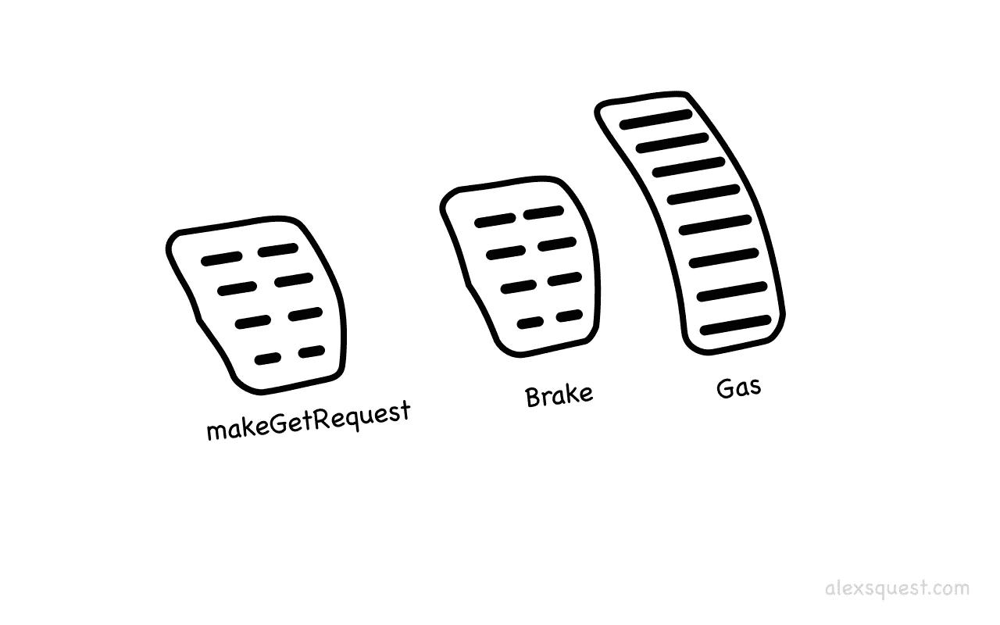
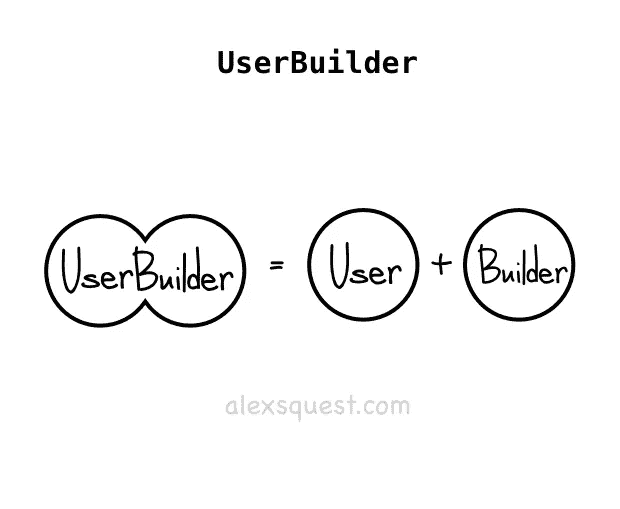
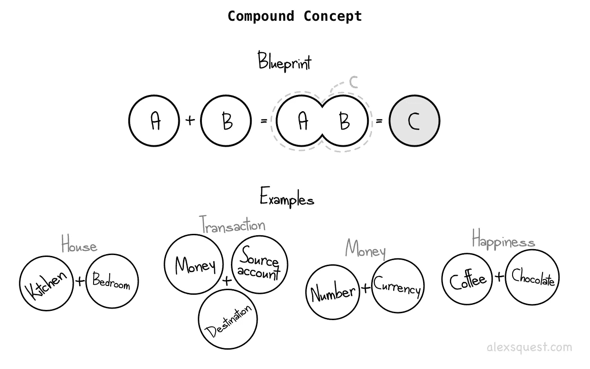
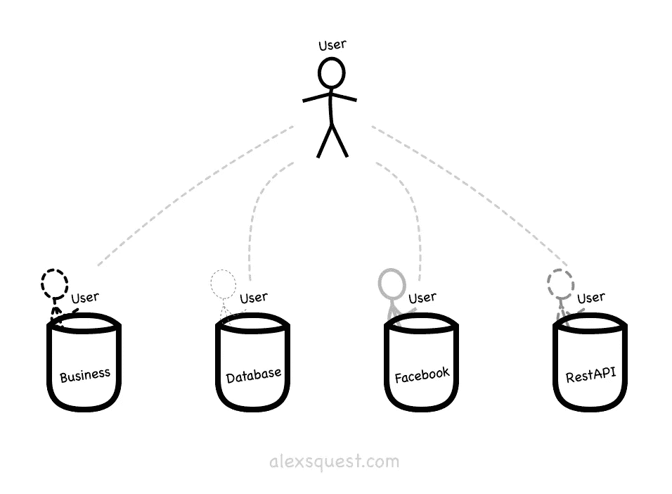

# 软件复杂性:命名的艺术

> 原文：<https://medium.com/hackernoon/software-complexity-naming-6e02e7e6c8cb>


> 计算机科学只有两个硬东西:缓存失效和事物命名。
> 
> 菲尔·卡尔顿

美食写作很难。但是为什么呢？因为好的写作是关于好的阅读。我们倾向于关注前者，而忘记后者。我们忘记了代码只写一次，却要读很多次。

好的写作是为了阅读的方便而优化，而不是为了写作本身的方便，这个过程的核心涉及到很多同理心。这是关于退后一步，试着从一篇文章中观察另一个角度。一个人必须理解一个人的问题，然后用其他人能理解的方式表达出来。对我来说，这显然把[软件](https://hackernoon.com/tagged/software)放到了社会科学的桶里。如果不是为人类，我们为谁写代码？

因此，我们如何向我们的人类同伴和我们自己传达想法和过程，是[编程](https://hackernoon.com/tagged/programming)的核心。

# 命名组件

为了说明我们的第一个概念，我们来玩一个游戏。叫*“我们在哪个房间？”*。我给你一张照片，你必须说出这是什么房间。

**3 个问题中的第 1 个**


A couch, what room does it belong to?

从这件家具来看，这肯定是*客厅*。根据一个组件，我们知道我们所在房间的名字。那很容易。下一个。

**第 2 个问题，共 3 个问题**


A toilet, what room does it belong to?

根据这个物体，我们可以相当肯定地说这是*洗手间*。

看到这里的模式了吗？房间的名字是一个**标签**，它定义了里面是什么。有了这个标签，我们不需要查看容器内部就可以知道里面有什么元素。这使我们能够建立我们的第一个推论:

**推论 1:容器名是其元素的函数。**

注意这基本上是鸭子打字。它有床吗？然后是卧室。

现在，反过来也是正确的:根据容器名，我们可以推断出它的组成部分。如果我们在谈论一间卧室，它很可能有一张床。这使我们能够定义我们的第二个推论:

推论 2:我们可以根据容器名来推断组件。

很明显，但是现在我们有了一些规则，让我们试着把它们应用到下一个房间。

**第 3 个问题，共 3 个问题**


What room has a toilet and a bed?

好了，*同一个房间*的一张床和一个马桶？这使得它的定义非常模糊不清，如果我不得不使用推论 1 和 2 来命名这个房间，我会叫它**怪物房间**。

这里的问题不在于同一个房间里物品的数量，而是完全不相关的东西被当作具有相同的功能。在家里，我们把具有相同关注点、目的和意图的东西放在一起，这使组织变得更容易，而通过弄乱这些责任，我们不能确定建筑师想要什么或这些物体应该如何使用。通过混乱，我们阻断了流动。

**推论 3:容器定义的清晰程度与其组件的紧密程度成正比。**

这很难读懂，所以我们用一张图:


Clarity vs relation

当组件相关时，更容易找到一个好的名称。当事情不相关时，就变得越来越困难。这里的“关系”一词可以是它们的功能、目的、策略、类型等等。在我们谈到标准之前，关系本身并没有多大意义。请耐心听我说，我们很快就会谈到这一点。

在软件中，这同样适用。我们有组件、类、功能、服务、应用、小怪物。*“我们的理解与我们的感知相关”*，罗伯特·德劳内曾经说过，在这种技术背景下，我们的代码能让读者以最简单的方式感知业务需求吗？

**例 1: HTTP 域和汽车**

HTTP 是一个域，它有请求和响应。如果我们将一个名为`Car`的组件放入其中，我们就不能再称它为 HTTP 了。在这种情况下，它就变成了令人困惑的东西。

```
public interface WhatIsAGoodNameForThis {
  /* methods for a car */
  public void gas();
  public void brake(); /* methods for an HTTP client */
  public Response makeGetRequest(String param); 
}
```



**示例 2:通过单词耦合**

一种常见的模式是在类名中附加 Builder 和其他以`Er`结尾的单词。一些建设者。UserBuilder、AccountBuilder、AccountCreator、UserHelper、JobPerformer。



从名字判断，我们可以解读三件事。首先，类名中的动词 Build 意味着它是一个穿着类衣服的函数，过程化的。其次，它内部有两个隐藏的实体，一个用户和一个构建者，这意味着可能违反了封装。第三，这意味着 Builder 可以访问用户的内部工作方式，因为毕竟它们是相互纠缠在一起的。

这类似于工厂模式，有它的位置。当我们的例子在整个代码库中被滥用时，它就成了一个问题。另外，提醒一下，在工厂模式中，你不需要为它创建一个类。`Application`的`createUser()`完全可以胜任工厂的工作。

**例 3:底座**

我们来看几个现实生活中的例子。第一个是 [I18n](https://github.com/svenfuchs/i18n/blob/master/lib/i18n.rb) Ruby gem(为了简洁起见，只提供了类名和方法名):

```
class Base
 def config
 def translate
 def locale_available?(locale)
 def transliterate
end
```

在这里，*基*不表示意思。它可以配置和翻译，以及判断一个地区是否可用。它在做一些不同的，不相关的事情。

**例 4:名称引导设计**

当我们谈到名字如何指导我们的设计时，Discourse 有几个例子，其中一个让我们感兴趣。

```
class PostAlerter
 def notify_post_users
 def notify_group_summary
 def notify_non_pm_users
 def create_notification
 def unread_posts
 def unread_count
 def group_stats
end
```

*帖子提醒者*这个名字暗示了*提醒*某人某个帖子的功能。然而， *unread_posts* 、 *unread_count* 和 *group_stats* 显然处理的是别的东西，使得这个类名对于它所做的事情来说并不理想。将这三种方法转移到一个名为*poststatistics*的类中会让事情变得更清晰，对新来者来说也更容易预测。

```
class PostAlerter
 def notify_post_users
 def notify_group_summary
 def notify_non_pm_users
 def create_notification
endclass PostsStatistics
 def unread_posts
 def unread_count
 def group_stats
end
```

**例 5:怪物名字**

Spring 框架有几个例子来说明做了太多事情的组件，因此，需要类似于我们的怪物房间的名称。这里有[一个](http://docs.spring.io/spring/docs/2.5.x/javadoc-api/org/springframework/aop/config/SimpleBeanFactoryAwareAspectInstanceFactory.html)(因为[这个](http://www.javafind.net/gate.jsp?q=%2Flibrary%2F36%2Fjava6_full_apidocs%2Fcom%2Fsun%2Fjava%2Fswing%2Fplaf%2Fnimbus%2FInternalFrameInternalFrameTitlePaneInternalFrameTitlePaneMaximizeButtonWindowNotFocusedState.html)有点太多了):

```
class SimpleBeanFactoryAwareAspectInstanceFactory {
 public ClassLoader getAspectClassLoader()
 public Object getAspectInstance()
 public int getOrder() 
 public void setAspectBeanName(String aspectBeanName) 
 public void setBeanFactory(BeanFactory beanFactory)
} 
```

**例 6:好的命名，有所改变**

糟糕的命名已经够多了。好的命名可以在 D3 的[弧](https://github.com/d3/d3-shape/blob/master/src/arc.js)中找到，比如:

```
export default function() {
  /* ... */
  arc.centroid     = function() { /* ... */ }
  arc.innerRadius  = function() { /* ... */ }
  arc.outerRadius  = function() { /* ... */ }
  arc.cornerRadius = function() { /* ... */ }
  arc.padRadius    = function() { /* ... */ }
  arc.startAngle   = function() { /* ... */ }
  arc.endAngle     = function() { /* ... */ }
  arc.padAngle     = function() { /* ... */ }
  return arc;
}
```

这些方法中的每一个都很有意义:它们都是以弧的名称命名的。我喜欢下图的原因是它非常简单。


## 方法 1:分开


Divide and… name

**何时使用:**您无法为一个类或组件找到一个好的名称，但是您已经有了孤立的概念，并且想要为它们的分组找到一个好的名称。

它包括两个步骤:

1.确定我们拥有的概念。把他们分开

在厕所+床的场景中，我们把床推到左边，厕所推到右边，把我们能识别的不同东西分开。好了，现在我们有两个独立的东西，我们终于可以用自然的方式推理了。

当你找不到一个好名字的时候，你面前可能有不止一个东西。正如你现在所知道的，命名多个事物是很困难的。当遇到麻烦时，试着识别你所拥有的是由哪些片段和动作组成的。

**示例**

我们有一个未命名的类，包含一个*请求*、*响应*、*标题*、*URL*、*正文*、*缓存*和*超时*。除了这个主类，我们只剩下组件`Request`、`Response`、`Headers`、`URLs`、`ResponseBody`、`Cache`、`Timeout`等等。如果我们只有这些类的名称，我们可以相当肯定地假设我们正在处理一个 web 请求。web 请求组件的一个很好的候选是`HTTPClient`。

代码硬的时候，不要先考虑整体。不要。想想零件。

## 方法 2:发现新概念



Compound concept

**何时适用:**当一个类不简单或不连贯时。

发现新概念需要业务领域的知识。当软件应用与业务相同的术语时，一种无处不在的语言就建立起来了(Evans，2003)，这种语言允许不同专业领域的专业人员使用相同的术语。

**示例 1:将组件封装成一个新概念**

几年前，一家公司即将失去一份大合同。为什么？因为团队发布新功能和修复错误的速度很慢。

这个电子商务市场通过多个支付网关向不同国家的学生收取不同规则的费用。需求相当复杂。当我看到收费代码`PaymentGateway`的时候，我震惊于它是多么的复杂，有好几个依赖关系，包括:`User`、`UserAddress`、`CreditCard`、`BillingAddress`、`SellerAddress`、`LineItems`、`Discounts`等等。它的构造函数是巨大的，这种复杂性使得添加新规则变得困难，因为触及一个东西会破坏其他东西，并且要求我们改变所有的网关适配器。

这个问题超出了付款的范围。通过让信息课程再次汇总所有这些数据，向学生发送电子邮件。技术支持有自己的屏幕，第三次聚集了这些数据，只是这个特定的地方使用了一个名为`Aggregator`的类(这个词没有上下文就没有任何意义)。我们必须做些什么来修复这个架构障碍。

为了解决这个问题，我从一个思维练习开始。以下是事情进展的大致情况:

> 我来了，带着这些我需要你帮我收费的细节。如果这是一张桌子，我会把这些文件整理好，我可能会把它们叫做发票。那么，如果我创建一个名为`Invoice`的类，它只不过是所有其他细节的集合，这样网关就不需要知道那些规则是如何执行的，因为`Invoice`会知道。我没有注射一百万个物体，只是把一个交给你？

发票*术语没有在任何地方使用。我们花了一个月的时间进行重构，一旦完成，我们就能更快地改变软件。*

发票是一个很好的概念例子，它只是来自许多来源的数据的集合，大多数人都知道它是什么。最终的解决方案添加了`Invoice`类，它被单独注入到网关中，充当门面模式并隐藏其他类。

好的命名不仅仅是写出漂亮的文字，还要准确写出以前没有的需要表达的内容。

**示例 2:基于业务领域的旋转名称**

在一个全新的拼车项目中，我们从头开始设计这个系统，在研究其他交通解决方案的过程中，描述某人在某一天从出发地到目的地的旅程的合适词是`trip`，这群人被称为`ride`。我们发布了一个词汇表，这样公司的其他人就可以讨论和分享这种无处不在的语言。

发布后，我们的客户总是将 trips 称为`rides`。很快，我们在将支持请求转化为必须要做的事情时遇到了问题，在经历了一些痛苦之后，我们决定是时候重构`trips`到`rides`和`rides`到`carpools`了。这解决了一家公司说两种不同语言的问题。

**示例 3:抽象层次**


一个人说，*移动右腿然后左腿然后右腿*，另一个人说*走*。两者意思相同，但据说后者更抽象。

理想情况下，随着代码越来越接近它的公共 API，它就越试图匹配业务术语。当它接近数据库和金属时，它使用与其上下文相关的机器术语。在这两者之间，是一个从更抽象到不那么抽象的渐变。

在一家公司，一个商务人士会说 *post Tweet* ，所以像`postTweet()`这样的名字在公共 API 中比`makeHttpRequest()`更有意义。在一家技术服务更强的公司，后者可能更合适。

第二，考虑特异性。`postTweet()`非常具体，而`makeHttpRequest()`非常通用，可以用于脸书或基本上任何涉及 HTTP 的东西。通用名称可以很容易地重用，但代价是模糊不清。这解释了为什么框架代码与商业软件代码如此不同。

**例 4:一般化**

很久以前，一个 CMS 有数据库表*新闻*，*历史*，*视频*，*文章*，*页面*等。其中大部分都有相同的栏目，*标题*，*摘要*，*正文*。 *videos* 表有额外的属性，如 *url* (用于嵌入 YouTube)和 *history* 有一个 *date* 属性，因此页面会按年份显示历史事件列表。所有这些表看起来都像副本，有些地方有一些不同，添加新功能需要重新编写大量样板文件。

我将所有这些表折叠成一个名为`contents`的表，其中一个外键指向一个名为`sections`的表，该表包含新闻、历史、视频等栏目列表。现在，`contents`的一个代码就足够了。几年后，一个朋友不得不写一个小的 CMS，我建议采用同样的方法。一旦完成了管理内容的表单，实现任何内容所需的时间只有正常情况下的 1/N，因为对于每一个相同类型的新部分，都已经完成了。

通过给它取另一个名字来一般化可以提高生产率。新闻是一种内容。文章是一个内容。历史是一个内容。所有这些可以共享相同的属性吗？是的。调查？不，*不是*的一个内容。

## 方法 3:分组标准

**什么时候用:**名字都不错但是不太搭的时候。

组件可以根据各种标准进行分组，包括物理性质、经济、情感、社会以及软件中最常用的功能。相框是根据情感因素分类的，而产品是根据经济动机分类的。沙发和电视放在同一个房间里，根据功能标准组合在一起，因为它们都有相同的功能或目的，提供休闲。

在软件中，我们倾向于按功能对组件进行分组。列出您的项目文件，您可能会看到类似`controllers/`、`models/`、`adapters/`、`templates/`等内容。然而，有时这些小组会觉得不舒服，这将是重新评估模块结构的最佳时间。

**例:按策略分组**

一个自动化文档操作的库基于代码生成一个规范文件(即 API 蓝图),将该文件(保证格式正确)上传到云中(即 S3)。

根据文档格式，将自动做出各种后续决定。选择 API 蓝图将会选择一个不同的线程，一个不同的测试器和一个不同的 API 元素转换器。这里基于一个输入对所有这些不同的功能进行分组的关键词是*策略*。随后，该库包括一个名为 Strategy 的模块(或命名空间),用于将文件格式、摘要、文档测试人员和存储提供者分组在一起。这使得该库能够将普通的操作文件(如上传器、解析器和命令行)与业务核心策略分开。

# 利用上下文

每个应用程序都有不同的上下文，其中的每个模块，其中的每个类，下至每个函数。仅单词*用户*就可以表示系统的用户，但也可能是数据库表或第三方服务凭证。`lib/billing/user`与`lib/booking/user`不同，但仍然是`user`。



想象一下，每个容器，比如一个模块，都是一个桶。在它们内部，组件与外部世界绝缘。你可以随意命名这些课程。它让大脑不必为普通事物寻找深奥的名称。

微服务(许多独立的桶)优于单一体系结构(一个大桶里面有小桶)的一个强有力的论点是，它在每个服务中强制执行约束责任，因为现在您不能轻易地将完全不相关的东西相互纠缠在一起。记账生活在 BillingApp 内部，预订生活在 BookingApp 内部，等等。在整体架构中，这些各自的服务名称可能是简单的模块名称，但不是每个人都有保持事物整洁的纪律。

**示例:名称空间**

马克正在构建一个*广告*平台，该平台需要生成数十万个广告，然后发送给广告词、和必应，所有这些都是通过图形用户界面进行管理的。

Mark 从一个名为`Ad`的实体开始，这个实体很快变得臃肿。AdWords 的广告有`headline_part1`和`headline_part2`，脸书的没有，而必应只有`headline`。他需要想办法分裂他的实体。他思考不同的上下文，以及如何利用语言的名称空间特性来表达。他提出了以下结构:

*   `Adwords::Ad`:表示 Adwords 中的广告对象。它具有 Adwords 特有的属性，逻辑可以包含在这个类中。
*   `Facebook::Ad`:和上一个一样，只是有脸书的具体要求和逻辑。
*   `Bing::Ad`:同上。
*   `RemoteAdService::Ad`:作为`Adwords::Ad`、`Facebook::Ad`、`Bing::Ad`与系统其余部分之间的接口。这意味着这三个类将拥有相同的公共 API，允许系统利用多态性。
*   `Database::Ad`:这是`ads`表的 ORM。它使用 ActiveRecord、DataMapper 或任何自定义解决方案。
*   `GUI::Ad`:表示在 UI 中显示广告所需的属性。它可能具有表示和国际化功能。
*   `API::Ad`:广告的 HTTP 端点将有自己的自定义属性，因此序列化逻辑存在于此是有意义的。

根据上下文，单词可以有不同的含义，当我们利用上下文时，我们可以为组件选择更简单的单词。在这个例子中，我们不需要做任何杂技动作来找到那些组件名，因为它们都是一个东西，ad。

# 无意义和新词

随着时间的推移，名字演变并获得新的含义。其他人进来填补漏洞。

**助手:**助手是支持应用程序主要目标的功能。但是，定义应用程序主要目标的标准是什么？应用程序中的一切都支持应用程序的主要目标。

在实践中，它们被不自然地组合在一起，为一些杂七杂八的常用操作提供可重用性。他们倾向于遭受[特性嫉妒](https://sourcemaking.com/refactoring/smells/feature-envy)，在那里他们需要访问另一个组件的内部数据来工作。它们是人们找不到合适名称的事物的借口。

**Base:** 命名为 *Base* 的类是很久以前 C#中的一个约定，用于在缺少更好的名称时指定继承。例如，`Automobile`和`Bicycle`的父类将是`Base`而不是`Vehicle`。尽管微软建议避免使用这个名字(Cwalina，2009)，它还是感染了 Ruby 世界，最显著的是通过`ActiveRecord`。直到今天，我们仍然把 *Base* 看作是开发人员找不到名字的东西的类名。

*底座*的变体包括*普通*和*实用*。例如， [JSON](https://github.com/flori/json/blob/65297fbae1e92e26fdde886fe156bac322977db2/lib/json/common.rb) Ruby gem `Common`类有方法`parse`、`generate`、`load`和`jj`，但是 common 在这里真正的意思是什么呢？

**任务:**Javascript 社区有一波调用异步函数，*任务*。它始于 task.js，这个术语甚至在最初的库不存在的时候也开始使用。

团队里的人都懂吗？那就没事了！但是当新成员加入团队时，自 60 年代以来就存在的命名法会被扔进垃圾堆吗？

我在一个项目中工作，其中一个类的名字是，猜猜看，亚特兰大。是的，亚特兰大。该死的亚特兰大。没有人知道或能告诉我为什么这么叫。

# 交流

> "现实存在于人的头脑中，而不存在于其他地方."乔治·奥威尔

我相信擅长交流是一种利他主义的行为，我们为提高技能所付出的努力与我们关心他人的程度相关。我们希望人们容易理解，我们希望消除摩擦和障碍。

其次，我们希望别人理解我们。通过接受接收者接收信息是发送者的责任，我们建立了一个共情的环境。这是双赢的局面。没有理由不刻意练习我们的沟通技巧——除非你生活在丛林中。

通过写作，我们为阅读做了优化，而移情练习可能会让人精疲力尽。但是，就像生活中的一切一样，熟练只属于那些练习的人。

**参考书目**

克日什托夫 Cwalina。2009.框架设计指南:可重用的惯例、习惯用法和模式。NET 库，第二版。波士顿:皮尔逊教育公司 206。

埃文斯埃里克。2003.领域驱动设计:解决软件核心的复杂性。波士顿:艾迪生-卫斯理专业。

[](http://bit.ly/HackernoonFB)[](https://goo.gl/k7XYbx)[](https://goo.gl/4ofytp)

> [黑客中午](http://bit.ly/Hackernoon)是黑客如何开始他们的下午。我们是 [@AMI](http://bit.ly/atAMIatAMI) 家庭的一员。我们现在[接受投稿](http://bit.ly/hackernoonsubmission)并乐意[讨论广告&赞助](mailto:partners@amipublications.com)机会。
> 
> 如果你喜欢这个故事，我们推荐你阅读我们的[最新科技故事](http://bit.ly/hackernoonlatestt)和[趋势科技故事](https://hackernoon.com/trending)。直到下一次，不要把世界的现实想当然！

