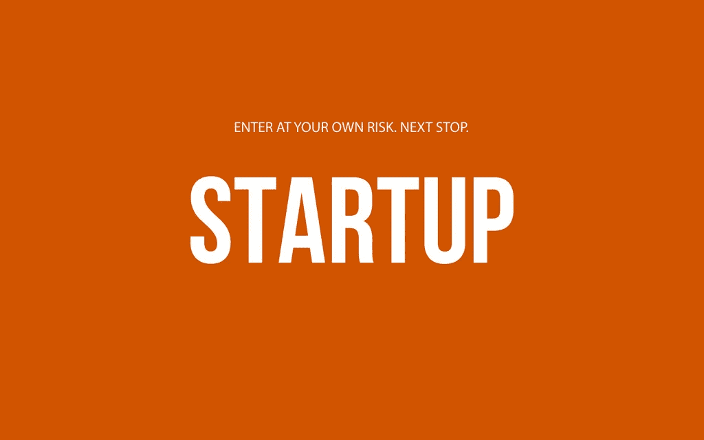
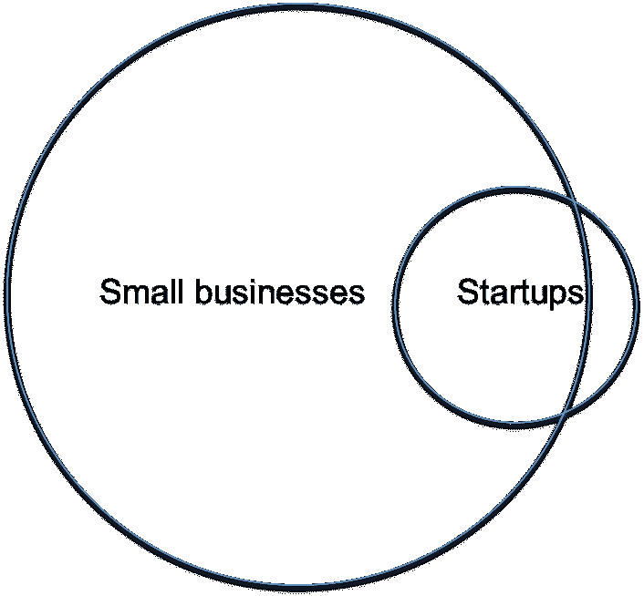

# 创业的一些定义

> 原文：<https://medium.com/hackernoon/some-definition-of-startup-86d35166e35>

(original source — [https://www.flickr.com/photos/brajeshwar/8946784950](https://www.flickr.com/photos/brajeshwar/8946784950))

创业到底是什么？

初创公司是一个新组建的公司，旨在寻找可重复和可扩展的商业模式。实际上，这只是创业的一个定义。在互联网上冲浪，人们可以找到许多其他的定义。但是没有固定的定义，因为它是一个相当新的术语。

让我们打开上面写的定义。“一家新组建的公司”——也就是说，如果某个东西已经运营了 10 年，它肯定不能被称为初创公司。我们所说的“可重复”是指，不仅今天有效，而且第二天、下个月也会有效的东西。这意味着，一家初创公司推出的产品或服务是新的，但却是有益的。我们说的“可扩展”是指可以扩展的东西，可以掩盖收入的东西。

通常，初创公司提供的服务/产品是市场上其他地方目前没有提供的，或者不是那么普遍。在初创阶段，初创公司的支出甚至可能超过收入。很多时候，当一家初创公司致力于开发和测试他们的产品时，他们会得到其他人、其他公司或银行贷款的资助。

Eric Ries 给出了创业公司的另一个定义:“创业公司是一个人类机构，旨在极端不确定的条件下提供新产品或服务”。他强调了“人”这个词，解释了它在这里的用法，因为许多初创公司和公司忘记了他们在为谁工作，而是把重点放在他们的产品/服务上。

创业公司的另一个重要特征是它是暂时的。它并不总是停留在同一水平，并被称为创业。显然，它要么成长为一家公司/企业，要么就会失败。但实际上，许多调查显示，大多数创业公司都成长为更大的公司，并且比小企业做得更好。

*那么* [*什么是小企业*](https://goo.gl/8A3HVV) *？*

小企业是私人拥有和经营的企业，通常只有少量员工。到底有多少是“小数目”？嗯，这个要看商家本身和国家。在这种情况下，业务类型很重要，因为某些类型的业务比其他业务需要更多的“帮助”。此外，企业的规模因国家而异。例如，在美国，小企业员工可能有 500 人。

*什么是创业？或者说谁是企业家？*

从根本上说，企业家是想出商业点子的人。这不仅仅是有一个好的商业想法。他/她还计划他们要卖什么，谁将成为他们的客户，他们将如何向他们的客户介绍他们的产品，他们将如何宣传他们的产品等等。换句话说，我们可以说企业家是创建企业的人，不管是不是小企业。

那么，创业公司和小企业的主要区别是什么呢？

主要的也可能是最重要的区别是，小企业更关注利润，而初创企业的主要目标是很好地实现他们的新想法。这就是为什么在大多数情况下，初创公司都是由其他更大的公司投资的，而且是实验性的。
它们之间的另一个区别是，小企业提供更传统的产品/服务。创业是一种新的、现代的甚至是未知的事物。
小企业可以经营很多年。他们可能会成长为更大的企业，但在大多数情况下，小企业会保持现状。而创业，正如已经提到的，是暂时的项目，在某个时候要么成长为企业，要么以失败告终。

> [黑客中午](http://bit.ly/Hackernoon)是黑客如何开始他们的下午。我们是 [@AMI](http://bit.ly/atAMIatAMI) 家庭的一员。我们现在[接受投稿](http://bit.ly/hackernoonsubmission)并乐意[讨论广告&赞助](mailto:partners@amipublications.com)机会。
> 
> 如果你喜欢这个故事，我们推荐你阅读我们的[最新科技故事](http://bit.ly/hackernoonlatestt)和[趋势科技故事](https://hackernoon.com/trending)。直到下一次，不要把世界的现实想当然！

