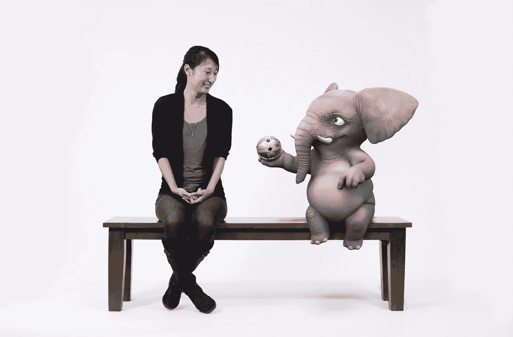

# 空间计算

> 原文：<https://medium.com/hackernoon/spatial-computing-9fc961a08b95>

Credit: [Disney Research’s Magic Bench](https://www.disneyresearch.com/publication/magic-bench/)

20 世纪 70 年代，微型计算机的引入引发了计算体验的巨变。到那时，人机交互已经被大型机所塑造:一台“大铁”机器被保存在一个固定的中央位置，并被许多用户共享。但是后来微型计算机改变了一切:计算变成了*个人化*，由更小更便宜的机器驱动，这些机器现在可以让*近在咫尺*并一对一使用*。*

过去四十年来，从昨天的微型计算机和个人电脑到今天的智能手机和可穿戴设备，再到明天的可植入设备和可摄取设备，很大程度上是关于实现个人计算的潜力。尽管该行业取得了令人难以置信的进步，但计算的个人本质(近在咫尺，一对一)并没有发生根本变化。

但这种情况可能不会持续太久。新兴技术、平台和行为的下一波浪潮最终将世界拉向一个新的方向:空间计算*。*机器，不再附属于我们，取而代之的是*(物理地或虚拟地)占据我们周围的空间，并且可以被*多人同时使用*(“多人模式”)。打破“个人电脑”模式的全新体验空间正在打开。*

## *为什么是现在？*

*就像个人计算一样，空间计算是在核心技术进步(如传感器、计算、人工智能/人工智能、3D 捕捉和渲染、显示器)、“后移动”行为和模式(如文本、语音、手势、AR/VR)以及新的计算环境(如手腕、眼睛、耳朵；在厨房和客厅、办公室地板和会议室、汽车中)。空间计算的几个经验原则直到现在才变得技术上可行、经济上可行、行为上可取:*

*   ***体现**:机器采取虚拟(代理)或物理(事物)的形式，与人一起表现为自己的实体，而不仅仅局限于桌子上的网站或某人口袋里的应用程序。想一想:可以看到和听到你并抓取完美自拍的个人无人机。*
*   ***智能**:机器感觉(听、看、读等。)，学习，决定，行动(说话，手势，动作等)。)通过人文界面，使他们能够融入更广泛的自然环境和社会背景。想象一下:你在繁忙的十字路口拦下一辆自动驾驶出租车，然后骑着它去上班。*
*   ***氛围**:机器时刻开着，时刻连接着，随着人们开始活动，机器在[背景](https://hackernoon.com/tagged/background)中自主运转(有时无处不在)，而不需要集中注意力。想想:拨入并转录每个呼叫的[会议](https://hackernoon.com/tagged/meeting)助理。*
*   ***主动性**:机器具有主动与智能，可以主动与人交流，也可以参与人际交流，而无需等待或进行人工操作。Think:家庭助理，它会在你走进家门时提醒你注意一条紧急消息。*
*   ***社会意识**:机器识别并与人(或其他机器！)进行一对多或多对多的交互，而不是假设与所有者进行一对一的交互。想一想:AR 这个角色会在周围环境中的每个人的肩膀上跳跃。*

*与之相关的是，这些原则(以及空间计算本身)与智能代理+智能事物的[世界紧密交织在一起。在](https://hackernoon.com/intelligent-agents-things-87b866f711ef)和[时代，我曾经写过很多关于机器的文章。](https://hackernoon.com/talking-with-machines-ab216a5581d8)*

## *突破主题*

*如果说微型计算机预示着个人计算的突破，那么现在又是什么预示着空间计算的突破呢？现在下结论还为时过早，而且很可能这种情况永远不会结束，但有几个显而易见的主题值得关注:*

*   ***增强&虚拟现实** *物理空间*
    中的虚拟体验通过显示器、魔镜、投影仪等呈现生活在视野中任何地方的交互式 3D 角色、对象和覆盖。*
*   ***机器人&很多** *在物理空间中体验物理体验*硬件设备和机器人生活和漫游在现实世界空间中，并与人和他们周围的空间进行物理交互。*
*   ***chat bots&Assistant Apps** *在虚拟空间中体验虚拟体验*存在于聊天群组、电子邮件线程、电话会议、代码转发等中的 Bots。作为额外的参与者并与人和内容交互。*

*虽然每个主题都反映了一种独特的空间计算方法，但它们之间的界限实际上非常模糊，例如，支持语音助手的设备，基于聊天的虚拟现实角色，AR 投影机器人，等等。空间计算的突破类别最终可能是多个主题的混合，甚至是一个尚未浮出水面的新主题。*

*这并不是说个人电脑正在消失。不是的。这里的主题并不局限于空间计算，还涵盖了许多个人计算用例，比如用语音助手设置定时器或在虚拟现实中观看电影。但这是说，存在以前不存在的体验的绿地潜力——帮助兄弟姐妹解决冲突的陪伴机器人，或打断呼叫以添加缺失上下文的会议助手，或桌面上有 AR 人物的自主冒险故事——这反过来又催生了新的产品类别。*

*如果你正在考虑或从事空间计算，[联系](mailto:vijay.sundaram@gmail.com)！*