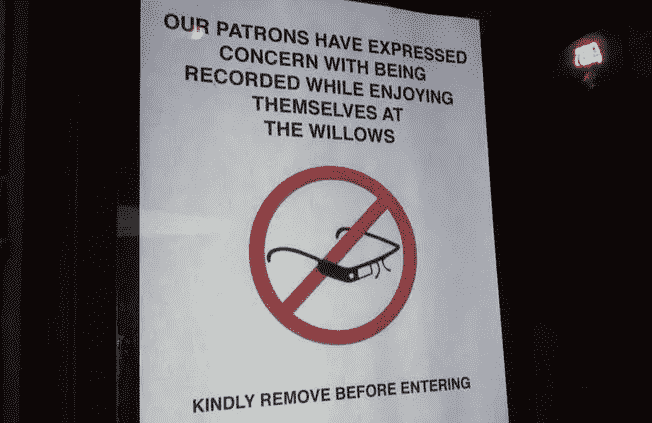
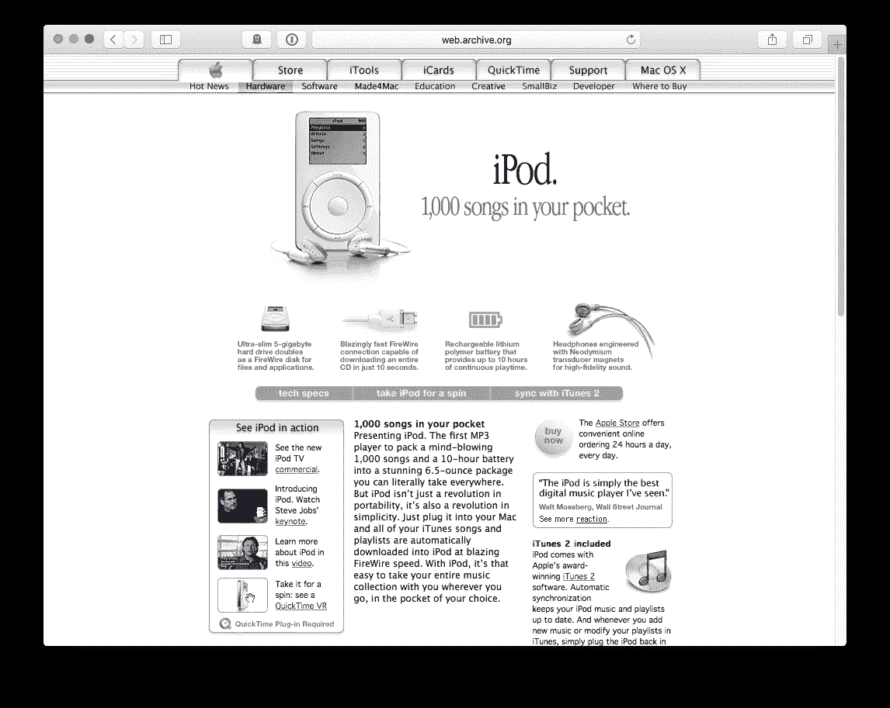
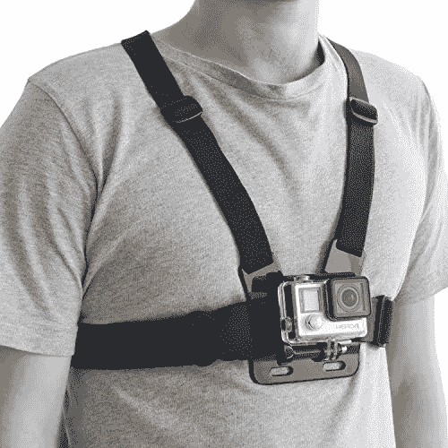

# 眼镜是反玻璃的

> 原文：<https://medium.com/hackernoon/spectacles-are-the-anti-glass-fc59ad4fc877>

## …他们将在谷歌陷入困境的地方取得成功

上周五晚上，Snapchat 发布了他们的首款硬件产品 Spectacles。尽管这是我们当前的社会宠儿的第一次硬件努力，埃文·斯皮格尔和他的公司似乎淡化了这一产品。在[《华尔街日报》在 Snap 上的特写](http://www.wsj.com/articles/snapchat-releases-first-hardware-product-spectacles-1474682719)，只有少数段落触及眼镜。一节沙袋整个努力:

> 就目前而言，Spectacles 似乎是一种娱乐。它的售价为 129.99 美元，发行有限，不能指望它马上带来可观的收入。Spiegel 将其称为一种玩具，可以在烧烤或户外音乐会上穿着玩——Spectacles 视频可以无线同步到智能手机上，便于分享。“我们将采取一种缓慢的方式来推出它们，”Spiegel 说。“这是关于我们弄清楚它是否适合人们的生活，以及他们喜欢它的程度。”

如果你忽略《明镜》周刊的卡尔·拉格费尔德肖像，整个事件相当低调。

谁能责怪他们呢？在加州的任何地方推出数字眼镜都迫使人们把它与谷歌眼镜进行比较，谷歌眼镜是一款其巨大的、改变生活的承诺从未兑现的设备。Glass 的发布视频是一个增强现实假设视频，接着是跳伞运动员的现场演示，然后是黛安·冯·弗斯滕伯格的时装秀。

与谷歌承诺的谷歌眼镜相比，Spiegel 为“烧烤或户外音乐会”设计的“玩具”相当普通。

但是没关系。

我认为 Spectacles 不仅会成功，而且会成为 Snap 的分水岭产品。原因如下:

## 眼镜侧阶玻璃的文化挑战

尽管他们的技术目标很高，但谷歌眼镜最大的挑战是文化。谷歌如此专注于谷歌眼镜的用户，以至于他们忘记了周围的所有人，导致了反社会产品的设计。我在这里详细介绍了[和](http://dbreunig.tumblr.com/post/45752835306/google-glass-is-just-like-the-segway-and)，但简单地说:

> “谷歌眼镜”的屏幕只对用户可见，它的摄像头可以记录除用户之外的一切，存储用户可以随意分享的内容。我认为，眼镜的这些始终存在的核心功能会阻止它在社交场合受到欢迎。眼镜使用者周围的人必须隐含地信任眼镜佩戴者，因为他们不知道眼镜使用者当前的注意力在哪里，也不能从视觉上确认他们当前是否被眼镜捕捉到。
> 
> **谷歌如此努力地将技术挡在门外，以至于他们忘记了为什么当技术出现时*看到*技术是如此重要。**

Snap 团队显然考虑到了这一挑战，因为他们做出了几个直接应对这一挑战的选择。他们加了一盏强光灯，向其他人展示你正在录音。他们将视频限制在 10 秒的片段，而不是持久的文档。最重要的是，他们制造了眼镜和太阳镜。

墨镜偶尔戴。墨镜不戴在里面。每个人都戴墨镜。在公共场合和娱乐时间戴太阳镜是有意义的。在室内戴上太阳镜，你就被认为是“那个家伙”，不需要机载相机。选择太阳镜特别严格地将眼镜的用例限制在社会可接受的范围内。眼镜在文化规范内工作，而不是试图重新定义它们。

## 眼镜有工作重心

像乔布斯的苹果一样，Snap 将专注和简单放在首位。

以上是[眼镜的网站](https://spectacles.com)。这里列出了我们需要知道的关于 Spectacles 的一切(保存设计和颜色，它会先和用户打招呼)。“从你的角度来看，眼镜制造记忆”这个承诺简单明了。

将上述内容与第一款 iPod 的[网站进行比较:](http://web.archive.org/web/20011114012126/http://www.apple.com/ipod/)

同样简洁的五点，包括一个明确的承诺:“口袋里有 1000 首歌。”[这一明确的承诺或愿景是为每一款苹果电脑以外的产品做出的](/@dbreunig/m-g-is-right-that-the-watch-isn-t-a-flop-95fb92cb6718#.fujaew1cn)(手表除外)。

当然，这似乎是最佳实践，但几乎所有试图发明一个类别的科技产品都忽略了这个建议。

眼镜不应该承诺延长寿命，只是更好的记忆。

Alexa 不应该承诺家用 AI，只是音乐点播。(当然，Alexa 做得还不错，但是比较一下上面的 iPod 和 Spectacles 网站和 Alexa 的主页。很不一样！)

除了共同的约束，Specs 和 iPod 都感觉像是实验。它们很奇怪，但无害，我敢打赌眼镜的销量也同样平平。他们会做得很好，但不会让世界着火。正如 Spiegel 所说，“我们将采取缓慢的方式推出它们。我们要弄清楚它是否适合人们的生活，看看他们是否喜欢它。”

## 当 Snap 找到公式时，眼镜将会无处不在

规格为 129.99 美元。[股票雷朋是 150 美元](http://www.ray-ban.com/usa/sunglasses/wayfarer/clv)。对于一件时装来说，规格已经够便宜了。电子元件甚至更便宜。

我们将不得不等待一个适当的拆卸，但规格可能包含蓝牙，一些照片的存储，几个芯片来运行整个事情，以及几年前的手机摄像头。(给他们做墨镜的另一个好处？相机只需要在明亮的光线下工作。)这个套餐已经很便宜了，而且只会越来越便宜。

如果 Snap 破解了代码，并发现这可以适合人们生活中的有趣部分，那么可以期待这个工具包在任何地方传播。如果 LensCrafters 的销售人员在询问防眩光涂层后问你是否想要带眼镜的太阳镜，我不会感到惊讶。

Snap 将追求一个好的价格点和小尺寸，然后他们会添加第二个摄像头进行 VR 录制。在 Snap 破解了用规格*和*分享视频的文化代码后，当人们有办法大规模消费 VR 视频时，VR 就会出现。

(同样有趣的是:所有的深圳山寨货。规格上的一切都可以从中国东南部的智能手机零件仓库中获得。期待照片的克隆很棒，但它和谷歌的其他产品是关于智能发现，而不是记忆。

Everyone hyping VR got very excited when they saw two ports in the frame.

## 明镜已经瞄准了目标:

他研究了 T2、柯达和宝丽来等公司的历史，以及它们如何向公众推销自己。“首先是拍一张照片，”斯皮格尔说，描述了人们参观工作室的方式，类似于我们现在正式开会时所在的工作室。“然后是拍照”，因为便携式相机让人们捕捉随意的快照。“最后，它变成了给一张照片，”开始是在派对上递给朋友的即时宝丽来相机，后来演变成智能手机相机，让你可以将自拍传给地球上的任何人。

Snap 刚刚在动作摄像机市场扔了一颗炸弹

Snap 只是拿了一个特色产品，展示了它如何可能成为大众。不是史诗时代给史诗人物的史诗相机，而是有趣时代给有趣人物的有趣相机。

你想要哪个市场？

(顺便说一句，12 月去时代广场，寻找胸前绑着 GoPros 的游客。机遇往往看起来像许多人在做尴尬的事情。)

> (又一个尴尬的行为？使用 GoPros 和无人机的人花了整个飞机飞行时间试图将他们的流编辑成实际可消费的东西。Snap 的 10 秒限制是一个明智的选择。)

## Snap 现在有世界上最好的简报

Snapchat 拥有大量的用户，他们使用这款应用来找乐子并分享这种乐趣。每天早上醒来一定很兴奋，任务是弄清楚如何实现那个承诺。

我承认，我已经对 Snapchat 持怀疑态度一段时间了。我不相信 VR/AR 的说法，因为照片滤镜相当简单，而且是一个非常有限的挑战。脸书在社交领域的持续主导地位看起来是不可动摇的。

但是 Specs 以一种我以前没有意识到的方式明确了 Snap 的含义。

Snap 的一位朋友很快回复了这条短信:“很有趣，埃文多年来一直在宣扬这种东西。只需要一个故事或一个产品就能把它们融合在一起。”

## [黑客中午](http://bit.ly/Hackernoon)是黑客如何开始他们的下午。我们是 [@AMI](http://bit.ly/atAMIatAMI) 家庭的一员。我们现在[接受投稿](http://bit.ly/hackernoonsubmission)并乐意[讨论广告&赞助](mailto:partners@amipublications.com)机会。

如果你喜欢这个故事，我们推荐你阅读我们的[最新科技故事](http://bit.ly/hackernoonlatestt)和[趋势科技故事](https://hackernoon.com/trending)。直到下一次，不要把世界的现实想当然！

I’ll admit, I’ve been a Snapchat skeptic for a bit now. I didn’t buy the VR/AR argument, as photo filters are rather simple and a very constrained challenge. And Facebook’s continued dominance in social looked immovable.

But Specs crystalizes what Snap stands for in a way I hadn’t realized prior.

A friend at Snap responded to this remark, sent via text, very quickly: “It’s funny, Evan’s been preaching this stuff for years. Just takes one story or product to bring it all together.”

> [Hacker Noon](http://bit.ly/Hackernoon) is how hackers start their afternoons. We’re a part of the [@AMI](http://bit.ly/atAMIatAMI) family. We are now [accepting submissions](http://bit.ly/hackernoonsubmission) and happy to [discuss advertising & sponsorship](mailto:partners@amipublications.com) opportunities.
> 
> If you enjoyed this story, we recommend reading our [latest tech stories](http://bit.ly/hackernoonlatestt) and [trending tech stories](https://hackernoon.com/trending). Until next time, don’t take the realities of the world for granted!

