# 23 岁时在东欧开始并自筹资金做软件生意

> 原文：<https://medium.com/hackernoon/starting-and-self-funding-a-software-business-in-eastern-europe-at-the-age-of-23-c13d3ea4beb5>

*为什么我决定分享这个故事:*

*对于有抱负的企业家来说，在东欧这样的地区出生和长大，会面临一系列非常不同的挑战。经济不发达，这使得说服任何人购买你试图卖给他们的任何东西变得极其困难。人们悲观绝望，大多数富人通过腐败和犯罪活动赚钱。经营一家合法企业几乎得不到支持或资助。人才稀缺。在地方一级，没有什么可以竞争的，也没有人可以与之竞争。所有这些因素加起来就是企业家在创办公司时通常会经历的压力。这绝对不是你在互联网上或流行文学中读到的那种典型的“创办公司”的故事。*

离我大四开学只有几天了，我在想我应该做些什么来充分利用我在保加利亚[美国大学](http://www.aubg.edu)的最后几个月。

我回顾了我在大学的最后三年。我是个好学生——我的成绩很高，我在体育运动中相对活跃，也取得了一些成绩。但是我没有做过任何有影响力的事情。我太专注于保持良好的学术地位和为就业市场做准备。我是来自东欧一个小镇的典型学生——我家很穷，为了保住我的助学金和奖学金，我必须成为一名优秀的学生。我总是担心，如果我冒险参加一项更耗时的课外活动，我会失去我的好成绩，降低我获得成功职业的机会。

我并不总是这样。十几岁的时候，我曾经做过各种各样的事情——导演短片，加入在线游戏社区，和来自世界各地的人一起玩。2009 年，我创建了 [World-Garage](https://www.facebook.com/WorldGarage/) ，这是一个致力于 EA 游戏《速度的需要:世界 MMOR》的粉丝网站。我们是游戏的第一批粉丝社区之一，并得到了 EA Games 的大量支持和赞助。

World-Garage 的秘方是它创造的伟大内容和活动——我们制作了 machinima、角色扮演、[汽车切割](https://www.google.bg/search?q=car+chopping+photoshop&safe=off&rlz=1C5CHFA_enBG693BG694&espv=2&source=lnms&tbm=isch&sa=X&ved=0ahUKEwjbkPzOm7rTAhUBERQKHR5oCPMQ_AUIBigB&biw=1440&bih=803#safe=off&tbm=isch&q=photoshop+chopping+car)竞赛和游戏内聚会。这为我们赢得了大量的追随者，并使我们的社区保持活跃。我们在 YouTube 上获得了成千上万的浏览量，在我们的网站上每天都有数百人注册。这是一个爆炸。作为一个生活在保加利亚小镇的 16 岁少年，活跃在互联网上是我能做的最好的事情——我磨练了我的英语技能，生活在一个国际(虚拟)社区中，学习各种技术技能。如果我没有这么做，我可能会去卖毒品，做运动，或者像大多数同龄人一样在城里闲逛。

我渴望在大学的最后一年做类似的事情。我曾几次试图进入当地的[初创企业](https://hackernoon.com/tagged/startup)社区，但可以理解的是，投资者不愿意资助一个过于担心成绩的大学生。然而，我所有失败的尝试并没有完全白费，因为我设法赢得了去美国参加[暑期创业项目](https://vimeo.com/143328343)的奖学金。

在这个项目中，我们参观了纽约的创业点，并在波士顿的巴布森学院学习了一个月的创业知识。我们的旅程在硅谷、Airbnb 和其他价值数十亿美元的独角兽的总部停留了一周，达到了高潮。

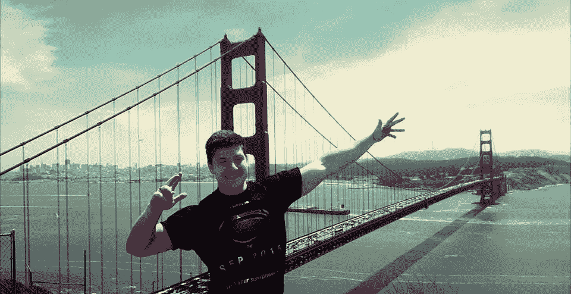

The Summer Entrepreneurship program funded by the [ABF](http://www.us4bg.org/) was a big eye-opener for me.

看到美国科技领域的魅力和壮观，我仿佛回到了少年时代。我在这个项目中遇到的人们的激情和热情激励了我，我在保加利亚随身携带了硅谷的一部分。我决心开始做点什么。毕竟我快高三了，不用再担心成绩和奖学金的问题了。

我打电话给我的朋友兼同学 Gavril，花了几个小时讨论我们在最后一年可以做些什么。Gavril 几乎是一个人赢得了微软创新杯的全国决赛。他的团队成员没有继续下去的动力，只是决定到此为止。我们讨论了我们大学的学生如何缺乏硅谷人所拥有的激情和雄心。在我们大学学习计算机科学的学生是高度个人主义和被动的。他们大部分时间都呆在宿舍里，写作业和阅读功课。

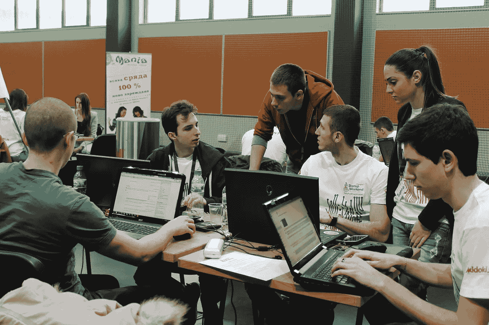

Gavril (center, with the red hoodie) has always been active in all kinds of technology competitions, so I knew we’d make a good team.

大学里的计算机科学俱乐部毫无生气。他们组织了一些活动，主题平淡乏味。出席率很低。Gavril 和我都曾试图成为俱乐部的成员并改变现状，但我们都被无缘无故地拒绝了。

所以我们决定把事情掌握在自己手中。我们创建了自己的学生俱乐部，在那里我们可以将所有的精力和热情用于技术。我们的计划是把学生带出他们的房间，把他们放在一个空间里，激励他们一起运用他们的技能去创造一些东西。我们想向他们展示这个世界给他们带来的无数机遇和挑战，因为他们显然没有意识到自己错过了什么。

**与我在硅谷遇到的人不同，我们的技术导向型学生中只有少数人参与了 hackatons，为开源软件做出了贡献，开设了个人博客，或者在 StackOverflow 等在线帮助社区回答了问题。对于科技界的其他人来说，他们几乎是隐形的。**

Gavril 和我没有太多时间考虑品牌和名称，所以我们启动了一切:我们将俱乐部命名为 [**AUBG Spaces**](https://www.facebook.com/TheHubAUBG/) **(后来更名为 Hub)** ，并将我创建的创业公司的徽标作为夏季创业计划的练习。我们印了几张激励海报，贴在校园里。

Sleep-deprived after a long night of brainstorming, we came up with several different designs of posters for our own club — [AUBG Spaces](https://www.facebook.com/TheHubAUBG/).

我们的第一次活动非常成功。我们强调了我们在大学现状中看到的所有问题，并得到了学生和管理层的大力支持。我们非正式地开始在学生中心的一个房间里聚会，并组织了技能分享会、小型聚会和培训。我们开始邀请业内专家，并组织实地考察当地技术公司和会议。

寒假来了，我们新成立的俱乐部成了校园里最热门的话题。Gavril 和我被培训学生、组织活动和与公司沟通的压力压得喘不过气来，以至于我们没有时间考虑毕业后要做什么。

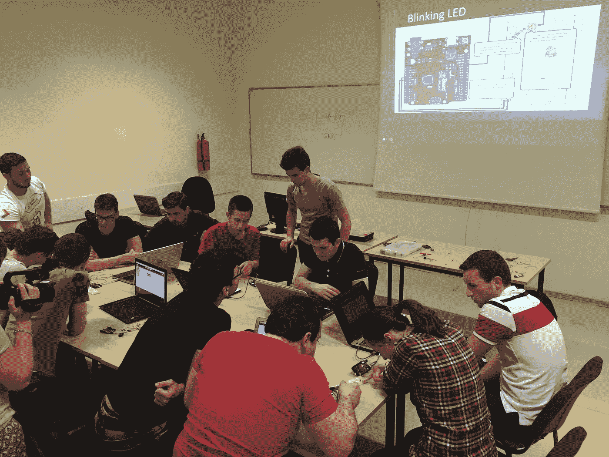

AUBG Spaces quickly became a hot topic among computer science students

然后，我们大学的一位支持我们俱乐部的教授让我们联系了当地一家管理住宅物业的公司。该公司在扩展其业务流程时遇到了问题。每个月，他们必须组织不同城市的几个物业的居民，并管理他们所住大楼的费用。他们使用纸张和 excel 电子表格来完成这项工作，而且管理越来越多的物业的流程带来了很多麻烦。

我和加夫里尔去他们的办公室咨询他们。在对他们的问题有了更深入的了解后，我们同意为他们创建一个业务流程优化(BPO)软件解决方案，他们也愿意为此付费。在寒假期间，我们组织了一些学生，开发了一个 web 和 iOS 应用程序的原型。

寒假结束后，我们收到了项目的第一笔付款，Gavril 和我认为简单地分发和挥霍这些钱是一种浪费。申请硕士学位有点太晚了，我们有太多的乐趣去考虑从企业界的最底层开始。

## 我们把所有的钱都投入到了创建 Centro IDA(T1)上，这是一家端到端的数字产品开发公司，使用微软技术为 iOS、Android(原生)和 Angular 提供咨询、软件开发和培训。NET Web Api & Azure)。

我们想出了这个名字，因为我设计的标志似乎代表了一个[形心](https://en.wikipedia.org/wiki/Centroid)，我们在互联网上找不到任何其他实体有相同的名字。然后我们自办了一个[网站，](https://www.centroida.co/)在校园旁边的楼里租了一个小空间，买了几张桌椅，开了一个派对。

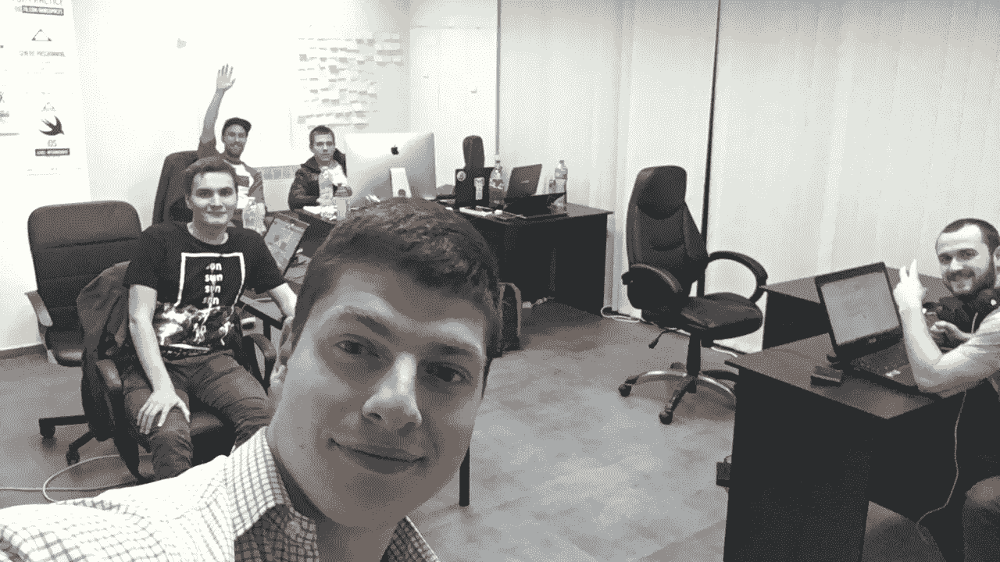

Working late in Centroida’s newly-established office.

这立即引起了学生、教师和管理人员的兴趣。[学生媒体](http://aubgdaily.com/aubg-spaces-the-first-aubg-club-to-become-a-firm/)和[大学媒体](https://www.facebook.com/AUBGcurious/posts/1162562097096001)分享了这一消息，我们开始普遍受到更多关注。人们很好奇，想看看接下来会发生什么，我们已经设定了很高的期望。为了生存，先涛公司必须提供大的产品，最大的挑战就在我们面前。

那是三月，离毕业还有两个月，我们继续开发管理住宅物业的软件解决方案(也称为街区管理)。我们发现还有其他公司和独立经理在为我们的软件优化的过程而努力。我们的第一个付费客户是概念验证，所以我们看到产品走向哪里似乎是合乎逻辑的。这个软件解决方案现在有了一个名字— **Centralproperty。我们赢得了一些当地的比赛，这给公司带来了新的资本。**

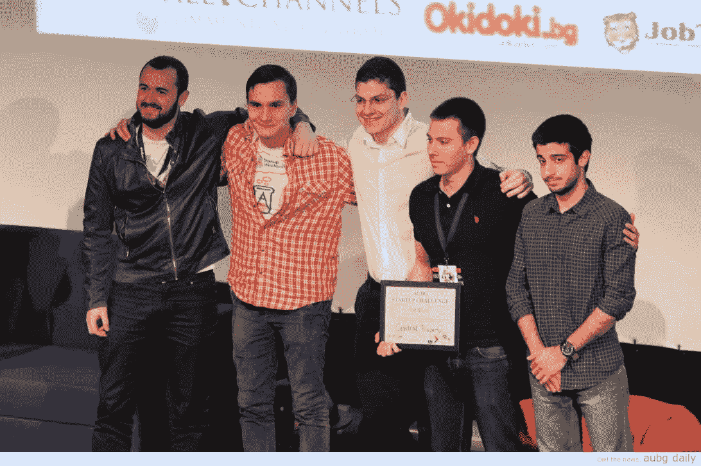

尽管资金不断涌入，但我们需要存更多的钱，因为我们计划毕业后搬到首都索非亚。Gavril 在夏天从他的工作中攒了一些钱，我开始为 [Pluralsight](https://www.pluralsight.com/guides/author/Kaizeras) 写指南。另一个大问题是，我们已经开始建立一个稳固的团队，所以我们必须寻找一个合适的办公室来工作。

值得庆幸的是，帮助我们完成第一个项目的教授联系了学校的管理部门，问我们是否可以做一些交换。他们向我们提出了一个可以解决办公室问题的提议:**我们同意彻底改造大学旧的课程注册系统，以换取大学在索非亚的一栋建筑——埃利夫中心**的一个房间。如果没有 AUBG 的教师和管理人员的支持，我们在索非亚的发展会困难得多。

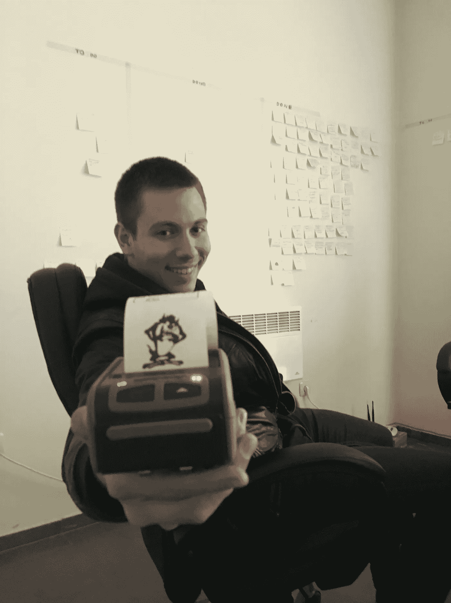

Gavril showing a mobile printer used by the cashiers who collected the resident’s payments through our iOS app. Behind him — Centroida’s scrum board.

五月即将来临，我们静静地度过了毕业典礼和聚会。我们的一些毕业生找到了工作，其他人被国外的大学录取，但我、Gavril 和 Teodor 在我们租下第一间办公室的时候加入了，他们有另一个当地的创业竞赛即将到来，我们有一个业务关键的交付要为我们的客户做。我们还必须支付工资。在所有围绕毕业的庆祝活动结束后，我们在家乡呆了几天，收拾行李，前往索非亚，渴望在那里建立我们的办公室。

我们参加的下一个比赛是由 J [unior 成就保加利亚](http://www.jabulgaria.org/)组织的，我们和其他由大学生创办的公司一起竞争“保加利亚最佳学生管理公司”。该活动在索非亚科技园举行，获胜者将由保加利亚共和国总统亲自颁奖。

当我们来到索非亚时，我们只有三天的时间来建立我们的办公室并为活动做准备。我们尽可能做好了准备。这是我们在全国范围内曝光的机会。

令我们惊讶的是，我们在活动中遇到的竞争并不像我们最初想象的那样好。来自其他大学的学生要么是在建造处于非常早期阶段的东西，要么是复制已经存在的东西。我们的 product Centralproperty 具有可靠的商业计划、工作原型和付费客户，很容易脱颖而出。这是一场轻松的胜利。

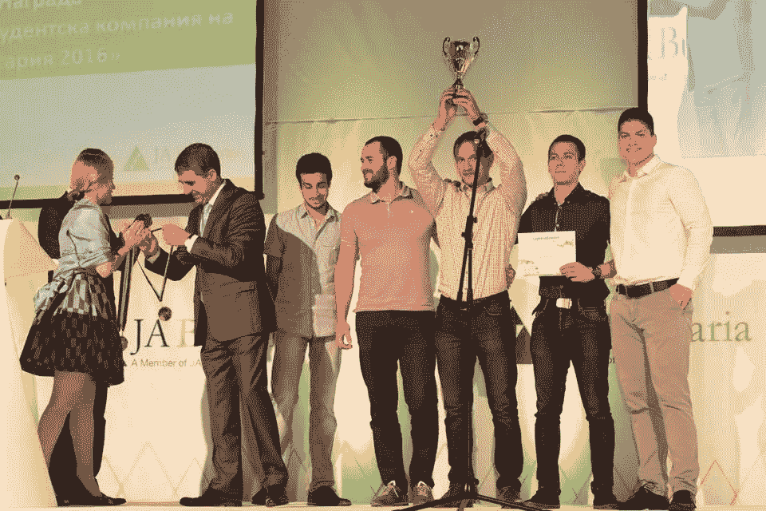

Being called the “Best student-run company in Bulgaria” by the President gave us a great exposure.

在短暂的庆祝和几个朋友和家人祝贺我们成功的电话后，我们不得不回去工作，准备好办公室。

最大的挑战是我们不能在大楼里上网。可用的只有 AUBG 的内部网络，而大学的通信办公室不想与我们共享，所以我们必须想办法尽快上网。为了让工作继续下去，我们不得不使用我们的移动互联网，每月几百美元。这是不可持续的。

然后，Gavril 决定向附近大楼的人要互联网。Wi-fi 还不够——我们需要一根电缆以某种方式连接到我们的办公室。一个店主同意帮助我们，所以我们打电话给一家电信公司，在他的店里为我们安装了一个单独的插座。一旦他们安装了插座，我们就必须把互联网接入我们的办公室，那是在埃利夫中心的二楼。因此，我们从商店的地下室开始铺设了一条 50 米长的电缆，穿过商店窗户角落的一个洞，穿过埃利夫中心院子的围栏，穿过一条小巷，绕过其中一根柱子，来到我们的窗户前。当我们来寻求帮助时，店主并不像她最初那样高兴，但我们尽了最大努力用一些酒和糖果来改善这种情况。

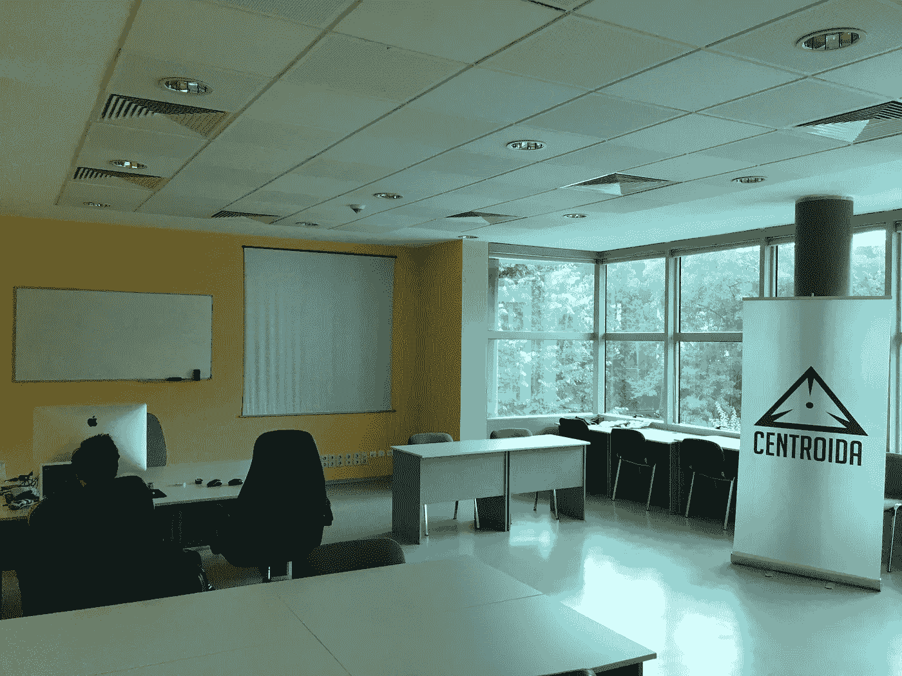

Centroida’s new office in Sofia — June 2016\. The internet cable came from the window in the corner of the room.

## 有了固定的办公室和少量的积蓄，未来似乎一片光明。我们一点也不知道，最紧张和最具挑战性的时期就在我们面前。我们即将离开所谓的“AUBG 泡沫”,进入在保加利亚经营企业的严酷现实。

随着互联网的建立和运行，我们准备全速前进。我们收到了一些来自保加利亚客户的关于定制软件开发的询问，以及一些关于 Centralproperty 演示的请求，因此我们忙于安排会议。

与 Centralproperty 潜在客户的会议气氛紧张。一些街区管理公司的所有者感觉受到了软件的威胁——他们认为我们会窃取信息或窃取他们的成果。其他人没有特别好的计算机技能，用软件工作的想法让他们害怕。也有一些客户提出过分的功能要求，但他们不愿意为此付费。最重要的是，这些公司的所有者反应有些迟钝。其中许多对我们来说是粗俗或粗鲁的。推进这一进程是如此艰难。

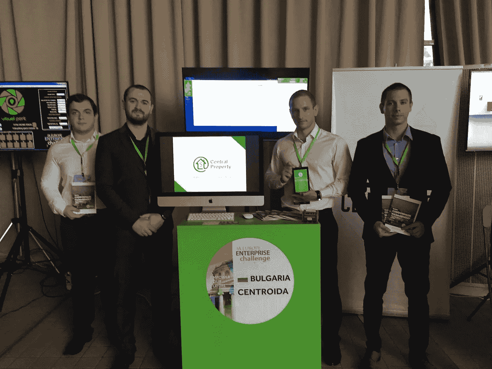

Presenting Centralproperty at Junior Achievement’s Europe Enterprise Challenge.

我亲身体验了在发展中经济体与企业合作的感受:这些小型设施管理企业的所有者没有接受过数字产品、业务流程优化或任何新技术方面的教育。对我来说，感觉这些人仍然停留在 90 年代。

出现了一种更令人担忧的模式:与我们的第一个客户不同，大多数后来的客户要求我们向最终用户“隐藏”软件中的一些数字，他们的理由是“他们真的不需要知道这些”。这让我们怀疑管理住宅物业的人和公司欺骗了居民。通常，从居民那里收集到的大部分钱会放在一个“黑箱”里，然后神奇地作为费用分配出去。使用 Centralproperty 会增加该过程的透明度，并破坏该方案。

所有这些经历使我们得出结论，中央房地产在保加利亚是很难推销的。住宅设施管理业务中的腐败和有害环境使我们无法销售出真正能带来价值的产品。

认识到这一点让我们很难过。我们花了几个月的时间相信我们正在建造的东西有助于物业经理，但他们不想这样——他们想让这个过程变得困难，这样他们就可以从居民那里偷钱。

今年 7 月，我去了冰岛的一所暑期学校，我的费用由一个欧盟项目支付。

尽管我在冰岛呆了一个月，但我的心思一直在 Centroida 在保加利亚的办公室。每天我都会花几个小时为 Centralproperty 开发功能，并询问事情进展如何。消息并不好:Centralproperty 的潜在客户拖着我们到处跑，试图以一种允许他们欺骗客户的方式改变软件工作。另一方面，要求定制软件开发的客户希望以四分之一的价格开发他们的解决方案，这使我们面临进入死亡行军和减缓公司发展的威胁。

当我回到办公室时，气氛没有我离开时那么愉快。我们的团队壮大了一些，但我们的工作成本很低。我们的客户大多是保加利亚人，他们付不起我们的工资，所以他们用特征和合同义务欺负我们。与全球市场上的价格和条件进行谈判是非常困难的。付款被延迟，因此按时支付工资开始变得困难。

我们的主要收入来源来自我们的一个外国客户。这是一家在美国做大麻分析的初创公司。我们管理他们的整个软件开发过程。费率不是很高，但我们在保加利亚市场的收入不错，而且我们按时拿到了工资。但我知道，如果我们继续这样下去，从长远来看，我们几乎无法养活自己和我们的员工。我们将无法积累任何资本。

尽管困难重重，Centroida 还是有自己的魅力。这是一家小公司，拥有一支年轻的国际团队，位于索非亚学生城的中心。我们说英语，行为不同，思维方式也不标准。这让我们鹤立鸡群。每个人都很好奇我们在做什么。我们从不缺少申请我们职位的人。总有人渴望和我们一起工作。但也有人称我们为“被宠坏的西化小子”。

我们的文化为我们的办公室带来了许多聪明的年轻人，他们每个人都愿意学习新技术和建造复杂的东西。作为创始人，我们的时间现在被分配在培训员工、满足客户需求和解决最困难的技术问题上。我几乎每天都从 9 点工作到 9 点。我们全心全意开发员工的潜力。

新年伊始，我第一次感觉到了抑郁的迹象。我们飞快地跑出跑道。我们在一个地方积累了大量的技术人才，但我们无法为他们找到工作。随着整个世界都在经历寻找技术人才的困难，失业的想法似乎是不可能的。但不知何故，我们最终几乎没有项目在我们的管道中，我们开始想知道我们做错了什么。同时，我们知道每个员工都有巨大的潜力，我们不想让他们走掉。

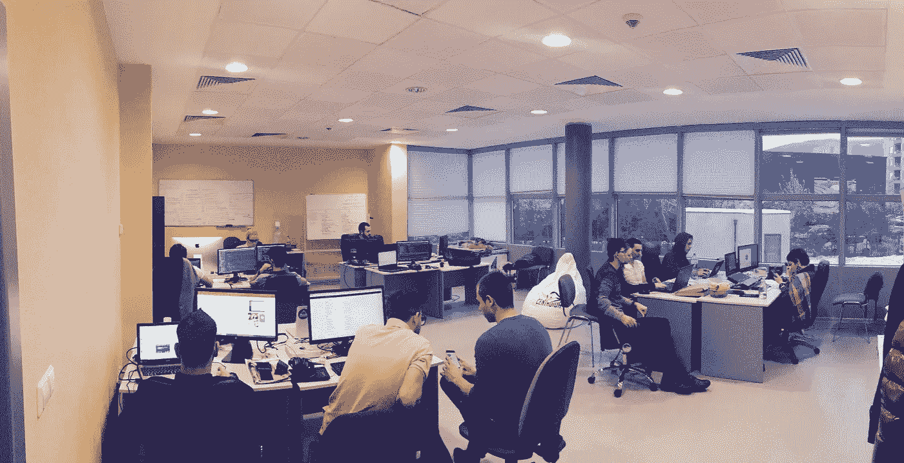

Centroida’s office in the beginning of winter 2016: Teeming with young and ambitious people, thirsty for knowledge and success.

后来有一天，我们突然意识到我们犯了一个错误——我们过于关注运营工作，并与错误的客户合作:我们与太小的公司和个人合作，无法支付我们或给我们带来重复的业务。他们中的一些人公然欺骗我们，不给我们报酬或试图付给我们太少的报酬。我们没有努力向保加利亚以外的客户推销我们的服务，也没有为发展我们的业务投入足够的精力。**唯一的解决办法是放弃本地市场，开始在全球舞台上竞争。**

加夫里尔、特奥多尔和我一起制定了一个拯救公司的紧急计划。我们计划给保加利亚以外的所有联系人打电话，发送冷冰冰的电子邮件，宣传我们的服务。世界必须了解先涛公司及其优秀的技术团队。

我们试图在员工面前保持乐观，并向他们保证一切都会好起来，但我们眼睛下面的眼袋表明了一个更加严峻的现实。随着每一天的过去，森特罗里达的末日越来越成为现实，而不是可能。“如果我们做不到，我们会做什么”这个话题开始越来越频繁地出现在我们的讨论中。自从创办公司以来，我一直有睡眠不足的问题，但问题恶化到我睡眠时间不能超过 4 小时的地步。

我们周围的氛围也没什么帮助:我们生活在[学生的城镇](http://www.bbc.com/news/world-europe-21364650)，那里的大多数人缺乏创业精神，喜欢快速消费(主要是在汽车和健身补充品上)，而不是考虑他们的未来。他们长时间工作，他们工作不是为了实现梦想，而是为了生存。他们中的大多数人的工资接近最低工资，所以他们甚至不能考虑储蓄资本或投资。他们也没有时间考虑全球变暖是否会毁灭地球，或者我们什么时候开始去火星旅行。这不是创办公司的典型地点。

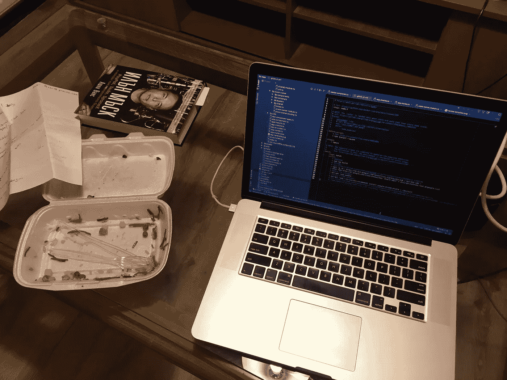

Eastern European Tech Entrepreneurship summarized in one photo — $2.30 dinner, Elon Musk autobiography and late night coding sessions on a $4,500 MacBook Pro bought during a Work & Travel program in the US. The impromptu drag strip outside makes work and sleep a mental challenge.

我在那里，试图经营一家软件开发公司，每天工作超过 12 个小时，试图逆潮流而动。但我知道我做的是对的。我知道我们的团队有很大的潜力，我们可以发展。我们只需要找到合适的人和公司来合作。

**向全球市场开放的第一步是将我们的最新作品添加到我们的网站上，并加强我们的在线存在——这是“外部”人士了解我们的最便宜的渠道**。我们要求我们的团队开始编写内容，并参加 Sofia 周围的技能分享会议，以获得一些曝光率。我们是成千上万个软件开发外包/咨询公司中的一员，他们在那里竞争项目，所以我们必须向世界证明我们是有价值的。

然后，到了三月中旬，就在我们实施应急计划一个月后，我们开始慢慢地收到越来越多的询问。我们推广 Centroida 工作的努力开始得到回报。我们收到了来自世界各地的询问，我们彻底解决了每一个问题。

我们的团队在他们所做的事情上变得如此出色，以至于我们比以往任何时候都更快地交付了产品，在短短几周内，我们就重振旗鼓了。

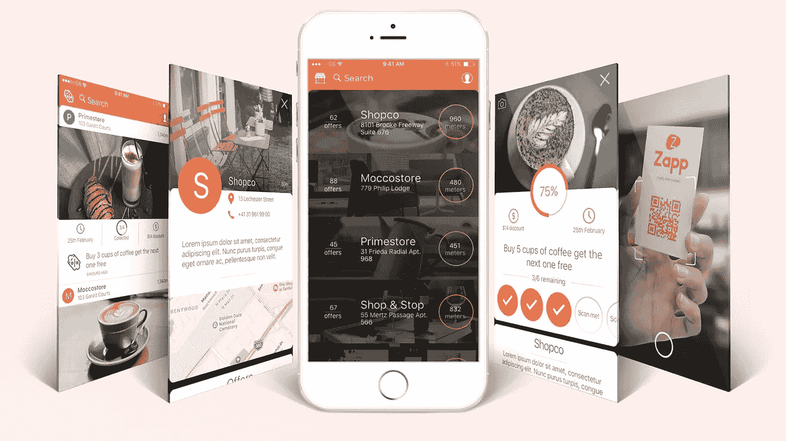

The iOS version of Zapp — a loyalty app we’re developing for one of our customers. Also available for web and Android.

所有的推荐和积极的评价给我们带来了大量的推荐，一切都归结为我们为客户做了一件好事。当与全球客户打交道时，我们不必像与本地客户打交道那样，一直浪费时间重新谈判条款，应对功能障碍或被胁迫免费工作。**自从我们走向全球，我们已经与几家企业建立了合作关系，稳定了公司的现金流。**

# 经验教训

危机得以避免，但我所经历的事情给了我一些关于东欧商业的重要教训:

**尽快放弃本地市场—** 如果你很年轻，你的企业有走向全球的潜力，不要被本地客户和投资者的兴趣所诱惑。他们知道你年轻天真，他们会努力发掘你的才能，直到你意识到你错过了什么。记住:不管他们承诺给你的东西听起来有多大，他们经营的市场比你能销售的市场要小几倍*倍*。在大多数情况下，从经济上来说，他们不可能支付比你能与来自更大市场的潜在客户/投资者讨价还价的价格更高的价格。

**促进包容、国际化的公司文化—** 东欧文化非常保守，这使得许多当地公司无法吸引更多人才，因为公司领导层的偏见和工作氛围。尝试建立一种包容的文化，你很可能会拥有许多才华横溢的同性恋、有色人种，如果你经营的是一家以技术为导向的企业，还会有拥有丰富技术知识的女性。有了这样的公司文化，你会赢得许多来自不同少数民族的忠诚员工。

**像在一个竞争激烈的环境中一样工作和推动你的公司—** 你在一个发展中的经济体中运营，可能感觉你做得相对较好，但请三思你在与谁比较——你应该记住，你在世界各地都有竞争对手。有些公司不得不在本地和全球范围内竞争，因此他们建立了更先进的职业道德和文化。他们的环境使他们在交付上更加努力，并尽可能优化一切。试着跟随那些生产力高的国家的做法，忽略当地市场的工作文化，因为缺乏竞争会使企业发展缓慢，效率低下。

# 结论

如今，在东欧创业和经营一家企业可能具有挑战性。然而，值得一提的是，也有积极的因素，主要是低成本，这吸引了许多投资者将资本投入保加利亚和其他东欧公司。

由于成本如此之低，而且靠近更大的市场，创业失败的代价很低，你可以在公司的初始阶段生存更长时间。在发达市场，我们犯下的一些错误可能会严重影响我们的生存机会，但总部设在保加利亚给了我们更大的弹性，因为我们在危机期间保持公司运营的成本更低。

低成本也让你可以套利，尤其是如果你提供高附加值的服务和产品。高附加值的服务会给你带来客户，他们不是因为你的低价，而是因为你提供的服务/产品的质量而雇佣你。如果你设法把这些点恰当地连接起来，并有正确的技能和背景，如果你把你的生意建立在东欧，你可以很快积累大量的财富。

# 现在去哪里？

软件开发和咨询是一个很好的行业，但是世界上有成千上万这样的行业。我们的目标是收集足够的技术和资金，将 Centroida 转变为一家产品公司。

我们的策略很简单:想想 10 年后我们希望看到什么样的未来，然后创造它。进入软件开发和技术领域给了我们几乎无限的梦想和实验的能力。我们想要做的事情之一是让为 [WebVR](https://developer.mozilla.org/en-US/docs/Web/API/WebVR_API) 创建 UI 控件变得更容易(Centroida 最初是打算成为一家专注于 VR 的公司)。我们正在与一家人工智能初创公司合作开发聊天机器人。我们还研究了使用低频蓝牙传感器的物联网。时间会告诉我们关注的焦点会在哪里。

至于 Centralproperty，我们已经暂停了这个项目，直到我们想出如何处理它。我们考虑的可能性之一是将其国际化，并向所有人开放注册。目前，Centralproperty 负责管理超过 20，000 个家庭，通过开放平台，它将帮助希望透明的公司和个人更快更好地工作。

同时，你可以在[社交媒体](https://twitter.com/CentroidaCo)上看到我们在做什么，或者查看我们[分享的一些代码](https://github.com/Centroida)。你想和我们一起工作还是只是聊聊天？给我们写一封电子邮件。

> [黑客中午](http://bit.ly/Hackernoon)是黑客如何开始他们的下午。我们是 [@AMI](http://bit.ly/atAMIatAMI) 家庭的一员。我们现在[接受投稿](http://bit.ly/hackernoonsubmission)并乐意[讨论广告&赞助](mailto:partners@amipublications.com)机会。
> 
> 如果你喜欢这个故事，我们推荐你阅读我们的[最新科技故事](http://bit.ly/hackernoonlatestt)和[趋势科技故事](https://hackernoon.com/trending)。直到下一次，不要把世界的现实想当然！

