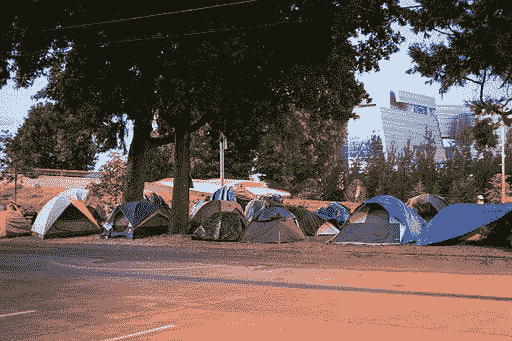
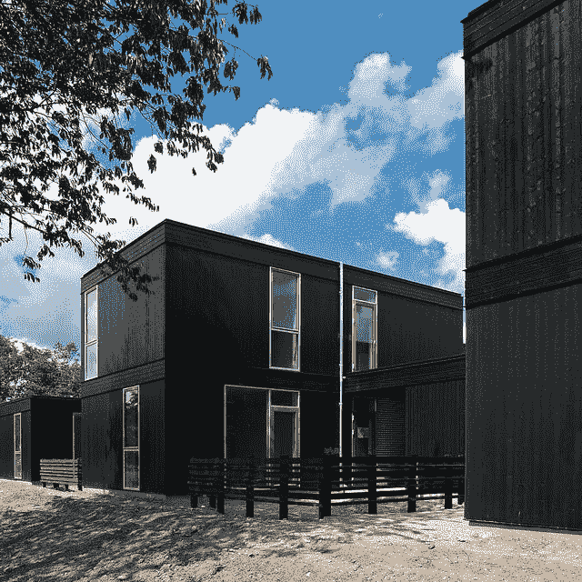
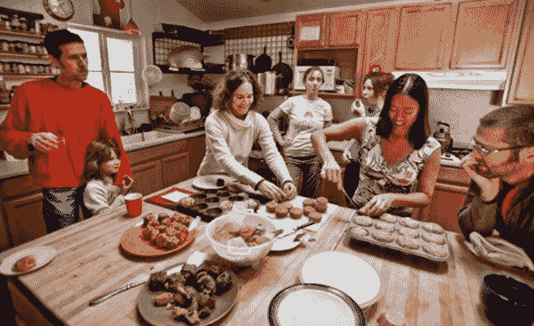
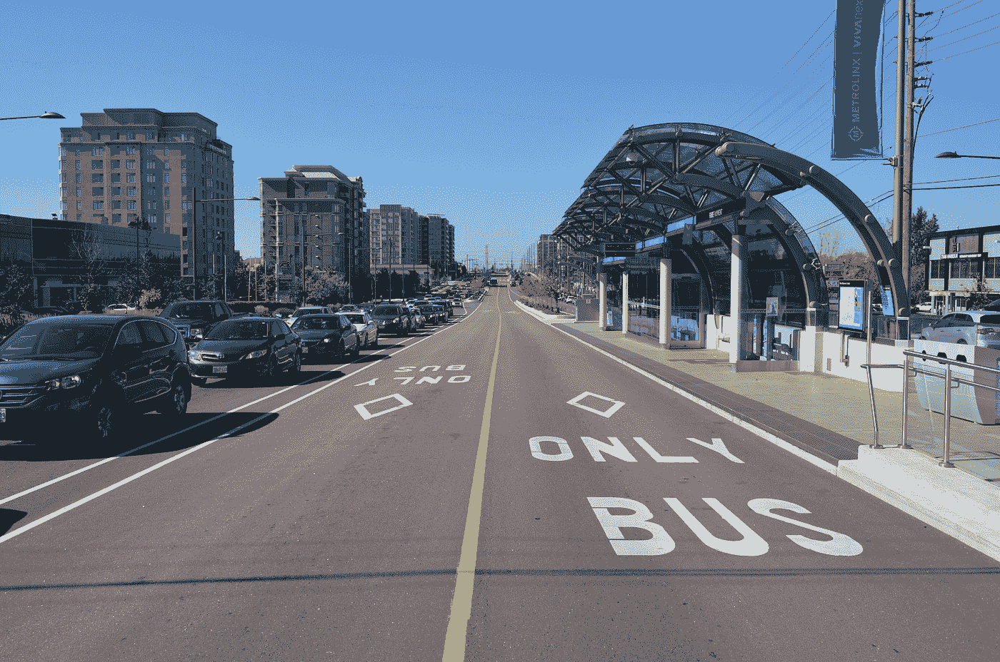
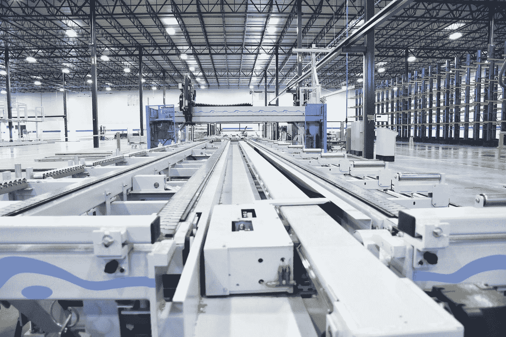
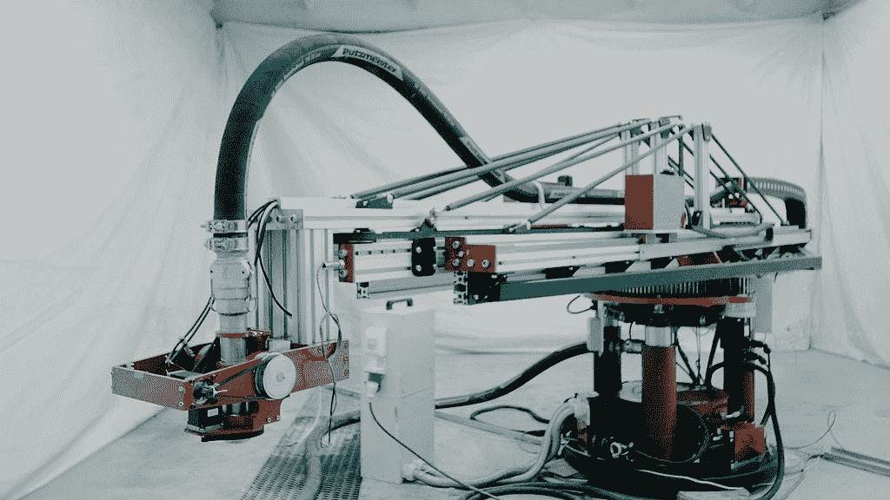
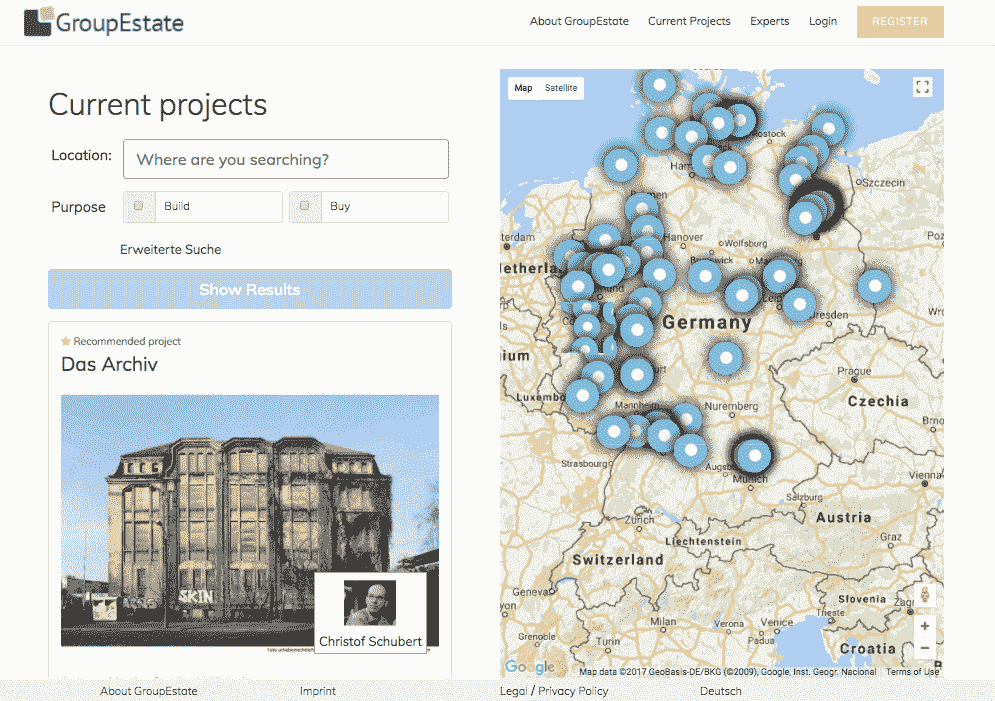
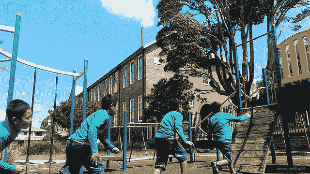

# 创业和经济适用房的未来

> 原文：<https://medium.com/hackernoon/startups-and-the-future-of-affordable-housing-9f2ff4c066cb>

[之后的三大趋势 140+创业公司回顾](https://docs.google.com/document/d/1d83zohp8feXI3Ue64v3v35SUPbOJCtdEm2anaFfY4uM/edit)。

*由* [*吴彦祖*](https://www.linkedin.com/in/wu12345/) *和* [*李钰*](/@criindel)

几乎每周都有人提醒我们，我们正处于经济适用房危机之中。在旧金山，只有美国最顶尖的人才能租得起普通的两居室。[无家可归者营地已经蔓延](http://zillow.mediaroom.com/2017-08-03-Rising-Rents-Lead-to-Increased-Homeless-Population)。千禧一代的银行账户中平均只有 1000 美元的 T21，大部分收入都花在了生活费用上。但在这场危机中，政策建议——尽管至关重要——占据了主导地位，因为有希望的私人部门解决方案往往被忽略。事实上，社区发展界的许多讨论都集中在住房资金的来源上，如第 8 节。虽然这种讨论是必要的，但更多地思考如何有效地使用这笔钱可以带来更好的可负担性结果。

在这里，基于对 140 多家公司的回顾，我们讨论了这些创新中的一小部分，它们为改善住房提供了机会。这些创新主要分为三类:让土地更便宜、建筑更便宜、融资更容易的创新。

俄勒冈州尤金市的一个无家可归者营地。(来自维基共享用户 [*访问者 7*](https://commons.wikimedia.org/wiki/File:Whoville_Homeless_Camp_(Eugene,_Oregon).jpg) *下一个* [*CC-by-SA 3.0 许可证*](https://creativecommons.org/licenses/by-sa/3.0/deed.en) *)*

通过建设更密集、更智能的建筑来降低土地成本。

受自然资源短缺或限制供应的规则和政策的推动，土地成本本身就是经济适用房的巨大障碍。平均而言，土地约占房地产开发预算的 50%。

如果土地成本是一个供求问题，那么增加供应显然是第一步。但考虑到这些公寓有多贵，我们不能仅仅建造更多的市场和豪华公寓。相反，我们应该采用新的设计来降低成本，帮助人们共享空间，更好地共同生活。

像微型单元、附属住宅单元(ADUs)和公共居住计划这样的新布局颠覆了美国住房宽敞和孤立的概念，以增加密度和降低成本。[微单元](http://gothamist.com/2015/09/01/micro_apartments_kips_bay.php)的特点是布局比平均水平小 30%到 50%,相应地也更便宜。他们经常使用多功能家具，如折叠床，以更好地利用有限的空间。位于奥斯丁的[创业公司](https://hackernoon.com/tagged/startup)kasita 以 14 万美元的价格出售[单卧室微型单元。这些微型单元每单元大约 352 平方英尺(作为背景，一个普通的工作室大约有两倍大)。其他微型单元创业公司，如](https://www.curbed.com/2017/9/6/16222342/prefab-tiny-smart-affordable-housing)[模块住宅](https://webcache.googleusercontent.com/search?q=cache:6kfD-EDnYHcJ:https://modulehousing.com/press/module-taking-reservations-residential-customers-pittsburgh/+&cd=3&hl=en&ct=clnk&gl=us)，允许居民在需要更多空间时，将一个一居室的创业单元变成一个三居室的房子[。](https://hackernoon.com/tagged/house)

尽管微型单位通过缩小规模来增加密度，但成年人和公共生活安排的目标是空间低效。附属住宅单元 (ADUs)，如蒙大拿州 [Montainer](https://www.montainerhomes.com/) 制造的那些，通过向屋顶和后院等未充分利用的空间添加单元来优化这些空间。如果所有有资格增加 ADU 的地块事实上都采纳了的话，单单 ADUs 就足以[实现到 2021 年增加 10 万套新住房的适度目标](http://www.businessinsider.com/granny-flat-law-solution-california-affordable-housing-shortage-2017-3)。

*预制微型单元公寓(L)和适合后院使用的附属住宅单元(R)的示例。(L，来自 flickr 用户*[*seier+seier*](https://www.flickr.com/photos/seier/8201355899/in/photolist-4s4wPn-6B5nXG-pBQqjU-6B1bn8-6B1u7B-6B1ceB-6B1bN2-6B1u1i-6B1tTr-PgNhN-6B5mRL-6B5niQ-duJ6nV-it7AyL-it7F2a-it6Six-6BwPx7-it77q9-6B5mK9-duPFRq-58ZyAq-dpEP63-czguTU-5hi16B-837G2D-83aQ1f-837G1g-837FXZ-6e7YkN-vm77TB-837FYZ)*下一个*[*CC-by-2.0 license*](https://creativecommons.org/licenses/by/2.0/)*；r，来自 flickr 用户* [*丹尼尔·拉米雷斯*](https://www.flickr.com/photos/danramarch/34884841860) *下一个* [*CC-by-2.0 许可*](https://creativecommons.org/licenses/by/2.0/) *)*

同样，社区生活安排要求居民共享公共区域，如厨房，这是任何住宅的关键，但不要求隐私。这些社区在国外越来越受欢迎，它们还通过提供强大的社会支持系统来提高生活质量。包括社区生活公司在内的最近一波房地产创业浪潮可能最终会支撑 coliving 在美国的人气。相对较新的以科幻为基础的公司 [Starcity](https://www.joinstarcity.com/) 和[平房](https://www.livebungalow.com/)就是两个这样的初创公司。

合住社区通常分担照顾孩子和做饭的责任，以节省时间和金钱，并建立社区。 *(L，出自* [*宅规划帮*](http://www.houseplanninghelp.com/wp-content/uploads/2013/12/Nstreet-cooking-550.jpg)*；r，来自* [*尼尔森*](http://nelsoncohousing.com/wp-content/uploads/2015/05/07storytime.jpeg) *)*

然而，即使我们想要更密集地建设和生活，也有几个挑战需要克服。

一个初步的障碍是“不在我的后院”(邻避)的情绪。现有的房产所有者有强烈的动机反对急需的住房。教育不足以解决这一现象。住宅是一种极度情绪化的投资，而发展政治的神话并不总是理性的。相反，必须从根本上改变当地房主的财务激励机制。房屋净值保护计划，比如由 Home HeadQuarters Inc .[提供的那些计划，至少可以保证房产价值不会下降——这是一种推动邻避情绪的普遍担忧。激励措施也可以扩大到现有的房主，以换取政治支持。后一种策略已经被开发商成功运用，比如洛杉矶市中心一个 560 万平方英尺的综合建筑 L.A. Live 的开发商。](http://www.mn2020.org/issues-that-matter/economic-developmentfiscal-policy/home-equity-protection-plan-tried-worked-in-syracuse)

当然，对每个社区来说，正确的收益是不同的，无论是资助当地学校还是众筹投资机会。TechStars 波士顿 2013 届的成员库尔巴尼泽提供了一个在线平台，帮助开发者更容易地评估那些量身定制的好处可能是什么。华盛顿特区的一个多用途项目有 22 个经济适用房，该项目正在利用这个平台来确定[增加一个全方位服务杂货商](https://courbanize.com/projects/theladybird/comments?prompt=1.%20Grocery%20Store%20Preferences)是否有助于赢得社区对其建设的支持。其他项目没有具体的好处，正在征求当地社区的意见。

使用像 Fundrise 这样的众筹网站，开发商可以很容易地允许当地房主投资他们的房产，并从社区发展中受益。(出自**)**

*密集建筑的挑战不仅仅在于赢得当地社区的民心。随着城市变得越来越密集，拥堵也越来越严重。许多城市没有适当的公共交通和停车基础设施来让人们在这种增长中舒适地生活。*

*众筹[的公交、拼车和自行车专用道，Boring Company 的](https://nextcity.org/daily/entry/denver-bike-lanes-crowdfunding)[地下旅游隧道](http://www.businessinsider.com/elon-musk-tunnel-project-2017-6)，Dahir Insaat 的[高架公交车](http://bgr.com/2017/08/25/science-news-gyrocar-public-transportation/)都可以帮助居民避免拥堵，新的停车系统也是如此。东京是世界上地铁人口最多的城市，在这里，[邻里](http://plugin-magazine.com/driving/fully-automated-car-parking-system-in-japan/)或[后院](http://weburbanist.com/2013/07/11/vertical-garage-hide-cars-below-or-lift-your-ride-to-the-sky/)自动停车系统可以腾出停车位，缓解与停车相关的交通。这种系统最终在美国的圣何塞等城市被采用，尽管速度很慢。当这些解决方案建在高密度开发项目旁边时，通过解除居民拥有汽车的经济负担，具有进一步提高可负担性的好处。*

**

**公交专用道平均造价* [*为地铁轨道交通*](https://journalistsresource.org/studies/environment/transportation/bus-versus-rail) *的 10%,可以作为交通不太拥挤地区轻轨的性价比补充。(来自维基共享用户*[*Raysonho*](https://commons.wikimedia.org/wiki/File:Hwy7BusLane.JPG)*下*[*CC0 1.0*](https://creativecommons.org/publicdomain/zero/1.0/deed.en)*)**

***建筑更便宜。***

*建筑业在优化建筑流程方面进展缓慢，避免以牺牲经济适用房为代价广泛采用新的建筑方法。最近这些创新中最简单的是大规模生产的单元，也被称为模块化住宅或预制单元。因为这些单元是在受控的工厂环境中创建的，像[全景利益](http://www.businessinsider.com/berkeley-homeless-housing-micropad-2017-3)这样的开发商可以减少[30%的成本和 40%的完工时间](http://www.mckinsey.com/global-themes/urbanization/tackling-the-worlds-affordable-housing-challenge)。大多数工厂雇佣装配线工人来创建这些单元，而总部位于巴尔的摩的初创公司 blue print Robotics[通过使用汽车生产线上常见的工业机器人，创造了更高的效率](http://www.greenbuildingadvisor.com/blogs/dept/green-building-news/robotics-comes-homebuilding)。*

**

**蓝图机器人大规模生产房屋单元*。(来自[蓝图机器人](http://www.blueprint-robotics.com/))*

*但是，尽管理论上大规模生产的单元很棒，但当地的建筑和分区法规阻止了真正的标准化。这些成本可以通过自动化法规遵从性来降低。预设的创业公司，如 [Cover](http://www.businessinsider.com/cover-granny-in-law-units-using-machine-learning-2017-6) ，根据用户生成的输入，如地理位置或房间数量，使用算法来建议合法合规的设计。*

*我们可能会看到更加全面的自动化。尽管长期以来遭到行业的抵制，但它现在几乎没有选择。劳动力短缺达到历史最高水平。许多工人在上一次经济衰退中离开了这个行业，而且还没有回来，他们更喜欢在周期性较小的行业就业。为了解决这些问题，如今主导科技新闻的创新——无人机、机器人和 3d 打印——都被应用到了建筑行业。*

*可以部署无人机来调查和报告进展情况，现场机器人可以自动化并显著加快砌砖等高度重复的任务。世界第二大建筑公司小松(Komatsu)和硅谷无人机初创公司 Skycatch 正在[成功地将这两个概念](https://www.theverge.com/2015/10/13/9521453/skycatch-komatsu-drones-construction-autonomous-vehicles)结合起来，以解决日本的劳动力短缺问题。Skycatch 的无人机为自主机器人提供关于建筑环境的实时反馈，极大地提高了机器人工作的准确性和效率，同时[减少了对监管人力的需求](https://www.skycatch.com/komatsu-uses-skycatch-save-hundreds-hours-surveying-construction-sites/)。这些无人机和机器人的混合团队只需要一到两名非熟练工人在现场。*

**

**无人机和自主机器人的结合使用节省了数百小时的劳动时间。(来自 Pixabay 用户*[*Powie*](https://pixabay.com/en/drone-multicopter-dji-inspire-1080844/)*[*CC0 1.0*](https://creativecommons.org/publicdomain/zero/1.0/deed.en)*)***

**3d 打印也可以在现场使用，它利用大型机器人打印机喷射水泥墨水，在最少的人工监督下建造房屋。基于旧金山的 Apis Cor 是该领域最早的初创公司之一，它可以建造一个 400 平方英尺的房子，只需 1 万美元。Apis 的第一次建造发生在 2017 年初，令人印象深刻的是只需要 24 小时的工作，并且可以在许多不同的气候下复制。该公司希望将试验基地扩展到欧洲、美国，甚至南极和火星。**

****

**[*Apis Cor*](https://www.youtube.com/watch?v=GUdnrtnjT5Q) *用水泥墨水打印一栋房子，售价一万美元。(来自维基共享用户*[*Fizpaket*](https://commons.wikimedia.org/wiki/File:3D_%D0%BF%D1%80%D0%B8%D0%BD%D1%82%D0%B5%D1%80_Apis_Cor.jpg)*下一个* [*CC-by-SA 4.0 许可证*](https://creativecommons.org/licenses/by-sa/4.0/deed.en) *)***

****拥有和融资方式不同。****

**传统的融资模式需要给投资者 [10%](https://therealdeal.com/wp-content/uploads/all/images/37700/What_a_building_costs.pdf) 到 [25%](https://fundrise.com/education/blog-posts/why-does-residential-real-estate-cost-so-much) [的回报](https://getpocket.com/a/read/1108864281)。为了满足这些利润，开发商必须提高租金或售价。但一些所有权和融资结构更好地平衡了利润和社会影响，降低了成本，同时认识到住房是一种重要的社会商品。社区土地信托就是这样一个例子。**

**作为非营利组织，CLT 拥有并以可承受的价格租赁底层土地 99 年，因此房主只需支付房屋结构本身的费用。因此，集体土地所有权大大降低了拥有住房的门槛。**

**在奥斯汀的一个快速中产阶级化的地区，Guadalupe 社区发展公司经营的 CLT 使少数民族居民能够以平均成本的 50%购买房屋。作为负担得起的长期租约的交换，房主出售和从中产阶级化中获利的能力受到限制。**

****

**多亏了当地的 CLT，长期居住在奥斯汀的居民现在可以以 50%的成本成为房主。(摘自 [*瓜达卢佩邻里开发公司*](http://www.guadalupendc.org/) *)***

**另一个例子是完全排除第三方开发商， *baugruppen，*是德国建造经济适用房最成功的工具之一。个人将他们的资源集中起来成为开发者，而政府则帮助他们解决法律和技术问题。传统开发商要求 10%到 25%的资本回报率，而公民开发商，因为他们只关心住在单元里，不要求这么高的回报。结果，住房成本下降了。**

**尽管这个结果很吸引人，但找到志同道合的公民开发者并不总是容易的。总部位于德国的初创公司 GroupEstate 通过一个促进这一过程的在线平台瞄准了这一痛点。这家初创公司还允许人们购买已经完成的项目，并且[还提供其他产品](https://www.welt.de/finanzen/immobilien/article139737021/Die-Vorteile-des-gemeinsamen-Kaufs-von-Immobilien.html)，比如贷款和免费合同样本。通过简化 baugruppen 背后的过程，GroupEstate 希望进一步推广这种以居民为先的经济适用房方式。这个概念在美国也引起了人们的兴趣，一些类似于 baugruppen 的资源共享的例子已经在美国出现，比如杜伦中央公园合住社区。**

****

***GroupEstate 目前有 60 多个活跃项目。(来自*[*group estate*](https://www.groupestate.de/en/map-view/)*)***

**虽然这两种模式越来越多地被接受为长期经济适用房的工具，但它们的可扩展性仍然是一个公开的问题(T2 ), [w](https://www.americanprogress.org/issues/economy/reports/2016/06/20/139515/community-land-trusts/)[I](https://www.americanprogress.org/issues/economy/reports/2016/06/20/139515/community-land-trusts/)T[h](https://www.americanprogress.org/issues/economy/reports/2016/06/20/139515/community-land-trusts/)on[L](https://www.americanprogress.org/issues/economy/reports/2016/06/20/139515/community-land-trusts/)y[a](https://www.americanprogress.org/issues/economy/reports/2016/06/20/139515/community-land-trusts/)[b](https://www.americanprogress.org/issues/economy/reports/2016/06/20/139515/community-land-trusts/)o[u](https://www.americanprogress.org/issues/economy/reports/2016/06/20/139515/community-land-trusts/)T[2](https://www.americanprogress.org/issues/economy/reports/2016/06/20/139515/community-land-trusts/)[5](https://www.americanprogress.org/issues/economy/reports/2016/06/20/139515/community-land-trusts/)0[C](https://www.americanprogress.org/issues/economy/reports/2016/06/20/139515/community-land-trusts/)[L](https://www.americanprogress.org/issues/economy/reports/2016/06/20/139515/community-land-trusts/)T[s](https://www.americanprogress.org/issues/economy/reports/2016/06/20/139515/community-land-trusts/)[I](https://www.americanprogress.org/issues/economy/reports/2016/06/20/139515/community-land-trusts/)n [专注于社会影响的房地产投资者，如特纳影响资本，已经发现购买](https://www.americanprogress.org/issues/economy/reports/2016/06/20/139515/community-land-trusts/)[自然负担得起的旧房产并让它们负担得起可能是一笔好生意。由于在经济衰退期间对较低租金的需求增加，这种单元在经济衰退时就像债券一样。截至 2015 年，特纳和其他 15 家主要投资者，如](https://www.bloomberg.com/news/articles/2015-11-19/one-man-s-plan-to-expand-cheap-housing-and-make-money-doing-it)[avana th Capital Management](http://www.investors.com/news/real-estate/turner-capital-seeks-profit-in-social-impact/)，投资了 6 万套经济适用房，以保持他们永远买得起。**

****

**[*特纳影响力资本*](http://marketrent.clarendon.com/wp-content/uploads/2015/12/affordable-480x320.jpg) *投资自然经济适用房单元，并提供免费教育和健康课程，以提高生活质量。(来自 flickr 用户*[*Iman Shad*](https://www.flickr.com/photos/imanshad/15578982025/in/photolist-pJEmAn-nm1xYi-8FrR8U-htQzyR-d6NyjA-5nQdQU-VpaWE1-aoQDzQ-5nQq2E-2kzS9o-EapJq-TkFu7b-5nLaNp-XHM5E5-6da3qR-kQe4V-TLj8hZ-5nQrkJ-5nL394-5nQkaf-5nL9jr-b9L5Pc-5nLbLr-TnP4iL-5nLcfx-5nQmuq-tsff2-TLj7Up-TnP4KC-TXQHXD-TnP4zC-TXQGY4-pDpZAw-TXQKnc-TnP497-5nQb3N-UeQ55B-2mxVgZ-fbJvos-5nQdww-5nL7mi-5zVpCc-naVwzf-dNpXau-6o4zMA-dNjnvB-8HsQJk-SCdoNh-UNz8bA-SRYDVi)*下一个*[*CC-by-2.0 license*](https://creativecommons.org/licenses/by/2.0/)*)***

****总之，让我们一起建设更好的城市****

**上述干预措施在降低成本方面大有可为，甚至可以结合起来提高住房的可负担性。但要真正有效地争取负担得起的住房，私营公司应该相互协商，并与住房领域的各种参与者协商，研究和实施这些创新。**

**脸书的 Catalyst Housing Fund 专注于“[可扩展的方式来增加……负担得起的住房](https://newsroom.fb.com/news/2016/12/a-partnership-to-strengthen-our-local-community/)”，在联盟建设方面做得特别出色。该基金现在包括一项公民运动、地方政府的努力以及已经成立的非营利组织。它的努力将为新园区的发展提供信息，新园区将容纳 1500 个低于市场价格的租赁单元，对脸书员工和公众开放。**

**在新技术和流程的背景下，这种合作尤为重要。创新的概念可以帮助我们解决经济适用房危机，但很有可能也会带来陡峭的学习曲线。这些挑战最好是一起应对，而不是单独应对。**

***☞同意还是不同意？欢迎随时关注我或在您的 Linkedin 邀请中给我发个便条* [*此处*](http://li) *。***

****注意**:**

*   **[此处提供了更详细的住房创新地图。](https://docs.google.com/document/d/1d83zohp8feXI3Ue64v3v35SUPbOJCtdEm2anaFfY4uM/edit#heading=h.pdoc4uiqe95e)**
*   **经济适用房领域的相关地图可以在《多家庭执行官》的另一篇文章中找到。**