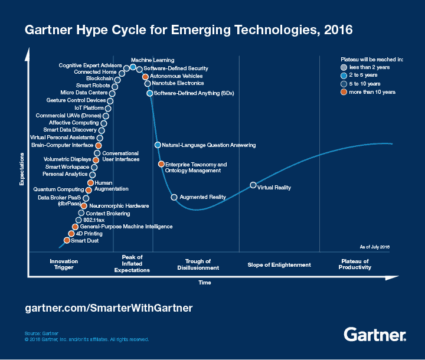
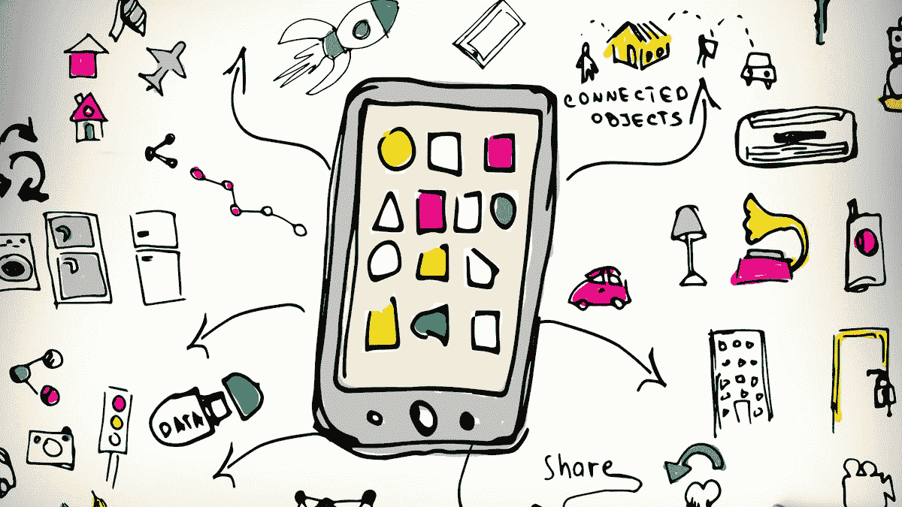
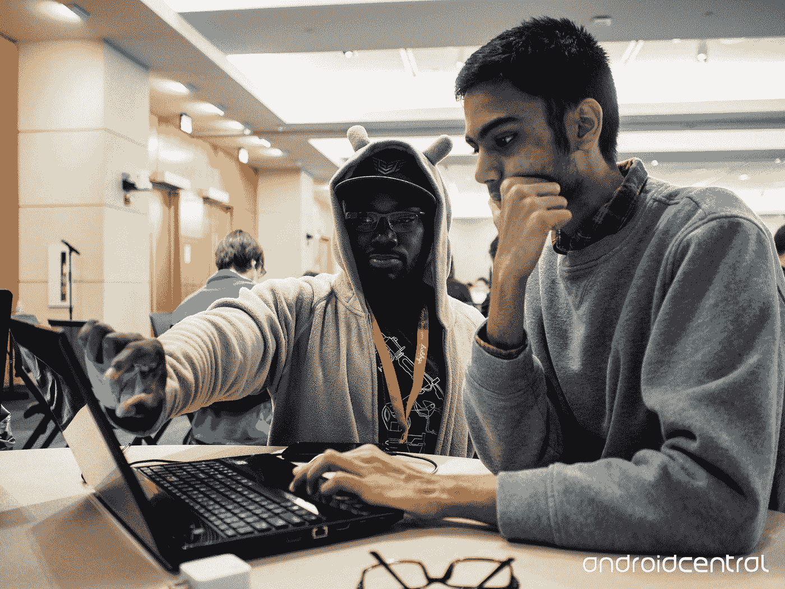

# 2016 年普适计算状况

> 原文：<https://medium.com/hackernoon/state-of-ubiquitous-computing-2016-e21f390d8697>

Image credit: [Black Mirror on Netflix](https://www.netflix.com/title/70264888)

## 今年关于可穿戴设备和互联设备有哪些重要收获？以下是我在无处不在的计算的十个领域中的主要经验，这些经验让我有时感到兴奋和担忧。

> 无处不在的计算的承诺是反直觉的，当简单地定义时，它听起来像一个类似于[网飞的黑镜](https://www.netflix.com/title/70264888)的未来，在那里我们所知道的计算是普遍的，以某种方式，并且势不可挡。事实上，无处不在的计算有助于让计算机变得更有用。普及或无处不在的计算意味着更多具有安全、私有、上下文感知、可扩展计算能力的互联事物，从而在 i/o 中融入、避开并最大化用户的效用，而不会带来复杂性。

对我来说，在这个世界里，我的“东西”安全地知道我是谁，并在我需要时通过自然的界面向我提供信息，这意味着盯着我手掌上的黑色镜子或摸索电视遥控器选项的时间减少了。这个独特的想法一直是我在[从事专业和个人工作的路标。今年，我在](https://github.com/stigsfoot) [Google+](https://plus.google.com/u/0/collection/kyU0JB) 上收集了我对这个领域的兴趣。到目前为止，这些帖子已经积累了相当数量的爱好者和读者。以下是每个收藏中粉丝数量的细分情况:

*   [连接物](https://plus.google.com/u/0/collection/wtyOPB)—**34415**
*   [联网移动](https://plus.google.com/u/0/collection/4ezOa) — **90，356**
*   [可穿戴设备周刊](https://plus.google.com/u/0/collection/gr1Oa)—**75994**
*   [互联健康&健身创新](https://plus.google.com/u/0/collection/4jbTa)—**43588**

So many internet points

我发布的各种主题有 25 万粉丝，因此毫不奇怪，在 2016 年，我有机会做了几次演讲，分享了大量关于联网汽车、可穿戴设备和物联网的内容。如果你关注我的帖子，参加我的演讲或者听我的播客，谢谢你！你点燃了我在这个空间的激情。

# 2016 年关于育碧公司的 10 件事:

今年我们听到了很多关于机器[学习](https://hackernoon.com/tagged/learning)，自动驾驶汽车，VR，ar，亚马逊终于在我们的客厅里装了一个我们实际上想要使用的助手。自 2000 年中期以来，微软一直试图通过 Windows Media Center 实现这一壮举。

说无处不在的计算中发生的许多事情属于“新兴技术”领域，这是一种保守的说法。就成熟度而言，看看 [Gartner 的炒作周期](http://www.gartner.com/smarterwithgartner/3-trends-appear-in-the-gartner-hype-cycle-for-emerging-technologies-2016/)会发现，这个领域的大多数技术都刚刚度过“过高预期的顶峰”。我认为这意味着 2017 年继续行业整合的时机已经成熟，初创企业退出和失败的趋势将会增加。有很多东西要学。

[Gartner’s hype cycle](http://www.gartner.com/smarterwithgartner/3-trends-appear-in-the-gartner-hype-cycle-for-emerging-technologies-2016/)

## 1.市场状况:专用与通用

我们今年了解到，在无处不在的计算领域不可能有一个市场领导者。只是太宽泛了。必须指出的是，即使在构成无处不在的计算的各种垂直领域中，也不会像过去那样出现零和企业。成为齿轮中的一个齿轮，不仅仅是对大公司的挑战，[创新者的困境](https://www.amazon.com/Innovators-Dilemma-Revolutionary-Change-Business/dp/0062060244)现在也影响着初创公司。赢家可能会赢得关键地位，但整个车轮移动如此之快，需要不断调整才能跟上。我们从未见过如此多的科技创业公司创造性地致力于让计算机更具感知性和个性化，同时保持实用性的清晰和简单。育碧公司的行业已经接受了创新的速度是光速。大公司正在适应更小的团队，更大的研发支出和杰克·纳普的设计冲刺书。

今年的规则是继续推动创新中心或合作伙伴。这就是加速回报定律的工作原理。

The singularity is near, deal with it

用一个平台来统治所有人的概念已经被个人电脑时代抛在了身后。在每一个技术领域，我很难相信有一家公司会像 IBM、苹果或微软那样独领风骚。

一个具体的例子:在专用计算时代，英特尔作为通用芯片制造商的角色并没有很好地转化。英特尔是一家通用芯片制造商，今年正在努力在主导育碧空间的许多领域获得立足点；可穿戴设备、物联网、自动驾驶汽车等。与此同时，随着 ARM 在专用计算领域的市场份额、许可业务模式和行业地位逐年增长，ARM 继续击败它。ARM 的商业模式刺激了许多领导者，如博通、苹果、英伟达和育碧公司。

特殊目的赢得了 2016 年育碧市场。我觉得这是一种趋势。

## 2.世界正在改变

为了实现一个由硅驱动的东西主动帮助我们的世界，也就是说，不需要我们太多的输入，我们所知道的计算机输入和输出必须改变。关于中产阶级生活的危险的讨论出现了高峰，这种快速的变化将会。然而，这并不全是坏事，一些变化也将改善用户的生活，同时极大地模糊物理和数字世界，以及转变行业和我们的生活和工作方式。随着计算机变得越来越普及，我们的经济将会发生更大的变化。这不是我在 2016 年学到的东西，只是我经常想起的东西。

参见:[人类无需申请，作者 CGP·格雷](https://www.youtube.com/watch?v=7Pq-S557XQU)。

People losing their jobs to robots is no laughing matter, sorry.

## 3.没有一个地方像::1/128

智能家居是无处不在的计算的首页。多年来，许多人已经尝试过了。我们一遍又一遍地了解到好莱坞风格的界面[在大银幕上看起来很棒](https://theawl.com/how-minority-report-trapped-us-in-a-world-of-bad-interfaces-d8d2d2af41da#.8g22a6pu4)但是在家里却不太好翻译。无缝连接的诀窍是一种上下文体验，它在不复杂的情况下最大化用户的效用。亚马逊、三星和大批初创公司主宰了家用电子产品。有些人可能已经预料到了这一点，但是家庭界面的赢家是语音。亚马逊的 Alexa 拥有 1000 多种技能，其成功归功于该平台近乎完美地执行了自然语言理解(NLU)和自动语音识别(ASR)。如果你的汽车信息娱乐系统工作得如此完美，那该有多棒？
你应该会问，有趣的是，三星通过[收购大量智能互联产品](https://www.crunchbase.com/organization/samsung-electronics/acquisitions)来规避风险。随着收购像 Viv、Harman 这样的初创公司的步伐加快，你现在有了类似亚马逊 Echo 的对话服务，由三星在回家时提供支持。

我们还没有到达那里；像 [Wink Hub](http://www.wink.com/products/wink-hub/) 这样的品牌还没有进入普通词汇，但苹果已经进行了一些[战略合作伙伴的赌注](http://www.digitaltrends.com/home/everything-that-works-with-apple-homekit/)来使数百万 IoS 设备和联网设备在简单、熟悉的用户体验下变得安全和可扩展。

Image credit: Internet of Shit by [Motherboard](http://motherboard.vice.com/en_uk/tag/Internet+of+Shit)

## 4.平衡特殊用途和单一用途的可穿戴设备

用户们以压倒性优势[用他们的钱包](https://goo.gl/pJh50a)投票决定今年他们更喜欢哪种腕戴式[可穿戴设备](/founder-in-the-trenches/smartwatch-shipments-are-tanking-but-we-can-stop-the-bleeding-b7cc2b8aadad#.2u0fm5wqu)。谈到市场份额，Fitbit 证明了用户想要特殊或单一用途的可穿戴设备，因为它继续在 Apple Watch 和 Android Wear 上占据主导地位。意识到消费者想要专业的可穿戴体验也让我回到了我之前关于英特尔的观点。[截至 2016 年第三季度，智能手表出货量同比下降 51.6%](http://techcrunch.com/2016/10/24/smartwatch-sales-are-tanking/)，基于数据的唯一合理解释是[用户对电池寿命的效用更大](https://goo.gl/pJh50a)。尽管今年苹果的 ai rpods推出了许多用于可穿戴设备的特殊用途 W1 硬件芯片，但 2016 年仍然充满希望。随着时间的推移，行业将继续这一趋势，建立在专门的低功耗芯片上，而不是重新利用尚未针对可穿戴设备进行优化的小型化芯片。

此外，在可穿戴设备领域，专业用途与通用用途的对比是 Snap 可能在谷歌眼镜失败的地方取得成功的原因。罗伯特·斯考伯又在洗澡了。

Image credit: [Business Insider](http://www.businessinsider.com/robert-scoble-wears-snapchat-spectacles-shower-2016-11)

## 5.云带给你的普适计算。

微软，IBM，谷歌，英伟达领导云，机器学习/汽车智能，甚至火狐，当谈到网络虚拟现实平台的快速发展。微软的云业务[引领了科技巨头的收益](http://www.wsj.com/articles/microsofts-cloud-buoys-earnings-1476995257)，他们在人工智能方面的努力对于独立开发者、学者和初创公司来说总是一个受欢迎的机会。站在巨人的肩膀上从来没有感觉这么好。事实上，专注于机器学习和互联移动性的跨行业合作[出现了激增](http://www.strategyand.pwc.com/reports/connected-car-2016-study)。为了跟上创新的步伐，汽车制造商正在采用新的商业模式，并加快与微软、IBM、谷歌、英伟达等科技公司的合作速度。

对于像特斯拉这样的公司来说，拥有让你的汽车看得见、听得见、能自主移动的部件更具战略意义[，因为它在去年夏天切断了与 MobileEye](http://www.cnbc.com/2016/09/16/tesla-says-mobileye-balked-after-learning-carmaker-to-make-own-cameras.html) 的关系。我认为前者将成为常态，企业将“坚持自己的工作”，并在有意义的地方利用他人的优势。我应该提到，特斯拉仍然保持着许多战略合作伙伴关系，如与松下的能源合作伙伴关系。

## 6.安全性:

[现在，行业团结在物联网标准周围比以往任何时候都更加重要。对于从头开始构建的设备来说，考虑安全性和隐私性是非常重要的。如果硬件和平台*必须有网络接入*，那么标准或立法应该有数字签名更新的能力。OTA 在家庭或企业联网方面的应用不应该是事后才想到的。](https://www.us-cert.gov/ncas/alerts/TA16-288A)

Friends don’t let friends buy cheap internet toasters

未打补丁的“东西”可能造成的指数级损害的一个不幸的例子发生在 Dyn 和 Mirai 未来组合僵尸网络上。如果你正在阅读这篇文章，你很可能在 10 月份受到了影响，这一事件暴露了许多设备制造商没有实施标准的安全做法，如在新设备激活期间强制实施个性化的出厂默认用户名和密码。大多数受影响的设备是现成的网络摄像头、DVR 有线电视盒和日常连接设备。我们都知道，作为一家 OEM，如果您打算发运一款需要互联网接入的设备，那么该设备需要一定的安全级别，让用户放心，他们的信息是隐私的，安全直观，可互操作更新。这提醒了我，我需要断开我的烤面包机。

“将牙膏放回管中”是很困难的，因为这关系到“连接物空间”的安全状态许多设备在制造时没有考虑安全性的一个原因是与通过持续更新进行开发和维护相关的成本。我认为，许多人会同意，像谷歌的 Weave 这样的解决方案可能会引领或严重影响可能成为行业标准的东西。

**Privacy?** What privacy?

## 7.论隐私

我有更多的问题，而不是建议或答案。 [Gartner 预测 2016 年将有 60 亿台](http://www.gartner.com/newsroom/id/3165317)联网设备。这是一个很聪明的事情，在你家里收集你认为是私人的信息。在我看来，最近的世界事件使互联网隐私领域的努力倒退，这极大地影响了无处不在的计算。从宏观角度来看，美国和英国陷入了恐惧、不确定性和怀疑之中。这种 FUD 有些是由言论、民粹主义和这个行业带来的经济转型支持的。

美国公民决定选川普，川普是一位支持政府击败加密技术的候选人[。在大洋彼岸，英国退出了欧盟，并带来了一位刚刚通过所谓的“窥探宪章”的首相](http://finance.yahoo.com/news/think-donald-trump-blasts-apple-133241253.html)[，这一法案让《爱国者法案》看起来像是儿戏。我说，弯下腰，伙计们，我们的隐私，因为它涉及到数百万与我们的数据相关的事情，是皇家性交！](http://www.techrepublic.com/article/privacy-issues-abound-as-uk-passes-controversial-snoopers-charter/)

然而，在我们的自由燃烧之前，我希望像苹果 HomeKit 或谷歌的 [Brillo 平台](https://developers.google.com/brillo/)这样的解决方案，可以为开发者在考虑隐私的情况下轻松解决问题创造条件。

## 8/9.互操作性和可扩展性

我们今年遭遇的安全恐慌暴露了一个更令人担忧的缺陷；“事物”联系得越多，我们就越脆弱。最近几年，市场推出了所谓的智能电视和带有网飞应用程序的硬盘录像机，这些应用程序永远不会更新。构建能与其他事物对话的可互操作的事物是昂贵的，而底层平台架构更是难上加难。原始设备制造商至今没有一个安全的统一标准。就好像每次我决定:“我选择用 Zigbee”来管理我的网络，另一个标准就出现了。

XKCD: How standards poliferate — [https://xkcd.com/927/](https://xkcd.com/927/)

就连谷歌也想不通。谷歌收购了 Nest，Nest 认为这些协议都不起作用，于是他们发明了 Weave。收购后，谷歌开始致力于 Weave。听起来很理智，直到你意识到 [Nest Weave 不同于](http://www.wegotserved.com/2015/10/03/whats-the-difference-between-google-weave-and-nest-weave/)Google Weave，并将继续在不同的发展轨道上前进。

每个人都想要自己的标准，这些生态系统领域将继续使互操作的事情变得困难。在我们解决安全问题之前，也许这是件好事。

## 10.最好的界面是没有界面

黄金奎师那关于接口的一篇文章是我最喜欢的，它实际上提倡没有接口。今年，我习惯了基于自然隐喻的界面。例如，我的 Android Wear 手表上的屏幕只有在我把手腕举向面部时才会打开。多棒啊。

> 唯一直观的界面是奶嘴

人类学习新界面的速度很慢，我们认为我们需要少数派报告，但在家里和工作中，我们很实际，依赖现有的隐喻和行为，我们已经习惯了。

Keep the buttons, give me Alexa for my car.

很难创建易于使用的界面，也很难创建难以理解的界面。甚至特斯拉的语音操作也很糟糕，不，17 英寸的触摸屏并没有让它变得更好。保留按钮，物理或数字，给我的车 Alexa。三星，你最好让哈曼那笔交易物有所值。

如果特斯拉，执行不了，苹果也不行，也许谷歌会帮我们？今年，谷歌在加州三藩市的斯特兰德举办了[普适开发峰会](https://ubiquity.withgoogle.com/)，开启了 2016 年。我有幸参加了这次会议，不仅对谷歌正在做的事情，而且对整个行业的发展方向都有所启发。也许我会回顾一下他们是如何做的，但这里有一些我有兴趣看到明年发展的无处不在的计算平台:

*   **车载:**安卓 Auto，苹果 Carkit，黑莓的 QNX
*   **可穿戴平台:**三星 Tizen，Android Wear，GarminIQ，WatchKit
*   **电视:**苹果电视，安卓电视，亚马逊火了
*   **传感器:** iBeacons，物理 Web，eddy stone(UUID/网址)
*   **开发者平台/环境:**
*   谷歌感知 API，附近的 API，
*   Project Tango，Windows 10 (Hololens)，
*   亚马逊 Alexa、谷歌 Home/ChromeCast
*   **接口:**
*   像 [Moto Hint+](https://www.motorolastore.com/accessories/bluetooth-headsets/hint.html) 这样的入耳式助手，Vuzix、Epson、HiMax 的产品，像谷歌眼镜(还有希望)MagicLeap、Oculus、HTC Vive、Hololens、MetaAR、Cardboard、Daydream/Tango 这样的设备和界面

Lost Explorer Podcast with Chris Jenkins

那么，我们该何去何从呢？普适计算的使命是反直觉的。它需要基础设施、平台、生态系统、堆栈、框架和硬件完美协调地工作，以便在我们需要时提供我们需要的东西。总而言之，我们取得了很多成绩，但明年仍有很多工作要做:

*   特朗普和英国退出欧盟世界中的安全和隐私
*   背景、意识和相关事物的智能
*   互操作性和可扩展性
*   更简单，更有用的界面，让应用程序高兴和失望。

不管是好是坏，这些是我继续对新兴技术和无处不在的计算感到厌烦的众多原因中的几个。这也是我努力鼓励更多少数民族进入科学、技术工程和设计领域的原因。

# 资源

[我丢失的探索者播客](https://soundcloud.com/stigsfoot/sets/lost-explorer-conversations)
[Twitter 上著名的思想领袖](https://twitter.com/30mhz/lists/iot-thought-leaders)
[最喜欢的科技播客，twit . TV](https://www.twit.tv)
[https://medium . com/@ nobleackerson/ode-to-ubiquitous-computing-5eb 772459 ca 1 # . fnvlh 7 VFS](/@nobleackerson/ode-to-ubiquitous-computing-5eb772459ca1#.fnvlh7vfs)

> [黑客中午](http://bit.ly/Hackernoon)是黑客如何开始他们的下午。我们是 AMI 家庭的一员。我们现在[接受投稿](http://bit.ly/hackernoonsubmission)并乐意[讨论广告&赞助](mailto:partners@amipublications.com)机会。
> 
> 如果你喜欢这个故事，我们推荐你阅读我们的[最新科技故事](http://bit.ly/hackernoonlatestt)和[趋势科技故事](https://hackernoon.com/trending)。直到下一次，不要把世界的现实想当然！

