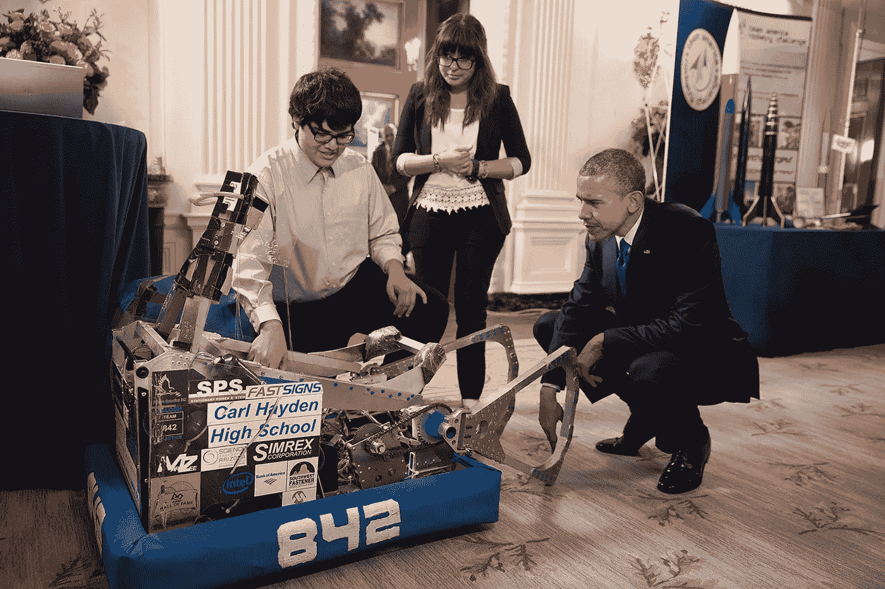

# STEM 教育:它的地位以及为什么它对美国的未来至关重要

> 原文：<https://medium.com/hackernoon/stem-education-where-it-stands-and-why-it-is-crucial-to-the-future-of-america-5175e14ba0b4>

在全国各地的教室里，年轻人每天都被告知，在这个世界上，他们可以成为任何他们想成为的人。这些年轻的心灵充满了希望和梦想，并决心成为他们每天在操场上假装的宇航员和医生。然而，对于我们国家农村和资金不足地区的一些年轻学生来说，这些希望和梦想往往迷失在混乱中，因为他们专注于对他们来说无用或从长远来看过时的课程。

尽管现实不容乐观，但仍有许多人支持我们的年轻人接受高等教育和实施 STEM 计划，这将使他们能够更深入地了解实现这些梦想所必需的职位和知识，并在年轻时就在日常工作中激发和激励他们的工作领域获得信誉。虽然这些项目还没有提供给我们国家的各个地区，但它们继续证明了它们的重要性，以及它们在我们社会、经济和就业市场的未来中所扮演的重要角色。事实上，据美国新闻报道，STEM 教育是美国经济失败的关键。

尽管如此，许多人仍然质疑这些项目是否至关重要，它们不仅在改善我们国家的教育方面，而且在我们经济的未来方面发挥了什么作用。因此，为了帮助[的绝大多数美国人了解美国 STEM 教育的需求](http://mastersed.uc.edu/news-resources/understanding-the-need-for-stem-education-in-the-united-states/)，我们回答这些问题非常重要。通过这样做，我们可以推进并创建一个功能齐全且高效的全国性 STEM 计划，从而培养出受过更好教育的下一代，并刺激我们的就业市场中迫切需要新的有前途的领域。

# **为什么全国性的 STEM 项目如此重要？**

正如统计数据继续证明的那样，STEM 项目让学生不仅能够了解科学、技术、工程和数学，还能了解我们社会和经济的未来——以及该项目希望迎头解决的巨大技能差距。事实上，根据福布斯杂志的调查，70%的组织将“能力差距”列为他们的五大挑战之一。同样，根据[财富杂志](http://fortune.com/2016/04/27/tech-skills-gap-stem/)的报道，目前仅全国就有 607，708 个开放的计算机工作岗位。最重要的是，尽管[1100 万美国工人失业](https://www.bls.gov/news.release/empsit.nr0.htm)，但目前仍有 400 万个职位空缺——其中大部分在 STEM 领域。

由于我们的就业市场存在明显且令人不安的技能缺口，经济是我们社会的主要部分，它正因缺乏经验和培训而受到巨大冲击。然而，当许多农村城市和资金不足的学区目前的教育体系根本没有为学生提供应对这些职位所需的教育时，很难责怪就业市场和经济。然而，stem 教育体系包括编程课程、各种科学课程和物理课程，对于那些发现自己难以为学生提供在当今工作中取得成功的必要手段的教育者来说，STEM 教育体系起到了众所周知的“帮助之手”的作用。

通过创建项目和课程，让学生了解当前最有成效的领域，你不仅创造了一个更有见识、更有教养的一代，也是一个保证在这个技术、数学和科学占主导地位的现代社会取得成功的一代。自 STEM 项目创立以来，[多项研究](https://tamucc-ir.tdl.org/tamucc-ir/bitstream/handle/1969.6/417/Olivarez_dissertation.pdf?sequence=1)显示，接受 STEM 教育的学生考试成绩提高，成绩提高，在学校的参与度提高。除此之外，结合课后活动，已经证明这些[课后计划实际上进一步提高了学生的 STEM 知识](https://thejournal.com/articles/2017/03/02/study-links-after-school-programs-to-improved-stem-knowledge.aspx?admgarea=News1)。

此外，对于位于资金不足地区或贫困地区的学生来说，这使这些学生有机会摆脱这些恶劣的环境，不仅养活自己，也养活家人。事实上，STEM 工作的平均时薪中位数是 37.44 美元，与美国所有其他类型工作的中位数(18.68 美元)相比，这在本质上是非常慷慨的。

然而，为了成功实施 STEM 计划，我们必须首先认识到早期 STEM 计划的重要性，并扩大 STEM 教育在我国的覆盖范围，以便将资金不足的地区和农村地区也包括在内。

# **STEM 项目的未来:更年轻的起点和更广泛的覆盖面**

STEM 项目目前面临的两个主要问题是这些项目开始教授的年龄和这些项目目前的覆盖范围。尽管许多人认为小学开始 STEM 教育可能为时过早，但这是不准确的。事实上，[最近的一项研究](https://education.fsu.edu/importance-stem-education-elementary-school)表明，通过在小学实施 STEM 教育，“教师可以通过解决问题来培养批判性思维，并为学生提供学术竞争优势。”

然而，一些人甚至认为科学可以教授给学龄前的学生，可以帮助他们在进入小学之前提高批判性思维能力，拓展思维。对于幼儿园教育的课程和内容开发经理梅格·戴维斯来说，当被问及她是否相信三岁儿童的科学是可能的时，她说，“当然，”并继续说，“儿童是年轻的科学家。他们通过感官了解周围的世界。关键是要给孩子们提供大量的动手机会，以一种有趣的方式探索科学。”

当低收入学区经常资金不足时，STEM 提供了一个摆脱贫困循环的机会。不幸的事实是，贫困社区的低收入学区面临着教育能力的持续下降，导致毕业率低，学生根本不参与日常课程。然而，STEM 项目希望解决这个问题，不仅给这些学生在我们的社会中有一个富有成效的未来的机会，而且通过学习者每天都很乐意参加的有趣的课程。

尽管如此，这些学校通常很难找到合适的资金来开展 STEM 项目，然而许多不同的组织目前正在解决这一问题，并为低收入学生提供[编程和代码](https://geekgirlcon.com/programming-code-low-income-schools/)，以及计算机，包括 Raspberry Pis 和各种其他形式的技术，以帮助他们在日常生活中取得成功。

最后，STEM 计划目前面临的最后一个障碍是农村教育系统，该系统不仅资金不足，而且经常拒绝科学教育。事实上，近 6000 万人居住在美国的农村地区，在这些地区，人们经常发现缺乏资金，缺乏合格的教师，以及缺乏以未来为中心的教育项目。尽管 STEM 继续与这一因素作斗争，但在美国农村教授科学面临着巨大的挑战。

然而，据《大西洋月刊》报道，有一个项目正在改变美国农村的 STEM 教育。他们最近表示，“Benedum 基金会与教育工作者、家长和私营部门的利益相关者(如雪佛龙)合作，在马塞勒斯页岩地层之上的新能源经济的农村中心开展工作。总部位于匹兹堡的该基金会与地区学校、大学和雇主合作，以提升 STEM 在课程和学生技能方面的作用。"

尽管 Benedum 基金会只是希望扩大美国 STEM 教育覆盖面的无数项目之一，但这些项目继续证明，技能差距很快将成为过去，希望解决这一问题的教育体系才刚刚开始获得牵引力。最终，许多年轻人的生活将永远改变，也许我们不仅会为我们的年轻人创造一个更美好的未来，还会创造一个更好的教育体系——一个以教授重要的东西而不是标准课程为荣的教育体系。