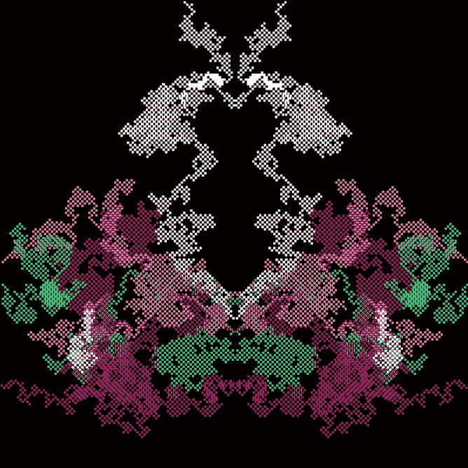
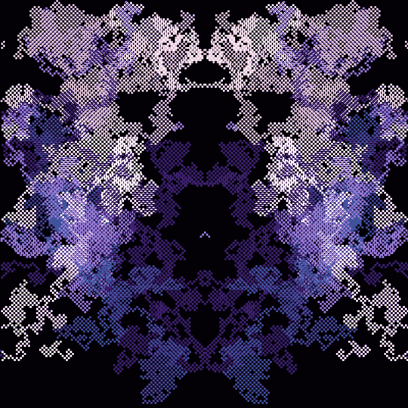
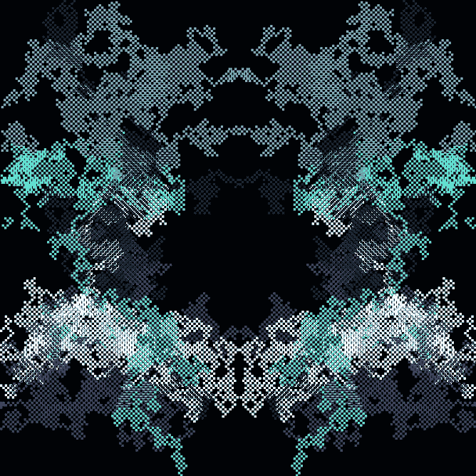
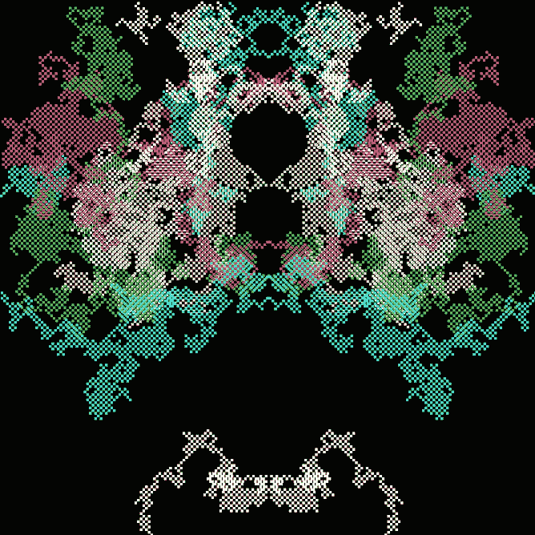
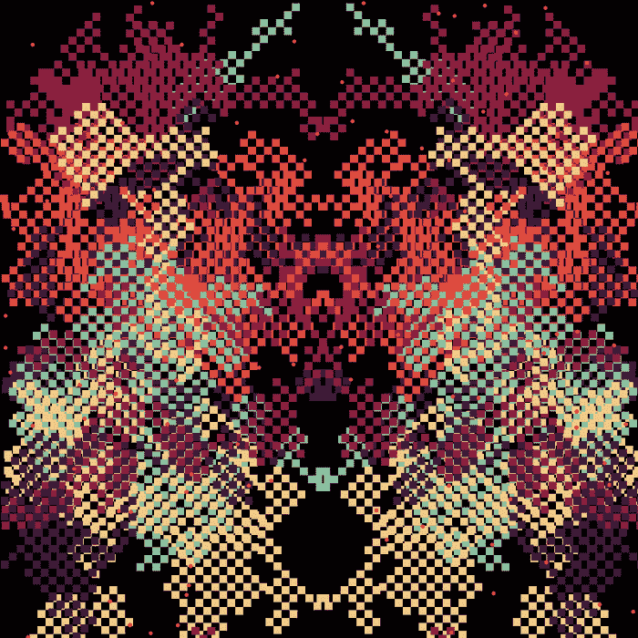

# 随机扩散搜索:寻找对称性

> 原文：<https://medium.com/hackernoon/stochastic-diffusion-search-c3f86d9f74a5>

随机扩散搜索(SDS)是一种多智能体优化算法，由测试和扩散两个步骤组成。测试阶段计算个体的目标值，扩散阶段控制代理之间分散的通信。标准 SDS 算法包括一群代理，每个代理的特征在搜索空间内随机初始化。这些特征作为代理人的假设。测试阶段计算他们的假设是正确还是不正确，并根据所述假设将每个人的状态设置为活动或不活动。扩散阶段控制着活性和非活性物质之间的交流。如果代理处于非活动状态，它将随机选择另一个代理。如果这个选定的代理是活动的，那么原始代理将采用它的假设作为自己的假设。然而，如果这个选择的代理是非活动的，那么代理将再次随机化他们的假设，以继续探索搜索空间。该算法存在许多变体，以通过改变诸如所使用的招募策略和上下文机制之类的属性来适应不同的问题空间。

在这个星期的实验后，我开始用 SDS 在简单的图像中寻找对称轴。我在处理过程中创建了一个基本程序，使用随机漫步机生成对称图像来测试算法。

Examples of symmetry generated using random walkers.

在这个实验中，每个代理都用图像中的随机 x 和 y 坐标初始化，作为它的假设。在测试阶段，代理将检查它的 x“邻居”。邻域是每个代理将在其左右水平检查的像素数。在上面的示例中，邻域大小设置为 100。代理将检查左边距其 n 步的像素*是否与右边距其 n 步的像素*匹配。每个代理执行这些对应像素中有多少在颜色值上相等的计数，并且如果该数目等于邻域大小，则代理的状态将更新为活动。一旦激活，代理将在其成功的 x 坐标处画一条垂直线来突出对称轴。**

Finding vertical axis of symmetry where neighbourhood size is 100.

这种实现利用了被动招募，因为非活动代理负责初始化与随机挑选的代理的一对一通信。如果该通信是与活动代理进行的，则该代理将移动到与所述活动代理相同的位置。如果通信是与非活动代理进行的，那么代理将再次生成随机假设。在这个应用中，一旦一个代理找到了一个解决方案，那么通信过程将导致在全局对称线上非常快速的收敛。然而，由于测试阶段的随机性，无法保证群体找到这个解决方案需要多少次迭代。

使用主动招募策略引入上下文敏感机制可以帮助找到多个垂直对称轴。如果主动代理与具有相同假设的主动代理通信，则通过提示主动代理随机化他们的假设，即使已经找到了解决方案，代理也会被激励在搜索空间中探索更远的区域。

邻域的大小对找到对称解有很大影响。当使用一个小得多的邻域时，代理会发现更多的局部对称例子。虽然在那个小区域中，代理可能会找到对称的实例，但当我们将图像视为一个整体时，它并不符合我们对对称的感知。

Finding vertical axis of symmetry where neighbourhood size is 30.

当生成对称时，背景的大部分区域保持未填充。代理会将这些空间定义为对称的，因为左边和右边的邻域包含纯黑色像素，所以两边是相同的。这需要为这个场景实现一个检查，在这个场景中，当找到一个背景颜色的像素时，创建一个计数器来递增。如果该计数器返回整个邻域的大小，则该代理的状态不会被设置为活动，以避免错误的解决方案。

实现这一点说明了在稍微复杂一点的环境中突出对称性是多么困难。在我这一代，像素没有经过任何压缩处理，所以不同颜色值的数量是六个。在其他图像中，压缩会产生假象，照片本身包含了感知上完全相同的像素的巨大差异。我简单地检查代理人的左面积等于右面积的方法过于简单，无法识别更复杂的对称模型。为了解决这个问题，也许允许精确匹配的定义有所不同会有所帮助。通过平均代理的局部邻域的主色值，它可以确定在它的邻域检查中允许哪种像素质量的变化。

接下来，我将重点放在定位 n 重旋转对称，并使用 SDS 对更复杂的图像进行实验。