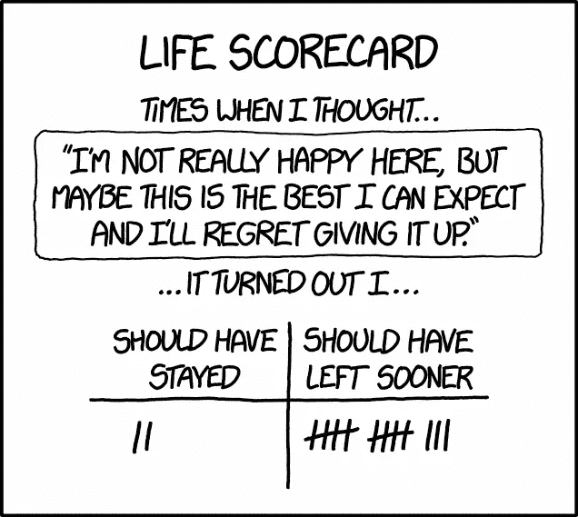

# 工作场所的禁欲主义

> 原文：<https://medium.com/hackernoon/stoicism-in-the-workplace-7a875d21d2b2>

## 对工作和人有更好的看法

Photo by [Nick de Partee](http://unsplash.com/photos/VOXoOCAjhVY?utm_source=unsplash&utm_medium=referral&utm_content=creditCopyText) on [Unsplash](https://unsplash.com/?utm_source=unsplash&utm_medium=referral&utm_content=creditCopyText)

我一次又一次地听到人们多么讨厌他们的工作。人们是如何鄙视他们的经理的。人们如何宁愿死也不在有毒的环境中。说实话，我以前也是这样。

这些年来我学到的是没有比这更好的地方了。只是挑战。只是一些需要完成的事情。无论你去哪里都一样。你升得越高也是一样。

让我们后退一步，弄清楚一个人通常期望在工作场所受到怎样的对待:一个人通常会兴奋地开始一份新工作或一个新角色。这种情况持续数月，日复一日；挫折、失望和失败的期望越来越多。人们会对他们的经理和同事形成判断。然后有一天，一个触发器，一个想法的轻微推动。一个会导致难以摆脱的恶性循环的想法。似曾相识？

Settling — [https://xkcd.com/1768/](https://xkcd.com/1768/)

是的。我认识的每个人都至少对这些情况有所了解。一个人怎样才能在悲观的情况下保持理智并富有成效呢？

> “在生活中，我们的首要任务是将事物分为两类:外在的事物我无法控制，但我能控制它们。我将在哪里发现好与坏？在我身上，在我的选择里。”

以我的经验来看，有一种方法帮助我坚持并改善了我对工作和生活的看法。它帮助我更好地看待自己，尤其是如何看待他人。有些人可能会称之为“成为一个坚忍的人”。

[斯多葛主义](https://hackernoon.com/tagged/stoicism)是一个宽泛的话题。这是一门促进掌控的学科，尽管这个世界是不可控的。有很多资源在讨论如何自我提高。这些都是很棒的读物，都很有见地。然而，事实是，人们知道但不应用它。它不应该被认为仅仅是文学作品。这是指导方针。需要实践和研究的东西。

我讨论这个话题的方式将是只挑选斯多葛派纪律的一部分。我鼓励你在下面了解更多。

 [## 斯多葛派:你可以实际使用的实用哲学

medium.com](/@RyanHoliday/stoicism-practical-philosophy-you-can-actually-use-f952d4002481) 

# 个人北极星

Photo by [Diego Hernandez](http://unsplash.com/photos/5LOhydOtTKU?utm_source=unsplash&utm_medium=referral&utm_content=creditCopyText) on [Unsplash](https://unsplash.com/?utm_source=unsplash&utm_medium=referral&utm_content=creditCopyText)

简单来说，北极星是一个目标。最近，它作为公司愿景或团队指导原则的流行语出现在科技圈。

从职业角度来看，人们也应该运用这一原则。这本质上很重要，因为它是你未来的向导，给你想要如何做的灵活性。可悲的是，没有多少人知道他们想去哪里以及如何去。我的建议是*开始小*。想一些更大的事情是一个压倒性的任务，经常会导致怀疑和困惑的循环。

> "看在上帝的份上，先从小事做起，然后再向更大的目标前进."

而不是停留在一个不确定和混乱的地带；帮助你自己，列出一个你想要完成的事情的清单，不管是大是小。这可以成为你自己的指导原则。

下面举一个我的“北极星”的例子:为自己的公司做准备，并为之努力。

保持它的模糊性将帮助我想出实现它的方法，并且可能有更多的途径可以借鉴。例如；管理人员、沟通和管理期望。

## 技巧 1:创造一条终点线。朝着终点线努力。无论大小。保持焦点对准。一遍又一遍地做。

在这里阅读我的另一篇关于组织信息的文章。

 [## 有组织的混乱

### 以及我如何处理工作中的所有信息流。

hackernoon.com](https://hackernoon.com/an-organized-chaos-5c844f8a9c82) 

# 判断

> “不要在意别人对你的印象。他们被表象所迷惑。坚持你的目标。仅此一点就能增强你的意志，让你的生活变得连贯。”

让我们把最重要的事情解决掉。事实是它们是不可避免的。一个人做出的判断是他们对某事或某人的选择。这些本身没有好坏之分，重要的是你对这些判断采取的行动。

我们都根据外表和技能来判断人。这是我们的天性。也许有人认为这极大地影响了一个人的[生产力](https://hackernoon.com/tagged/productivity)和与人打交道。在你的工作中拥有正确的心态很重要，因为这是你每天都要处理的事情。想象一下，如果有一天，你开始不在乎你的同龄人怎么想，那一天会怎样。

这一点的另一面是人们容易忽视的。 ***判断情况*。**一个很好的例子是你的工作环境以及人们如何反应和吸引你。有时候，人们讨厌他们的工作，因为他们周围的人不符合他们的期望。但现实是，每个人都不一样。

当事情不顺心时，一个人往往会给人留下负面印象。当问题出现，他们认为自己不走运或被诅咒时，人们会停下来抱怨。如果你陷入这个困境，退后一步，问问自己，我能做些什么来改善这种情况？

成为解决方案的一部分。不要停留在问题上。

判断会让你对周围的事情有更好的洞察力。以有益的方式使用它们。

## 提示 2:不要让你的判断影响你的工作。相反，坚持你的目标/目的/目的。这会给你清晰、专注和动力。

# 情感

> 我们能控制的是我们对事件的态度，而不是事件本身。没有什么本质上是灾难性的——甚至死亡也是可怕的，只要我们害怕它。”

人是感性的生物。你也不例外。职场中的人常常会感到沮丧、疲惫、不满和挫败。但我们会挺过去的，对吧？说实话，并不是每个人都有坚强的精神毅力。当被推得太远时，人们会崩溃。

不幸的是，有些人很难控制自己的情绪和判断。这往往会导致原本不存在的社会界限。最终导致生产率下降。

需要注意的是，情绪在我们的日常生活中扮演着重要的角色。它让我们保持安全和联系。对一个人如何思考、判断和工作有很大的影响。让我们来看看我们在工作中遇到的问题:

## 高兴

那是我们最渴望的。幸福只有一条路，那就是停止担心我们无法控制的事情。

期望会侵蚀我们的幸福。相反，让我们帮助自己现实地设定期望，并为可能的结果准备好情绪。

## 欲望

满足感。对于我们大多数人来说，这是一个伟大的驱动力。有些人依赖金钱、权力，对这些的渴望让我们如饥似渴。但是要注意，这也可能是一种破坏性的情绪。

坚守我们的北极星，用我们的欲望作为前进的动力。

## 害怕

一种强大的，非常有用的情感。这通常是工作场所中最可怕的事情，随时都有被解雇的危险。

让自己保持专注，努力工作。主观上，如果最坏的情况发生，请客是一个学习、前进和提高的机会。

不要停留在恐惧中。

## 骄傲

满足于被认为是愚蠢的。人们对此很纠结，因为我们一直被教导要正确。世界期望我们成为。这就形成了一种难以打破的性格。

诚实地坚持你的目标。接受正确并不总是被期待的事实。与你的同龄人一起工作，并在前进的道路上帮助他们。

永远不要忽视你的情感，承认它们。然后问问你自己，我现在的情绪有用吗？对我，对我的同事，对公司？

## 秘诀 3:承认你的情绪。为结果做好准备，把自我挡在办公室门外。

这是我自己做的一个练习，并不是基于任何特定的教导。我真的希望我能为你建立一个足够强大的理由来考虑我上面提出的观点。

祝你好运！

*所有引文均转述自爱比克泰德

RIP 查斯特·贝宁顿 1976–2017