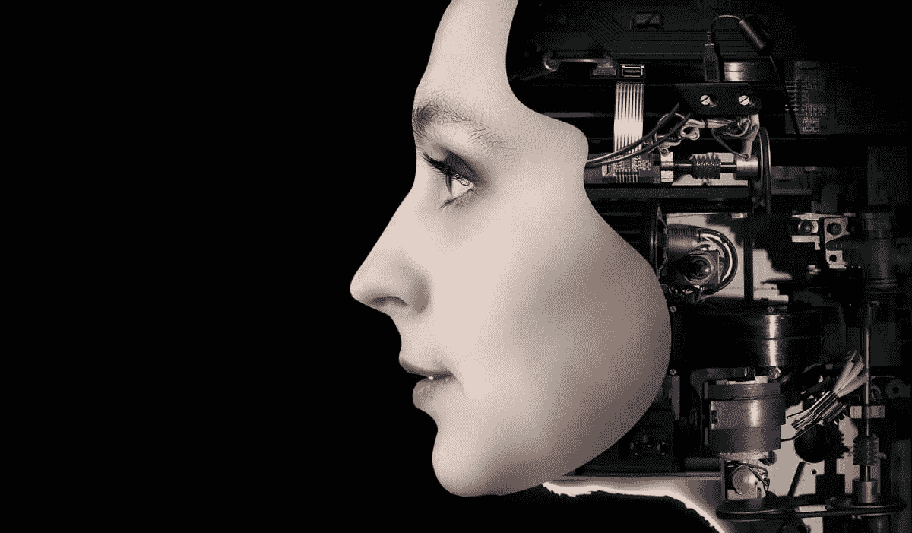
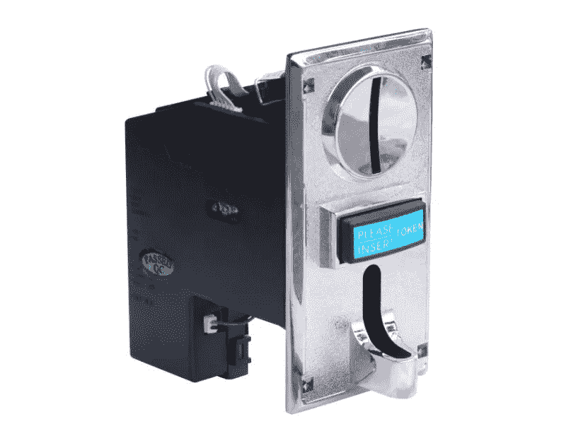
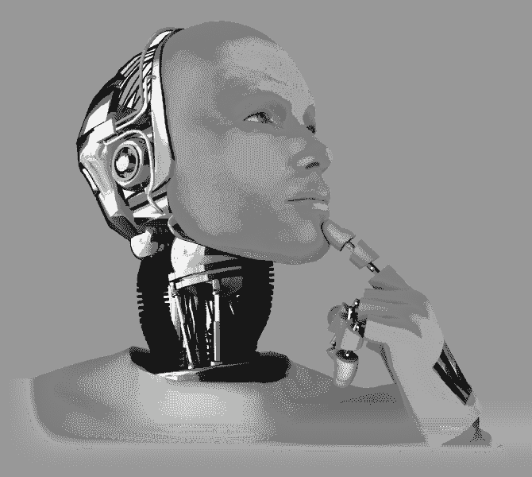

# 不要称之为智慧

> 原文：<https://medium.com/hackernoon/stop-calling-it-intelligence-6b1439a30bd8>

人工智能术语**是在 1956 年创造的，当时我们在这个领域没有多少经验。自那以后，小说家、记者和乐观的科学家们推波助澜，并允许这个词被误解为一个取代人类思维方式的系统。**

****

**最近，我不得不不止一次尝试解释这个概念。**

> **它会很快取代人类吗？代码什么时候会自己写？只是 AI 会把你手上的活都拿走吗？
> 能不能给我们的系统插上 AI，让我们的产品更好？**

**我还必须应对趋势诱导的投资者需求，将人工智能应用到所有事情中。**

**各种各样的人提出的诸如此类的问题让我坚信这个术语已经被滥用了，应该被改变。**

**我们所说的人工智能，与人们所认为的毫无共同之处。能解决问题吗？是的。它能识别模式吗？是的。它能思考吗？不。它是智能的吗？号码**

**这是一个非常聪明的数学工具，用于非常特殊的情况。随着时间的推移，它会对错误进行调整，以便更好地完成它被训练去做的一件事情。你给它明确的输入，它给你一些输出，然后你需要理解。**

****

**硬币机就是一个很好的例子。你投入一些硬币，它就知道你投入了多少。“人工智能”实际上是这样的，但机器的创造者没有将声明性的决策编入其中，而是让软件经受成千上万的例子，以调整其决策系统，使其达到某种程度上可以工作的程度。**

**我不想深入细节，你可以在网上找到一些资源来了解它们是如何工作的。底线是:如果没有人首先把声音变成图像，一个图像识别系统将永远不会自己发展出识别音乐的能力。它不会思考！**

**还有，不是即插即用。你不能把“人工智能”从架子上拿下来，然后取代你的劳动力。你*可以*通过使用复杂的系统提供额外的信息，让你的员工生活更轻松，但仅此而已。**

**所以我的想法是:**

*   **这个名字含糊不清，容易引起误解**
*   **并不像人们认为的那样**
*   **创建和使用它需要大量的工作**
*   **人们创造了它**
*   **人们训练它**
*   **人们使用它**

**在我的书里，没有任何人为的东西，智能存在于创造、训练和使用这个系统的人们之中。**

****

# ****我们可以开始称之为:高级分析吗？****

**但是 Meza，它能做的所有好的预测呢？**

**为此，我必须重申:预测是由使用“人工智能”输出的人或系统观察和识别的。你会得到一组很好的数字，这些数字意味着一些你必须解释和理解的东西。**

*****但是梅萨，它像人类一样通过反复试验来学习！*****

**你需要 200 万个例子来识别一个没有 100%比率的硬币吗？**

**我知道在学术上，人工智能这个术语是可以应用的。我没有质疑这一点。我在这里试图发现的是，如何让它对非学术人士不那么模糊和误导。**

**我不得不把这件事一吐为快。让我知道你是否同意。我想找一个更好的术语来形容这个。你有什么想法吗？**