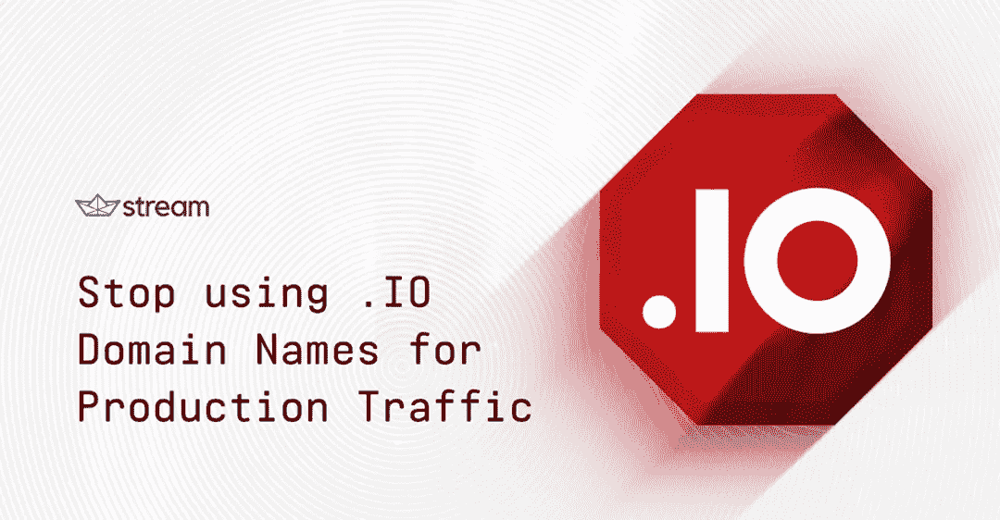

# 停止使用。生产流量的 IO 域名

> 原文：<https://medium.com/hackernoon/stop-using-io-domain-names-for-production-traffic-b6aa17eeac20>

*注意:如果你是* [*Stream*](https://getstream.io/) *的用户，请务必将你的 API 客户端更新到最新版本，以大幅提高可靠性。对于那些使用定制 API 客户端的人，看看我们更新的* [*REST 文档*](https://getstream.io/docs_rest/) *。*

域名解析是互联网的主干服务之一。这是我们通常很少花时间去思考的事情。当然，当它坏掉时，情况就变了。在过去的一年里，IO 域中断是我们的客户无法使用 [Stream](https://getstream.io/) 的首要原因。具体来说，2017 年 9 月 20 日的停电是一个令人头疼的问题。本文将深入探讨。IO 域名可靠性问题以及我们如何解决这些问题。

互联网域名系统(DNS)的基础设施庞大而复杂。由于其分散性，如果问题出在您的 DNS 提供商或更广泛的 DNS 基础设施上，除了坐等问题解决，您别无选择。处理 DNS 中断的唯一可行的解决方案是回退到备份域。

这使得 DNS 服务中断相当严重。许多风险都很复杂，降低风险的成本也很高，在某些情况下，降低风险几乎是不可能的。

# 哪里出错了:全球停电。“io”顶级域

2017 年 9 月 20 日，我们的系统监视器和健康检查开始显示间歇性故障。Pings 我们的网站和 API 服务器无法将“getstream.io”记录解析为有效的主机名。

要访问我们的核心 API 服务和仪表板，域名解析是必需的。没有它，客户就无法找到我们服务器的地址。不言而喻，这立即被归类为关键，并得到了我们团队的充分重视。

经过初步调查，我们发现解析任何 getstream.io 记录都会随机失败，并返回不正确的 NXDOMAIN 错误。随后，我们的一名工程师发现。6 个权威的 io 域中有 2 个会持续失败。io 名称服务器。其余四个运行正常，这解释了错误的明显随机性。

一个坏的如下所示:

由于这发生在权威的域名服务器上，我们联系了我们的 DNS 提供商，然后也试图联系 NIC.io。令我们惊讶的是，我们发现 **NIC.io 只能在世界协调时周一到周五上午 7 点到 12 点之间通过电话联系，并且没有暴露任何关于服务健康状况的状态**。

与此同时，我们开始查看还有谁受到了这次宕机的影响，并在 Twitter 和[黑客新闻](https://news.ycombinator.com/item?id=15293578)上发布了相关消息。在等待中断结束时，我们还增加了 DNS TTL，以便 DNS 查询的数量尽可能低。此后不久，我们收到了 Gandi.net 的回复，告知我们 NIC.io 正在修复这个问题。

[中断](http://status.getstream.io/incidents/kgqqpz89lpr0)持续了近 2 个小时，在此期间，对任何. getstream.io 记录的 DNS 查询都有 1/5 会失败。对于摆在我们服务前面的东西来说，这是一个很大的问题，并对我们提出了很多问题。

# 这难道不会发生在任何 TLD 身上吗？

我们明白了。有时候东西会坏掉。实际上，任何顶级域名都可能发生类似的中断。

当我们在 2014 年开始时，我们决定。从品牌的角度来看，io 很棒。 [Stream](https://getstream.io/) 是一个技术产品，我们的受众主要是技术型的，所以。木卫一似乎是一个伟大的匹配。为 API 使用相同的域与其说是一个深思熟虑的决定，不如说是一个结果。

不可能估计…的可能性。com 域名服务器与。io 名称服务器。令我们惊讶的是，虽然大约 20%的 DNS 解析。io 域名完全被破坏，很难在 Twitter 上找到抱怨的人。事实上，我相信我们是第一批发微博的人之一。如果这一切都发生了。com 域名，所有的新闻来源将已着火。

# 到底哪里出了问题

不幸的是，我们发现 NIC。IO 没有配备管理顶级域名所需的技术支持和系统。在发生大停电时无法联系到他们是不可接受的。

进一步看，不需要很多研究就能发现。io TLD 团队在过去几年里犯了几个错误。仅举几个例子:

*   一年前发生了几乎[相同的停机](https://news.ycombinator.com/item?id=12813065)(假阴性 NXDOMAIN 响应)。
*   2017 年 7 月，谷歌的一名安全工程师能够[购买一个权威域名服务器](https://thehackerblog.com/the-io-error-taking-control-of-all-io-domains-with-a-targeted-registration/) (ns-a1.io)的域名，并获得每个域名的控制权。io 域。

正在搜索[。HN 上的 io](https://hn.algolia.com/?query=io%20domain&sort=byPopularity&prefix&page=0&dateRange=all&type=story)返回一长串类似的中断。

# 最好的即时解决方案是什么？

添加一个. com 域并在我们所有的 API 客户端上使用它作为缺省值显然是容易实现的。当然我们也会有同样的问题。然而，我们对. com 背后的管理层更有信心。很明显，这个问题不仅可以更早地发现，而且人们也不会花几个小时来承认和补救这种情况。

# 我们实现 DNS 无中断服务的路线图

这些 DNS 问题让我们停下来思考 DNS 可能出现故障的所有方式。

1.  我们失去了对自己领域的控制。这可能以多种方式发生:

*   NIC.io an 决定[取消我们的域名](https://www.nic.io/terms.htm)。
*   我们[忘记](https://www.theregister.co.uk/2017/07/26/marketo_forgot_to_renew_domain/)到[更新](http://www.theregister.co.uk/2003/11/06/microsoft_forgets_to_renew_hotmail/)域(哎呀)。

1.  **Route53 停运。**由于我们将 getstream.io 委托给 Route53 名称服务器，因此它们的名称服务器出现故障会中断我们的服务。从 2016 年开始的 [DynDNS](https://dyn.com/blog/dyn-statement-on-10212016-ddos-attack/) DDoS 宕机就是一个例子。
2.  **。TLD 停电。**

因为我们控制 API 客户端，所以实现故障转移机制很容易。设置和维护备份域和/或备份 DNS 提供商可能非常具有挑战性。在第一种情况下，我们需要保持数百个 DNS 记录同步，并加倍我们的 SSL 证书；其次，我们只需要改变我们的基础设施，不使用任何 Route53 特定功能。为此，我们需要在两个不同的提供商之间保持所有 DNS 记录同步，并确保我们不使用任何供应商特定的功能。作为 AWS 客户，这是一个重大挑战，因为 DNS 在许多方面都已深度集成。

展望未来，我们的计划是增加一个. org 域名，并找到一个 DNS 提供商来管理域名服务器。

# 结论

事后看来，为我们的核心 API 使用. IO 域并不是一个好的选择。9 月 20 日的停电显示了问题和支持基础设施有多严重。根据我们的经验，如果可用性很重要，我们建议不要使用. IO 域名。

为了解决 DNS 问题，Stream 的 API 流量现在运行在. com 域名上。该网站仍在运行。io，因为这更难改变，并且在正常运行时间方面不那么重要。为了进一步提高可靠性，我们正在考虑:

*   添加备份。ORG 域名。
*   将备份 DNS 提供程序用于。COM 或者。ORG 域名。
*   在我们的 SDK 中实现客户端 DNS 故障转移。

DNS 作为一个整体是最想当然的事情之一，但很容易导致严重的停机和麻烦。使用广泛使用的 TLD。com/。net/。org 是确保可靠性的最好也是最简单的方法。

> 这是 GetStream.io 团队的一次合作，由 GetStream.io 首席技术官[托马索·巴布格利](https://twitter.com/tommasobarbugli)领导。原始博文可在[https://getstream . io/blog/stop-using-io-domain-names-for-production-traffic/](https://getstream.io/blog/stop-using-io-domain-names-for-production-traffic/)找到。