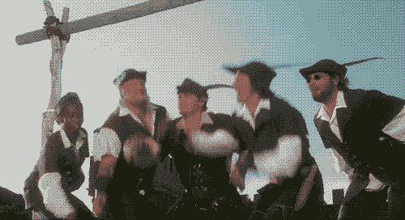

# 风暴表演:团队生产力的 4 个阶段

> 原文：<https://medium.com/hackernoon/storm-to-perform-the-4-stages-of-team-productivity-b47370c5ab17>

## 伟大的团队会真诚地对待彼此，不管有什么缺点

伟大的团队是如何创造历史的？

看看伟大团队的记录，比如最初的苹果 I 团队，1969 年的奇迹大都会，以及美国宇航局的太空任务组(多亏了 [*隐藏图形【T2 的】*](https://en.wikipedia.org/wiki/Hidden_Figures)团队合作的真实结构最近才被揭示)，很明显他们超越了团队合作的平均成就水平。但是他们是如何到达那里的呢？

根据团队发展理论，团队动力在推动人们超越平均水平并取得非凡成功方面发挥了重要作用。最大化[生产率的目标](https://hackernoon.com/tagged/productivity)就是为什么一个理论已经成为项目管理领域的核心教学——它列出了一些非常简单的原因，为什么有些团队达到了他们的生产率峰值，而有些没有。

从这个团队理论中借用见解，你可能最终会理解你的团队如何超越平均水平，一起释放更高水平的生产力。

# 群体发展理论

心理学教授布鲁斯·塔克曼博士在 1965 年的一项研究中首次提出了他的团队发展阶段模型，回顾了 50 多部现有的团队理论著作。从这些工作中，他将团队发展综合成四个基本阶段，甚至给他们起了一个方便的押韵名字:**形成、风暴、规范和表演。**

塔克曼阶段模型的目标是帮助项目领导理解他们的团队成员是如何一起建立关系的。事实证明，人们对待任务的方式取决于他们与同事关系的质量。

Teams can move backwards and forwards through Tuckman’s Stages model.

虽然这四个阶段让团队走上了高绩效之路，但团队发展不是一个线性的过程。随着新元素的增加或减少，动态会发生变化。

根据其成员的个性和经验，团队可能能够以更少(或更多)的摩擦吸收新的元素。团队可以在团队发展周期中前进和后退，甚至停留在不太发达的阶段(哎呀！).哦，所有这些都会影响生产率。

塔克曼模型是一个识别团队行为的框架，但是，正如麻省理工学院所指出的一样，它不应该被用来将团队“打包”成一份档案或“诊断”。

# 阶段 1:组建一个真正的团队

新工作的第一天，新老板的第一个任务——团队合作的形成阶段是关于第一次见面和第一印象。每个人都在 LinkedIn 式的最佳行为上。

在这个初始阶段，团队本质上是开始考虑项目和他们将扮演的角色的个人的集合。每个人都从自己的角度出发，专注于加入团队的“我有什么好处”。

由于每个人都在自己的岛上，因此由团队领导来启动团队方向，并描绘出要完成的工作。讨论了机遇和挑战，并制定了目标。每个人最需要的是清楚地了解自己在旅程中的角色。

但这不仅仅是生意。固体零食选择也有帮助。彼此相处融洽会产生联系，而联系会让人们摆脱个人主义的态度。部分原因是让他们意识到，他们的新团队成员带来了技能，帮助每个人以他们自己无法做到的方式取得成功。一起设定目标将这些技能和兴趣公开化。

*试试这个:* [设定你将坚持的目标的 5 个团队建设练习](https://blog.trello.com/5-team-building-exercises-setting-goals)

另一部分是建立情感联系。人们和他们喜欢的人做生意，所以想办法通过网飞戏剧、最近的假期和亚马逊上最好的咖啡机来建立联系。如果你鼓励团队成员在会议期间和休会期间相互交流，你会让他们一起更快地工作，减少牵手。

*用这些技巧来谈论它:* [远程视频会议的 5 个快速团队建设活动](https://blog.trello.com/team-building-activities-video-meetings)

总的来说，为了达到真正的生产力，团队需要超越闲聊，准备好参与更真实的层面，潜在的冲突等等。

# 第二阶段:闯入真实的联系

在某个时候，蜜月结束了。错过了最后期限，发布没有按计划进行，或者可能只是工作量太大，距离上个长周末已经太久了。一些团队成员可能不再对形成阶段设定的所有目标充满热情。触发因素会有所不同，但不和谐是不可避免的:大多数团队都会经历这样或那样的风暴阶段。

会有冲突，意见的两极分化，个性或工作风格的细分，以及从私人挫折到直接对抗的一系列不满。给不喜欢冲突的团队成员(和领导者)一个合理的警告——事情会变得尴尬。但是如果团队不能识别问题，进行建设性的沟通，并努力解决它们，他们将会在这个阶段停滞不前。

*澄清困惑:* [更好的团队沟通技巧](https://blog.trello.com/when-to-slack-and-when-to-hold-back-tips-for-better-team-communication)

有时需要一些冲突来找出项目中的弱点，帮助团队成员发现他们真正想要的角色，并互相推动来证明他们的想法。但是持续的风暴导致生产力、项目的毁灭，最终，团队本身。尝试不同的策略有助于在不直接对抗的情况下促进团队合作。

*跳出团队合作的框框思考:* [从集体头脑风暴中获得更好想法的方法](https://blog.trello.com/group-brainstorming-waste-of-time)

同样值得注意的是，当发生重大冲突或改变现状时，比如员工离职或更大的公司方向变化，团队可能会回到风暴阶段。(还要当心取消周五免费午餐的愤怒。)在这种情况下，对你团队不断变化的经历有一点同情会有所帮助，这种经历让你更难专注于深层工作，从工作保障或认可的角度来看，可能会感到不安。

团队中需要强调的关键价值是**积极的意图**。这就是说，即使事情进展不顺利，每个人都应该假设他们的“挑战者”来自一个好的地方，并试图以团队的最佳利益行事*。*每位团队成员还应尝试从他人的角度分析他们引发潜在冲突的原因。

人际痛点各种尴尬但不是常态。接下来，如果团队能够有效地沟通并找到合作的方法。

# 第三阶段:规范奇想乐队

对于能够解决问题并找到互补(而不是抵消)方法的团队来说，理解和接受团队动力的坦途指日可待。

要达到正常化阶段，需要对有效(和无效)的事物进行适当的观察、鉴别和行动。有时，这可能感觉像课后特殊小组治疗，但正如我们在最近的一项调查中发现的那样，专业性无法修补团队潜在的情感联系。执行团队不断地解决诸如交流偏好、成就认可和工作流程等问题。

*永远不要假设。点击此处查看我们的调查结果:* [在你的办公室需要克服的 8 个团队合作误区](https://blog.trello.com/8-teamwork-myths-to-tackle-at-your-office)

对于希望为梦之队奠定基础的领导者来说，在他们的报告中提倡积极的情商是很好的第一步。在一项分析中，三个团队属性特别有助于团队中健康的人际情商:信任、团队认同和团队效能感。将这种团队三连胜正常化不仅是可能的，下面还有一个方便的图表。

*描绘出你的梦想团队:* [你的团队真正高效所需的 9 项情商标准](https://blog.trello.com/9-emotionally-intelligent-norms-team-needs-truly-productive)

信任、理解和支持等属性也是由日常小事建立起来的，这些小事使一群人成为一个团队。以一种适合每个人的方式，留出时间进行水冷聊天，这样就有了每个人都可以开怀大笑的集体话题。

*保持联系:* [每周 15 分钟如何让你的团队保持联系](https://blog.trello.com/how-15-minutes-each-week-keeps-our-distributed-team-connected)

# 第四阶段:以最高的效率工作

表演阶段是协同作用发挥的时候。哦，是的，俗气的术语和所有。

以下是你在表演阶段可以期待的几件事:

*   群体规范已经被接受，人们感到交流想法和挑战现状很舒服，而不用担心错误的判断或拒绝。
*   团队成员清楚地知道他们在哪里可以最好地满足团队的需求，并且每个人都有高度的动力去实现相同的目标。
*   团队成员是相互依赖的，这意味着他们几乎不需要管理就能做出正确的团队决策并完成工作。

换句话说，当团队动态良好时，生产力真的很好。最有趣的是，性能并不意味着不会有冲突。团队成员仍然会互相挑战，但是从“积极意图”的角度来看，不同意见会被传递和接受，这意味着挑战实际上可以推动团队更加成功。

High fives all around!

在这种情况下，领导者能做的最好的事情就是授权团队成员获得他们需要的一切，以尽可能地提高生产力和创新力。

*了解你的团队工作方式:* [制造者与管理者:如何安排生产力方式](https://blog.trello.com/maker-vs-manager-productivity)

仅仅因为你的团队已经进入状态，你不应该停止对团队发展的关注。当因素发生变化，或者团队成员由于个人或人际关系原因退出团队工作时，总是有可能回到早期阶段。

放手可能很难，但伟大的队友从不认为别人会处理问题或抓住错误。科学术语是“社交游手好闲”，当人们陷入特定的职责时，即使是高绩效的团队也有可能出现这种情况。

*保持警惕:* [消除职场社交游手好闲的秘诀](https://blog.trello.com/avoid-social-loafing)

最后，不要忘记庆祝你的表演能力！一定要尽早和经常地验证伟大的团队合作，即使现在你的团队正处于巅峰状态。

*额外的事实:*第五个阶段，休会，是十年后增加的，代表当一个项目完成，一个团队逐渐停止合作时的拆除过程。

# 保持团队合作的透明度

保持团队在正确轨道上的一个关键因素是透明度。为什么不在下一次团队会议上讨论塔克曼的阶段模型？了解为什么在年度计划期间事情可能会变得棘手，或者你是如何在上个月的集体晚餐后发展出令人敬畏的团队合作的，可能会帮助你的团队在习惯性行为和互动破坏生产力水平之前阻止它们。

此外，这给了你一个合理的理由去分发激励海报，上面写着“团队合作让梦想成真！”或者……不是。这取决于你。😜

**接下来:** [建设高效团队的蓝图【免费指南】](https://blog.trello.com/productive-team-blueprint-free-guide)

*这篇文章，还有许多更啰嗦的东西，都是先在*[*blog.trello.com*](https://blog.trello.com/form-storm-norm-perform-stages-of-team-productivity)*发表的。*

> [黑客中午](http://bit.ly/Hackernoon)是黑客如何开始他们的下午。我们是 T21 家庭的一员。我们现在[接受投稿](http://bit.ly/hackernoonsubmission)并乐意[讨论广告&赞助](mailto:partners@amipublications.com)机会。
> 
> 如果你喜欢这个故事，我们推荐你阅读我们的[最新科技故事](http://bit.ly/hackernoonlatestt)和[趋势科技故事](https://hackernoon.com/trending)。直到下一次，不要把世界的现实想当然！

