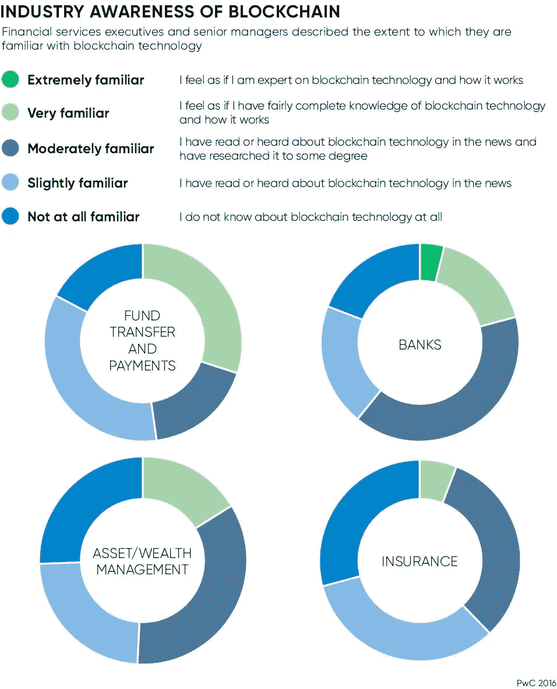

# 在新范式的区块链上浏览海洋协议

> 原文：<https://medium.com/hackernoon/surfing-the-ocean-protocol-on-a-blockchain-of-new-paradigms-e37e3b6e1d0c>

Ocean Protocol by BigchainDB

通过数百万年的生物设计，人类已经形成了对范式变化的抵抗力。有道理。根据定义，任何我们无法预料或想象的事情都是对我们行业确定性的威胁。*不确定性*是我们日常[压力源](https://www.nytimes.com/2016/06/05/opinion/sunday/are-you-in-despair-thats-good.html)的原因，这种一致性几乎不可思议。迟到的不确定性。赔钱的不确定性。生病的不确定性。我们害怕的不是痛苦地躺在床上的几个小时(这种情况几乎总会自行解决)，而是不知道它是否会发生或何时会发生。

但是为什么我们仍然把人送上月球，用大型强子粒子对撞机工作，或者进行任何危险的科学实验呢？

> “最大的风险是不冒任何风险……在一个变化如此迅速的世界里，唯一注定失败的策略就是不冒任何风险”——马克·扎克伯格

《海洋协议》是两项富有远见的技术的起源，这两项技术既乐观又充满不确定性:[人工智能](https://www.google.com/url?sa=t&rct=j&q=&esrc=s&source=web&cd=1&ved=0ahUKEwiqjN6wz6_WAhVDl1QKHcywBmwQtwIIMTAA&url=https%3A%2F%2Fwww.ted.com%2Ftalks%2Fsam_harris_can_we_build_ai_without_losing_control_over_it&usg=AFQjCNFsANQlRjyKoypHw-HFuOtHs6dFow)和[区块链](https://www.google.com/url?sa=t&rct=j&q=&esrc=s&source=web&cd=1&ved=0ahUKEwikweDBz6_WAhVqs1QKHVMnBOAQyCkIKjAA&url=https%3A%2F%2Fwww.youtube.com%2Fwatch%3Fv%3D1AVRVfw-8nE&usg=AFQjCNH3MEvJEBiYCoVXFbFIMsusG5yEUA)。海洋协议[就像其命名的巨大水体一样，是一个巨大的生态系统，深到足以让人着迷，但还没有深到让人完全恐惧。这是我听说的第一个真正将人工智能和区块链结合在一起的创新。许多创业公司声称分别使用人工智能和区块链技术来构建他们的平台——但这回避了一个问题:“你会通过每只手拿一只球棒来击出全垒打吗？”是的，每只球棒都可以增加接触的几率，但是要真正接触到所有的四个垒，需要两只手合在一起。](https://blog.bigchaindb.com/blockchains-for-big-data-from-data-audit-trails-to-a-universal-data-exchange-cf9956ec58ea)

# 第一个风险:人工智能

根据由[纳西姆·尼古拉斯·塔勒布](http://www.fooledbyrandomness.com/)倡导的[林迪效应](/incerto/an-expert-called-lindy-fdb30f146eaf),“不会腐烂的东西(比如技术和想法)的预期寿命与它们现在的年龄成正比。”也就是说，人工智能已经存在了大约 70 年，因此它应该至少再存在 70 年。人工智能已经存在，但是它的应用和它的[潜力](https://www.nytimes.com/2017/06/24/opinion/sunday/artificial-intelligence-economic-inequality.html?mcubz=0)是引起人工智能社区一些人担忧的原因。

目前，没有无可辩驳的证据来说服那些相信我们即将到来的人工智能末日的人。但是如果我们能证明追求这项技术的好处远远大于坏处呢？如果我们能够证明一台通过图灵测试的计算机，或者实现自我意识的计算机，比我们完全回避这项技术对社会的危害要小，那么研究和资金将会从两方面涌入。

毕竟，如果马仍然在纽约市的街道上走来走去，我们会在哪里？

人工智能已经对非常重要的算法负责，这些算法已经产生了社会层面的影响。以 2016 年美国大选为例。无需深究政治光谱的任何一方，众所周知[脸书的算法在诱使某些人口统计数据投票或不投票给某个特定候选人方面发挥了重要作用。它这样做除了让用户开心和花时间在这个平台上之外没有其他意图。（..另一篇文章的主题)。然而，这种影响表明，我们的人工智能程序已经深深地嵌入到全球文化的社会结构中，如果人类只是关闭它们或拒绝调查它们，它们可能会螺旋上升到愤世嫉俗者最害怕的程度。](https://www.samharris.org/podcast/item/persuasion-and-control)

# 风险二:B⃣l⃣o⃣c⃣k⃣c⃣h⃣a⃣i⃣n⃣

眼下，区块链和[加密货币](.news/business/blockchain-china-cryptocurrency-ico)已经成为创业和金融领域的时髦话题。在其核心，区块链有着巨大的潜力。它可以打开[社会的可扩展性](https://www.google.com/url?sa=t&rct=j&q=&esrc=s&source=web&cd=1&ved=0ahUKEwioifr-1K_WAhVjiVQKHUEtALsQFggoMAA&url=http%3A%2F%2Funenumerated.blogspot.com%2F2017%2F02%2Fmoney-blockchains-and-social-scalability.html&usg=AFQjCNFVfiEVPdbyg_zAZsZBdlLTKdM)，为发送和接收[汇款](https://www.google.com/url?sa=t&rct=j&q=&esrc=s&source=web&cd=3&ved=0ahUKEwja6qyI1a_WAhWKqFQKHehjCGgQFgg4MAI&url=https%3A%2F%2Fcointelegraph.com%2Fnews%2Ffrom-flying-money-to-blockchain-how-remittance-industry-has-reached-turning-point&usg=AFQjCNE)创造一个无障碍的渠道，消除我们对金融部门的依赖，重塑某些类型的[工程](http://www.enr.com/articles/41489-blockchain-and-engineering-a-new-business-model)，等等。(例如。自动驾驶优步/lyft 使用从乘客那里获得的加密货币支付自己的账单。由安德烈亚斯·安东诺普洛斯拍摄。)

PwC Blockchain Analysis

然而，这个世界远没有我们想象的那么可预测，在技术的道路上有各种各样的障碍。目前，区块链已经与加密货币密不可分，加密货币受到了地球上一些最大的[公司](corporations)和[监管机构](https://www.google.com/url?sa=t&rct=j&q=&esrc=s&source=web&cd=6&ved=0ahUKEwj-6_Wm1q_WAhUorlQKHf3wAa0QFghFMAU&url=https%3A%2F%2Fwww.coindesk.com%2Fa-bitcoin-law-for-every-state-appetite-and-animosity-greet-model-us-regulation%2F&usg=AFQjCNE_0c0i2Tg)的抨击。鉴于其对手的规模，可以有把握地说，如果比特币能够蓬勃发展，即使受到大银行和政府的攻击，该平台也将继续存在(Lyndi 效应也会同意这一点)。然而，另一方面，如果这些公司能够将加密货币打入地下，那么大众可能需要很多年才能意识到区块链和加密货币可能是互斥的。也就是说，区块链可以解除其与*货币*域的绑定，并继续将其应用于其他领域。

# 潜入海洋

《海洋议定书》背后的理念基于这样一个事实，即现代社会不可避免地依赖于数据。我们口袋里、背包里、售货亭里、杂货店里、机场里的电脑——它们都运行在巨大的数据池上，这些数据被收集并循环成各种信息带。分离这些集合的问题是，拉瓜迪亚国际机场的面部识别设备可以获得的数据无法访问已经同步到脸书的照片。或者 Amazon Go Kiosk 无法检测到有一个人正在为他购买杂货而发出全境通告。目前，有数百万个不同的数据池并排排列，但它们都被严格的屏障所分隔。

如果我们推倒这些墙会怎么样？

这正是 Ocean Protocol 在建立世界上有史以来最大、最高效的数据市场时所希望实现的目标。然而，拆除围墙并创建一个流动的数据体的问题是，很难使所有者与他们的数据协调一致。由于对隐私、监管和数据共享的需求，这可能会使这个大数据海洋变得不可行。

然而，有一种替代方案仍然保留了数据市场的本质——它依赖于双手挥动球棒。

根据 [BigchainDB](http://www.bigchaindb.com/) 的 Trent McConaghy 的说法，为了让这种类型的市场存在，“它需要去中心化”。它需要规模化，而不仅仅是一些闪亮的玩具技术。私有&大规模去中心化很难。然而，这正是我们自 2015 年以来一直在做的事情:一个 [IPDB](http://www.ipdb.io/) 如果你想知道，星际数据库就像维基百科，但什么都有。

在描述他的公司意识到他们有能力将这个虚构变为现实的那一刻，McConaghy 阐述道:“首先，我们拥有可扩展的区块链数据库技术。其次，我们拥有人工智能和区块链专业知识，这是设计数据市场算法的关键。第三，我们知道客户的世界，包括数据供应商(企业)和数据买家(人工智能公司)。最后，我们将与政府和数据监管机构建立关系。"

# 支持索赔

与其他一些雄心勃勃的初创公司不同，BigchainDB 正在兑现其与最大竞争对手——监管机构——建立关系的声明。他的公司已经与丰田研究所和 T2 数据交换公司合作。这种与动机可能与自己截然不同的研究公司合作的意愿，对麦康纳先生有很好的影响，应该会让他和他的团队在面临不可避免的摩擦时有所帮助。

无法预测人工智能和区块链将如何以及何时真正成为一个实体；然而，它们起源背后的逻辑是非常清楚的。后者是公平市场交易的绝佳工具。它在[隐私](https://www.americanbanker.com/news/cheat-sheet-the-trade-offs-of-blockchain-privacy-tools)，安全[，可扩展性](https://cointelegraph.com/news/from-flying-money-to-blockchain-how-remittance-industry-has-reached-turning-point)方面都很棒。前者效率极高，而且只会变得更加可怕。就个人而言，这些激进的技术有理由感到恐惧，但也许我们不应该孤立地看待每一项技术。也许我们应该把这两者统一起来，作为一个制衡体系。或许区块链是我们需要用来束缚人工智能并防止其失控的安全网。只有时间能证明一切。

然而，如果有一件事是可以确定的，那就是这些都是不确定的水域。

*如果你从这个故事* ***中发现哪怕一点涟漪的价值，请“鼓掌*** 👏 ***”下面的*** *这样别人也能找到。*