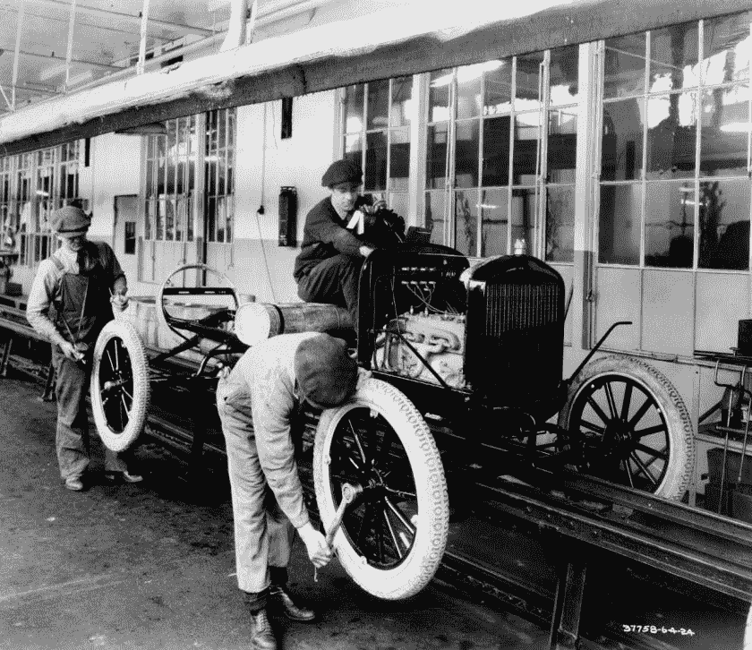
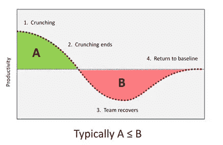

# 可持续工作

> 原文：<https://medium.com/hackernoon/sustainable-work-4189e68a88e9>

一个多世纪以来，我们已经知道，当工作周超过 40 小时时，工人的生产率就会下降。亨利·福特在 1914 年设定这一限制时并不是一个仁慈的软蛋——他知道这是利润最大化的方法。这就是他所做的——在他离开的第二年，利润翻了一番。[纽约时报，1914 年](http://www.nytimes.com/learning/general/onthisday/big/0105.html#article)

为什么这么多公司忘记了这个教训？一周又一周坚持长时间工作不仅会降低工作效率。身心健康、家庭和人际关系也会受到影响。太多时候，似乎光学(为什么停车场在下午 6 点是空的？)优先于理性。

从一个纯粹的、铁石心肠的商业角度来看，只有几周的短时间冲刺来满足不可动摇的最后期限才有意义。生产率的提高是短暂的，随后几周生产率会下降。以图形方式显示:

*Source:* [*lunar.lostgarden.com*](http://lunar.lostgarden.com/Rules%20of%20Productivity.pdf)

如果“崩溃”反复或持续发生，公司付出的代价将会更高。失去最优秀的人才是员工沮丧和脱离的必然结果。

当关键时刻不可避免地到来时，一家公司该怎么办？

在一家成熟的公司，反复的关键时刻几乎总是管理上的失败:承诺过多、计划不周或未能控制预期。所以，承认吧。然后，向员工展示一份两周紧缩期将如何产生预期结果的计划，以及一份如何避免未来出现这种情况的计划(并坚持到底)。)提供福利，比如庆祝或带薪休假一天，结束危机。如果两周的紧缩不能解决问题，那么最好找到一个替代解决方案，因为更长时间的紧缩只会适得其反。

创业公司是另一回事。他们可能对原因控制不了多少，但他们无法逃避这样一个事实，即过长的工作时间会降低 T2 的生产力。他们仍然需要将关键时刻限制在持续时间内，并确保团队有足够的恢复时间。

[的初创公司](https://hackernoon.com/tagged/startup)需要雇佣清楚了解所需承诺的团队成员。将公司的更大目标与工作联系起来将有助于激励员工。股权将确保对结果的主人翁感。公司应该:

*   提供灵活的时间表，以考虑到其他生活承诺
*   坚持休息健身和娱乐
*   创造一个团结互助的团队环境