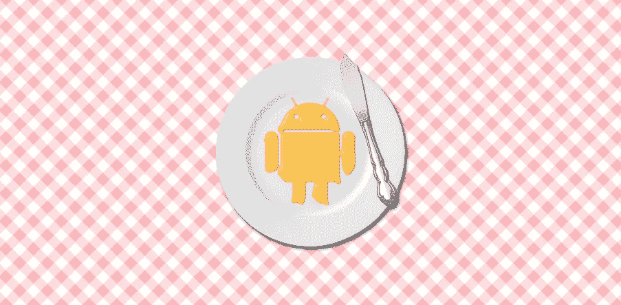

# 用黄油刀采取行动

> 原文：<https://medium.com/hackernoon/take-action-with-butter-knife-7381d2a1da9a>



如何在你的 Android 应用程序中使用黄油刀动作

如果你是安卓开发者，你可能听说过[黄油刀](https://github.com/JakeWharton/butterknife)。

Butter Knife 让在代码中绑定视图变得非常容易——不再有烦人的 *findViewById* 调用！

它也有更多的方法绑定，如 *OnClickListener* 和 *OnTouchListener* 等。

但是有一个你可能没听说过的鲜为人知的功能:

# 黄油刀动作

黄油刀动作与将多个视图绑定到一个视图列表结合使用:

```
@BindViews({ R.id.product_name, R.id.product_description, R.id.product_price })
List<TextView> productViews;
```

使用操作，您可以一次将操作应用于所有视图。酷吧？

```
ButterKnife.apply(productViews, View.ALPHA, 0.0f);
```

Android 上的操作[视图属性](https://developer.android.com/reference/android/util/Property.html)如下:

*   希腊字母的第一个字母
*   翻译
*   规模
*   等等

但是如果您想要自定义操作呢？

# 自定义操作

切换视图可见性可能是您经常做的事情，而且经常是在多个视图上同时进行。

虽然动作不支持开箱即用，但我们可以编写一个自定义动作来使这变得非常简单。

这里我们有两个选项:一个定制的**动作**，或者一个定制的**设置器**。

一个**动作**将简单地在一个视图上执行一个动作。例如，将可见性设置为消失，或将文本设置为空。

```
//custom action
public static final ButterKnife.Action<View> *GONE* = new ButterKnife.Action<View>() {

    @Override
    public void apply(View view, int index) {
        view.setVisibility(View.*GONE*);
    }
};//usage
ButterKnife.apply(productViews, *GONE*);
```

**设置器**更加灵活，支持参数。
设置一个视图的可见性更适合于一个**设置器**——我们可以创建一个设置器，而不是 3 个单独的动作:

```
//custom setter
public static final ButterKnife.Setter<View, Integer> *VISIBILITY* = new ButterKnife.Setter<View, Integer>() {
    @Override
    public void set(@NonNull View view, Integer value, int index) {
        view.setVisibility(value);
    }
};//usage:
//with a setter we can pass an extra visibility parameter
ButterKnife.apply(productViews, VISIBILITY, View.*VISIBLE*);
```

# 你还在等什么？

不要这样做:

```
productName.setVisibility(View.GONE);
productPrice.setVisibility(View.GONE);
productDescription.setVisibility(View.GONE);
```

执行以下操作:

```
ButterKnife.apply(productViews, VISIBILITY, View.*GONE*);
```

你的代码会喜欢你的，❤️

如果你喜欢这篇文章，一定要给它一些👏在推特上关注我。