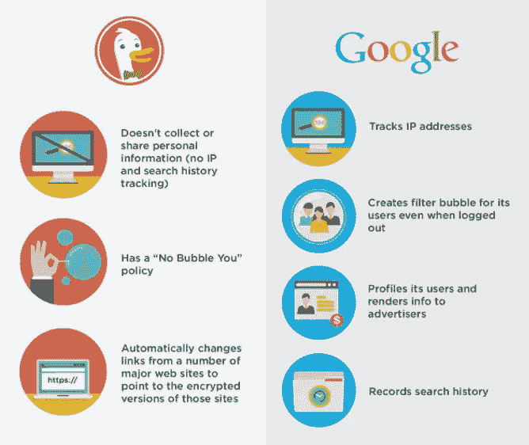
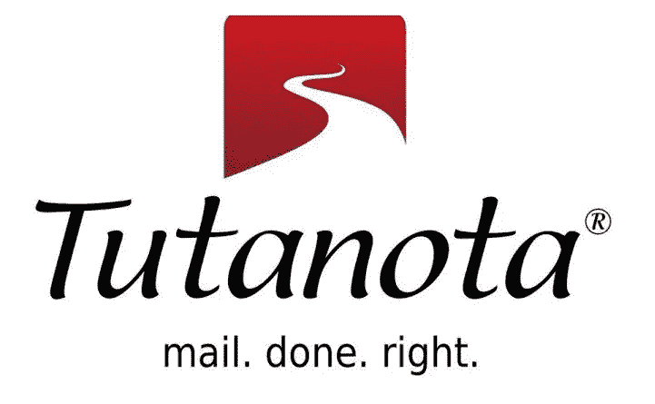

# 保护数据和通信中的隐私和机密性

> 原文：<https://medium.com/hackernoon/talking-about-security-of-communication-and-privacy-is-never-enough-especially-when-political-c0486fdda57>

谈论通信和隐私的安全性是远远不够的，尤其是当政治不稳定促使领导人做出将在全球范围内影响人们的决定时。那些希望在这篇文章中读到数据科学和机器学习的人应该把他们的愿望推迟到下一篇文章，因为这篇文章的内容同样重要，如果不是更重要的话。

# 动机

事实上，人们在交流方式上养成了很坏的习惯。许多人将他们的(数字)生活交到那些管理社交网络的人手中，声称他们正在促进交流的方式。其他一些人把他们的电子邮件放在那些声称自己不邪恶的人手中。其他人正在使用那些声称他们会保护自己的数据并应要求向安全机构敞开大门的人提供的工具在互联网上冲浪和搜索，或者更糟的是，让
的大门向入侵者和罪犯敞开。由于这种肤浅的交流行为，政府和企业已经获得了一个对我们所有人来说都非常不舒服和非常非常危险的位置。是时候停止这种做法，使用许多人负担得起的强大技术了。

# 一些常见场景

在 Google Drive 上与同事或朋友共享一份文档，以及一些电子邮件，当然还有 Hangout 上的一些电话，这种场景无疑会在一个提供商的手中留下极其丰富的痕迹。事实上，同一个提供商能够也将会建立一个完整的用户档案，包括他们写了什么，他们与其他同行的联系如何等等。如果这还不够，那么我们应该考虑这样一个事实，即这种行为将会在超过 10 亿的其他用户中大量重复。每天都是。永远。

*“我没什么好隐瞒的”*那些不努力保护自己通信安全的人会这么说。当然可以。没人有什么好隐瞒的。如果这是真的，这显然会与这样一个事实相冲突:发表这种言论的人，也就是那些在公共场合习惯锁门发短信而不是大喊大叫的人，不会透露一些无用的事实，比如他们晚饭要吃什么。

> 本来应该是私人的交流应该保持下去。句号。

另一种更微妙的情况是，小型和大型公司在数据和通信到达目的地之前，不太注意它们是如何流动的。这些信息通常会存储数年，并且可以被他们自己的提供商随时轻松访问，这些提供商有时也是他们的竞争对手。在撰写本文时，很少有人和组织能够声称对他们的通信有某种控制。即使是那些使用加密的少数情况也不总是安全的。

加密是由应该保密的密钥执行的，通常用于锁定和解锁纯文本或比特。如果这些密钥不在用户手中，整个加密机制就毫无意义。

Google Drive 和 **Gmail** ，仅举几个许多人大量使用的服务
(我不排除我自己)，不向他们的用户提供这些密钥。这仅仅意味着他们可以在任何时候阅读所有用户的文件和电子邮件，只要他们愿意或者被要求。阅读内容对于像谷歌和脸书这样的公司来说是必不可少的，以便为他们的用户提供个性化的搜索和广告，这也是所有这些服务免费的主要原因。

*“这些公司拥有惊人的数据仓库，可以很好地抵御黑客的攻击”*许多人说。确实如此。然而，这仍然给了他们获取信息的能力，或者，就像过去发生的那样，在他们提出或强加要求时，给予政府接触的机会。此外，没有人能保证这些电子邮件和文件会在整个生命周期中保持相同的安全状态。

不涉及加密背后的数学细节，如前所述，加密是通过密钥执行的。每当企业声称他们正在用加密技术保护用户的数据时，他们并没有说出事情的全部。

例如，他们通常保存密钥，这使得整个加密过程毫无用处。为了克服这种不愉快的情况，已经创建了许多安全通信协议。迄今为止最突出的一个是[零知识协议](https://en.wikipedia.org/wiki/Zero-knowledge_proof)，它不需要任何外部知识来证明一个陈述(通常是一个数学陈述)是真的。
这意味着使用零知识协议，提供商对其用户的数据一无所知，并且他们无法解密物理上处于其位置的数据，只是没有任何密钥。

实现零知识协议并确保其正确部署并不像人们想象的那么容易。但是感兴趣的用户不应该担心，因为我们在日常生活中使用的大多数软件都有类似的零知识语言。

> 如果这些密钥不在用户手中，整个加密机制就毫无意义

这里有一个“备选方案”列表，可以在需要时保证安全通信。

# 搜索引擎

事实上，谷歌搜索被指责在过于个性化的查询上返回有偏见的结果。也许这是副作用，也许不是。重要的是，随着时间的推移，我搜索的内容可能会返回不同的结果，这不仅仅是因为网络本身是动态的，还因为我的兴趣也会发生变化。为了做到这一点，谷歌收集我们所有的个人查询以供进一步分析，长期存储它们，并且永远不会让我们知道谁读了什么。假设人们通常不会对他们的搜索引擎撒谎(在这种情况下撒谎没有意义)，事实证明谷歌知道我们最隐私的秘密，我们想什么，我们想要什么，我们喜欢什么，我们对事实和人的怀疑。

DuckDuckGo 是一个更加独立的搜索引擎，它不跟踪用户，不存储他们的查询，只返回用户询问的任何内容。不包括偏见。

# 电子邮件和元数据

电子邮件分析是最微妙的，原因有二

1.  人们通过私人电子邮件写非常私密的信息
2.  虽然内容可以加密，但保证元数据的加密要困难得多

元数据是电子邮件服务器
将邮件发送到目的地所需的所有数据。因此，即使在非常罕见的情况下，电子邮件内容已经加密，元数据仍然在讲述谁发送给谁的故事。例如，通过分析发送给朋友或亲戚的信息的频率，然后发送给肿瘤学家或心理学家，可以揭示一个非常清楚的情况:发送者有健康或精神问题。
在这里，交流的模式才是有价值的。

[Tutanota](https://www.tutanota.de) 是一个开源的安全电子邮件服务，它负责加密电子邮件，而没有存储密钥的痛苦。电子邮件附件的端到端加密也得到了保证，安全性
和保密性通过对 [Tutanota](https://www.tutanota.de) 服务器的独特访问点得以加强。这允许用户使用他们的网络浏览器、移动设备或 Android/iPhone 应用程序进行交流。Tutanota 还允许为个人域名创建电子邮件地址，以确保安全通信，尤其是在商业环境中。至于存储，10GB 的成本相当于每月一杯咖啡。

另一个有效的替代产品是 ProtonMail，它具有非常相似的功能，但定价模式略有不同。

# 云计算和数据存储

如前所述，基本上所有的云存储服务都不提供任何保密功能，当他们提供时，他们更喜欢保留密钥，以允许他们读取存储在他们服务器上的任何内容。Google Drive、DropBox 或 Box 在[隐私](https://hackernoon.com/tagged/privacy)和加密方面都存在同样的问题。此外，用户的数据不仅可以被他们自己获取，也可以被任何入侵他们服务器的人获取，就像 DropBox 和雅虎已经发生的那样。

值得一提的有两大安全云存储提供商:SpiderOak 和 [Tresorit](https://www.tresorit.com) 。

在 worldofpiggy.com 的[我们有机会用 10 个用户的高级账户试用](http://worldofpiggy.com) [Tresorit](https://www.tresorit.com) 。不用说，我们发现 100%兼容 Mac、Linux、Windows 和移动平台 Android 和 iPhone 真的令人印象深刻。在一个非常直观的界面后面，共享本地目录和创建所谓的 Tresors，保持私密或与同事和朋友共享，有一个 **AES-256** 客户端加密，它应该是快速和安全的。
一个非常有趣的特性是共享文档的版本控制，它跟踪谁在改变什么，随着时间的推移保持非常严格的安全策略。所有文档都可以在设备间同步，这些设备可以连接到一个非常直观的仪表板上，也可以从仪表板上拆下。
在这一切的背后，一个零知识加密协议保证了 [Tresorit](https://www.tresorit.com) 自己根本无法读取用户的数据。即使他们被国家安全局控制也不行。无论如何，这将是相当困难的，因为在欧洲的 Tresorit 服务器拥有瑞士隐私法授权的数据，美国政府有很多要学习的地方。

# 匿名上网

写关于 [Tor](https://www.torproject.org/) 的文章可能看起来没什么用，因为我总是假设普通读者都知道它。在这种情况下，我会冒险重复一遍。 [Tor](https://www.torproject.org) 是一款针对网络监控的免费软件。这是最微妙的监控形式之一，因为它不仅不可见，而且通常不会在任何客户端应用程序(如浏览器或任何消息应用程序)中实施。Tor 背后的概念非常简单却有效。所有请求都在分布于世界各地的中继网络中来回传递，同时对所有数据包进行加密，并始终遵循不同的路由路径。这种机制可以防止有人截取一个人的通信、访问的网站或下载的媒体，使用户的位置始终保密。
虽然 Tor 被设计成可以在任何桌面应用上运行，通过设置一个代理将请求转发到 Tor 网络而不是野生互联网，但现在这种保护也可以扩展到移动平台，特别是 Android。安装 Orbot 和 Orfox (Tor 浏览器)就行了。来自 Twitter 的所有流量也可以被转发到 Tor 代理，以混淆一个人发送的 tweets 的位置。

# 密码管理器

保存您在工作日可能使用的所有密码并不容易，尤其是当它们都不同时。它们有区别吗？

KeePass 是一个免费的开源密码管理器，帮助用户安全地管理他们的密码。Chrome 和 Firefox 浏览器试图跨设备同步密码和表单，这实际上是将从客户端散列得到的密码交给了相同的提供商。虽然从数学上讲不可能从哈希版本中重建密码，但仍然可以使用这些哈希进行身份验证(除非有双因素身份验证机制)。
由于显而易见的原因，我个人不鼓励在云上存储密码的散列。然而，我鼓励将它们保存在像 KeePass 这样的密码管理器中，它用密码锁定密码数据库(用 AES 或 Twofish 加密)。将本地数据库存储到加密的文件系统或与 Tresorit 共享的文件系统会增加另一个安全级别(只对最偏执的用户可用)。

# 移动通信

移动通信可能是风险最大的，因为人们更多地使用手机而不是笔记本电脑。WhatsApp 因故意或错误打开/忘记后门而多次受到指控。这种“错误”让 WhastApp 的员工可以读取用户的信息，即使这些信息已经从设备上加密了。由于 WhatsApp 使用专有协议和应用程序，因此无法核实他们所声称的事实。

Telegram 是一个更安全的移动消息应用程序，它在安全性和保密性方面做得更好，因为它们的客户端代码是开源的。然而，他们的后端不是，这再次导致不可能完全验证的场景。

唯一一个在完全打开状态下正确运行的手机信息应用程序是 [Signal](https://whispersystems.org/blog/signal) 。Signal 只需要一个电话号码(来接收认证码)，并使用真正的端到端加密来保护与其他 [Signal](https://whispersystems.org/blog/signal) 用户的所有通信。

当然，这是一个建议，它真的不应该适用于您的所有通信。应该在可以清晰传输的内容和您更好保护的内容之间进行权衡。这种权衡只能由你自己决定，只有你知道什么是重要的，什么…可能不是。

事实上，有非常有趣的技术可供我们使用，而且价格也非常低廉。我们可以选择使用它们。

> [黑客中午](http://bit.ly/Hackernoon)是黑客如何开始他们的下午。我们是 [@AMI](http://bit.ly/atAMIatAMI) 家庭的一员。我们现在[接受投稿](http://bit.ly/hackernoonsubmission)并乐意[讨论广告&赞助](mailto:partners@amipublications.com)机会。
> 
> 如果你喜欢这个故事，我们推荐你阅读我们的[最新科技故事](http://bit.ly/hackernoonlatestt)和[趋势科技故事](https://hackernoon.com/trending)。直到下一次，不要把世界的现实想当然！

