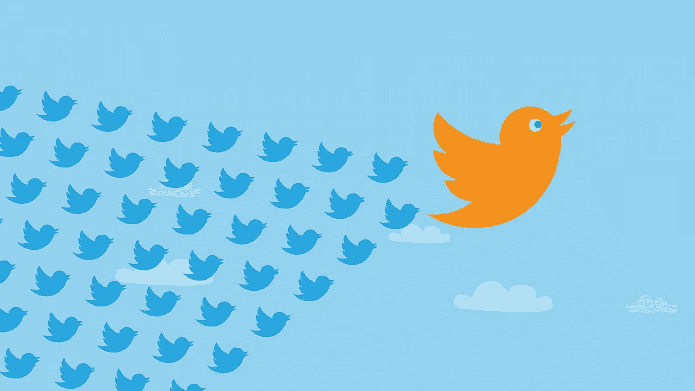

# 科技公司的首席执行官、创始人和风投们会对 Twitter 上的 280 个角色做出反应

> 原文：<https://medium.com/hackernoon/tech-ceos-founders-and-vcs-react-to-280-characters-on-twitter-90d9d09886a2>

昨天在 LinkedIn 上，该公司首席执行官杰夫·韦纳在推特上评论了新的 280 个字符的格式。

“解析和阅读那么长的推文可能并不有趣，但必须承认，写起来容易多了，”[韦纳在 LinkedIn 上发布了他的第一条 280 个字符的推文后写道。](https://www.linkedin.com/feed/update/urn:li:activity:6336322473872621568)

我认为看到一位科技公司的首席执行官评论 Twitter 的新格式很有趣。我问自己:其他硅谷和科技行业的领袖对 Twitter 谈论最多的进化有什么看法？

所以，我决定深入调查一下。

[在一位 Twitter 用户的帖子上，他解释说“我反对。不是以某种深切感受到的方式，但它似乎击败了使用价值，”威尔逊回应说:“是的，如果人们滥用它。”](https://medium.com/u/268314bb7e7e#280，”他在一系列推文中写道。“要说清楚。我不反对#280。但我认为少即是多，永远如此，”他补充道。

<p id=)[与旧金山设计和风险投资公司 Combine 的](https://twitter.com/mgsiegler/status/929033268116185088)[亚当·米凯拉](https://medium.com/u/dd5a4070f108?source=post_page-----90d9d09886a2--------------------------------)的交锋。