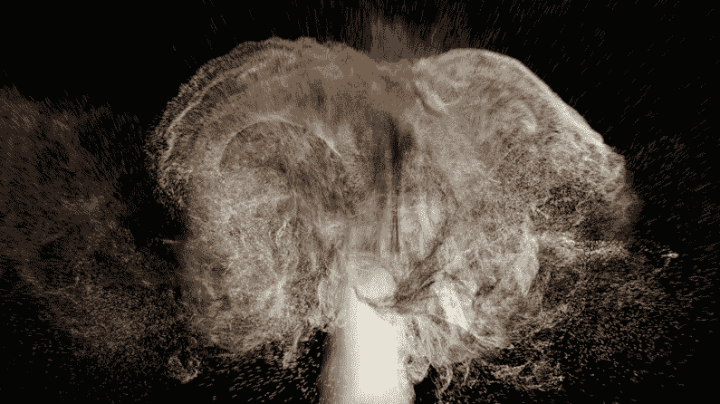

# 技术、感知和希望。

> 原文：<https://medium.com/hackernoon/technology-perception-hope-69ab0cc5f0fe>

永恒和变化是人类经验的两个方面。当我们凝视一朵花时，我们并不是在凝视我们祖先的同一朵花，因为我们的花，或者更确切地说，我们对花的概念与五百年前的人所说的不同。

我们的观念并不一定更好或更坏，只是不同而已，花还是花，人还是人，但实际上我们并不一样。

我们的概念和范式会随着时间的推移和不同的环境而改变，就我个人而言，我现在将专注于[技术](https://hackernoon.com/tagged/technology)(这本身就是一个大问题)如何改变我们的概念、模型和我们感知世界的方式。

如今，我们接触到前所未有的大量信息，这些信息不仅太多，而且是经过过滤的，我们只能看到我们感兴趣的内容。

今天，看到花，我们可以通过输入搜索立即扩展我们的花概念。花，或者说我们的花的概念现在更宽泛了，但根本不是我们的。

我们的祖先，独自在田野里，在他们自己的概念下，用他们自己的眼睛，凝视着那朵花。但是我们不再那样做了，我们在其他人的视角下观察花朵，许多其他人，并且越来越难以构思自己的概念。

技术赋予我们力量，并在许多方面提供了更大的生存可能性，它以指数方式改变了我们。

科技会让我们变得更好还是会毁灭我们？我认为这个问题的答案不取决于技术，但在美国，例如人工智能代表了生产和服务模式的一种范式转变，正如卡尔萨根(Carl Sagan)所言:我们是一个高度依赖科技的文明，但实际上，大多数人对科技知之甚少。

人工智能带来的变化以及它们将如何应用将由那些设法掌握技术的人来实现，大多数人将不得不适应这些最终由少数人决定的变化。监管将是必要的，但在一个政治主导、对许多问题盲目无知的世界里，监管很难实现。

是好是坏？嗯……两者都有，对一些人来说更好，对另一些人来说更差，但可悲的是，人类历史总是这样。

今天，与我们的祖先不同，我们以更强的理解来观察我们的世界，但不一定有同样的深度，不一定有同样的自由，也不一定有同样的希望。然而，它并没有停止令人着迷，因为我们的产品有力量让我们屈服或者[带领](https://hackernoon.com/tagged/lead)我们到达宇宙的极限。