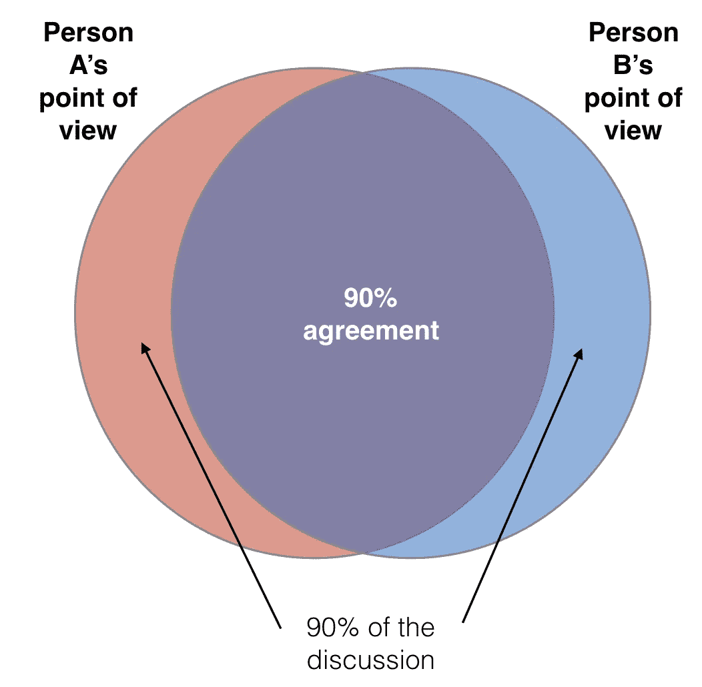

# 90%同意规则

> 原文：<https://medium.com/hackernoon/the-90-agreement-rule-36757dcc8eaa>

我可以回忆起很多例子，当我与某人(我通常同意的人)的谈话、会议或讨论变成了一场完全成熟的辩论。我们经常将这些对话描述为“横向进行”,因为这是双方的感受。这是一种感觉，你们并肩前进，然后突然，有人来了个急转弯。双方通常会带着这样的感觉离开这些对话:“我以为我们很一致——结果我们并不一致”。有时这是真的——有一个根本性的分歧刚刚浮出水面。但在绝大多数情况下，我认为这种不一致的感觉更多的是视角问题，而不是真正的意见分歧。

我在工作场所目睹过这种情况，但考虑到当前的政治和社会环境，这种情况在外面也发生得更多。以下是我对这类情况的观察，以及我现在如何处理它们。观察是这样的:

> 我们花了 90%的时间，谈论我们不同意的 10%的事情

直观地表达出来——看起来是这样的。

停一会儿。回想一下过去的一周，看看你是否能回忆起这样的例子。如果可以，反效果会很明显。但是具体到这种现象的缺点，这就是为什么它不可怕:

*   所有的创造力和精力都用在了争论和阐述解释或观点的细微差异上，而不是建立在共同的信仰和价值观上
*   如果有人依赖你来解决冲突，他们的进展就会受阻，因为没有明确的共识
*   你觉得与某人的距离/距离/不同步比你需要的要多。这可以减少你将来想和那个人交往的可能性

这些讨论通常很痛苦，或者“[低带宽](https://hackernoon.com/tagged/low-bandwidth)”……如果你是一名领导或经理，这个问题有时可能源于优先考虑“被倾听”而不是“T2”创造清晰。但是如果我们反过来看，我们的角色就变得很明显了——在有一致意见的地方(和没有一致意见的地方)提供最大的清晰度。如果我们重新思考我们的角色，我们会发现认同率比我们想象的要高。

这并不意味着我们必须在所有事情上都达成一致。为不同意见创造空间实际上非常重要——它有助于充实重要的差异，如果被墙纸覆盖或忽略，这些差异可能会被放大。这在亚马逊的“不同意并承诺”领导原则中得到了很好的体现。但对我来说，排序是非常重要的……首先在“大约 90%一致”的地方创造清晰度(并以此为基础)——然后回来解决分歧。通过一系列步骤阐明这一点，这就是我如何尝试[不总是成功地]管理一场讨论:

1.  通过问“我们同意什么”、“我们有什么共同的观点”、“我们在哪里一致”来积极地寻找共同点？因为这些是共享的，所以把它们写下来。我们的目标不是在所有事情上都达成一致，而是寻找 90%一致的领域，并在这些领域花时间。当出现分歧时，确保这些领域被清晰地表达/写下来，但此时要克制住争论或解决它们的冲动。
2.  随着达成共识的项目越来越多，花时间阐明它们，以确保事实确实如此。让个人尝试表达其他人的观点，以确保大致一致。不要求完美——记住，我们寻求 90%的一致。如果有人/事依赖于某个决策，那么问“这个[团队/人/决策]是否有足够的共识来推进？”。如果是这样的话，确保发生这种情况。
3.  最后，回到有实际分歧的地方，继续努力。

关于如何解决真正的分歧(#3)，如何打破僵局，以及确保决策不是“所有意见的平均值”，我们现在可以说很多，但这超出了本文的范围。目前，我的主要希望是帮助那些共同点比你可能相信或感知的更接近的情况。

因此，下一次当我们感到必须向某人解释他们错得有多离谱，或者有人觉得有必要对我们做同样的事情时，在展开怀疑的辩论之前，我们可以先问问自己“我们到底在什么问题上达成了一致？”。偶尔，答案会是“什么都没有”——但是如果我们带着好奇心去思考这个问题，我们会发现答案是“实际上，很多”。