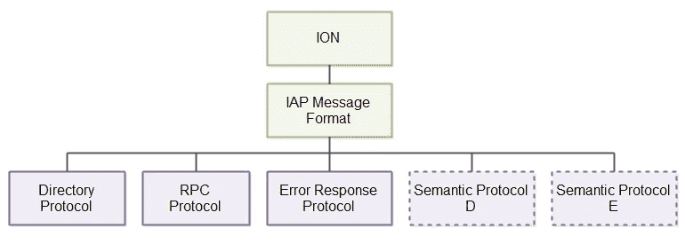

# IAP 协议的优势

> 原文：<https://medium.com/hackernoon/the-advantages-of-the-iap-protocol-54ba85bc62d3>

在[这篇文章](https://hackernoon.com/our-ambitious-quest-to-democratize-distributed-systems-act-1-protocols-b6bec5297213#.829elar43)中，我们强调了为什么协议在处理分布式系统时很重要，我们还简单介绍了我们的 HTTP 协议的替代方案，称为 **IAP** ，它是我们在 Nanosai.com[正在进行的项目的一部分。](http://www.nanosai.com)

IAP 协议主要是为了 3 个特定的目标而设计的:为整个互联网带来分布式计算的实时民主化、多功能性和智能性。我们称这个版本的互联网为“T8”网格(Grid)，我们希望它能由我们的高级分布式系统开放 Java 工具包(名为 [**Grid Ops**](https://github.com/nanosai/grid-ops-java) )提供支持。

1.  **实时**

为了满足实时民主化的目标，我们将 IAP 的编码 [**ION**](http://tutorials.jenkov.com/iap/index.html#iap-object-notation) 设计为二进制，并且尽可能的快速和紧凑。将[与其他二进制编码和 JSON 进行比较后，我们强烈地感觉到我们离实现这个目标更近了。](http://tutorials.jenkov.com/iap/ion-performance-benchmarks.html)

2.**多功能性**

为了满足通用性的目标，我们将 ION 设计成一种通用的数据格式，可以很容易地在当前使用 XML 或 JSON 的任何地方替代它。类似地，IAP 被设计成一个可扩展的网络协议，其协议基础可以用定制的语义协议(子协议)来扩展。最后，IAP 旨在处理多种消息交换模式，而不仅仅是 HTTP 协议的请求-响应模式。

3.**情报**

为了实现智能目标，我们正在为最常见的互联网通信用例设计一套 IAP 语义协议。这些协议将使互联网更加“即插即用”，并向“语义网”——Web 3.0 或任何你想叫它的东西——迈进一大步！

在未来，我们计划增加更先进的分布式交互选项，但要避免过多承诺和披露我们未来的商业计划；在这一点上我们不能谈论太多的细节。我们花了将近 2 年的时间从最初的架构设计转向一个更具雄心的架构，我们希望这将有助于塑造一个更智能、更多功能的大规模分布式计算的新方向。

最后，我们将很快宣布面向分布式系统开发人员的第一套基础设施服务的发布日期。如果您对我们的公开发布感兴趣，请`[**Subscribe here.**](https://goo.gl/forms/zXQe9k2es9iombdD2)`

> [黑客中午](http://bit.ly/Hackernoon)是黑客如何开始他们的下午。我们是 [@AMI](http://bit.ly/atAMIatAMI) 家庭的一员。我们现在[接受投稿](http://bit.ly/hackernoonsubmission)并乐意[讨论广告&赞助](mailto:partners@amipublications.com)机会。
> 
> 如果你喜欢这个故事，我们推荐你阅读我们的[最新科技故事](http://bit.ly/hackernoonlatestt)和[趋势科技故事](https://hackernoon.com/trending)。直到下一次，不要把世界的现实想当然！

