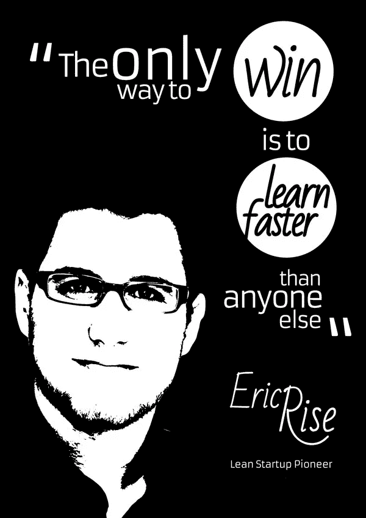

# 敏捷原则在现代产品开发中已经过时

> 原文：<https://medium.com/hackernoon/the-agile-principle-that-is-obsolete-in-modern-product-development-7b7d3e8d773e>

我认为自己是敏捷以及[宣言](http://agilemanifesto.org/principles.html)所陈述的价值观和原则的粉丝。事实上，我使用敏捷已经很多年了，我看到了多少团队通过这种实践在这些年里发生了变化和改进。

我目前正致力于组织层面的敏捷转型，试图将敏捷实践带到整个公司(包括营销、客户服务、销售等)。

这种转变还包括将 IT 团队带到一个新的“敏捷性”水平，尝试更多地利用它提出的价值和原则。对我来说，这意味着重新接触敏捷的根源和基础。

因此，我一直在重读这份宣言，并再次思考它的原则。令我惊讶的是，我发现了一个我认为完全不适合现代产品开发的问题:

1.  ***工作软件是进步的首要衡量标准。***

# 关注结果而不是产出

这一原则的基本思想是，原型、文档或任何其他无效的工件都不能算作真正的进展。我同意。

**但这还不够。**

交付没有人想要或者没有目的的工作软件是没有用的。**只是*交付*把重点放在了产出上，而不是结果**。

构建创新产品**时的主要进度衡量标准应该是{核心指标}改进**！

使用、保留、生命周期价值或任何其他你定义为核心指标的 KPI，你可以衡量人们是否重视你的产品，这应该是跟踪进展的方式。

为了给敏捷宣言一个正确的评价，第七条原则在一段时间前是完全合理的，当时他们试图摆脱瀑布模型，转向早期交付。并且考虑到软件开发人员的角色更倾向于交付“业务涉众”认为重要的东西。

但是当我们进入一个**产品创新的世界，没有人真正知道什么会有效**，整个团队应该对结果负责，仅仅交付有效的软件是不够的。

# 还可以跟踪学习情况…

当我们脱离软件工厂模型时，我们需要专注于理解什么是要构建的正确产品。这就是[产品发现](/@nachobassino/effective-prioritization-with-rapid-experimentation-ddb7c6403d46)发挥重要作用的地方。

产品发现包含我们为 ***学习和验证*** 什么是我们必须制造的“正确产品”所做的所有活动。基于精益原则和客户开发，在我们着手构建解决方案之前，使用一套工具来快速与用户互动，以了解他们需要什么。

因此，作为进展的衡量标准，我们需要关注**(交付周期的)度量改进和(发现周期的)学习**。

*注:这涉及到* [*双轨敏捷*](http://svpg.com/dual-track-agile/) *我希望我能尽快写出来。*

由于整个团队都应该参与到这些活动中，跟踪学习有助于你衡量团队在创新产品方面的进展。

# 最后的话

实际上，如果我们看一看第一个原则(“1。我们最优先考虑的是通过早期和持续交付有价值的软件来满足客户。”)，它专注于通过**有价值的**软件为客户服务。我相信这已经涵盖了第七原则试图做的事情，并更好地关注结果。

无论如何，这只是一个谈论发现和注重结果的产品团队的好借口，所以我抓住了这个机会:)

*原载于***。如果您喜欢它，并希望获得更多关于产品发现的工具&提示，您可以在此* [***订阅***](//my.leadpages.net/serve-leadbox/1440c1173f72a2:111de60b7f46dc) *。**

******

> *[黑客中午](http://bit.ly/Hackernoon)是黑客如何开始他们的下午。我们是 [@AMI](http://bit.ly/atAMIatAMI) 家庭的一员。我们现在[接受投稿](http://bit.ly/hackernoonsubmission)并乐意[讨论广告&赞助](mailto:partners@amipublications.com)机会。*
> 
> *如果你喜欢这个故事，我们推荐你阅读我们的[最新科技故事](http://bit.ly/hackernoonlatestt)和[趋势科技故事](https://hackernoon.com/trending)。直到下一次，不要把世界的现实想当然！*

**