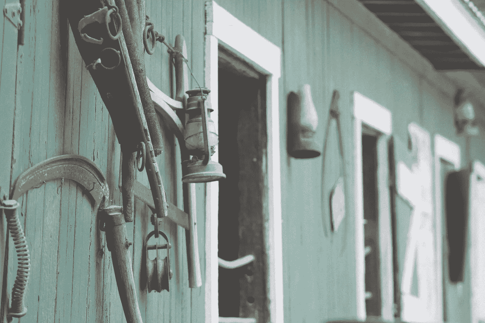

# 古董店模式是你摆脱自由职业盛宴或饥荒的方法。

> 原文：<https://medium.com/hackernoon/the-antique-shop-model-is-your-way-out-of-freelance-feast-or-famine-511f05b5577b>

Photo Credit: Justin Greene via Unsplash

## 自由职业基础

你可能没有足够的东西卖。

你很可能将自己置身于一个艰难的场景中，月复一月，[你必须卖出足够的小时数](https://blog.usejournal.com/freelancing-fundamentals-48e1e43fd5e1)或[固定价格项目](/@austinlchurch/freelancing-fundamentals-ae817ce573fb)来实现你的收入目标。

但是如果你只卖写作——也就是你自己的技能——而你的大多数客户每年只需要你几次，那么你总是会有客户短缺。每个月都会重置时钟。

你什么时候才能最终转危为安，能够享受这种人人都在谈论的所谓“自由”？

现在，你比过去朝九晚五的工作时间更长。

我的朋友迪克·哈里森的妙语如珠，令人心痛:

> “作为一名自由职业者，我可以决定什么时候工作——任何我想要的每周 60 到 80 个小时。”

自由职业是一种残酷的玩笑吗？

不。对于只有一件东西可卖的自由职业者来说，无休止的忙碌太常见了——例如，写作或设计。

## 该是你熟悉古董店模型的时候了。

当我还是个孩子的时候，我的祖父母会带我去田纳西州的贝尔扣进行他们所谓的“威吉利叔叔”探险。

贝尔扣市中心被列入了国家历史古迹名录，你来这里只有一个原因:古董购物。

玛莎和乔·莱盖特不算采摘工，但小奥斯汀在镇上，他们喜欢驱车 50 英里去贝德福德县，花一天时间浏览农场古董。

至少从一个聪明的男孩的角度来看，农场古董的好处在于你可以触摸它们。它们是为了持久。我可以在旧马蹄铁上找到手指。我可以操作一个被多年强壮的双手磨得发亮的木制牛奶搅拌器。我几乎提不起铸铁煎锅，它们被上千顿饭的油脂弄黑了。

我的祖母解释了为什么没有两个拼布被子是一样的。像田纳西州费耶特维尔的所有妇女一样，她和母亲会剪断空饲料袋的接缝，用棉花做衣服和被子。

他们重新利用手头所有零碎的布料，而不是购买新的。因此，每一床被子都讲述了一个家庭的足智多谋、需求和手工、土地和动物的故事。

“这些东西都是从哪里来的？”我以为。“你怎么能整天坐在古董店里还能找到古董卖呢？”

## 多年后，我了解了寄售。

店主保留了一本账簿。凯莉·海切尔放下了这条属于她曾祖母的被子。她还有其他的，如果价格合适愿意卖。古董店把被子陈列出来。如果卖了，店主会得到佣金，卡丽也会。

你会在跳蚤市场、社区庭院销售和当铺找到同样的寄售模式。

一大堆东西会吸引更多的人。这也是有道理的:更多的多样性意味着更多的人更有可能找到他们突然离不开的小玩意或珍宝。

我希望你记住寄售的概念:兜售别人的东西，赚取销售佣金。

## 古董店模式在自由职业中发挥作用。

假设你是一名自由撰稿人，要想每个月赚 5000 美元，你必须拼凑足够的小时工、固定价格的项目、产品化的服务，才能从 0 美元到 5000 美元。

在一个*好*月的中间，你取得了很大的进步:

*   500 美元 Acme Corporation 的博客预聘费用
*   750 美元——给朋友的网络内容
*   1250 美元——会计师事务所的新培养序列
*   1，500 美元—电子商务网站的销售页面
*   250 美元—当地商会的新闻稿

有了 4250 美元的销售额和两个星期的时间，你肯定能达到你的目标。

也许你知道。也许在大多数月份里，你卖出的自己的东西足以超过 5000 美元大关。

正如我之前提到的，挑战在于你自己的库存总是有限的。你一天只有这么多时间，在你冒着精疲力竭的风险之前，你只能在一定程度上利用你自己的生产力。

你当然不想筋疲力尽，如果你像大多数自由职业者一样，你喜欢在更短的时间内赚更多的钱。

我有一个解决方案给你。采用古董店模式。卖别人的东西。

你自己的技能和服务将占据一个角落，当每个新客户进入你的领域时，你可以询问他们的全部需求。

## 再看一下上面的列表。

难道其他潜在的需求没有在那里表现出来吗？你可以识别他们并向他们推销，而不需要亲自负责执行某些任务。

*   Acme Corporation——您为 Acme Corporation 撰写博客文章，但是登录到 WordPress 仪表板，格式化每个新文章，然后发布它？谁追踪免费库存摄影？谁会抓住要点，将其改写成社交帖子，并安排这些推文和脸书更新？
*   朋友—你已经在提供网页内容了。设计、开发和摄影的计划是什么？
*   注册会计师事务所——一旦你发布了新培育序列的内容，谁会在 MailChimp 中设置它？谁来拆分测试主题行并监控打开率和点击率？谁会利用这些数据来优化每封邮件并提高转化率？
*   电子商务网站——谁来设计销售页面？公司会创建多个版本并向两个版本发送流量吗？谁会从对比测试中得到结果，并重新思考内容策略？谁将与购买了产品的客户交谈，并从他们那里获得真知灼见？
*   商会——谁将分发新闻稿？谁来联系当地的新闻站和记者？目标比创造意识更大吗？成功是什么样子的，谁来负责？

我毕业后的第一份工作要感谢这种多卖东西的思维方式。当地一家创意机构的老板给了我一个文案的职位，但我们从来没有足够的写作工作。

我成了一名普通的杂役，我的时间都用来做一些零工，比如制定我们的品牌战略、社交媒体管理、创建和编辑提案，以及销售和客户管理。

该机构的负责人和创意总监都给我分配了一些随机任务:“你是新来的。做这件我不想做的事。收拾这个烂摊子。解决这个问题。”

## 成为图腾柱上的底层人物是因祸得福。

六个月后，经济衰退，我失业了。那时候，我已经戴着不同的帽子了。我习惯于像一个问题解决者一样思考和行动，而不仅仅是一个责任范围狭窄的“作家”。

向每个自由职业客户出售各种服务似乎是显而易见的。机构就是这么做的。

古董店模式与代理商模式有两个不同之处:

1.  代理机构向客户出售员工的时间。自由职业者必须出卖其他自由职业者的时间。
2.  代理机构将其所有服务集中在一张账单上。但是，一个自由职业者出售其他自由职业者的技能，可能会以其他方式组织支付。

你如何为其他自由职业者的工作向客户收费取决于你和客户以及每个自由职业者的关系。

销售佣金(Sales Commission)——客户相信我的推荐，实际上是说，“去帮我雇那个摄影师。”然后，摄影师可能会付给我 10%的佣金作为感谢:“谢谢你为我做营销和销售。我欣赏你。”这种情况并不经常发生，我已经让我的自由职业者朋友被雇佣了很多次，却没有得到补偿。

**介绍费**——在这个场景中，我把某人介绍给一个自由职业的朋友。如果我的朋友最终赢得了这个项目，他或她可能会决定给我 500 美元或 10%或任何看起来公平的东西。这些费用从来不是来自某种合同义务:“除非你付钱给我，否则我不会把你介绍给这个客户。”它们是对一种宝贵关系的小小认可——更像是免费赠送的礼物，而不是附加在罚款上的费用。

**项目管理**——我的客户通常想要一个为你完成的服务，所以不管我是否把他们介绍给其他自由职业者，他们仍然希望我完成项目。管理其他自由职业者给任何项目增加了一层复杂性和风险，所以我为项目管理增加了固定的金额，以弥补额外的时间和我创造的额外价值。你是否让你的自由职业者朋友直接联系你的客户取决于你自己。

加价/套利 —有时候，你可能会认真扮演中间人。平面设计每小时 50 美元。你转身以每小时 75 美元的价格卖给你的客户。你的客户想要一个积极的结果。他们不在乎香肠是怎么做的。

## 你的许多客户都愿意和你一起花更多的钱。

你卖给他们两个铸铁煎锅，但如果你找到一床手工棉被，他们也会很乐意付钱给你。

为什么？因为你节省了他们的时间，让他们的生活变得更轻松。许多企业主不希望*让*自己去买被子。

他们希望你表现得像一家古董店的老板，管理一个收藏——在你的情况下，是一个有才华的自由职业者的花名册。至于你对名册的财务安排，你的客户可能不太关心。

你会发现，如果你能向更少的客户出售更多的东西，每个月从 0 美元到 5000 美元会更容易。当然，继续推销你自己的技能，但也要留意每个项目提出的其他需求。

古董店模式是你摆脱自由职业盛宴或饥荒的方法。你可以每月出售价值 4250 美元的作品，也可以出售价值 8500 美元的写作和其他创意服务。

唯一缺少的是你的天才自由职业者名册。

现在，做些家庭作业。

## 你是否有自由职业者，你相信他们能在预算内按时完成出色的工作？你的花名册有多深？

我在每个专业领域都有一份自由职业者的名单，这样我就可以自信地接受更多的项目并快速完成它们。

[点击此链接](https://app.convertkit.com/landing_pages/303461?v=6)分享你的姓名和电子邮件地址，我会把我的自由职业者名册电子表格模板的下载链接发给你。