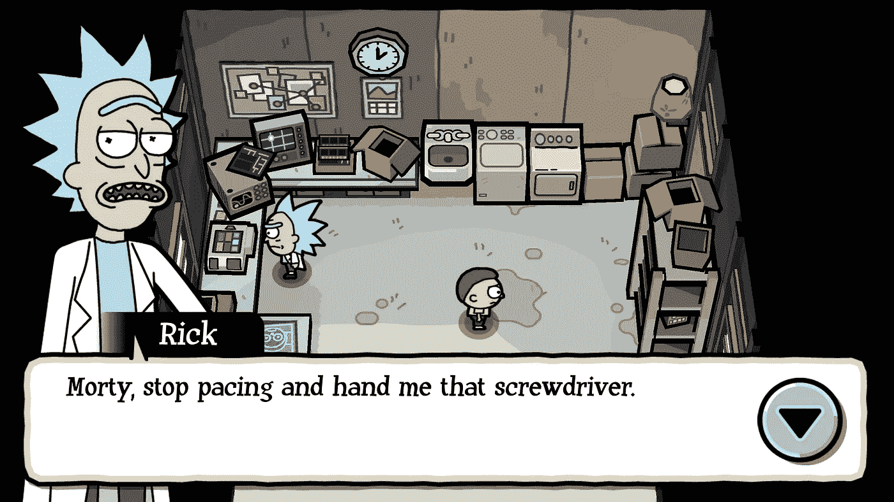

# 学习新技术的最好方法是实践。这里有一些灵感。

> 原文：<https://medium.com/hackernoon/the-best-way-to-learn-new-technologies-is-by-doing-heres-some-inspiration-6ca144216790>

我最近发表了[作为一名开发人员，我如何跟上时代的步伐](https://hackernoon.com/how-do-i-stay-up-to-date-as-a-developer-5ec773e30a82#.lsgsqd7ob)。当然，这个故事是关于如何了解所有这些新的“闪亮”技术。这也有点关于学习，但主要是关于知道这些事情的存在。现在的问题是:**如果你真的想学习它们呢？**我想再次强调，你不应该赶每一项新技术的潮流，首先是因为你不需要，其次是因为这会让你陷入技术疲劳、精疲力竭、社交生活失调、抑郁和潜在的自杀倾向(☉_☉).**但是假设你决定学习这个新事物，你会怎么做呢？**

# 第一步——理论

有两种类型的学习者，即**读者**和**观察者**。

如果你是一个**读者**，最好的方法通常是去你想学习的技术的网站。它并不总是这样，但今天，大多数网站都有很棒的“入门”和“文档”部分。有些人甚至会通过互动教程来指导你。书籍也是一种很好的学习方式，我想它会一直如此。如果你是一个爱书的人，可以看看 [Safari 在线图书](https://www.safaribooksonline.com/)。巨大的资源。

如果你是一个**观察者**，跳转到 [PluralSight](http://pluralsight.com) 或者 [LinuxAcademy](https://linuxacademy.com/) 。PluralSight 的优势在于主题的多样性，而且除了技术之外，它还包括“创意”部分，在这里你可以学习 Photoshop、3D Studio Max 和许多其他软件。另一方面，LinuxAcademy 在动手实验室中大放异彩，它实际上是在指导你做事情。不限于视频，大部分内容都是关于 Devops 工具，云，当然还有 Linux。还有[书呆子](https://egghead.io/)、[守望者](https://sub.watchmecode.net/)、 [Edx](https://www.edx.org/) 、 [Udemy](https://www.udemy.com/) 、 [Udacity](https://br.udacity.com/) 和 [LernVern](http://www.learnvern.com/) 。

# 第二步——行动

这是我最后想去的地方。**动作**。为了学习你必须做的事情。你必须尝试一些东西，打破一些东西，为你曾经尝试过而后悔，克服你的懒惰并且完成它。我不是在说这些无用的“你好，世界”的废话。我是在说从开始到结束，建立一些真实的、有目的的东西。你能做到的！

此外，这是在 GitHub 上开始一个开源项目的极好方式，如果您还没有这样做的话。当你面试的时候，有一件事会让你眼前一亮，那就是你过去的工作经历。现在你不仅可以说你知道它。你可以表现出来！

现在，终极问题:**你能做什么？不是每个人都有创造力。如果这是你的情况，我的朋友们，那么做好准备，因为我 **t 的想法放弃的时间！\o/****

# 应用创意—第 1 部分

这些不是突破性的想法，它们不一定是新的，它们可能不会让你变得富有，但它们足够简单，让你能够自己从头开始执行它们。这些都不是我以前见过的项目(至少我是这样想象的)，它们至少比你通常在 [App Ideas](https://www.reddit.com/r/AppIdeas/) 和[someone make this](https://www.reddit.com/r/SomebodyMakeThis/)中发现的要好一些。

此外，如果你不想从头开始，别忘了拿起一份样板文件。并且如果你着手实现其中的一个，请告诉我=)以下名字是**虚构的**，随便挑。

## 开发板

DevBoard 是一个面向开发者的新闻聚合网站，有类似 Trello 和 TweetDeck 的专栏布局。用户可以建立自己的论坛，从多个来源获取专栏，如 Twitter、Medium publications、Subreddits、Hackernews、stack overflow tags/hot questions、GitHub trending repositories 和 CodePen picked pens。

你可以从小处着手，随着它变得越来越流行，不断增加更多的来源。这将是我的文章[如何作为一名开发人员保持最新状态](https://hackernoon.com/how-do-i-stay-up-to-date-as-a-developer-5ec773e30a82#.d0hqxkoit)的一体化替代。

我肯定会用它。

## 问号

[电子](http://electron.atom.io/)特别酷，因为你可以用 HTML/JavaScript/CSS 来构建跨平台的桌面应用。可以以 QuestionMark 为契机，学习电子和自己喜欢的前端栈。

**问号**是**创作**和**参加** **考试**和**认证**的电子申请。如果用户选择创建考试，他/她可以设置诸如标题、持续时间和问题数量等属性。考试以 JSON 文件的形式保存在本地硬盘中。用户也可以选择创建一个问题。问题具有标题、选项列表等属性，以及随机化等其他属性。试题必须作为 JSON 文件保存在考试文件夹内的“问题”文件夹中。当然，用户可以使用这个应用程序实际参加考试。因此，即使可能有 2000 个问题，当您选择一个考试时，如果它只配置为使用 30 个问题，这些问题将从可用的 2000 个问题中随机选择。

现在，在 GitHub 上创建一个单独的存储库，用户可以在这里提交自己的考试和问题。他们也可以在现有的考试中增加新的问题。

我当然会用它来学习我的**证书**。

## 火花流

许多公司，尤其是那些构建以数据为中心的业务应用程序的公司，需要一个工作流模块。过去，工作流是 BPMN 的同义词，但这种情况已经改变。像 [Integromat](https://www.integromat.com/) 、 [Zapier](http://zapier.com/) 和 [Microsoft Flow](https://flow.microsoft.com/) 这样的服务证明了通过简化手续，工作流程可以变得更有吸引力。然而，这些服务因通过 500 多个应用集成吸引终端用户而出名。

通过将对 GitHub 的热爱与许多企业不会将其源代码/知识产权暴露给像 GitHub 这样的第三方云的事实结合起来，GitLab 已经从开源项目中获得了利润。SparkFlow 遵循同样的商业模式。

SparkFlow 是一款开源工作流应用，专注于集成到现有产品中，而不是最终用户，其界面受到 Integromat 的启发，但没有所有这些应用集成。它只有 4 种元素:

1.  Webhook start :这是启动流程的一种方式。SparkFlow 给你一个 URL，你可以调用它来传递你想要的任何 T2 数据。传递的数据现在被绑定到流实例，并且可以在**过滤器**中使用以做出决策。
2.  **定时器启动**:这是启动流程的另一种方式:每 X 分钟，或者每天/每周/每月的特定时间。
3.  **过滤**:又称决策。这当然让流量“分叉”了。流是否将向特定方向移动取决于基于流数据的表达式的评估(例如*appointment type = = " personal "*)
4.  **API 请求**:SparkFlow 没有集成很多应用，只有 1 个**活动触发器**。它使用基本身份验证、OAuth 或根本不使用身份验证来调用 API。因为我们的目标是产品集成，我们只需要调用目标产品 API，循环就完成了。

我工作的公司会喜欢的。

# 应用创意—第二部分

我的大脑有一个专门吐槽 App 创意的线程。它的作用如此之大，以至于有时我不得不冥想来让它停止\_(ツ)_/。这些东西来自很多地方。如果人们感兴趣，我会在**未来的帖子中给出它们。**

# 结论

最好的学习方法是边做边学。释放你的创造力，不要害怕失败。在你的日程表上找些时间，开始做一个创造者，而不仅仅是一个消费者。你能做到的。还有，**把事情做好**。不要从一个项目跳到另一个项目。你的大脑会试图说服你，新的想法总是更好。别听它的。专注。**送货是特色**。

黑客快乐！

# 关于作者

我是安德烈·佩纳，我喜欢写作和建筑。最近我建了: [https://remoted.io](https://remoted.io) ，一个面向开发者的远程作业聚合器，看看吧！💗

> [黑客中午](http://bit.ly/Hackernoon)是黑客如何开始他们的下午。我们是 [@AMI](http://bit.ly/atAMIatAMI) 家庭的一员。我们现在[接受投稿](http://bit.ly/hackernoonsubmission)并乐意[讨论广告&赞助](mailto:partners@amipublications.com)机会。
> 
> 如果你喜欢这个故事，我们推荐你阅读我们的[最新科技故事](http://bit.ly/hackernoonlatestt)和[趋势科技故事](https://hackernoon.com/trending)。直到下一次，不要把世界的现实想当然！

